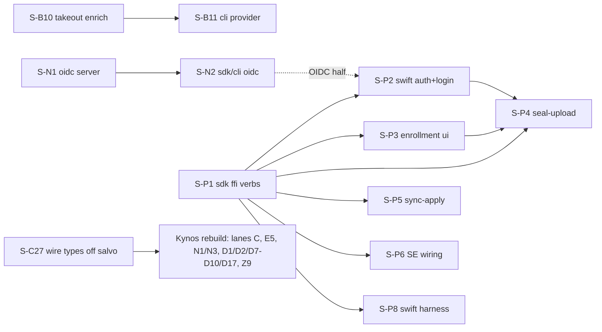

# Implementation Slices

This file is the executable index of everything the [design docs](capsule-docs/src/content/docs/design/)
specify, decomposed into independently shippable **slices**. It is the single tracker for
both halves of the current programme:

- the **v1 campaign** (completed 2026-07-12), which landed all 74 original slices, and
- **wave 2** — the full design-docs↔code gap census (2026-07-12 audit, re-verified against
  the code 2026-08-21) plus everything needed to exercise the iOS app against a server end
  to end.

It also absorbs the **post-teardown verdict**: the previous Salvo server, the Progenitor
SDK, `capsule-media`, and `capsule-core`'s media/exif/legacy-import-execution trees are
review material (four `legacy-review/` buckets: `server-salvo`, `sdk-progenitor`,
`media-pipeline`, `core-import-media`), and the replacement server is one **Kynos**
REST/OpenAPI application. That verdict is accepted and final. What it does **not** mean is
that those trees are gone from this workspace today — see
[Sequencing — build then retire](#sequencing--build-then-retire).

Because a slice can now be honest in one tree and dishonest in the other, every row carries
an **Area**. Read `Status` through `Area`, never on its own.

**How to use this file.**

- Every slice has a stable ID (`S-A8`, `S-P1`, …). Code skeletons, `#[ignore]`d contract
  tests, and `LEGACY-PLAINTEXT (frozen)` markers reference these IDs; `rg S-P1` finds a
  slice's entire footprint. IDs are never reused: wave-2 IDs continue each lane's
  numbering past the landed set.
- A slice references other slices **only by ID + contract anchor**, never by their
  internals. "Depends on" edges are hard (the contract consumed must exist); everything
  else can proceed in parallel.
- **Done when** must be checkable by running named commands. A slice that flips its
  named tests, keeps `mise run check-rust` (and the other relevant `mise run check-*`
  gates) green, and satisfies its owner doc's Validation bullets is done.
- Sizes: **S** ≤ ½ day, **M** ≤ 2 days, **L** ≥ 3 days — for slicing sanity, not
  estimation. An L slice that can split should split.
- When a slice lands, update its row to `done` (add a **Landed:** note recording any
  deviation). When a new gap is found, add a slice — never a floating TODO.

**Area — what tree the slice's target lives in.**

| Area | Meaning |
| --- | --- |
| `ACTIVE` | The whole surface survives the teardown (`capsule-core` minus its media/exif trees, `capsule-core-ffi`/`-swift`/`-kotlin`, the apps, `capsule-cli` local paths, `capsule-web` local paths, `locales/`, `xtask`, the docs site). Implementable against the live workspace today and unaffected by the Kynos rebuild. |
| `RETIRED` | The target sits in a `legacy-review/` bucket on `master` — `capsule-api/**`, `capsule-sdk/**`, `capsule-media`, or `capsule-core::{media, exif}` + `import/{executor_cancellation, progress}.rs`. The deliverable must be re-landed on the replacement (Kynos for the server buckets, the Rawshift-backed pipeline for media, the spargen SDK for the client). |
| `MIXED` | Both: a surviving `capsule-core`/client/app half that ships and stays, and a server, SDK-wire, or media half that must be re-landed. |

**Status — read through Area.**

- On an `ACTIVE` row, `Status` means what it always meant.
- On a `MIXED` row, `Status` describes **the surviving half only**. The retiring half is
  owed to the rebuild by construction; it is not a separate `Owed →` pointer.
- On a `RETIRED` row, `done` is not available. An implemented `RETIRED` slice reverts to
  `ready`, and its detail block records that it **landed in code that is still live in
  this workspace today** — the contract is proven, the deliverable re-scopes onto the
  replacement. The one exception is Lane G: those slices *are* retirements, so their
  `done` stands in any area.
- `done*` = landed with a named owed remainder; the `Owed →` column names where the
  remainder now lives.
- `blocked` = a dependency gates the start, not review priority.

## Baseline — already implemented and validated

What actually ships in this workspace today (not `master`'s thinner contract-skeleton
tree). Everything the v1 campaign shipped is the floor wave 2 stands on:

- **Offline crypto data plane** (`capsule-core`): canonical CBOR (RFC 8949 §4.2,
  cross-language gate); the primitives inventory (SHA-256, HKDF-SHA512, Argon2id,
  AES-256-GCM STREAM + metadata blobs, hybrid Ed25519+ML-DSA-65, X-Wing KAT-validated);
  key hierarchy with multi-epoch AMK rotation, wrapped file-key mode, re-key salt
  folds, software keystore, signed device directory; `Signer`/`HardwareSigner` seams
  with software, TPM (tss-esapi), Windows TBS, and Secure Enclave/StrongBox adapters;
  P-256 hybrid DSK + hardware-bound P-256 ECDH DEK composition; signed manifests +
  append-only provenance + the exhaustive `verify_asset` chokepoint; metadata↔manifest
  binding (invariant 25 both sides); pure key-free validation invariants; CRDT
  metadata + signed `SidecarV1` (incl. `stack_membership`, `cull`, `hidden`,
  `gps.datum`) + privacy-strip table; deterministic signed backup (tar, AMK ledger,
  escrow, Shamir 2-of-3, restore, recovery cadence); lifecycle `Workspace` over
  `library.sqlite`; cache-eviction sweep; share-link + drop crypto (WASM sealing
  builds); culling engine; local-auth gate (NFR1 proven structurally).
- **MLS lane** (`OpenMlsAuthority`, OpenMLS 0.8.1, X-Wing `0x004D` via libcrux): the
  four membership ceremonies, minted-and-distributed write-tier keys, Welcome/history
  delivery, durable group persistence, tombstone-plus-fork upgrade ceremony, re-keying,
  `ReconcileOutcome` reconciliation.
- **Import/media**: thumbnail/LQIP + video-derivative generation over injected
  per-platform encoder seams, signed `DerivativeManifest` chains; signed-path import
  executor; streaming import; staged uploads (tier ladder); Takeout source adapter
  (`SourceAdapter` trait); planner determinism suite. Derivative byte-encoding is a
  per-platform SDK seam — CLI-path derivative generation is inert without an injected
  encoder (by design, thumbnails.md). **Area caveat:** the decode/derivative half lives in
  `capsule-core::{media, exif}`, which is `RETIRED` territory; the executor, planner,
  scanner, importers, streaming, and staged scheduler survive.
- **Key-free server** (`capsule-api`, Salvo): hardened chunked upload (invariants 1–15 +
  strictness table, testcontainer-proven), `capsule.sync.v1` gRPC feed (+ gRPC-web),
  `/albums/{id}/ops` lifecycle writes, content-addressed blob serving at the 65,536-B
  stride, storage verification + custody receipts + signed attestation
  (`attestation-keys` well-known), quota, drops + atomic adoption, share serving,
  device directory + enrollment (code + relay), escrow store/replace, cohort storage,
  moderation hooks, refcount GC + retention purge + integrity scrub (operator
  binaries), federation capabilities/budgets/revocation state, album provisioning with
  UUID album ids. Auth: sessions, password+TOTP, passkeys — real and testcontainer-tested
  (OIDC is wave 2, `S-N1`). **This whole tree is `RETIRED` territory**: it is live and
  green today, and it is the contract the Kynos rebuild must reproduce.
- **SDK/clients**: session store + auto refresh, hand-written upload/sync clients,
  spargen-generated typed REST client from committed `openapi.json`, verify-before-
  destroy + receipt gate, adverse-network engine, LAN peering (in-process), recovery
  cadence, CLI auth/register/status/sync/list/push/demo (E2E cases 1–3), web guest-drop +
  share-viewer (wasm), aggregated federated albums, uniffi FFI for catalog + SDK user
  flows.
- **Legacy retired**: GraphQL, plaintext proto/entities/import-executor gone.
- **Cohesion floor** (2026-08-21, wave-0 ground clearing): `lifecycle.rs` (3501 LOC, reaching
  17 of 24 sibling modules) split into a `lifecycle/` module of twelve sibling files plus
  `mod.rs`, none over 600 LOC, with `Workspace` still one type and every public path
  preserved — eleven wave-2 slices touch this area and serialized on it before. The three
  real module cycles are broken (`db → ml` via a `domain::model_identity` leaf plus an
  `EmbeddingProvenance` seam, `sidecar → library` via `utils::paths`, `ml → lifecycle` via
  `AssetSource`/`AiTagSink`), giving `domain ← db ← ml ← lifecycle`. The other seven
  reported "cycles" are rustdoc intra-doc links only, with no `use` and no call sites —
  recorded in module-map.md so a future audit does not re-flag them. **`master` has no
  equivalent** (it still carries the 3501-LOC `lifecycle.rs`), which is why this branch's
  baseline, not `master`'s, is the one wave 2 stands on.
- **Operable server** (`S-P7`): `mise run serve-api` brings up deps, seeds `.env`, mints a
  signing key, migrates and serves in one command. The gRPC sync service moved to the server
  **root** — tonic's `AddOrigin` keeps only scheme and authority, so the previous
  `/v1/sync/...` mount was unreachable from every native client and `capsule sync` could not
  work against a real deployment at all.
- **i18n**: catalog infra + 13 locales + error-code contract + three-surface guard +
  README translation pipeline.

## Sequencing — build then retire

The teardown verdict is final; the **order** is not "retire, then rebuild". It is
**build, then retire**.

- The Salvo server (`capsule-api/**`), `capsule-sdk`, and the in-repo media stack are
  **still live in this workspace** and stay that way until the Kynos rebuild reaches
  parity. `legacy-review/`'s own charter is that code leaves quarantine only once its
  replacement contract and tests exist; retiring first would leave the tree with no
  server, no CLI network commands, and no end-to-end test for the whole rebuild.
- `xtask architecture-check` is **adopted and reporting-only**. It reports **63
  violations** today (`mise run architecture-check`), and that list *is* the rebuild
  worklist: implicit workspace packages, retired dependencies, buildable manifests under
  `legacy-review/`, and stale component references.
- The retirement of `capsule-api/**`, `capsule-core/src/media`, `capsule-core/src/exif`,
  and `import/{executor_cancellation,progress}.rs` into `legacy-review/` happens in **one
  future commit**, once Kynos reaches parity — and `architecture-check` joins `check-rust`
  in that same commit. Until then it is a report, not a gate (the rationale is duplicated
  in `mise.toml` next to the task so nobody re-wires it early).
- **Kynos is a git dependency, not a crates.io release.** Pin it at rev
  `6513109b5725a3e0713808de0eaee6b4b74281e3`; it is not published, so a version
  requirement will not resolve.
- **`capsule-sdk` is replacement-in-progress, not review material.** It already satisfies
  most of `legacy-review/sdk-progenitor/REVIEW.md`'s stated replacement contract:
  spargen-generated from a checked-in OpenAPI 3.1 document, token refresh / upload / sync /
  recovery / protocol-version orchestration kept **outside** generated code, no
  `generate_openapi.sh`, no Progenitor macros. Two things are owed: its **gRPC sync half
  re-fronted on REST**, and its **schema sourced from Kynos** rather than from the Salvo
  `gen_openapi` binary. Slices whose target is the SDK are marked `RETIRED` because their
  wire contract is re-sourced — not because the crate is being thrown away.

**Lane P builds locally again (2026-08-22).** The Xcode host was broken twice over: a stale
March-2025 `DVTDownloads.framework` shadowed what Xcode 26.6 expects, and the documented fix
for it (`sudo rm -rf /Library/Developer/PrivateFrameworks`) removed the still-required
`CoreSimulator.framework` as well, turning a shadowing fault into a missing-framework one
(`xcodebuild -create-xcframework`, exit 70). `sudo xcodebuild -runFirstLaunch` restored the
directory with both frameworks, and `mise run build-ffi-apple` now exits 0 and assembles
`capsule-swift/.ffi/CapsuleCoreFFI.xcframework` with `ios-arm64` and
`ios-arm64_x86_64-simulator` slices. Simulator-backed lane-P verification runs on the dev host.
Note for whoever hits this next: `xcodebuild -showsdks` does **not** load the simulator plugin,
so it is never evidence that this lane works — only a command reaching `-create-xcframework` is.
swiftformat 0.55 is still SIGKILLed locally, so `format-swift` alone rides CI.

## Unified Slice Index

All 122 slices — the 74 from the v1 campaign and the 48 from wave 2 (46 indexed plus
`S-C27` and `S-Q6`, allocated in this pass). `Lane`, `Depends on`, and `Size` are the
campaign's own metadata; `Owed →` names where a `done*` row's remainder now lives.

| ID | Slice | Lane | Depends on | Size | Area | Status | Owed → |
| --- | --- | --- | --- | --- | --- | --- | --- |
| S-A1 | Wrapped file-key mode (seal/unseal + verify) | core-crypto | — | M | ACTIVE | done | |
| S-A2 | Re-key salt fold | core-crypto | — | S | ACTIVE | done | |
| S-A3 | Metadata↔manifest binding (invariant 25, both sides) | core-crypto | S-A1 | M | ACTIVE | done | |
| S-A4 | P-256 hybrid DSK variant | core-crypto | — | L | ACTIVE | done | |
| S-A5 | Share-link crypto (`capsule_core::sharing`) | core-crypto | — | M | ACTIVE | done | |
| S-A6 | Drop crypto (`capsule_core::drop`, incl. WASM build) | core-crypto | S-A1 | L | ACTIVE | done\* | multi-device OGK re-wrap → post-v1 (OGK cluster) |
| S-A7 | `gps.datum` sidecar field + BD-09 input fold | core-crypto | — | S | ACTIVE | done | |
| S-A8 | BD-09 bounded input fold (flip `FoldGated`) | core-crypto | — | S | ACTIVE | done | |
| S-A9 | Add-id counter reseed at `Workspace` open | core-crypto | — | S | ACTIVE | done | |
| S-A10 | Durable album-key persistence + library open plumbing | core-crypto | — | L | ACTIVE | done | |
| S-A11 | Publish the DEK in the device directory | core-crypto | — | M | ACTIVE | done | |
| S-B1 | Thumbnail/LQIP generation | media/import | — | L | RETIRED | ready | |
| S-B2 | Signed-path import-executor rewrite | media/import | S-B1 | L | MIXED | done\* | durable album keys → `S-A10` |
| S-B3 | Streaming import (probe, `total_size`, drive mode) | media/import | S-D1, S-D4 | L | MIXED | done | |
| S-B4 | Staged uploads (low-data tier ladder) | media/import | S-C1, S-C2, S-D1 | M | MIXED | done | |
| S-B5 | Video derivatives (first-frame still + H.264 preview) | media/import | S-B1 | M | RETIRED | ready | |
| S-B6 | Google Takeout importer | media/import | S-B2 | M | MIXED | done\* | sidecar-enrichment write → `S-B10` |
| S-B7 | iCloud export importer | media/import | S-B6 | M | MIXED | post-v1 | |
| S-B8 | Immich importer | media/import | S-B6 | M | MIXED | post-v1 | |
| S-B9 | Tethered camera import (PTP/IP) | media/import | S-B2 | L | MIXED | post-v1 | `ptpip-rs` gate |
| S-B10 | Takeout metadata → signed sidecar enrichment | media/import | S-A10 | M | ACTIVE | done | four doc rows owed; streaming path → `S-B3`/`S-B11` |
| S-B11 | CLI `import --provider takeout` + real-archive run | media/import | S-B10 | S | ACTIVE | done\* | synthesized archive only; real export owed |
| S-B18 | No CLI surface shows what the importer actually wrote | media/import | S-B10 | S | ACTIVE | ready | users cannot verify enrichment |
| S-B12 | Base default-album resolution (`resolve_default_album`) | media/import | — | M | ACTIVE | done | scope-override + source-kind rows → post-v1 |
| S-B13 | Codec stubs → typed `UnsupportedFormat` (no panics) | media/import | — | M | RETIRED | ready | |
| S-B14 | LQIP on Chromahash 0.7.1 in `capsule-core::lqip` | media/import | — | M | ACTIVE | done | wasm entry point owed to the browser-`lqip` slice |
| S-B15 | Importer-formed stacks exist only in the index | media/import | S-D21 | M | ACTIVE | done | rebuild guard kept as pre-`S-B15` compatibility |
| S-B16 | Every import stamped by import time, not capture time | media/import | — | S | ACTIVE | done | found by the CLI round-trip test |
| S-B17 | Repair capture timestamps written before `S-B16` | media/import | S-B16 | M | ACTIVE | ready | the wrong value is in *signed* bytes |
| S-C1 | Upload-server hardening (envelope gate + invariants) | server | — | L | RETIRED | done\* | discard worker, asset index and quota not ported |
| S-C2 | Key-free sync feed | server | S-C1 | L | RETIRED | done\* | ported to Kynos REST; Postgres adapter + cursor-key loading owed |
| S-C3 | Storage-verification endpoint | server | S-C35, S-C37 | M | RETIRED | done\* | structural verdict only; the `deep` re-hash → `S-C41`; GC state → `S-C11` |
| S-C4 | Share-link serving endpoints | server | S-A5 | M | RETIRED | ready | |
| S-C5 | Drop store, inbox, atomic adoption | server | S-A6, S-C1, S-C6 | L | RETIRED | ready | OpenAPI row → `S-C22`; shared limiter → post-v1 |
| S-C6 | Quota service | server | S-C25, S-C37 | M | RETIRED | done\* | federated-receive and purge-reclaim accounting owed to `S-C11`/federation |
| S-C7 | Device-enrollment endpoints (code + relay channel) | server | S-C9 | M | RETIRED | ready | |
| S-C8 | Moderation hooks | server | S-C2 | M | RETIRED | ready | blob-path 410 → `S-C17`; MLS block half → `S-X4` |
| S-C9 | Device-directory publish/fetch | server | S-C29 | M | RETIRED | done\* | invariant 23's *signature* clause is unenforced → `S-C42`; device identity → `S-C20` |
| S-C10 | Key-free media serving conformance | server | S-C35, S-C37 | M | RETIRED | done\* | takedown → `S-C17`; GC state → `S-C11`; the `403` → `S-C39`; the `409` → `S-C40` |
| S-C11 | Refcount GC + retention purge worker | server | S-C1, S-C16, S-C37 | M | RETIRED | done\* | discharges the GC-state debt on `S-C3` and `S-C10`; the `gc` binary rides the adapters |
| S-C12 | Backup escrow server surface | server | — | S | RETIRED | ready | |
| S-C13 | Session device-cohort storage + grouping | server | — | S | RETIRED | ready | wire device_id + ceremony cohort → `S-N3` |
| S-C14 | Server integrity scrub (Postgres⇄blob-store) | server | S-C1 | M | RETIRED | ready | |
| S-C15 | Custody receipts + signed storage attestation | server | S-C1, S-C3 | M | RETIRED | ready | |
| S-C16 | Generic lifecycle-write endpoint (`/albums/{id}/ops`) | server | S-C1, S-C37 | M | RETIRED | done\* | the feed's only tombstone producer; quota → `S-C6`; `replace` → `S-C43` |
| S-C17 | Takedown 410 gate on `/blob/{hash}` + legacy route del | server | — | M | RETIRED | ready | |
| S-C18 | `.well-known/capsule` registry completion | server | — | M | RETIRED | ready | |
| S-C19 | Authoritative album `protocol_version` pin | server | — | M | RETIRED | done | unrepresentable via `WriteAuthority` (`S-C1`) |
| S-C20 | Invariant-7 floor grounded in the device directory | server | S-C9 | M | RETIRED | done\* | the account-creation fallback is gone, not kept |
| S-C21 | `feed_seq` visibility-order race fix | server | — | M | RETIRED | done | unrepresentable: one sequence, minted under the row lock (`S-C37`) |
| S-C22 | Structured `duplicate_blob` ref + adopt in OpenAPI | server | S-C37 | S | RETIRED | done\* | server half; adopt endpoint → `S-C5`; undescribed extension → `S-C38` |
| S-C23 | `revoke_all_sessions` with master-key proof | server | — | M | RETIRED | ready | |
| S-C24 | Album-upgrade server halves (quiescence/drain/lineage) | server | — | M-L | RETIRED | ready | |
| S-C25 | Album provisioning + UUID album ids (unblocks push) | server | S-C29 | M | RETIRED | done\* | also lands the first real `WriteAuthority`; sharing widens it → `S-C4`/`S-C5` |
| S-C26 | Retire the plaintext album name/description columns | server | S-C25 | S | RETIRED | ready | |
| S-C27 | Wire-contract types on plain serde behind an adapter | server | — | M | RETIRED | part 1 done | DTO move → Kynos rebuild; status gaps → `S-C28` |
| S-C28 | Publish the statuses the server actually returns | server | S-C27 | S | RETIRED | done\* | auth surface closed; folds into each remaining port |
| S-C29 | The two storage ports + typed ceremony stores | server | S-C27 | L | RETIRED | done\* | Valkey + Postgres adapters owed; counters → `S-C32` |
| S-C30 | Feed `manifest_cbor` carries the signed manifest | server | S-C1, S-C2 | M | RETIRED | done\* | server half stores and serves verbatim; client producer owed to `S-D1` |
| S-C31 | Custody receipt attests a hash of server-invented bytes | server | S-C30 | M | RETIRED | ready | found by `S-C30` |
| S-C32 | MFA-attempt and rate-limit counters have no port | server | S-C29 | M | RETIRED | ready | found by `S-C29`; blocks login `429` parity |
| S-C33 | Request-size limits — Kynos declares constraints it does not enforce | server | — | S | RETIRED | done\* | per-field constraints still undecided |
| S-C34 | Nothing gates the Kynos OpenAPI document | server | — | S | RETIRED | done | two documents gated separately until parity |
| S-C35 | The blob store port, sharded | server | S-C27 | L | RETIRED | done | wired by `S-C1`, which also found a missing operation |
| S-C36 | Kynos's framework rejections carry no `error.*` code | server | S-C33 | M | RETIRED | ready | breaks the i18n contract |
| S-C37 | The asset index port, one sequence instead of two | server | S-C27, S-C29 | L | RETIRED | done\* | Postgres adapter owed; absorbs `S-C21` and unblocks `S-C22` |
| S-C38 | Problem extensions are absent from the OpenAPI document | server | S-C34 | M | RETIRED | ready | found by `S-C22`; a regression against the Salvo document |
| S-C39 | Blob fetch has no read authority, so its `403` is unwritable | server | S-C10 | M | RETIRED | ready | found by `S-C10`; the contract names a status neither server renders |
| S-C40 | `awaiting-original` is not observable on the blob path | server | S-C10, S-C37 | M | RETIRED | ready | found by `S-C10`; the `409`/`410` split has no `409` side |
| S-C41 | The `deep` re-hash, with the limiter that makes it safe | server | S-C3, S-C32 | M | RETIRED | blocked | found by `S-C3`; needs the per-user counter `S-C32` owns |
| S-C42 | Nothing verifies the device directory's own signature | server | S-C9 | M | RETIRED | ready | found by `S-C9`; half of invariant 23 is unenforced, and it bricks `S-C23` |
| S-C43 | `replace` rides the upload protocol and has no producer | server | S-C1, S-C37 | M | RETIRED | ready | found reading `S-C1` against the authorization doc; invariants 17 and 18 go live with it |
| S-C44 | A swept blob's bytes are never credited back | server | S-C6, S-C11 | S | RETIRED | ready | found by `S-C11`; quota only ever goes up |
| S-D1 | SDK upload client (hand-written, stateful protocol) | sdk/clients | S-C1 | M | RETIRED | ready | |
| S-D2 | SDK sync/download client + connection-class budget | sdk/clients | S-C2, S-C9 | L | RETIRED | ready | |
| S-D3 | Web guest drop client (WASM) | sdk/clients | S-A6, S-C5 | L | MIXED | done\* | live-browser smoke → `S-Q5`; seeds → gates |
| S-D4 | Verify-before-destroy wiring | sdk/clients | S-C3, S-C15 | M | MIXED | done | |
| S-D5 | CLI auth/sync/list | sdk/clients | S-D1, S-D2 | M | MIXED | done | |
| S-D6 | Web server gateway (key-free reads) | sdk/clients | S-D2 | L | MIXED | done\* | live gRPC-web smoke → `S-Q5`; decode boundary → post-v1 |
| S-D7 | SDK auth/session foundation + auto token refresh | sdk/clients | — | M | RETIRED | ready | |
| S-D8 | spargen REST client integration | sdk/clients | — | M | RETIRED | ready | 401-retry-once → `S-D17` |
| S-D9 | capsule-sdk uniffi FFI bindings | sdk/clients | S-F1, S-D7 | M | RETIRED | ready | Swift harness → `S-P8`; Kotlin harness → owed-CI |
| S-D10 | Adverse-network hardening | sdk/clients | S-D1, S-D2 | M | RETIRED | ready | |
| S-D11 | Client cohort emission + devices grouping UI | sdk/clients | S-C13, S-D7 | M | MIXED | done\* | iOS reader → `S-P6`; devices screen → post-v1; device_id → `S-N3` |
| S-D12 | Recovery verification cadence + guided re-wrap | sdk/clients | S-C12 | M | MIXED | done | |
| S-D13 | Culling workflow client UX | sdk/clients | — | M | ACTIVE | done | |
| S-D14 | Local-gallery security gates | sdk/clients | — | S | ACTIVE | done | |
| S-D15 | Exact client build identification | sdk/clients | — | S | MIXED | done | |
| S-D16 | Standalone `capsule cull` command | sdk/clients | S-A10 | S | ACTIVE | done | |
| S-D17 | Typed REST client reactive 401-retry-once | sdk/clients | — | S | RETIRED | ready | |
| S-D18 | `capsule push` — drive `capsule_sdk::upload` from CLI | sdk/clients | S-A10 | M | MIXED | done | |
| S-D19 | Hidden-view DB projection + gate wiring | sdk/clients | — | S | ACTIVE | done | rebuild un-hides → `S-D21` |
| S-D21 | Index rebuild loses gated state (two sidecar shapes) | sdk/clients | S-D19 | M | ACTIVE | done | importer stacks → `S-B15`; unsigned migration → `S-D24`; no hidden writer → `S-D25` |
| S-D22 | FFI `Catalog` bypasses the SR1 view gates | sdk/clients | S-D19 | S | ACTIVE | done | Swift half landed with `S-I4`; two small items owed |
| S-D23 | Client SQLite schema has no upgrade path | sdk/clients | — | M | ACTIVE | done | typed error at the `open` boundary still owed |
| S-D24 | Migrate unsigned sidecars, then delete the reader | sdk/clients | S-D21 | L | ACTIVE | blocked | needs a design decision first |
| S-D25 | `hidden` has a column, a gate and views but no writer | sdk/clients | S-D19 | S | ACTIVE | done | |
| S-D26 | CLI drops the rotated token pair, forcing re-login | sdk/clients | — | S | MIXED | ready | fix in the REST client, not the old one |
| S-D27 | The SDK test mock never shuts its listener down | sdk/clients | — | S | ACTIVE | done\* | fixed a real leak; the LEAK signal is partly noise |
| S-D20 | CLI truthfulness pass (status/register/endpoints/flags) | sdk/clients | — | M | MIXED | done | |
| S-E1 | Share-link end-to-end serving | fed/sharing | S-C4 | M | MIXED | done\* | live-browser smoke → `S-Q5`; seeds → gates |
| S-E2 | Federation capabilities + pulls | fed/sharing | S-C2, S-A3 | L | RETIRED | ready | capability gate on the live read method → `S-E5` |
| S-E3 | LAN peering | fed/sharing | S-D2, S-C7 | L | RETIRED | ready | live mDNS → post-v1 (peering.md note) |
| S-E4 | Aggregated federated albums (album-group view) | fed/sharing | S-E2, S-D2 | L | MIXED | done | cover override rides post-v1 settings doc |
| S-E5 | Federation capability gate on the REST sync surface | fed/sharing | — | M-L | RETIRED | ready | |
| S-F1 | uniffi consolidation (0.29 catalog vs 0.31 core) | platform/FFI | — | M | ACTIVE | done | |
| S-F2 | Secure Enclave / StrongBox hybrid composition | platform/FFI | S-A4, S-F1 | L | ACTIVE | done\* | Kotlin run → owed-CI |
| S-F3 | Xcode/Gradle binding wiring + on-device CI | platform/FFI | S-F2 | L | ACTIVE | done\* | first CI runs + device lanes → owed-CI |
| S-F4 | Windows TPM (TBS) backend | platform/FFI | S-A4 | M | ACTIVE | done\* | Windows CI + real-TPM smoke → owed-CI |
| S-F5 | Hardware DEK binding | platform/FFI | S-F2 | M | ACTIVE | done\* | Kotlin ECDH → owed-CI |
| S-F6 | `log` → `tracing` migration (core + core-ffi) | platform/FFI | — | S | ACTIVE | done | |
| S-F7 | core-swift XCTest → swift-testing migration | platform/FFI | — | S | ACTIVE | done | |
| S-F8 | Hardware DEK → workspace keystore wiring | platform/FFI | — | M | ACTIVE | done | |
| S-G1 | GraphQL retirement | legacy-retire | — | M | RETIRED | done | README residual → `S-Z4` |
| S-G2 | gRPC/plaintext proto retirement | legacy-retire | — | S | RETIRED | done | |
| S-G3 | Plaintext server entity quarantine | legacy-retire | — | M | RETIRED | done | legacy route deletion → `S-C17` |
| S-G4 | Legacy import-executor quarantine | legacy-retire | — | S | RETIRED | done | |
| S-H1 | Embeddings + sqlite-vec index | ML | — | L | ACTIVE | done | |
| S-H2 | Model registry + version regen | ML | S-H1 | M | ACTIVE | done | E2E case 10 landed as `S-Q6` |
| S-H3 | Semantic/face features | ML | S-H1 | L | MIXED | done\* | real runner → post-v1 (ai.md note) |
| S-H4 | Group-scoped evaluations (best shot/framing/exposure) | ML | S-H3 | M | MIXED | post-v1 | |
| S-I1 | Hardcoded-string migration to catalog keys | i18n | — | M | ACTIVE | done\* | Swift plural/InfoPlist gaps → `S-I4`; review → gates |
| S-I2 | Official language-set rollout (12 locales + RTL) | i18n | — | L | ACTIVE | done\* | native RTL → post-v1; review → gates |
| S-I3 | `xtask translate-readme` + CI drift check | i18n | S-I2 | M | ACTIVE | done | |
| S-I4 | Swift interpolated/plural strings + InfoPlist/LAContext | i18n | — | M | ACTIVE | done | forced an ICU→Apple compiler in the generator |
| S-I5 | The CLI import arm has no `cli.import.*` catalog namespace | i18n | — | M | ACTIVE | ready | `i18n-guard` never scanned the CLI |
| S-I6 | Android ships raw ICU to users; the guard never fires | i18n | — | M | ACTIVE | done | `aapt2` unverified — owed-CI |
| S-I7 | The Rust runtime formatter cannot do ICU plurals | i18n | — | M | ACTIVE | done\* | refuses now; evaluating plurals still owed |
| S-I8 | clap `--help` text is unreachable from the catalogs | i18n | — | S | ACTIVE | ready | found widening `i18n-guard` |
| S-N1 | OIDC relying party (server) | auth | — | L | RETIRED | ready | |
| S-N2 | SDK/CLI OIDC login flows | auth | S-N1 | M | MIXED | blocked | |
| S-N3 | `device_id` on session listing + ceremony cohorts | auth | — | S | RETIRED | ready | |
| S-P1 | `capsule_sdk` FFI workspace verbs | iOS path | S-A10 | L | MIXED | done | feed `manifest_cbor` shape → `S-C30` |
| S-P2 | Swift auth service + Keychain + login screen | iOS path | S-P1 | L | MIXED | ready | |
| S-P3 | First-device enrollment UI | iOS path | S-P1 | L | MIXED | ready | |
| S-P4 | Import→seal→upload bridge + status UI | iOS path | S-P1–P3 | L | MIXED | blocked | S-P2/S-P3 |
| S-P5 | Sync-apply into local catalog + render | iOS path | S-P1 | L | MIXED | ready | second-device render → `S-C30` |
| S-P6 | SE signer wiring into the app + iOS cohort reader | iOS path | S-P1 | M | ACTIVE | ready | |
| S-P7 | Dev-server bring-up (task, keys, blob backend, ATS) | iOS path | — | M | MIXED | done | |
| S-P8 | Swift behavioral FFI harness (flips S-D9) | iOS path | S-P1, S-P7 | M | MIXED | ready | |
| S-Q1 | Mark/complete E2E cases 2, 3, 11 | e2e | — | S | MIXED | ready | |
| S-Q2 | E2E case 6: backup → fresh-device restore | e2e | — | M | MIXED | ready | |
| S-Q3 | E2E case 7: full lifecycle chain | e2e | — | M | MIXED | ready | |
| S-Q4 | E2E case 12: cross-device enrollment | e2e | — | M | MIXED | ready | |
| S-Q5 | Live-browser smokes (gRPC-web, share, drop) | e2e | S-P7 | M | MIXED | ready | |
| S-Q6 | E2E case 10: model regen after version bump | e2e | — | M | ACTIVE | done | the case was untestable, not untested |
| S-X1 | OpenMLS backend → `OpenMlsAuthority` | crypto/mls | — | L | ACTIVE | done | |
| S-X2 | MLS membership + Welcome/history delivery | crypto/mls | S-X1 | L | ACTIVE | done | |
| S-X3 | Album upgrade ceremony + MLS resilience | crypto/mls | S-X2 | L | ACTIVE | done\* | server halves → `S-C24` |
| S-X4 | Per-user block MLS Remove + epoch bump | crypto/mls | — | M | ACTIVE | done\* | server composition → `S-C8` |
| S-Z1 | Library-settings document schema (design) | design/docs | — | S | ACTIVE | done | implementation → post-v1 (OGK cluster) |
| S-Z2 | Provider migration user guides (docs site) | design/docs | S-B6 | S | ACTIVE | done\* | real-archive round trip → `S-B11` |
| S-Z3 | Design-doc scope-out + amendment notes | design/docs | — | M | ACTIVE | done | |
| S-Z4 | README GraphQL scrub (13 READMEs + web) + regen | design/docs | — | S | ACTIVE | done | |
| S-Z5 | Dead-code removal (exports stub, CLI import planner) | design/docs | — | S | MIXED | done | |
| S-Z6 | Developer-docs parity pass | design/docs | — | M | MIXED | done | |
| S-Z7 | Developer reference architecture (design) | design/docs | — | S | ACTIVE | done | |
| S-Z8 | Reference shell + CLI reference | design/docs | S-Z7 | M | ACTIVE | ready | |
| S-Z9 | REST reference from the Kynos document | design/docs | S-Z8, S-D8 | M | ACTIVE | blocked | Kynos document → `S-C27`/`S-D8` |
| S-Z10 | SDK / FFI / WASM reference | design/docs | S-Z8 | M | ACTIVE | ready | |

**Row counts.** 133 rows. By area: **49 ACTIVE / 49 RETIRED / 35 MIXED**. By status:
**43 done / 18 done\* / 63 ready / 4 blocked / 4 post-v1 / 1 part-done** (`S-C27`).

Lanes are independent by construction; within a lane, "Depends on" is the only
ordering. Only four block chains are live — `S-B11` behind `S-B10`, `S-N2` behind
`S-N1`, `S-P2`–`S-P6`/`S-P8` behind `S-P1`, and `S-Z9` behind the Kynos rebuild.
Everything else that once read `blocked`
is startable: `S-A10` and `S-P7` are done (freeing `S-B10`, `S-D16`, `S-P1`, `S-Q5` — of
which `S-D16` has since landed),
spargen shipped and is on crates.io (freeing `S-D8`), and the X-Wing codepoint `0x004D`
exists and OpenMLS ships it (freeing `S-X1`–`S-X3`, all three of which are now `done` in
`ACTIVE` `capsule-core`).

## In-House and External Library Gates

Some slices depend on libraries that are ours but not yet stable, on upstream projects, or
on environments we do not have. A gated slice can start its non-gated parts; its "Done
when" cannot fully pass until the gate lifts.

| Library / environment | Status | Gates |
| --- | --- | --- |
| [`kynos`](https://github.com/getkono/kynos) 0.1.0 | adopted as the replacement server; **published, consumed from crates.io** | Published 2026-08-29, which fired the repin-on-publish exit this row used to carry — the git rev `6513109` is history, not a pin. Taken with the `openapi32` feature, but note that the feature alone does **not** yield a 3.2 document: Kynos emits the lowest version that expresses the API and deliberately refuses to key that on a flag Cargo can unify in from an unrelated crate, so `capsule-server` pins it explicitly via `openapi_as(SpecVersion::V3_2)` and a test asserts the emitted `openapi` field. Gates the whole `RETIRED` rebuild: lane C, `S-E5`, `S-N1`/`S-N3`, and the SDK wire half (`S-D1`, `S-D2`, `S-D7`–`S-D10`, `S-D17`). `S-C27` is its precondition. |
| `spargen` 0.4.0 | adopted; both known gaps **closed**; consuming OpenAPI **3.2** | Bumped 0.1.0 → 0.4.0 on 2026-08-28. Both gaps this row used to record are gone: 0.2.2 added *decode textual and binary responses* and *serialize typed OpenAPI parameters*, so byte serving and object-typed query params lower correctly and the media asset-serve tree **returns to the generated client** — the hand-written byte path is no longer justified by a generator gap. 0.3.0 added *complete OpenAPI 3.1 and 3.2 conformance* plus runtime dependency contracts (which forced minimum bumps of `bytes`, `reqwest`, `serde`, `serde_json`). The API also changed: `Config` split into `Spec`/`Build`, and `Report::outcome` became a method. **0.4 validates the document strictly, and it rejects four operations the Salvo server emits** — see the row below. |
| Salvo-emitted schema | **4 of 37 operations structurally invalid** | Found 2026-08-28 when spargen 0.4 refused them; 0.1.0 accepted them silently, which is the only reason they reached the committed contract. `POST /v1/albums/{album_id}/ops` declares **no responses at all** — the handler returns `()` and picks its status at run time (`StatusCode::from_u16(result.status)`) so an idempotent replay returns stored bytes verbatim, leaving salvo-oapi no return type to describe. `GET /v1/auth/devices/directory/{user_id}`, `GET` and `POST /v1/auth/devices/enroll/channel/{channel_id}` carry a path-template variable and **declare no path parameters**. All four are therefore already uncallable from a typed client — which is *why* the SDK hand-writes `capsule_sdk::directory`. Narrowed with `spargen::omit!` in `capsule-sdk/build.rs` rather than repaired: fixing salvo-oapi annotations is work thrown away, and **Kynos makes both classes unrepresentable** (status is part of the return type; `#[kynos::get(..)]` checks at compile time that the path type's fields are exactly the template's variables). These are acceptance criteria for the Kynos port of `S-C16` and the auth-devices tree, and the hand-written directory client goes with them. |
| `openmls` 0.8.x | adopted (X-Wing `0x004D`) | The X-Wing codepoint **exists** (`0x004D`) and OpenMLS ships it via libcrux, so `S-X1`–`S-X3` are not blocked and are done. Key serialization surfaces are `test-utils`-gated — persistence rides public fields + ungated codecs; fragile if upstream privatizes (upstream ask filed against openmls). Version pairing is load-bearing (0.8.x ↔ traits/storage 0.5.x ↔ libcrux-crypto 0.3.x). |
| `libcrux` provider | no wasm32 target | `mls` feature is host-only; a browser MLS surface would need another provider. |
| BD-09 datum fold | **no crate adopted** | Decision 2026-08-21: `S-A8` implements the error-bounded refined BD-09→GCJ-02 inverse **in-house** (~40 LOC, deterministic, unit-testable) rather than taking a dependency for one function. `geocoordinates-rs` is **not** a gate on `S-A7`/`S-A8` and is not planned; the earlier "exact fold from `geocoordinates-rs`" wording is superseded. Display-side lossy conversions remain unscheduled and are not part of either slice. |
| `rawshift` (in-house RAW decode) | stabilizing, unconsumed | Full RAW support in thumbnails/import; `media::image::formats::raw` is the integration stub. Also the target the `RETIRED` media slices (`S-B1`, `S-B5`, `S-B13`) rebuild onto. |
| `ptpip-rs` (in-house PTP/IP) | repo not created | `S-B9` (post-v1). |
| Self-hosted device runners | unprovisioned | The `strongbox-device`/`secure-enclave` CI lanes exist, manual-trigger, inert. Owed-CI items park here: `S-F2` Kotlin run, `S-F3` first Android/iOS CI runs + device lanes, `S-F4` Windows ffi build + clippy + real-TPM smoke, `S-F5` Kotlin ECDH adapter, `S-D9` Kotlin harness. |
| swiftformat 0.55 (mise) | broken on dev host | Binary SIGKILLed (invalid signature); `format-swift` can't run locally. |
| Xcode 26.6 on the dev host | **repaired 2026-08-22** | Two faults, one after the other: a stale March-2025 `DVTDownloads.framework` shadowed Xcode 26.6, and `sudo rm -rf /Library/Developer/PrivateFrameworks` (the documented fix) also removed the required `CoreSimulator.framework`, so `-create-xcframework` failed with exit 70 on a *missing* framework. `sudo xcodebuild -runFirstLaunch` restored both. `mise run build-ffi-apple` exits 0 and produces `CapsuleCoreFFI.xcframework`. `xcodebuild -showsdks` does not load the simulator plugin and is not evidence this lane works. |
| Translation seeds | pending human review | ~350 machine-seeded entries across 12 locales (`S-I1`/`S-I2`/`S-E1`/`S-D3`) flagged in the `context` field; human review is the gate, not agent work. |

## Lane A — core crypto

Area: `ACTIVE` throughout. Every slice in this lane targets `capsule-core`'s crypto,
domain, and lifecycle trees, none of which are review material — the Kynos rebuild does
not touch them.

### S-A1 — Wrapped file-key mode

- **Contract:** [Encryption — Asset Key Derivation](capsule-docs/src/content/docs/design/cryptography/encryption.md),
  [Provenance — Asset Manifest](capsule-docs/src/content/docs/design/cryptography/provenance.md).
- **Deliverable:** `asset-keywrap/v1` seal/unseal in `crypto::encryption` (wrap `K` under
  the AMK with a fresh `wrap_nonce` folded into the salt; unwrap to STREAM-decrypt), and
  `verify_asset` + `structural_ok` enforcing the presence rules (`wrapped_file_key`
  present iff `key_mode = wrapped`; `metadata_blob_hash` presence-by-action).
- **Done when:** the wrapped-mode positive/negative cases in the provenance doc's
  Validation section exist and pass (tampered `wrapped_file_key` → terminal-reject;
  member unwrap + decrypt round-trip); `mise run check-rust` green.
- **Tier:** Unit (exhaustive negative cases). **Blocks:** S-A3, S-A6.
- **Landed:** shipped in the v1 campaign.

### S-A2 — Re-key salt fold

- **Contract:** [Encryption — Re-keying on Rewrite](capsule-docs/src/content/docs/design/cryptography/encryption.md).
- **Deliverable:** fold the fresh `nonce_prefix` into the file-key salt
  (`file_id || nonce_prefix`) and the metadata blob's fresh `nonce` into its key salt
  (`blob_id || nonce`), plus the writer's refuse-to-reuse-a-nonce defense in depth.
- **Done when:** the rewrite re-roll unit tests in the encryption doc's Validation
  section pass (same `file_id` + epoch `replace` yields a different key AND nonce);
  existing round-trip vectors unchanged for first encryptions.
- **Tier:** Unit. **Landed:** shipped in the v1 campaign.

### S-A3 — Metadata↔manifest binding

- **Contract:** [Provenance](capsule-docs/src/content/docs/design/cryptography/provenance.md),
  [Metadata — Provenance Binding and Sealing Order](capsule-docs/src/content/docs/design/metadata.md),
  [Validation invariant 25](capsule-docs/src/content/docs/design/threat-model/validation.md).
- **Deliverable:** `Workspace` writes populate `metadata_blob_hash` per the sealing
  order; `verify_asset` runs the round-trip equivalence check (decrypted blob ==
  signed sidecar, blob hash == manifest field); the pure invariant-25 envelope check in
  `capsule_core::validation` for the server side.
- **Depends on:** S-A1. **Blocks:** S-E2.
- **Done when:** metadata round-trip equivalence tests (metadata + encryption docs)
  pass; a one-byte sidecar mutation quarantines.
- **Tier:** Unit. **Landed:** shipped in the v1 campaign. The server-side half is the
  *pure* envelope check in `capsule_core::validation`, so it survives the rebuild
  untouched — Kynos calls the same function `capsule-api` calls today.

### S-A4 — P-256 hybrid DSK variant

- **Contract:** [Keys — Device Keys](capsule-docs/src/content/docs/design/cryptography/keys.md).
- **Deliverable:** algorithm-tagged hybrid signature/verifying-key/directory-entry types
  over `ClassicalAlgorithm`, `P256HybridSigningKey: Signer` composing a hardware P-256
  half (DER ECDSA) with the software ML-DSA-65 half, and `verify_asset` dispatch on the
  directory entry's declared algorithm — the Ed25519 path byte-for-byte unchanged.
- **Done when:** `p256_hybrid_round_trip_and_directory_dispatch` green against a mock
  P-256 element; existing Ed25519 vectors untouched.
- **Tier:** Unit + Smoke (mock element). **Blocks:** S-F2, S-F4.
- **Landed:** shipped in the v1 campaign.

### S-A5 — Share-link crypto

- **Contract:** [Share Links](capsule-docs/src/content/docs/design/share-links.md).
- **Deliverable:** `ShareLinkIssuer` implemented on `Workspace`: scope-key encapsulation
  around a fresh ≥128-bit link secret, optional Argon2id passphrase wrap (client-side
  unwrap), revocation records.
- **Done when:** the module's opaque-id-entropy and client-side-passphrase-unwrap tests
  pass, plus the share-links doc's unit Validation bullets.
- **Tier:** Unit. **Blocks:** S-C4. **Landed:** shipped in the v1 campaign.

### S-A6 — Drop crypto

- **Contract:** [Web Upload](capsule-docs/src/content/docs/design/web-upload.md).
- **Deliverable:** `seal_drop` (fresh `K`, STREAM, KEM encapsulation to the Drop Key),
  `UploadLinkIssuer` + `DropAdopter` on `Workspace` (Drop Key mint + master-key/OGK
  escrow wrap; decapsulate → `asset-keywrap/v1` rewrap → signed `create` with
  `key_mode = wrapped`), and the WASM build of the sealing path for `capsule-web`.
- **Depends on:** S-A1. **Blocks:** S-C5, S-D3.
- **Verification note (2026-08-22):** the WASM half of this slice was **broken at HEAD** and
  is now fixed (`5b1bb2c`). `crypto::keys` declared `pub mod albumstore` ungated while
  `albumstore.rs` (filesystem-backed, added by `S-A10`) imports `native`-gated
  `utils::paths`, so `cargo build -p capsule-core --target wasm32-unknown-unknown
  --no-default-features` — this slice's own "Done when" command — failed. `capsule-wasm`,
  `build-wasm`, `build-web`, and `check-web` were all unbuildable behind it. No gate ever
  built wasm32 (`build-rust` compiles the host triple only), so `check-rust` structurally
  could not see it; `build-check-wasm` now runs in `check-rust`.
- **Done when:** the module's three seal/adopt tests pass; the web-upload doc's unit
  Validation bullets pass; the sealing path compiles to `wasm32-unknown-unknown`.
- **Tier:** Unit (seal round-trip + adoption rewrap).
- **Landed:** shipped in the v1 campaign. **Owed:** multi-device OGK re-wrap → post-v1
  (OGK cluster).

### S-A7 — `gps.datum` sidecar field + BD-09 input fold

- **Contract:** [Metadata — Geolocation](capsule-docs/src/content/docs/design/metadata.md),
  [Metadata — Closed Enum Value Sets](capsule-docs/src/content/docs/design/metadata.md).
- **Deliverable:** the closed `GpsDatum` enum (`wgs84 | gcj02`) in
  `capsule-core::domain`; the optional `datum` key on the sidecar `gps` value
  (wire-absent = `wgs84`, byte-identity regression-tested against the existing
  known-answer vectors, plus a new populated-`datum` vector); the BD-09 → GCJ-02 fold
  applied at the input edge.
- **Superseded wording (2026-08-21):** the original block called the fold "exact" and
  sourced it from `geocoordinates-rs`. Neither holds. The fold is the **error-bounded
  refined inverse**, implemented **in-house** — no crate is adopted and
  `geocoordinates-rs` is not a gate. The lossy *display* conversions are out of scope for
  both this slice and `S-A8` and are not currently scheduled.
- **Done when:** the metadata doc's datum-verbatim-storage Validation bullet passes
  (GCJ-02 round-trips unconverted; BD-09 folds within bound; WGS-84 stays wire-absent and
  byte-identical); `mise run check-rust` green.
- **Tier:** Unit. **Landed:** field, enum, wire behaviour, and the fold itself (the
  bounded inverse landed with `S-A8`; `DatumFoldError::FoldGated` is gone). **Owed:** —.

### S-A8 — BD-09 bounded input fold

- **Contract:** [Metadata — Geolocation](capsule-docs/src/content/docs/design/metadata.md)
  (amended 2026-07-12: the fold is the error-bounded refined inverse, not "exact").
- **Deliverable:** `fold_bd09_to_gcj02` in `capsule-core::domain::gps_datum` swaps the
  `FoldGated` refusal for an **in-house** error-bounded refined BD-09→GCJ-02 inverse
  (deterministic, sub-meter bound), no signature change; drop `DatumFoldError::FoldGated`
  if nothing else needs it. Flips `S-A7` done\*→done (update its row).
  Decision 2026-08-21: implemented in-crate rather than via a `geocoordinates` dependency —
  it is one ~40-LOC iterative refinement; the gates table's "BD-09 datum fold" row records
  that no crate is adopted.
- **Done when:** the metadata doc's amended datum-verbatim-storage bullet passes (BD-09
  folds within bound, deterministically; GCJ-02 verbatim; WGS-84 wire-absent
  byte-identical); `mise run check-rust` green. **Tier:** Unit.

### S-A9 — Add-id counter reseed at open

- **Contract:** [Metadata — Add-id Binding + Validation](capsule-docs/src/content/docs/design/metadata.md)
  ("reseed from the device's existing sidecars").
- **Gap:** `Counter::new(device_id)` on both `Workspace` create and open, so a reopened
  library could reissue `add_id` counters — OR-set aliasing after restart.
  `reseed_from_max` existed but had no production caller.
- **Deliverable:** on open, derive this device's max issued counter from the indexed
  sidecars (or a persisted high-water mark) and `reseed_from_max` before the first
  issue.
- **Done when:** the doc's add-id-counter-durability bullet runs against a real
  reopen (import → close → reopen → add → assert strictly-greater counters).
- **Tier:** Unit. **Landed:** shipped on this branch; correctness fix, closed early.

### S-A10 — Durable album-key persistence + library open plumbing

- **Contract:** [Keys — Album Master Keys](capsule-docs/src/content/docs/design/cryptography/keys.md),
  [Backup](capsule-docs/src/content/docs/design/backup-recovery.md).
- **Gap:** AMKs were session-scoped — every CLI run minted a fresh "Imports" album, and a
  reopened library could not decrypt or write prior assets. This was the single biggest
  blocker for every persistent-library flow (importers, `capsule cull`, the iOS app).
- **Verification note (2026-08-22):** the core claim holds — a reopened `Workspace`
  resolves the album the first run minted rather than replacing it, and the album id is
  derived deterministically from the master key, so this is right by construction. But the
  "Done when" says *in a new process* at Tier Unit + Smoke, and every proof is an
  in-process second `Workspace::open` against the same temp dir. There is no
  process-boundary test: `capsule-cli` had no `tests/` directory and no way to spawn its own
  binary. The CLI wiring was correct by inspection and uncovered by test.
  **Partly closed (`S-D16`):** `capsule-cli/tests/cull_round_trip.rs` now drives the real
  `capsule` binary over one library across four processes, so `Workspace::open`'s durable
  restore is proved across a genuine process boundary — for the culling path. The equivalent
  proof for `import`/`push` is still owed, and rides the CLI network commands' return.
- **Deliverable:** persist album authorities/AMK ledgers through the keystore
  (encrypted at rest under the master key; MLS group state via the existing
  `export_state`/`import_state` CBOR), plus `Workspace::open` plumbing (passphrase /
  platform-keystore unlock) that restores albums, authorities, and the `S-A9` counter.
  The CLI stops minting a fresh default album per run.
- **Done when:** import → close → reopen → decrypt + write to the same album round-trips
  in a new process; `capsule demo` unaffected; backup restore still round-trips.
- **Tier:** Unit + Smoke. **Landed:** shipped on this branch — this is what unblocked
  `S-B10`, `S-D16`, `S-D18`, and `S-P1`.

### S-A11 — Publish the DEK in the device directory

- **Contract:** [Keys — Device Keys](capsule-docs/src/content/docs/design/cryptography/keys.md):
  "Each device's keys are cross-signed into the device directory by the user's IK: 1. **DSK**…
  2. **DEK** (Device Encryption Key)… **Both are signed by the IK** (hybrid signature)."
- **Gap** (found 2026-08-22 while landing `S-F8`): only the DSK is. `DeviceEntry` carries
  `device_id`, `dsk_public`, `added_at` and `revoked_at` — **there is no `dek_public` field**, so
  the device encryption key is never published and never IK-signed. A peer that wants to
  encapsulate to one of a user's devices has no authenticated public half to wrap to, and the
  doc's "both" is simply false today.
- **Why `S-F8` made it visible:** hardware DEK binding gave `Workspace::device_dek_public()` a
  real answer for the first time, and nothing anywhere advertises it.
- **Deliverable:** add the DEK public half to `DeviceEntry` so it rides the IK signature with the
  DSK, and publish it from the directory-publish path (`S-C9`'s surface).
- **Cost, stated up front — this is why it is `M` and not `S`:** `DeviceEntry` is inside a
  **signed, canonically-CBOR-encoded** structure that `verify_asset` and every cross-platform
  fixture depend on. The field MUST be added as an absent-key optional
  (`#[serde(default, skip_serializing_if = …)]`); a present-`null` encoding changes
  `signing_bytes()` and silently breaks re-verification of every directory signed before it.
  A wire-absence regression test is mandatory, mirroring the one in `manifest.rs`.
- **Unsettled, and it must be decided first:** *which* public half `dek_public` carries.
  `dsk_public` is a `HybridVerifyingKey`, but the encryption side has two candidates — `DekKeypair`
  (`DEK_PUBLIC_LEN` = 1184 + 32) and the `P256HybridDek` that `S-F5`/`S-F8` introduced. Whether one
  field covers both, or the P-256 hybrid needs a tagged type, is open; picking wrong is expensive
  because the field is inside the signed bytes.
- **Adjacent, worth knowing before it looks like tidying:** `added_at` and `revoked_at` are plain
  `Option<String>` with no `skip_serializing_if`, so they already encode as present-`null`. The
  directory will therefore carry both conventions for the same reason manifests do, and
  "make the optionals consistent" is a signature-visible change, not a cleanup.
- **Done when:** a directory published with a DEK verifies under the IK; a directory signed
  before this change still verifies byte-identically; and a peer can encapsulate to a device
  using only the published entry. **Tier:** Unit.

## Lane B — media / import

Split area. The **executor, planner, scanner, importers, streaming, and staged
scheduler** survive the teardown; **`capsule-core::{media, exif}`, `capsule-media`, and
`import/{executor_cancellation, progress}.rs`** do not. A slice that produces or consumes
decoded pixels is `RETIRED` or `MIXED` for that reason alone.

### S-B1 — Thumbnail/LQIP generation

- **Contract:** [Thumbnails](capsule-docs/src/content/docs/design/thumbnails.md).
- **Deliverable:** **still-image** thumbnail/preview generation through a narrow
  Rawshift adapter with `DerivativeManifest`-signed outputs. Video tiers are split to
  `S-B5` (distinct transcode toolchain).
- **Scope reduced 2026-08-29:** the LQIP half left this slice for **`S-B14`**. It was bundled here
  because both halves needed decoded pixels, but LQIP cannot retire with the media stack and come
  back — it is reachable from the import pipeline, the apps through the FFI, and the browser
  through `capsule-wasm`, and a placeholder that depends on which client imported a photo is a
  visible defect. `S-B14` is `ACTIVE` and lands outside `capsule-core::media`; this slice keeps
  only the derivative generation that genuinely retires with Rawshift's adapter.
- **Done when:** generation produces the committed still formats with signed
  derivative manifests.
- **Tier:** Unit + Smoke. **Blocks:** S-B2, S-B5.
- **Landed in retired code:** generation ships today over injected per-platform encoder
  seams and is green in this workspace, but it lives in `capsule-core::media` +
  `capsule-media`, both review material on `master`. **Re-scoped:** re-land on the
  Rawshift-backed pipeline. The signed `DerivativeManifest` chain and the sidecar `lqip`
  field are `ACTIVE` and stay — the field stays here, its producer moves to `S-B14`.

### S-B2 — Signed-path import-executor rewrite

- **Contract:** [Import — Pipeline](capsule-docs/src/content/docs/design/import/pipeline.md).
- **Deliverable:** a new executor over Rawshift results and the signed
  `lifecycle::Workspace` path (signed `SidecarV1` + manifest + provenance + derivatives),
  informed by but not restoring `legacy-review/core-import-media/`.
- **Depends on:** S-B1 (derivative generation is the missing input).
- **Done when:** an executor import produces `verify_asset`-accepting assets with
  derivatives; planner determinism suite unchanged.
- **Tier:** Unit (planner) + Smoke (executor).
- **Landed:** `capsule-core/src/import/executor.rs` is the new signed executor and is
  `ACTIVE` — it survives. Its *derivative and EXIF inputs* are `RETIRED`, which is why
  the row is `MIXED`. **Owed:** durable album keys → `S-A10` (landed).

### S-B3 — Streaming import

- **Contract:** [Import — Pipeline: Import-Upload Streaming Mode](capsule-docs/src/content/docs/design/import/pipeline.md).
- **Deliverable:** `library::available_bytes()`, planner `total_size` accounting, the
  `streaming_recommended` plan attachment at confirmation, the minimum-headroom
  hard error, and the executor's import→upload→verify→release window with
  halt-on-disconnect.
- **Depends on:** S-D1 (upload client), S-D4 (release gate).
- **Done when:** the pipeline doc's three streaming Validation bullets pass; the
  `space.rs` probe test is green.
- **Tier:** Unit (auto-detect) + Smoke (release gating, halt-on-disconnect).
- **Landed:** `import/streaming.rs` + `library/space.rs` ship and are `ACTIVE`. The upload
  leg rides `S-D1` against the Salvo server, so the release/halt smokes re-run against
  Kynos.

### S-B4 — Staged uploads (low-data tier ladder)

- **Contract:** [Download & Sync — Upload Tiering (Staged Uploads)](capsule-docs/src/content/docs/design/import/download-sync.md);
  seams: `UploadPolicy`/`UploadTier` in `capsule-core::import::upload`.
- **Deliverable:** the client-side staged scheduler — sessions open T0 (manifest +
  metadata w/ LQIP) → T1 (thumb + preview) → T2 (original) per asset, T2 gated on the
  large-reconciliation criteria; the `awaiting-original` derived state end-to-end
  (badge UX, `error.blob.pending_upload` handling, GC carve-out server-side); tier
  queue re-derived from server truth on resume. Zero server mode branches by
  construction — the policy is session ordering only.
- **Depends on:** S-C1 (visibility gate + `original_held` derivation), S-C2 (feed
  field), S-D1 (upload client).
- **Done when:** the download-sync doc's staged Validation bullets pass (ladder order,
  awaiting-original semantics, release gate, resume-from-server-truth, staged×streaming
  exclusion).
- **Tier:** Unit + Smoke.
- **Landed:** `staged::StagedScheduler` and `staged::held_from_feed` ship in
  `capsule-core::import::upload` and are `ACTIVE`. The `original_held` derivation, the
  visibility gate, and the GC carve-out are server-side and re-scope onto Kynos.

### S-B5 — Video derivatives

- **Contract:** [Thumbnails — Video Previews](capsule-docs/src/content/docs/design/thumbnails.md)
  (formats fixed by the tier table).
- **Deliverable:** the video derivative path behind the `media` feature — first-frame
  JXL/AVIF still for the thumbnail tier, H.264 baseline preview transcode (original
  resolution capped to 1080p, CRF 23, 30 fps cap, AAC audio) for the preview tier —
  signed through the same `DerivativeManifest` path as `S-B1`'s stills.
- **Depends on:** S-B1.
- **Done when:** a fixture video yields both tiers with signed manifests; the
  closed-format rejection covers the video rows of the tier table.
- **Tier:** Unit + Smoke.
- **Landed in retired code:** ships today behind the injected encoder seam; the transcode
  half is `capsule-core::media` and re-scopes onto the Rawshift-backed pipeline.

### S-B6 — Google Takeout importer

- **Contract:** [Import — Third-Party Importers](capsule-docs/src/content/docs/design/import/pipeline.md).
- **Deliverable:** the Takeout source adapter in
  `capsule-core::import::importers::takeout` (and the `SourceAdapter` trait it defines,
  shared by S-B7/S-B8/S-B9): archive walk, JSON-sidecar pairing (taken-time, GPS,
  description, favorites, album JSONs), the EXIF-over-exporter precedence fold at
  extraction, and the known Takeout quirks (truncated filenames, `(1)` duplicates,
  edited/original pairs, split archives) as fixture-covered adapter concerns. The
  planner and executor are untouched.
- **Depends on:** S-B2. **Blocks:** S-B7, S-B8, S-Z2.
- **Done when:** the pipeline doc's Takeout mapping-table Validation bullet passes;
  a fixture-archive import is deterministic across runs and skips completed work on
  re-run.
- **Tier:** Unit (mapping table, determinism) + Smoke (end-to-end archive import).
- **Landed:** the adapter and trait ship in `import/importers/` and are `ACTIVE`. Only the
  EXIF side of the precedence fold rides `capsule-core::exif`, which is `RETIRED`.
  **Owed:** sidecar-enrichment write → `S-B10`.

### S-B7 — iCloud export importer (post-v1)

- **Contract:** [Import — Third-Party Importers](capsule-docs/src/content/docs/design/import/pipeline.md).
- **Deliverable:** the iCloud Photos export adapter (originals + CSV metadata) on the
  `S-B6` adapter trait. **Depends on:** S-B6. **Status: post-v1** — indexed so the
  contract has an owner. **Tier:** Unit + Smoke.

### S-B8 — Immich importer (post-v1)

- **Contract:** [Import — Third-Party Importers](capsule-docs/src/content/docs/design/import/pipeline.md).
- **Deliverable:** the Immich adapter (export/API surface fixed when the slice
  starts) on the `S-B6` adapter trait. **Depends on:** S-B6. **Status: post-v1**.
- **Tier:** Unit + Smoke.

### S-B9 — Tethered camera import (post-v1)

- **Contract:** [Import — Camera Import](capsule-docs/src/content/docs/design/import/camera-import.md).
- **Deliverable:** the PTP/IP source adapter in `capsule-core::import::camera` over
  the gated in-house `ptpip-rs` crate — deterministic handle enumeration,
  hash-on-receipt integrity, per-object resume, read-only camera storage, mDNS +
  manual discovery/pairing — feeding the unmodified pipeline; Sony extension quirks
  stay behind the crate.
- **Depends on:** S-B2 + the `ptpip-rs` library gate. **Status: post-v1**.
- **Done when:** the camera-import doc's mock-responder unit suite passes; the bench
  smoke pulls a real card's worth from hardware. **Tier:** Unit + Smoke (bench
  hardware lane); rides E2E case 2 once live.

### S-B10 — Takeout metadata → signed sidecar enrichment

- **Contract:** [Import — Third-Party Importers](capsule-docs/src/content/docs/design/import/pipeline.md)
  (EXIF-over-exporter precedence fold).
- **Gap:** `TakeoutAdapter` extracts `ExtractedMetadata` (taken-time, GPS, description,
  favorites, albums) but the executor never writes it through — only bytes + embedded
  EXIF land.
- **Deliverable:** the executor consumes the adapter's folded metadata into the signed
  sidecar at import (precedence rule of the pipeline doc), album-membership mapping
  included. **Depends on:** S-A10 (landed — this slice is startable).
- **Done when:** the pipeline doc's Takeout mapping-table bullet passes including the
  enrichment fields; fixture-archive determinism/resume unchanged. **Tier:** Unit + Smoke.
- **Landed 2026-08-29.** The precedence rule resolves in **two** places and the split is
  load-bearing: the adapter folds at extraction, and the write site then prefers the file's own
  EXIF instant, else the adapter's *folded* value, else the import clock. Falling back to the folded
  value rather than the raw exporter value is what keeps EXIF ahead — `resolve_timezone` yields
  `capture_utc = None` for a floating `DateTimeOriginal` with no offset, the common case, and
  consulting the exporter there would have let it beat real EXIF.
- **This slice was untestable before `S-B16`.** That parser returned `None` for every well-formed
  EXIF date, so "EXIF beats the exporter" was vacuously true and the both-present-and-disagreeing
  case could not be constructed. It is now the central test.
- **Four decisions the design docs do not cover — doc rows owed** in
  `import/pipeline.md`'s mapping table and/or `metadata.md`: a Takeout favourite maps to
  `rating = 5` (Capsule models no favourite, and `cull` is a review-pass state deliberately
  orthogonal to stars, so writing `pick` would fabricate a cull the user never made); album
  membership maps to `tags_user` (an asset lives in exactly one container album and Organization
  forbids automated imports inventing destinations, so titles are preserved in the only
  multi-valued user-content set the sidecar has, leaving the album reconstructible as a view); an
  exporter GPS fix records `GpsSource::Manual` (`Exif` would be a lie in a signed record); and an
  over-long description truncates on a char boundary with a warning rather than being dropped.
- **Fidelity loss worth knowing:** the adapter collapses Takeout's `geoData` (user-editable) and
  `geoDataExif` (the service's EXIF copy) into one point, so a `geoDataExif`-sourced fix cannot be
  distinguished and also lands as `Manual`.
- **Gap:** `import_asset_streaming` still passes `enrichment: None`. Wiring it changes a positional
  API and belongs with `S-B3`/`S-B11`.

### S-B11 — CLI provider wiring + real-archive round trip

- **Contract:** [Import — Third-Party Importers](capsule-docs/src/content/docs/design/import/pipeline.md);
  the [Google Photos guide](capsule-docs/src/content/docs/guides/) (`S-Z2`).
- **Deliverable:** `capsule import --provider takeout <dir>` driving the `S-B6` adapter
  through the standard plan/confirm/execute flow; run the guide's steps against a real
  Takeout archive. Flips `S-Z2` done\*→done. **Depends on:** S-B10 (**live block**).
- **Done when:** the guide's verification checklist passes on a real archive; re-run
  skips completed work. **Tier:** Smoke.

- **Landed 2026-08-29 as `done*`.** `--provider takeout` drives the `S-B6` adapter through the
  standard plan/execute path, and the positional widened to accept **many** paths — not cosmetic,
  since the adapter's seam is parts-based and a media file in part 1 pairs with its sidecar in part
  2 only if both are named in one run. `--provider` spells only the provider with a committed
  adapter, so iCloud and Immich are unspellable rather than accepted-and-ignored.
- **The streaming gap `S-B10` left is closed:** `import_asset_streaming` takes enrichment, and the
  fold moved into a shared helper so the bulk and streaming drive modes cannot drift — which was the
  real risk, a streamed Takeout import silently discarding what the bulk path had just learned to
  keep.
- **Why it stays `done*`, and why `S-Z2` does too:** a synthesized two-part export covers the quirks
  table, the precedence rule in both directions, and the re-run step. It cannot cover the magnitude
  check against Google's own item count, real camera EXIF across the device long tail, real
  HEIC/MP4/Live Photo payloads, or how Google actually encodes non-ASCII filenames. There is no real
  Takeout archive on this machine and no claim is made about one.

### S-B18 — no CLI surface shows what the importer actually wrote

- **Gap** (found 2026-08-29 running `S-B11`'s guide checklist by hand): `capsule match` reports
  **source-file** facts only — hash, size, timestamps. Nothing in the CLI prints an imported asset's
  caption, rating, tags or GPS, so a user cannot verify the enrichment `S-B10` exists to deliver.
  The migration guide had to be rewritten to say so rather than instruct something impossible.
- **Why it matters beyond convenience:** the enrichment lands in a **signed** sidecar, and the
  mapping decisions are lossy by design (a favourite becomes five stars, an album becomes a tag). A
  user who cannot see the result cannot discover a mapping they disagree with until much later,
  when correcting it costs a signed `metadata-update` per asset.
- **Deliverable:** a read surface — extending `capsule match`, or an `info`/`show` verb — that
  prints an asset's sidecar projection. Strings must come from `locales/`, which for the import arm
  do not exist yet (`S-I5`).
- **Done when:** the guide's metadata-sampling step is executable as written. **Tier:** Smoke.

### S-B12 — Base default-album resolution

- **Contract:** [Organization — The Default Album + Scope Grammar](capsule-docs/src/content/docs/design/organization.md)
  (status note 2026-07-12: settings-document rows deferred; base order ships).
- **Deliverable:** `Scope`/`scope_id`/`SourceKind` types (closed enums per the doc) and
  `resolve_default_album(context)` implementing explicit-pick → owner
  `default_album_id` pointer → derived de facto album, recording which rule fired in
  the plan; the planner consumes it instead of a raw `target_album_id`. The
  `scope_overrides`/`source_kind_defaults` rows plug in post-v1 with the settings doc.
- **Done when:** the organization doc's resolution-order bullets (minus override rows)
  pass; planner determinism suite unchanged. **Tier:** Unit.

### S-B13 — Codec stubs → typed `UnsupportedFormat`

- **Contract:** [Thumbnails and Previews](capsule-docs/src/content/docs/design/thumbnails.md);
  [Module Map](capsule-docs/src/content/docs/design/module-map.md).
- **Gap:** `capsule-core/src/media/image/formats/` shipped eight pure-stub modules
  (`avif`, `bmp`, `dng`, `gif`, `heif`, `jxl`, `tiff`, `webp`) at 22 `unimplemented!()`
  each, plus `raw.rs` at 21 and `media/fs/mod.rs` at 1 — **197 of the repo's 199 panicking
  stubs**. `media/fs/mod.rs` dispatches to them by `ImageFormat`, so any non-JPEG/PNG image
  aborted the process rather than failing.
- **Deliverable:** make the stub types **uninhabited** (`pub enum AvifImage {}`), so every
  `&self` body is `match *self {}` — total, non-panicking, and unreachable by construction.
  The only two ways to obtain one (`ImageDecode::decode_from_bytes`, `Image::from_raw_parts`)
  already return `Result`, so they return a new
  `ImageError::UnsupportedFormat { format, op }`. `media/fs` dispatch is unchanged — the `?`
  now propagates instead of aborting. Add `ImageFormat::is_decodable()`,
  `SUPPORTED_IMAGE_FORMATS`, and `ImageFormat::from_extension()` as the single codec-coverage
  table.
- **Originals always import.** Codec coverage gates *derivatives*, never *admission*. Capsule
  is a backup tool and the reference library is HEIC end to end; refusing to back up a photo
  because we cannot thumbnail it would turn a cosmetic gap into data loss. A still with no
  codec commits on the signed path exactly like a JPEG — encrypted, signed, `verify_asset`-
  accepting — with EXIF dimensions, no LQIP, and no thumbnail/preview until the codec lands,
  at which point derivatives are backfillable from the stored original.
  `ImportDecision::SkipUnsupported` keeps its original meaning: "not an importable file at
  all".
- **The gap is visible at derivative time.** `Workspace::prepare_still` returns a
  `DerivativeStatus` (`Decoded` / `DeferredNoCodec` / `DecodeFailed` / `NotAKnownStill`)
  carried on `ImportOutcome::Imported` and counted by
  `ImportExecutionSummary::deferred_derivative_count()`, so a run can report "N imported
  without derivatives". `decode_still` warns per asset, and the two no-derivative reasons stay
  distinguishable in the logs.
- **Scope-out:** real JXL/AVIF/WebP encode and RAW decode stay deferred (gates table). This
  slice makes the gap honest, not smaller.
- **Done when:** `rg 'unimplemented!\(|todo!\(' capsule-core/src/media` is empty; a
  table-driven test asserts every unsupported format returns `UnsupportedFormat` and that
  `is_decodable` / `from_extension` / the `media::fs` dispatch table agree; an executor test
  pins that HEIC and RAW-only originals import and self-verify **without** derivatives, and a
  planner test guards that undecodable stills are never skipped at plan time;
  `mise run check-rust` green. **Tier:** Unit.
- **Landed in retired code:** shipped and green on this branch, but the whole surface is
  `capsule-core::media`. **Re-scoped:** the uninhabited-stub discipline and the
  `is_decodable`/`from_extension` coverage table are the contract the Rawshift-backed
  rebuild inherits; `DerivativeStatus` on `ImportOutcome` is `ACTIVE` and stays.

### S-B14 — LQIP on Chromahash 0.7.1, in its own module

- **Contract:** [Thumbnails — LQIP](capsule-docs/src/content/docs/design/thumbnails.md#lqip);
  [Dependencies](capsule-docs/src/content/docs/design/dependencies.md).
- **Why it exists** (allocated 2026-08-29): AGENTS.md gated Chromahash to "after its v1 release",
  which is why `lqip.rs` calls `thumbhash::rgba_to_thumb_hash` today. 0.7.1 shipped and the gate is
  amended to that version, so ThumbHash goes — the cargo dependency and the npm one in
  `capsule-web` both.
- **Why a new module rather than a fix in place:** the code sits in `capsule-core::media`, which
  retires to `legacy-review/`. LQIP cannot retire with it: it is reachable from the import
  pipeline, from the apps through the FFI, and from the browser through `capsule-wasm`, and a
  placeholder that differs by which client imported the photo is a visible defect. AGENTS.md also
  forbids Rawshift from wrapping Chromahash — Capsule imports it directly. A small Capsule-owned
  module outside the retiring stack is the only home satisfying both, and it survives Stage 7.5
  untouched.
- **Tier:** `DEFAULT_TIER` — exactly 32 bytes, which is what `ChromaHash::encode` produces.
- **The migration is free, and that was checked rather than assumed.** Nothing pins a ThumbHash
  payload: the only literal `lqip` bytes in the tree are eight bytes of synthetic filler in
  `sidecar_v1.rs`'s round-trip test, the committed KATs never encode a sidecar, and there is no
  snapshot infrastructure (no `insta`, no golden files). Every other assertion is presence-only.
  So **no `sidecar_schema` bump and `format_version` stays 1** — and it is legitimate for a reason
  worth writing down: the schema already *declares* chromahash. The field is `Lqip.chromahash` and
  `LQIP_FORMAT_V1` is documented as "the current LQIP chromahash format version" while the code
  calls ThumbHash. ThumbHash was an undeclared stand-in for an unreleased dependency, not the
  declared encoding, so this makes the code match a contract that never changed.
- **The condition on that:** the migration must be **total**. ThumbHash payloads are shorter than
  32 bytes but overlap the lower chromahash tiers in length, so byte length alone will not catch a
  stale value. A partial migration needs a new `format_version`, never a redefinition of 1.
- **Four things the move forces that the decision does not settle:**
  1. **It is not a file move.** `lqip.rs` also owns `render_sidecar_lqip` and
     `dominant_color_fill`, which return `media::image::buffer::ImageBuffer` and take
     `media::metadata::ColorSpace` — both inside the retiring stack. The new module either returns
     raw `(w, h, rgba)` or needs a buffer type outside `media`.
  2. **Feature gating fights the one-implementation goal.** LQIP compiles only under `media`,
     which implies `native`. `capsule-wasm` can only reach it if the module is default/wasm-safe,
     and chromahash building for `wasm32-unknown-unknown` is unverified.
  3. **`gamut` is a new input.** `encode` needs a `Gamut`; the pipeline carries
     `media::metadata::ColorSpace` and the sidecar stores no gamut, so a mapping must be defined
     and the gamut is not recoverable from the sidecar afterwards.
  4. **The 100px pre-resize is a ThumbHash artifact.** `from_rgba_buffer` downsizes to a 100px
     long edge before hashing; chromahash takes full RGBA and band-limits on the read side with
     `decode_capped`. Carrying the resize forward silently caps fidelity.
- **Done when:** `cargo tree -i thumbhash` is empty and `thumbhash` is gone from
  `capsule-web/package.json`; an encode is asserted to be exactly 32 bytes; a signed sidecar
  round-trips with a chromahash payload; and the same input produces the same bytes from the
  CLI, the FFI and `capsule-wasm`. **Tier:** Unit.
- **Landed 2026-08-29.** ThumbHash is gone from `Cargo.lock` and `package.json`; `cargo tree -i
  thumbhash` matches no packages. The four forced decisions resolved as: a named `RgbaImage` rather
  than the retiring `ImageBuffer`; **no feature gate at all**, because chromahash has zero runtime
  dependencies and builds clean for `wasm32-unknown-unknown` (verified before designing, not after
  — it enabled the design rather than constraining it); a Capsule-owned `Gamut` mirror so a pre-1.0
  dependency cannot reshape an FFI-facing type, with `Linear → Srgb` because `Linear` names a
  transfer function and over-saturating is worse than under-saturating; and the 100px pre-resize
  deleted, guarded by a 200×200 KAT well above the old threshold.
- **The totality condition was made falsifiable rather than trusted.** Two *real* ThumbHash payloads
  were captured from the retired path before it was deleted and pinned as constants. One is exactly
  21 bytes — `COMPACT_TIER`'s length — which is the concrete proof that byte length cannot
  discriminate a stale payload. Both are rejected by `from_bytes` and render as the solid
  dominant-colour fill, never noise.
- **Owed:** no `wasm_bindgen` export exists. wasm links and compiles the identical encoder, but the
  browser has no decrypted `lqip` to decode yet, so the entry point belongs to that slice.

### S-B15 — Importer-formed stacks exist only in the index

- **Contract:** [Organization — Asset Stacking](capsule-docs/src/content/docs/design/organization.md#asset-stacking).
- **Gap** (found 2026-08-29 while landing `S-D21`): there are two ways an asset joins a stack and
  only one of them is durable. `Workspace::set_stack_membership` writes the LWW register into the
  signed sidecar; the **importer** does not — `import_asset_with` records a `StackPlacement` as
  index columns and builds its sidecar with `stack_membership: Lww::new()`. `Workspace::open` reads
  the placement back out of the index, which hides the asymmetry in normal use.
- **Why it matters:** the placement exists nowhere on disk, so losing the index loses it and no
  rebuild can recover it. That breaks the recovery-first principle for exactly the assets a user
  never touched by hand.
- **The hazard it already caused:** `S-D21`'s first pass projected the register onto every rebuilt
  row, which would have overwritten importer placement with NULL on a *surviving* index and
  resurrected stacked secondaries into the timeline. Rebuild now preserves an existing row's
  placement when the register is absent — a correct workaround for a gap that should not exist.
- **Deliverable:** write the stack register at import, the same way the manual path does.
- **Cost, stated up front:** this changes signed sidecar bytes for newly imported assets, so it
  carries the absent-key discipline every signed-struct change carries.
- **Done when:** an importer-formed stack survives deleting `index/library.sqlite` and rebuilding;
  the `S-D21` preservation workaround becomes redundant rather than load-bearing. **Tier:** Unit.

### S-B16 — every import was stamped by import time, not capture time

- **Contract:** [Metadata](capsule-docs/src/content/docs/design/metadata.md);
  [Client Filesystem — date bucketing](capsule-docs/src/content/docs/design/filesystem/client.md).
- **Gap** (found 2026-08-29 by the `capsule import` process-boundary test): `extract_exif` parsed
  `field.display_value().to_string()` with `%Y:%m:%d %H:%M:%S`. That pattern is right for the EXIF
  *wire* format, which is colon-separated — but `display_value()` is not the wire format.
  kamadak-exif's `Display` deliberately renders the date with **dashes**. The parse could never
  match, so `date_time_original` was **always** `None` for well-formed EXIF, `capture_utc` went
  unset, and `import_asset_with` fell back to `Timestamp::now()`.
- **Blast radius:** the whole date-organised surface — the `media/{YYYY}/{YYYY-MM}` layout, timeline
  ordering, and anything keyed on capture date. A user importing a decade of photos got them all
  filed under the month they ran the import.
- **Why it survived, and the lesson worth keeping:** `extract.rs`'s tests covered UUID helpers and
  a nonexistent file, never feeding real EXIF through the extractor. `timezone.rs`'s tests built
  `ExifExtract` values by hand using the same colon spelling the extractor expected. **Both sides
  agreed on a format the crate never produces**, so the bug was consistent with every test that
  touched it. Mutually-consistent fixtures on both sides of a boundary test nothing about reality.
- **Landed:** parsed from the raw ASCII via `exif::DateTime::from_ascii`, the crate's own wire
  parser, which additionally rejects the all-blank value the spec permits. The regression guard
  goes through `extract_exif` over a hand-built JPEG container rather than a constructed struct.
- **Audited while here:** the module's four other `display_value()` reads are safe — the GPS
  hemisphere refs are substring checks and make/model pass through `strip_quotes`. Only the date
  had a format contract to get wrong.

### S-B17 — repair the capture timestamps written before `S-B16`

- **Contract:** [Client Filesystem — date bucketing](capsule-docs/src/content/docs/design/filesystem/client.md);
  [Maintenance — Repair](capsule-docs/src/content/docs/design/filesystem/maintenance.md).
- **Gap:** fixing the parser does not fix the data. `import_asset_with` does
  `capture_utc = tz.capture_utc.unwrap_or_else(|| Timestamp::now().as_second())`, and that value is
  written to `capture_timestamp` **inside the signed sidecar** and used to pick the
  `media/{YYYY}/{YYYY-MM}` bucket. Every asset imported before `S-B16` therefore carries import time
  as its capture time, permanently and under signature — the correct value is still recoverable
  from the original file's EXIF, but nothing will go and get it.
- **Why this is a slice and not a migration script:** the wrong value is in signed bytes, so
  correcting it is a `metadata-update` issued by a key-holding client, not an edit. It cannot be
  done server-side and it cannot be done by rebuild, which reconstructs from those same sidecars
  and would faithfully preserve the error.
- **The design already accommodates the outcome**, which is what makes this tractable: the bucket
  is fixed at import and a later capture-date correction deliberately does **not** relocate the
  bundle — the sidecar is authoritative for date and the path is only a shard, so post-correction
  drift is expected and maintenance repairs it opportunistically. So the repair is a metadata
  correction, not a file move.
- **Deliverable:** a repair pass that re-extracts EXIF from each original, and where a real
  `DateTimeOriginal` exists and disagrees with the recorded capture time, issues a signed
  `metadata-update`. Detection must not simply compare capture to import time — an asset genuinely
  imported the moment it was taken is not broken.
- **Scope note:** every library in existence today is developer-recreated (see `S-D23`), so this is
  cheap now and becomes a real user-data migration the moment it is not. That is the argument for
  doing it before v1 rather than after.
- **Done when:** a library imported under the old parser, containing originals with EXIF capture
  dates, reports correct capture timestamps after the pass, and the pass is a no-op on a library
  imported after `S-B16`. **Tier:** Unit + Smoke.

## Lane C — server (key-free surfaces)

Area: `RETIRED` throughout. Every slice here targets `capsule-api/**`, which is the
`server-salvo` bucket on `master`. The whole lane is live, green, and testcontainer-proven
in this workspace **today** — and every row still reads `ready`, because the deliverable is
now "the same contract, on Kynos". These blocks are the only surviving specification for
that rebuild; `S-C27` is the precondition for starting it.

Note on filing: `S-C15` is a Lane C server slice. `master` filed its detail block under
Lane D while indexing it `server`; it is filed correctly here, in numeric order.

### S-C1 — Upload-server hardening

- **Contract:** [Import — Upload Protocol](capsule-docs/src/content/docs/design/import/upload-protocol.md),
  [Validation invariants 1–15](capsule-docs/src/content/docs/design/threat-model/validation.md).
- **Deliverable:** the Kynos `capsule-api::upload` envelope gate
  wired ahead of every write with `capsule_core::validation::protocol_gate` +
  `check_manifest_envelope` (already implemented and unit-tested in core) plus the
  top-level↔envelope consistency check (`error.upload.envelope_mismatch`); the
  idempotency machinery (tuple replay store returning byte-identical duplicate
  responses; create-dedup returning the active session / `409 duplicate_blob` per the
  doc's Idempotency and Resumption section, in one `SELECT…FOR UPDATE` transaction);
  the atomic status CAS on finalization + the finalization transaction ordering; the
  visibility gate on **manifest + metadata** finalization with `original_held`
  derivation (staged-uploads contract); the discard machinery (≥1 h progress floor,
  pressure eviction least-recently-progressed-first, startup scrub of orphan
  `incoming/*.bin` + length-diverged sessions); the uploader-scoped session index; and
  the `error.upload.*` code on every rejection.
- **Done when:** invariants 1–15 (as amended) each have a rejecting test against the
  real server (testcontainer Postgres + Valkey) asserting status **and** `error.*`
  code; every row of the upload doc's Strictness Table has a test; the
  session-lifecycle smoke passes; the discard-floor test passes; crash injection between
  append and counter-increment, and between rename and commit, recovers per the atomicity
  invariants.
- **Tier:** Unit + Smoke + E2E case 2/11. **Blocks:** S-C2, S-C5, S-C11, S-D1, S-B4.
  (The custody-receipt insert that joins this finalization transaction is owned by
  `S-C15`.)
- **Landed in retired code:** all 15 invariants + the strictness table are green against
  testcontainers on the Salvo server today. **Re-scoped onto Kynos.** The pure gates it
  calls (`capsule_core::validation`) are `ACTIVE` and carry over unchanged.
- **Owed:** duplicate-blob field → `S-C22`; device floor → `S-C20`.

### S-C2 — Key-free sync feed

- **Contract:** [Download & Sync](capsule-docs/src/content/docs/design/import/download-sync.md),
  [API Surfaces](capsule-docs/src/content/docs/design/api-surfaces.md).
- **Deliverable:** a Kynos **REST** sync feed — per-album `sync_seq` minted in the
  finalization transaction, the HMAC'd opaque cursor (invariant 22), entries carrying
  the manifest as opaque CBOR + metadata blob + blob refs + the `original_held`
  completeness fact; REST header negotiation per the API-surface mapping.
- **Depends on:** S-C1. **Blocks:** S-C8, S-D2, S-E2.
- **Done when:** the download-sync doc's sync-feed Validation bullets (monotonicity,
  forward-version rejection, rewind rejection, cursor authenticity) pass server-side.
- **Tier:** Unit + Smoke + E2E case 3.
- **Landed in retired code:** shipped as the `capsule.sync.v1` **gRPC** feed (+ gRPC-web),
  served from the server root. **Re-scoped:** the rebuild is REST, per api-surfaces —
  the transport changes, the cursor/`sync_seq`/completeness contract does not.
- **Ported 2026-08-30 (`done\*`).** `GET /v1/sync` in `capsule-server/src/routes/sync.rs`, over
  `S-C37`'s index. Fourteen cases in `capsule-server/tests/sync.rs`, including the one the
  contract is actually about: the manifest bytes a client uploaded come back off the feed
  **byte for byte**, not re-serialized (`S-C30`).
- **The cursor's owner binding became a correctness requirement, not doc compliance.** Sequence
  numbers are per owner, so a cursor replayed under another account would name a *different*
  entry rather than a forbidden one. The owner is therefore MAC **input**, not a field beside
  the MAC, and `another_owners_cursor_is_refused_even_under_the_right_key` is the case that
  says so. The retired implementation never had the property its own design doc claimed.
- **Owed:** the Postgres adapter behind `S-C37`, and key loading — nothing reads
  `SYNC_CURSOR_MAC_KEY` or `JWT_ED25519_DER` yet, so the codec is constructed from a literal at
  every call site including the tests.

### S-C3 — Storage-verification endpoint

- **Contract:** [Storage Verification](capsule-docs/src/content/docs/design/import/storage-verification.md).
- **Deliverable:** `POST /storage/verify` computing stored/indexed/retrievable from the
  blob store + Postgres, the `deep` re-hash (rate-limited, coalesced), and the
  GC-grace interaction that keeps a just-verified blob out of byte deletion.
- **Done when:** the storage-verification doc's six unsigned-verdict Validation
  bullets pass. (The signed `StorageAttestation` extension is owned by `S-C15`.)
- **Tier:** Unit + Smoke. **Blocks:** S-D4, S-C15.
- **Landed in retired code; re-scoped onto Kynos.**
- **Ported 2026-08-30, structural half (`done\*`).** `POST /v1/storage/verify` in
  `capsule-server/src/routes/storage.rs` over a `capsule-server/src/verify` engine; 12 cases in
  `capsule-server/tests/storage.rs`. Four of the doc's six unsigned-verdict bullets pass —
  durable, partial/missing, wrong-hash declaration, and the quarantine half of mid-GC. The
  verify-before-destroy bullet is the client's (`S-D4`), and the deep-scan bullet is `S-C41`.
- **The failure directions are not symmetric, and the surface is built around that.** A wrong
  `durable = false` costs a client some disk; a wrong `durable = true` costs a user their
  photograph. So a collaborator that cannot answer is a coded `500` and never a verdict —
  conflating an outage with a real finding would train a user to ignore the state that means
  their photos are gone.
- **Two tightenings on the retired surface.** It is **owner-scoped**: the Salvo endpoint
  answered about any `asset_id` a caller sent, and this one answers only about the caller's own,
  with somebody else's asset indistinguishable from one that never existed
  (`another_owners_asset_is_not_verifiable` asserts the two responses are *equal*, not merely
  both negative). And an **empty declaration is a `400`**: `durable` is a conjunction over the
  declared hashes, so declaring none makes it vacuously `true` — and the worst possible answer
  to a client with that bug is "yes, safe to delete".
- **Why `indexed` is checked before `stored`.** A hash the asset does not hold reports
  `stored = false` *even when the store holds those bytes*, because the store is never asked
  about it. Content addressing means one blob serves many assets, so answering would turn a
  durability query into a cross-account existence oracle. The contract already fixes the shape;
  this is the reason behind it.
- **Owed:** the `deep` re-hash and its limiter → `S-C41`; the signed `StorageAttestation` →
  `S-C15`, which wraps this engine rather than replacing it — which is why `AssetVerdict` is
  public. **The GC half is no longer owed**: `S-C11` landed it, and a marked blob now reports
  `stored = true, retrievable = false`, which is the combination the whole verdict exists for.

### S-C4 — Share-link serving

- **Contract:** [Share Links — Security Contract](capsule-docs/src/content/docs/design/share-links.md).
- **Deliverable:** `/s/{opaque-id}` metadata + blob + wrapped-secret endpoints:
  indistinguishable 404, per-IP/per-link rate limits, mandatory privacy strip,
  fail-closed revocation cache, home-server pointer for peers.
- **Depends on:** S-A5. **Blocks:** S-E1. **Done when:** the doc's six Validation
  bullets pass. **Tier:** Unit + Smoke.
- **Landed in retired code; re-scoped onto Kynos.**

### S-C5 — Drop store, inbox, adoption

- **Contract:** [Web Upload](capsule-docs/src/content/docs/design/web-upload.md),
  [Validation invariants 26–32](capsule-docs/src/content/docs/design/threat-model/validation.md).
- **Deliverable:** drop sessions under link-capability auth (+ Argon2id passphrase
  verifier), chunks via the upload mechanics, the inbox rows, and the single-transaction
  inbox→album promotion on adoption (invariant 32).
- **Depends on:** S-A6, S-C1, S-C6 (drops charge the owner's quota at creation).
- **Done when:** invariants 26–32 each have a rejecting test; the adoption-atomicity
  crash-injection smoke passes. **Tier:** Unit + Smoke + E2E case 13. **Blocks:** S-D3.
- **Landed in retired code; re-scoped onto Kynos.**
- **Owed:** OpenAPI row → `S-C22`; shared limiter → post-v1.

### S-C6 — Quota service

- **Contract:** [Quota](capsule-docs/src/content/docs/design/quota.md).
- **Deliverable:** `capsule-api::quota` per the doc's contract skeleton —
  accounting sums, the five states (incl. the Grace-expired lifecycle-write exemption),
  enforcement at session creation/cancellation/metadata-growth, `GET /quota`.
- **Done when:** the quota doc's seven Validation bullets pass. **Tier:** Unit + Smoke.
  **Blocks:** S-C5.
- **Landed in retired code; re-scoped onto Kynos.**
- **Ported 2026-08-31 (`done\*`).** `capsule-server/src/quota` plus `GET /v1/quota`; 11 port
  cases and 7 surface cases. Four of the doc's seven bullets pass — hard-limit enforcement,
  dedup attribution, grace expiry, and status reporting. The other three are accounting the
  server does not do yet: trash retention and derivative reclaim need the purge path (`S-C11`),
  and federated receive needs federation.
- **Attribution is keyed on the content address, globally.** A blob two accounts hold counts
  against the first only — not as a courtesy but because without it a malicious user could
  exhaust another account's quota by re-uploading blobs whose addresses they already know.
- **Charge first, then check**, which looks backwards and is not. Dedup means a blob somebody
  already holds costs this account nothing, and a check taken *before* the charge cannot know
  that — it would refuse an upload that would have added zero bytes. So the ledger decides
  whether anything was added, and a charge that turns out to cross the limit is released again.
- **A finding worth writing down: an upload cannot reach `HardExceeded`.** Enforcement is on the
  *projected* total, so a session that would cross never opens and one that opens leaves the
  account under. Being over is reached by a **lowered limit**, or by growth the session check
  did not project. That follows from the doc rather than contradicting it, and it is recorded
  because it is easy to write a test assuming otherwise and then "fix" the enforcement when the
  test fails — which is what happened here before the note existed.
- **The one cell the design is emphatic about:** a `delete` or a `trash-restore` is admitted in
  every state, grace-expired included. A user must be able to delete their way back under quota,
  and the provenance record a delete produces is itself a write. A quota that could lock someone
  out of freeing space would be a trap rather than a limit.
- **Unlimited is the default and takes the same code path.** `hard_limit = u64::MAX` is never
  crossed, so a self-hosted deployment runs the same predicates a limited one does rather than a
  "quota off" branch nothing tests. The wire reports the limits as **absent**, not as
  `u64::MAX`: a number that is not a limit is a number some client will put in a progress bar.
- **Owed:** trash-retention and derivative-reclaim *accounting* — `S-C11` landed the purge that
  drops the references, and crediting the freed bytes back to whoever they were attributed to is
  the half still missing, because the purge does not yet call `QuotaStore::release`;
  federated-receive accounting and the per-peer caching budget ride federation; the Postgres
  adapter with the rest. The credit-back half has its own row now — `S-C44`.

### S-C7 — Device-enrollment endpoints

- **Contract:** [Device Enrollment](capsule-docs/src/content/docs/design/device-enrollment.md).
- **Deliverable:** enrollment-code issue/redeem (single-use, 10-min, rate-limited,
  deleted on redemption/expiry), the relay channel, and the directory-update path for
  cross-device add.
- **Depends on:** S-C9. **Blocks:** S-E3.
- **Done when:** the enrollment doc's code-lifecycle Validation bullets (expiry,
  single-use, local-auth gate) pass. **Tier:** Unit + Smoke; E2E case 12 is `S-Q4`.
- **Landed in retired code; re-scoped onto Kynos.**

### S-C8 — Moderation hooks

- **Contract:** [Moderation](capsule-docs/src/content/docs/design/moderation.md).
- **Deliverable:** federated-report intake (signed, rate-limited — invariant 24),
  suspension (`error.moderation.account_suspended` at session creation), takedown
  (`served = false`, 410 to peers, moderation provenance record), server blocklist.
- **Depends on:** S-C2. **Done when:** the moderation doc's six Validation bullets pass.
- **Tier:** Unit + Smoke. **Landed in retired code; re-scoped onto Kynos.**
- **Owed:** blob-path 410 → `S-C17`; MLS block half → `S-X4`.

### S-C9 — Device-directory publish/fetch

- **Contract:** [Keys — Device Directory](capsule-docs/src/content/docs/design/cryptography/keys.md),
  [Validation invariant 23](capsule-docs/src/content/docs/design/threat-model/validation.md).
- **Deliverable:** the server surface for publishing and fetching signed
  `DeviceDirectory` documents with the monotonic `directory_version` check — without it
  no sync consumer can verify manifests. (The directory type + signing is `ACTIVE` core.)
- **Done when:** invariant 23's rejecting test passes; a client can fetch and pin a
  directory end-to-end. **Tier:** Unit + Smoke. **Blocks:** S-C7, S-D2.
- **Landed in retired code; re-scoped onto Kynos.**
- **Ported 2026-08-30 (`done\*`).** `POST /v1/auth/devices/directory` and
  `GET /v1/auth/devices/directory/{user_id}` over a `capsule-server/src/directory` port with a
  deterministic in-memory adapter; 7 port cases and 9 surface cases.
- **The monotonic guard is an operation on the port, not a check in a handler.** A handler that
  reads the stored version, compares and then writes has a window in which a concurrent publish
  lands, and two publishes racing through it can leave the *lower* version stored — which is the
  rollback invariant 23 exists to prevent, reintroduced by the code enforcing it. So the
  comparison is `DeviceDirectoryStore::publish` and every adapter owes atomicity: a mutex in the
  in-memory one, a guarded upsert whose `WHERE` clause **is** the comparison in Postgres. The
  same lesson `S-C37` learned about sequence numbers, applied before it could be got wrong here.
- **Strictly greater, so equal is refused too** — `a_non_advancing_version_is_refused_and_leaves_the_stored_document_alone`
  covers 5, 4 and 1 against a stored 5. A republished version could carry a different device
  list under the same number, which is the rollback wearing the right version.
- **The account comes from the signed core**, not from the token or a path parameter, so a
  document signed for one account cannot be published under another's name even by the account
  holding it.
- **Two Salvo defects not carried across.** The retired `GET .../directory/{user_id}` was one of
  the four operations spargen 0.4 refuses outright — a path template variable with **no declared
  path parameters**, so no typed client could call it; Kynos checks that correspondence at
  compile time. And the retired `404` carried no `error.*` code, which the i18n contract
  requires; it is now `error.directory.not_published`.
- **A `422` deleted by construction:** Kynos's shared body rejection declares `400`, `415` *and*
  a `422` a raw-bytes body cannot produce. The `OpaqueBody` newtype that `S-C1` wrote for the
  chunk body is now `capsule-server/src/body.rs`, shared, with the catalog codes coming from the
  media-type marker — the second surface needing it is where two copies differing in two string
  constants stopped being acceptable.
- **Owed:** the signature half of invariant 23 → `S-C42`; upload device identity → `S-C20`.

### S-C10 — Key-free media serving conformance

- **Contract:** [Filesystem — Server](capsule-docs/src/content/docs/design/filesystem/server.md),
  [Encryption — ranged reads](capsule-docs/src/content/docs/design/cryptography/encryption.md),
  [Download & Sync](capsule-docs/src/content/docs/design/import/download-sync.md).
- **Deliverable:** `GET /blob/{hash}` serving opaque ciphertext by content address with
  HTTP `Range` at the **65,536-byte ciphertext stride**, with access-token auth per route.
- **Done when:** ranged reads decrypt correctly at chunk boundaries (the encryption
  doc's ranged-read test against a real server); no plaintext-era route regressions.
- **Tier:** Unit + Smoke. **Landed in retired code; re-scoped onto Kynos.**
- **Ported 2026-08-30 (`done\*`).** `GET /v1/blob/{hash}` in `capsule-server/src/routes/blob.rs`
  over a `capsule-server/src/serve` module that composes the index and the blob store; 14 cases
  in `capsule-server/tests/blob.rs`.
- **The range rides on the port, not on a filesystem.** The Salvo route built a `NamedFile` and
  let it write the range, which tied resumable serving to the store *being* a directory. Kynos's
  `ByteSource` is a trait over spans, so an object-store adapter resumes with nothing above it
  changing — and every byte case in the suite serves out of a `BTreeMap`, which is the proof
  rather than the convenience.
- **The content address is the validator.** `ETag::strong(address)` is not a construction, it is
  the name itself, which is what makes `If-Range` honest: a resumed fetch cannot splice bytes
  from a different representation, because a different representation has a different address.
  `a_resumed_fetch_splices_into_the_whole` is the case.
- **A liveness check that is a property rather than a coincidence:** a quarantined blob needs no
  flag on this path, because `BlobStore::quarantine` moves the bytes *out* of the store, so it
  presents as a reference with no bytes and resolves through the dangling arm. One less pair of
  facts to keep in step.
- **A defect in the retired resolution, not carried across:** it took the *newest* reference for
  an address and would have answered `410` for a blob a live asset still holds. Content
  addressing means two assets share a thumbnail, so deleting one must not take the other's bytes
  — the lookup asks whether **any** live asset holds it, and
  `a_shared_blob_survives_one_holders_deletion` is why that is not a matter of opinion.
- **Owed:** takedown-gate fold → `S-C17` (there is no `served` flag on an asset row yet); the
  contract's `403` → `S-C39`; the transient `409` → `S-C40`. **GC state is no longer owed** —
  `S-C11` landed it, and a blob the collector has marked is `410` with its bytes still on disk,
  checked before the store is touched.

### S-C11 — Refcount GC + retention purge worker

- **Contract:** [Filesystem — Server: Deletion and GC](capsule-docs/src/content/docs/design/filesystem/server.md),
  [Organization — Retention Window](capsule-docs/src/content/docs/design/organization.md).
- **Deliverable:** the two-phase mark-and-sweep over refcounts (grace window honored),
  the keyless purge worker enforcing `retention_until` from the envelope, and the
  orphan sweep the finalization crash-safety depends on.
- **Depends on:** S-C1. **Done when:** the organization doc's retention smokes pass
  (early purge refused; post-window purge proceeds; hostile-purge defense).
- **Tier:** Unit + Smoke + E2E case 7 (`S-Q3`).
- **Landed in retired code; re-scoped onto Kynos.**
- **Ported 2026-08-31 (`done\*`).** `capsule-server/src/gc` — the two-phase collector, the
  retention purge and the dangling-reference report; 11 worker cases and 3 more in the index
  conformance suite. **It discharges what two landed slices owed**: `S-C10`'s takedown-adjacent
  GC state and `S-C3`'s `retrievable`, both of which now read the collector's mark.
- **Reference counting is a query, never a counter.** `AssetIndex::reference_count` is derived
  from the rows that name an address each time it is asked. A counter is a second copy of a
  derivable fact, and the failure mode of a counter that drifts low is deleting a live blob —
  the one outcome this whole module exists to prevent.
- **What the grace window is actually for.** Not politeness: a blob renamed into the store whose
  index write never landed looks *exactly* like a blob whose last reference just went away, and
  the difference only becomes visible by waiting. A reference reappearing mid-window **cancels**
  the mark rather than deferring the sweep, which is the finalization-retry case.
- **A marked blob is `410` and is `stored` but not `retrievable`.** That second combination is
  the one that matters: the bytes are on disk right now and on their way out, so a client that
  read `stored` alone and released its local copy would be releasing it into a window that
  closes. The serve path checks the mark **before** touching the store, so a blob awaiting
  collection is never read.
- **A tombstone still references, and purging keeps it.** Deleting is not purging — trash
  occupies storage until the signed window passes, which is what makes it recoverable — and the
  purge drops the *references*, not the row, because a client that has not synced since the
  delete still has to learn about it. The feed entry a tombstone produces already carries no
  byte references, so the purge changes nothing a reader can see.
- **The retention floor is the client's.** `retention_until` is read from the signed envelope
  onto the asset row, so a hostile server cannot accelerate a purge by editing a config and a
  buggy one cannot retain past the window the user chose. **A tombstone carrying no floor is
  never purged**: absent is not "immediately", and reading it that way would purge exactly the
  assets whose delete manifest the server failed to project a field out of. An *unparseable*
  floor is a `400` rather than an absence, for the same reason.
- **A mismatch is never resolved by deletion.** A blob with no referencing row is an orphan the
  sweep reclaims; a row referencing a blob the store does not hold is reported, logged and left
  alone, because erasing the row would destroy the only record that the asset should exist.
- **Dry run is the default posture, not a debugging aid.** Both workers take a `Mode`, and a
  dry pass reports exactly what a real one would do while writing nothing — including *not*
  marking, since a dry run that marked would make the next real pass sweep a window early.
- **Owed:** the `gc` operator binary, which is contracted in `guides/self-hosting.md` and needs
  the Postgres and filesystem adapters to have anything to connect to; it lands with them rather
  than as a shell. The layout-doc reconciliation this row used to carry is already discharged —
  the sharded tree landed with `S-C35`.

### S-C12 — Backup escrow server surface

- **Contract:** [Backup — Master-Key Escrow](capsule-docs/src/content/docs/design/backup-recovery.md).
- **Deliverable:** store/fetch/**replace** of the wrapped master-key escrow blob
  (opaque to the server) — replace is single-active-escrow: the old blob is deleted in
  the same transaction, per the guided re-wrap contract — with the ≥128-bit
  recovery-secret rule surfaced client-side.
- **Done when:** escrow round-trips through the server and unwraps with the passphrase
  path already tested in core; after a replace, the prior blob is gone and unwraps
  nothing. **Tier:** Smoke + E2E case 6 (`S-Q2`). **Blocks:** S-D12.
- **Landed in retired code; re-scoped onto Kynos.**

### S-C13 — Session device-cohort storage + grouping

- **Contract:** [Authentication — Device Cohorts](capsule-docs/src/content/docs/design/authentication.md);
  pure hash in `capsule_core::cohort` (`ACTIVE`, implemented + tested).
- **Deliverable:** accept the advisory `cohort_hash` in the session-creation body,
  store it on the session record + the durable `device_cohorts(user_id, cohort_hash,
  first_seen, last_seen)` map, and surface both through the session listing.
  Advisory-only invariant enforced structurally: no authorization path reads it.
- **Done when:** the authentication doc's cohort Validation bullets pass (advisory
  behavior under absent/garbage values; grouping; durable map outlives sessions).
- **Tier:** Unit + Smoke. **Blocks:** S-D11.
- **Landed in retired code; re-scoped onto Kynos.**
- **Owed:** wire device_id + ceremony cohort → `S-N3`.

### S-C14 — Server integrity scrub

- **Contract:** [Maintenance — Server-Side Integrity Scrub](capsule-docs/src/content/docs/design/filesystem/maintenance.md).
- **Deliverable:** the operator-invoked, read-only scrub command in `capsule-api` —
  row→blob presence (with the `awaiting-original` carve-out), blob→row orphan
  detection, deep re-hash, envelope⇄index chain agreement, mirrored-fact agreement,
  debris/quarantine inventory — classified structured findings, per-class counts,
  non-zero exit on any finding, and **no mutation of any kind**.
- **Depends on:** S-C1. **Done when:** the maintenance doc's seeded-corruption matrix
  passes against testcontainer Postgres + a real blob tree; clean-store idempotency holds.
- **Tier:** Unit + Smoke. **Landed in retired code; re-scoped onto Kynos.**

### S-C15 — Custody receipts + signed storage attestation

- **Contract:** [Storage Verification — Custody Receipts / Signed Storage Attestation /
  Proof of Loss](capsule-docs/src/content/docs/design/import/storage-verification.md),
  [Validation invariants 33–34](capsule-docs/src/content/docs/design/threat-model/validation.md).
- **Deliverable:** the server **attestation keypair** (hybrid Ed25519+ML-DSA-65,
  distinct from the operational key) with well-known publication + append-only key
  history (federation doc); `CustodyReceipt` signing hooked into `S-C1`'s finalization
  transaction (receipt + `uploaded` flip commit together) with the per-server
  `receipt_seq` chain; `GET /upload/{id}/receipt` + `GET /assets/{asset_id}/receipts`
  (`error.upload.receipt_not_available` before Completed); `signed`/`nonce` on
  `POST /storage/verify` returning `StorageAttestation`, rate-limited like `deep`.
- **Depends on:** S-C1 (finalization transaction), S-C3 (verify endpoint).
- **Done when:** the storage-verification doc's receipt/attestation/proof-of-loss
  Validation bullets pass (issuance atomicity, log monotonicity, nonce echo,
  loss-proof composition, delete rebuttal, cross-server replay, rotation continuity).
- **Tier:** Unit + Smoke. **Blocks:** the receipt half of `S-D4`'s release gate.
- **Landed in retired code; re-scoped onto Kynos.** The client-side receipt verify +
  persist half (`capsule-core::library::receipts`) is `ACTIVE` and stays.

### S-C16 — Generic lifecycle-write endpoint

- **Contract:** [Authorization — The Lifecycle Write Surface](capsule-docs/src/content/docs/design/authorization.md),
  [Validation invariants 16–18 + 25](capsule-docs/src/content/docs/design/threat-model/validation.md),
  [API Surfaces](capsule-docs/src/content/docs/design/api-surfaces.md).
- **Deliverable:** `POST /albums/{album_id}/ops` — the signed manifest bundle (opaque
  canonical-CBOR manifest + encrypted metadata blob when the action carries one) through
  `S-C1`'s `EnvelopeGate` before any write; invariants 16 (closed action set), 17
  (`prior_provenance_hash` chain match, `409` stale-revival), 18 (monotonic +
  MLS-attested `amk_version`), and 25 (metadata-blob hash binding) each rejecting with
  its `error.*` code; content-hash replay idempotency returning the byte-identical prior
  response; provenance append + per-album `sync_seq` mint in one transaction.
- **Depends on:** S-C1.
- **Done when:** invariants 16/17/18 each have a rejecting test (status **and**
  `error.*` code) against testcontainer Postgres; the replay test returns
  byte-identical responses; a delete → restore round-trip smoke passes and appears on
  the sync feed in order.
- **Tier:** Unit + Smoke + E2E case 7 (`S-Q3`).
- **Landed in retired code; re-scoped onto Kynos.**
- **Ported 2026-08-30 (`done\*`).** `POST /v1/albums/{album_id}/ops` in
  `capsule-server/src/routes/ops.rs` over `AssetIndex::apply_op`; 14 surface cases in
  `capsule-server/tests/ops.rs` and 6 more in the index conformance suite.
- **This is the feed's only tombstone producer.** Before it, `ChangeKind::Deleted` was
  reachable in tests and by nothing else, so half of what the surface cases assert is not about
  the response at all — it is about what a second device reads off `/v1/sync` afterwards. A
  delete that answers `200` and never reaches the feed has deleted nothing as far as every other
  device is concerned.
- **Where each invariant is decided, and why they are not all in one place.** 1, 2, 6, 7, 8, 15
  and 16 are pure over the request and live in `check_op`; 25 compares bytes in hand against a
  manifest field and lives in the route; **17 and 18 live in the index**. Those two are the only
  ones whose answer depends on stored state, and a check taken outside the write's critical
  section is a check on facts that can change before the write lands — two concurrent ops
  reading the same chain head would both pass a handler-side check and double-apply, which is
  the stale revival invariant 17 exists to catch, reintroduced by the code enforcing it. The
  gate is therefore handed the manifest's own claims for those two, and says so in its docs
  rather than looking like an oversight.
- **Idempotency without remembering any bytes.** The contract asks for a byte-identical prior
  response; the retired implementation kept the serialized response in a table beside the op.
  Here the body is a pure function of `(asset_id, action, sync_seq)` and all three are stored
  facts, so byte-identity follows from determinism instead of from a second copy of something
  derivable. The ordering is load-bearing: the index checks the replay key **before** invariant
  17, because a client that lost an acknowledgement is resubmitting a manifest whose predecessor
  is no longer the head, and checking the chain first would answer `409` to a client whose only
  fault was not hearing the first answer.
- **Two modelling gaps this found, both fixed here rather than filed.** A `create`'s manifest
  never became a chain head, so the *first* lifecycle op on any asset could chain onto nothing
  and invariant 17 was unsatisfiable; `record_blob` now sets the head when a provenance blob
  lands, with the `S-C31` trap written down — the head is the provenance blob's content address
  only because the shipped suite's digest **is** SHA-256, and a suite that picked another would
  make it unknowable rather than wrong. And `check_op` originally refused only `create`, letting
  `replace` through to fail confusingly downstream; it is now an allow-list, so an action added
  to core's enum fails loudly instead of silently becoming a lifecycle op.
- **A distinction the taxonomy needed:** a non-`create` manifest carrying **no**
  `prior_provenance_hash` is `400`, not `409`. A `409` tells a client to re-read and rebase, and
  this cannot be rebased — the manifest never claimed to follow anything, and every non-create
  action chains by definition.
- **The `S-C28` win here is structural.** The retired handler chose its status at run time
  (`StatusCode::from_u16(result.status)`), which is why salvo-oapi could describe *no responses
  at all* for this operation and spargen 0.4 refuses it outright. The value was unconditionally
  `200` every time. Kynos makes the status part of the return type, so the operation describes
  itself and the narrowing disappears.
- **Owed:** quota accounting on a metadata-growth op → `S-C6`; the album pin column →
  `S-C19`; `replace` → `S-C43`; E2E case 7 → `S-Q3`.

### S-C17 — Takedown gate on the content-addressed path

- **Contract:** [Moderation — Takedown](capsule-docs/src/content/docs/design/moderation.md),
  [Validation](capsule-docs/src/content/docs/design/threat-model/validation.md).
- **Gap:** `BlobServeService::resolve` never read `served` — a taken-down asset still
  served on `GET /blob/{hash}` (the real client/federation path); the 410 gate lived
  only on the legacy per-id routes retained for it.
- **Deliverable:** the `served = false` → 410 check on blob resolution (decided before
  disk access, like the GC checks), then delete the legacy per-id asset routes.
- **Done when:** takedown → `/blob/{hash}` 410 test passes (federation-fetch shape
  included); legacy routes gone; no OpenAPI drift. **Tier:** Unit + Smoke.
- **Landed in retired code; re-scoped onto Kynos.** Moderation-correctness fix —
  schedule it early in the rebuild, not after.

### S-C18 — `.well-known/capsule` registry completion

- **Contract:** [Authentication — The `.well-known/capsule/*` Registry](capsule-docs/src/content/docs/design/authentication.md),
  [Federation — Token Lifecycle](capsule-docs/src/content/docs/design/federation.md).
- **Deliverable:** `server-info` (API base URL, auth + federation endpoints, server
  signing key, `protocol_version` range, deprecation cutoffs — never a user list),
  `revoked-jti` (≤ 24 h window, the existing table published; peers' 15-min fail-closed
  staleness rule becomes enforceable), and `deprecation`. `moved/{user}` stays post-v1.
- **Done when:** each record round-trips against its doc's shape; a second server's
  revocation check consumes the published list in the federation test rig.
- **Tier:** Unit + Smoke. **Landed in retired code; re-scoped onto Kynos.**

### S-C19 — Authoritative album protocol pin

- **Contract:** [Validation invariant 6](capsule-docs/src/content/docs/design/threat-model/validation.md),
  [Authorization](capsule-docs/src/content/docs/design/authorization.md).
- **Gap:** `ops.rs` derives the pin from the head feed entry, falling back to the
  request's own value on an empty album — the first write is self-checked.
- **Deliverable:** an `albums.protocol_version` pin column set at album creation,
  checked by envelope + ops paths; migration backfills from feed heads.
- **Done when:** invariant 6's rejecting test covers the first-write case (fresh album,
  mismatched request → reject). **Tier:** Unit.

### S-C20 — Ground invariant-7's floor in the device directory

- **Contract:** [Validation invariant 7](capsule-docs/src/content/docs/design/threat-model/validation.md),
  [Keys — Device Directory](capsule-docs/src/content/docs/design/cryptography/keys.md).
- **Gap** (corrected 2026-08-21 — the original census claim that "the upload contract
  carries no device id" was wrong): `created_by_device` is already carried on the wire
  and persisted into receipts. What is missing is narrower: the invariant-7 `added_at`
  floor is still account-creation time. `uploader_added_at` returns `user.created_at`,
  and its comment "until the directory table lands" is itself stale — `S-C9` landed that
  table. `EnvelopeContext.device_added_at` is fed the account floor, and the invariant-7
  test asserts against that floor rather than a directory row.
- **Deliverable:** resolve `added_at` from the published device directory for the
  `created_by_device` already on the request — membership check plus per-device
  `added_at` ≺ request timestamp — keeping the account-creation floor as the documented
  fallback for directory-less accounts. The wire and envelope battery need no change.
- **Done when:** invariant 7's test uses a real directory entry's `added_at` (pre-dating
  entry accepted; post-dating rejected; unknown device rejected). **Tier:** Unit + Smoke.
- **Landed 2026-08-30 (`done\*`)** as part of the first real
  [`WriteAuthority`](#s-c25--album-provisioning-and-uuid-album-ids):
  `capsule-server/src/album/authority.rs` reads the floor out of the account's published
  directory entry.
- **The account-creation fallback is gone rather than kept**, which is a deliberate departure
  from this slice's own wording. An account with no published directory now has **no** floor and
  every device is refused. The fallback made invariant 7 vacuous for exactly the accounts most
  likely to be wrong about their devices, and the honest answer to "was this device in the
  directory" for an account with no directory is *no*. A client publishes at first-device
  enrollment, so the state is transient by design.
- **A revoked device is refused outright**, whatever its `added_at`. The entry is retained
  rather than deleted so manifests it signed *before* revocation stay verifiable forever, and
  `revoked_at` is what makes the difference expressible.
- **Owed:** the Postgres adapters behind both stores.

### S-C21 — `feed_seq` visibility-order fix

- **Contract:** [Download & Sync](capsule-docs/src/content/docs/design/import/download-sync.md),
  [Validation invariant 22](capsule-docs/src/content/docs/design/threat-model/validation.md).
- **Gap:** the global cursor pages over bigserial `feed_seq`; a long-racing
  finalization can commit a lower seq after a higher one was served — that entry is
  permanently skipped (`S-C2`'s known limitation).
- **Deliverable:** eliminate the skip window — candidates: page below
  `pg_snapshot_xmin`-safe horizons, or a committed-visibility watermark the cursor
  respects; per-album `sync_seq` semantics unchanged.
- **Done when:** a concurrency test with an artificially stalled finalization proves
  no entry is skipped across cursor pages. **Tier:** Unit + Smoke.
- **Note:** carry this into the Kynos feed's design rather than re-introducing the bug
  and fixing it again.
- **Closed 2026-08-30 by removing the second sequence, not by patching the first.** The race
  needed *two* orderings that could disagree: a `bigserial feed_seq` allocated by `nextval`,
  which is explicitly non-transactional and does not roll back, and the commit order readers
  actually observe. `S-C37` allocates from a per-owner counter row with
  `UPDATE … SET next_seq = next_seq + 1 … RETURNING`, so the lock is held to commit and
  allocation order **is** commit order. There is no window left to page across.
- **What this costs, stated rather than buried:** finalizations within one library serialize on
  that library's counter row. That is the price of the property, and it is the right one — a
  library's uploads are already serialized by the human doing them, while a skipped entry is
  permanent and silent.
- **What the test suite can and cannot show.** A single-process conformance suite cannot exhibit
  a race between two concurrent transactions, and saying otherwise would repeat the `S-C35`
  mistake in a new place. `capsule-server/src/index/conformance.rs` therefore asserts the
  property's observable consequences — every minted number is reachable through the feed,
  numbers strictly increase per owner, and paging at any page size sees every published asset
  exactly once — and states in its own module docs that an adapter minting outside its critical
  section passes the suite and is still wrong. The structural guarantee lives in the adapter.

### S-C22 — Structured duplicate ref + adopt in OpenAPI

- **Contract:** [Validation — Idempotency table](capsule-docs/src/content/docs/design/threat-model/validation.md),
  [Web Upload](capsule-docs/src/content/docs/design/web-upload.md).
- **Deliverable:** a machine-readable `existing_asset` field on
  `409 error.upload.duplicate_blob` (English detail unchanged); `/drops/{id}/adopt`
  (session-auth JSON) added to the OpenAPI schema so the typed client can drive it;
  the checked-in schema regenerated.
- **Done when:** the SDK merge path switches on the structured field; schema gate
  green. **Tier:** Unit.

- **Was blocked on a disclosure argument rather than effort** (found 2026-08-29 porting `S-C1`): a
  `409 duplicate_blob` must name the *existing asset*, and there was no asset index. The
  tempting shortcut — answering from blob presence alone — would tell one account that another
  account holds a particular blob. Content addressing makes that a real cross-tenant disclosure, so
  the status was refused entirely until something could answer it honestly.
- **Unblocked and landed 2026-08-30 by `S-C37` (`done\*`).** `CreateRejection::DuplicateBlob`
  carries `existing_asset` as a problem extension, answered from
  `AssetIndex::find_by_address`.
- **The scope is in the signature, not in a caller's discipline.** The lookup takes
  `(owner, album, address)` because that **is** the idempotency key
  [validation.md](capsule-docs/src/content/docs/design/threat-model/validation.md) fixes for
  session creation. Owner is the disclosure boundary above. **Album is the merge contract**, and
  that half was got wrong first and caught by a test: the doc calls the `409` "the client's merge
  trigger", and across two albums there is nothing to merge — the same thumbnail legitimately
  belongs to an asset in each — so a second album's upload proceeds and the *blob store*
  deduplicates it onto the occupied address. An owner-only lookup refused that upload, which is
  why `identical_bytes_become_one_object` now uploads into two albums and
  `the_same_bytes_in_the_same_album_are_refused_as_a_duplicate` holds the other half.
- **Owed, and filed rather than improvised:** nothing *adopts*. For a retry the `409` is a
  complete answer; for genuine cross-asset dedup within one album the requesting asset is
  refused a session and has no way to record a blob it now knows exists. Silently recording it
  and answering `200` is a new reply variant and a wire-contract decision, and the idempotency
  table specifies the `409`. The `/drops/{id}/adopt` half of this slice's original deliverable
  goes with `S-C5`; the undescribed `existing_asset` extension is `S-C38`.

### S-C23 — Revoke-all with master-key proof

- **Contract:** [Authentication — Explicit Revocation item 3 + Validation](capsule-docs/src/content/docs/design/authentication.md);
  the client-side half in [Threat Model — Client Invariants](capsule-docs/src/content/docs/design/threat-model/validation.md).
- **Deliverable:** the global `revoke_all_sessions` ceremony: server challenge, IK
  signature over it, verification against the published directory's IK, then
  `invalidate_for_user`; SDK/CLI surface with the forbidden-behaviors rule (no
  confirmation without proof).
- **Done when:** the doc's revoke-all bullets pass (valid proof revokes everything
  including the caller; missing/invalid proof refused with its `error.*` code).
- **Tier:** Unit + Smoke.
- **Landed in retired code; re-scoped onto Kynos.** The IK signing half is `ACTIVE` core.

### S-C24 — Album-upgrade server halves

- **Contract:** [Versioning — Album Upgrade Ceremony](capsule-docs/src/content/docs/design/versioning.md),
  [MLS Resilience](capsule-docs/src/content/docs/design/mls-resilience.md); `S-X3`'s owed list.
- **Deliverable:** server-clock deadline evaluation (consuming core's `is_expired`),
  `409` on upload sessions whose `intent_id` mismatches during quiescence, in-flight
  session drain at ceremony start, and `upgraded_from` carried at the manifest layer
  so joiners see lineage (core field + envelope projection).
- **Done when:** the versioning doc's server-side ceremony bullets pass against
  testcontainer Postgres (stale-session 409, drain, joiner lineage visible on the
  feed). **Tier:** Unit + Smoke; completes E2E case 8's server shape.

### S-C25 — Album provisioning and UUID album ids

- **Contract:** [Filesystem — Server: Ownership Partitioning](capsule-docs/src/content/docs/design/filesystem/server.md),
  [Organization — The Default Album](capsule-docs/src/content/docs/design/organization.md),
  [Validation invariant 6](capsule-docs/src/content/docs/design/threat-model/validation.md).
- **Gap** (found 2026-08-22 while landing `S-D18`): **a client could never register its
  album with the server, so `capsule push` could not succeed.** Two independent causes:
  1. Every album-id column was a 21-char nanoid — `albums.id`, `album_shares.album_id`,
     `assets.album_id`, `sync_album_seq.album_id`, `sync_entries.album_id`,
     `lifecycle_op_replay.album_id` — all from the original pre-key-free schema. The
     client's album id is a UUID, and Postgres refused it outright:
     `value too long for type character(21)`.
  2. **No album-provisioning endpoint existed.** The whole `/v1/albums` tree was
     `S-C16`'s `{album_id}/ops`. Nothing created an album row, so invariant 6 (album
     exists + writable) could never pass for a client-derived album.
- **Deliverable:** widen the six album-id columns to hold a UUID (forward-only migration,
  backfill-safe — existing nanoid values still fit), and add an **idempotent** album
  provisioning surface that accepts the caller's derived album id and binds it to the
  authenticated owner. Idempotency is not optional: the client re-derives the same id on
  every device and after recovery, so re-registering must be a no-op rather than a
  conflict.
- **Privacy constraint:** provisioning must **not** accept an album name. `albums.name`
  and `albums.description` are plaintext columns predating the key-free model; the server
  is not entitled to album titles. Do not populate them from client input — see `S-C26`.
- **Done when:** `capsule push` puts bytes on the server end to end, and re-running it is a
  no-op; provisioning the same id twice succeeds both times. **Tier:** Unit + Smoke + E2E.
- **Landed in retired code:** shipped in commits `c1448ec`/`76036c3`/`b4b5436`/`3ee87db`
  against the Salvo server; the CLI push round trip puts bytes on the server today.
  **Re-scoped onto Kynos** — the UUID column widths and the idempotent provisioning
  contract are the two things the rebuilt schema and surface must reproduce.
- **Ported 2026-08-30 (`done\*`).** `POST /v1/albums` over a `capsule-server/src/album` port;
  8 port cases and 7 surface cases. The column-width half of the original gap is
  unrepresentable rather than fixed: the Kynos schema is designed from the contract and there is
  no legacy nanoid column to widen.
- **It also lands the first real [`WriteAuthority`].** Until this, the only implementation was a
  test double, so every write path was proven against facts a fixture asserted rather than facts
  the server holds. `ProvisionedAuthority` answers invariant 6 from the album store and
  invariant 7 from the published device directory — which is `S-C20`, closed here because the
  two are one seam.
- **The pin is the server's and it is fixed at provisioning.** `S-C19` in one line: invariant 6
  compares a write against the album's own pin, and an album whose pin came from a request would
  be comparing a request against itself. Moving one forward is an album upgrade (`S-C24`), a
  ceremony rather than a field. The pin comes back in the response so a client learns it without
  a second call.
- **Canonical spelling, not merely parseable.** `Uuid::parse_str` accepts braced, urn and
  mixed-case forms; an album whose id round-trips to a different string is an album two devices
  would disagree about, and the id is *derived* so its spelling has to be the same everywhere.
- **The name refusal is a `422`, not a silent drop.** The body is strict, so a `name` or
  `description` is refused — a client is told the server will not hold album titles rather than
  left to assume it did. `S-C26` retires the columns themselves.
- **Owed:** sharing widens "writable" from *owner* to *member*, which is `S-C4`/`S-C5`; until
  then an album is writable only by the account it was provisioned to, which is the safe
  direction. The Postgres adapter is owed with the rest.

[`WriteAuthority`]: #s-c20--ground-invariant-7s-floor-in-the-device-directory

### S-C26 — Retire the plaintext album name/description columns

- **Contract:** [API Surfaces](capsule-docs/src/content/docs/design/api-surfaces.md) (key-free
  server), [Filesystem — Server](capsule-docs/src/content/docs/design/filesystem/server.md)
  ("Album *contents* stay E2E-encrypted").
- **Gap:** `entity::album` carries `name: String` and `description: String` as plaintext
  Postgres columns — a residue of the pre-key-free schema, in the same family as the entities
  `S-G3` retired. Album titles are user content and belong in the encrypted sidecar, which is
  already where clients read them from. On a key-free server they are a privacy defect, not
  just dead weight.
- **Deliverable:** drop both columns and every write to them; confirm no read path depends on
  them (the sync feed is key-free and does not carry them).
- **Depends on:** S-C25 (provisioning must already refuse to populate them).
- **Done when:** the columns are gone and the API surface is unchanged. **Tier:** Unit.
- **Rebuild note:** the cheapest resolution is that the Kynos schema simply never declares
  them. Keep the slice anyway — if the rebuild ports the existing schema, this is the row
  that has to be dropped, and if it does not, this is the row that proves it.

### S-C27 — Wire-contract types on plain serde behind a per-framework adapter

- **Contract:** [API Surfaces](capsule-docs/src/content/docs/design/api-surfaces.md)
  (the transport row and the one-server rule); the salvo→kynos row of the
  [Deferred Migrations Register](#deferred-migrations-register).
- **Gap:** the migration register named this work — "the only tractable first step" — but
  never gave it an ID, so it was un-schedulable and un-referenceable from code. Allocated
  here. The measured shape: ~648 `salvo` occurrences across 84 files, of which the
  load-bearing half is not routing but **types** — `capsule-api/auth/src/models/responses.rs`
  alone is 1440 LOC / 113 occurrences, and 67 `ToSchema` + 51 `impl Writer` +
  41 `EndpointOutRegister` impls are attached directly to the request/response structs.
- **Deliverable:** move `capsule-api/*/src/models/{requests,responses}` onto **plain
  serde** — no framework derive, no framework trait impls on the contract types — with a
  thin per-framework adapter crate holding the `Writer`/`ToSchema`/`EndpointOutRegister`
  glue. The Salvo server keeps working through the adapter; Kynos gets a second adapter
  over the same types. The OpenAPI schema must come out byte-identical across the move.
- **Done when:** `rg salvo capsule-api/*/src/models` is empty; the regenerated
  `openapi.json` is byte-identical to the pre-move one; `mise run check-rust` green.
- **Tier:** Unit (schema byte-identity) + Smoke (existing testcontainer batteries unchanged).
- **Why it is the precondition:** this is *not* a transport swap. Attempting the Kynos
  migration before the contract types are framework-free would stall every other lane,
  because every SDK, web, and CLI surface reads those types.
- **Part 1 landed (2026-08-22).** New `capsule-wire` crate — `serde` only, no framework and
  no retired dependency — holding the neutral response taxonomy (`ResponseSpec`, `BodyShape`,
  `WireResponses`), the six `X-Capsule-*` header names, and a `salvo_responses!` macro that
  expands one table per enum into `Writer` + `EndpointOutRegister` + `WireResponses`. A macro
  body may name `::salvo::…` without its defining crate linking salvo, since it resolves at
  the expansion site — that is what makes the crate framework-free while the Salvo server
  keeps working. **80 blocks and 1,898 lines of hand-written glue removed** (40 `Writer` +
  all 40 `EndpointOutRegister`); `capsule-api` net −1,155, repo net −609.
  `capsule-sdk/openapi.json` byte-identical. The OpenAPI impl now *iterates* the taxonomy
  rather than restating it, so the two halves cannot drift, and
  `every_taxonomy_publishes_exactly_what_it_declares` asserts that across all 20 auth
  taxonomies. 12 `Writer` impls remain on purpose: they are unpaired, so converting them
  would *add* OpenAPI surface that does not exist today — a contract change, not a refactor.
- **Part 2 owed to the Kynos rebuild.** The DTO structs themselves cannot move yet. 39
  `ToSchema` derives sit on them and salvo-oapi is what emits `openapi.json`; a neutral crate
  cannot carry that derive (the architecture check counts *optional* dependencies, so the
  crate may not depend on salvo at all) and an adapter crate cannot implement a foreign trait
  for a foreign type. The structs move when Kynos replaces salvo as the schema source, which
  is why the "Done when" above stays unmet and this row is not `done`.

### S-C28 — Publish the statuses the server actually returns

- **Contract:** [API Surfaces](capsule-docs/src/content/docs/design/api-surfaces.md)
  (the rejection-mapping table), [Validation](capsule-docs/src/content/docs/design/threat-model/validation.md).
- **Gap** (found 2026-08-22 by `S-C27`): **thirteen response variants render a concrete HTTP
  status that `capsule-sdk/openapi.json` never declares** — auth `400`×4, `401`, `404`×2,
  `409`, `423`, `429`×3, and upload `200`. The spargen-generated client therefore cannot map
  them: a caller who trips account lockout (`423`) or rate limiting (`429`) on login receives
  a status the typed client does not know exists. The gap was invisible before S-C27 because
  it lived *between* two hand-written impls — the `Writer` rendered a status the
  `EndpointOutRegister` never registered. It is now data: `LoginResponses::undocumented()`
  returns `[423, 429]` and a test pins it.
- **Deliverable:** document each status, or delete the variant if it is genuinely unreachable.
  This **moves the schema**, so the SDK regenerates and `openapi-check` must be re-baselined
  in the same change — that is why S-C27 preserved the gaps rather than closing them.
- **Do this at design time on Kynos, not as a Salvo retrofit.** Kynos makes the class of bug
  impossible: status is part of the return type (`#[derive(Reply)]`), so a status the
  description omits cannot be rendered. Fold the audit into the Stage 6 port of each surface.
- **Done when:** every taxonomy's `undocumented()` is empty, and the regenerated schema is
  committed. **Tier:** Unit.

### S-C35 — the blob store port, sharded

- **Contract:** [Server Filesystem — blob store layout](capsule-docs/src/content/docs/design/filesystem/server.md);
  AGENTS.md's Rust Architecture Decisions.
- **Why it needs an ID:** four lane-C slices consume a blob store — `S-C1` (envelope gate), `S-C3`
  (storage verification), `S-C10` (media serving), `S-C14` (integrity scrub) — and none of them owns
  it. Like `S-C29`'s two storage ports, it is the foundation those surfaces are written against, so
  it is a slice rather than an implementation detail of whichever one lands first.
- **Layout:** `blobs/{hash[0:2]}/{hash[2:4]}/{hash}.bin`, settled 2026-08-29. The reasoning shapes
  the port: the sizing case is **not** lookup, which is a `stat` either way. It is the three
  full-store enumerations — the integrity scrub, the refcount GC's orphan sweep, and the index
  rebuild scan — so **enumeration is a first-class operation of the port**, not something callers
  walk the tree to do themselves. That is the part a flat-to-sharded change would otherwise break
  silently.
- **Boundary:** Capsule-owned, narrow, over an arbitrary backend. `object_store` and generic
  CAS/transfer crates are refused by AGENTS.md and `object_store` is on the architecture check's
  retired list, so adopting one fails a gate rather than merely departing from the design.
- **Four questions the layout decision does not settle**, each of which has a correctness
  consequence: where the temp file lives (the finalizing `rename` is only atomic within a
  filesystem, and `self-hosting.md` records the one-filesystem requirement); durability of a newly
  created shard directory across a crash; whether `incoming/` and `quarantine/` shard too; and
  tying the two-level split to the 64-char lowercase-hex invariant `is_content_hash` enforces, so a
  future digest change fails a test rather than corrupting the layout silently.
- **A missing operation, found by the first consumer.** `commit` requires the caller to have
  verified that staged bytes hash to the address, and the port had **no way to read staged bytes
  back** — so upload invariant 14's re-hash was not expressible without reaching past the port to
  the filesystem, which is the one thing the "no caller reaches past the port" criterion forbids.
  `read_staged_at` was added with `S-C1`, mirroring `read_at`. Worth noting the conformance suite
  did not catch this: a suite proves the operations that exist behave consistently, never that the
  set is sufficient. Only a consumer can find a missing verb.
- **Done when:** one shared conformance suite passes for every adapter, enumeration is exercised
  over a populated shard tree, and no caller reaches past the port to the filesystem.
  **Tier:** Unit + conformance.

### S-C33 — request-size limits, because Kynos declares constraints it does not enforce

- **Contract:** [API Surfaces](capsule-docs/src/content/docs/design/api-surfaces.md);
  [Threat Model — Validation Invariants](capsule-docs/src/content/docs/design/threat-model/validation.md).
- **Gap** (found 2026-08-29 while porting the auth surface): Kynos 0.1.0 renders
  `#[schema(min_length / max_length)]` into the emitted document but does **not** enforce it on the
  request path — verified directly: a request with an empty password reaches the handler. A
  published document that promises validation the server does not perform is worse than one that
  promises nothing, because a generated client will trust it.
- **Handled for now by removing the constraints** rather than shipping the lie. That is the honest
  state, not the desired one.
- **Deliverable:** a request body-size limit as middleware — the control that actually belongs at
  the transport layer — plus a decision on whether per-field constraints are re-declared once
  upstream enforces them, or stay a handler concern.
- **Done when:** an oversized body is refused before it reaches a handler, and no schema constraint
  appears in the document that the server will not apply. **Tier:** Unit.

- **Landed 2026-08-29.** Kynos already ships `middleware::limits::BodySize`, so it is used rather
  than hand-rolled — and it is the structurally right one: an interceptor declares its responses as
  an associated type, so configuring the limit and documenting it are **one action**, which makes
  the `S-C28` class unrepresentable here. The cap is **32 MiB, deliberately not 16**: the largest
  legitimate body is one 16 MiB upload chunk, and the protocol answers a breach itself with a coded
  `413 error.upload.chunk_too_large`. A 16 MiB cap would make that coded rejection unreachable and
  replace a diagnosis with a bare status. The emitted document gained a `413` on every operation,
  each of which had to be *produced* by a test.
- **Still open (`done*`):** whether per-field `#[schema]` constraints get re-declared once upstream
  enforces them, or stay a handler concern. Nothing currently makes the document promise a check the
  server skips, which was the property that mattered.

### S-C36 — Kynos's framework rejections carry no `error.*` code

- **Contract:** [i18n](capsule-docs/src/content/docs/design/i18n.md) — every server rejection
  carries a stable code from the `error.*` namespace, which the client localizes while the English
  detail stays English.
- **Gap** (found 2026-08-29 landing `S-C33`, and visible in the auth port before it): the `413` the
  body-limit interceptor renders is a bare RFC 9457 Problem with **no `code` extension member**, and
  the same is true of `AuthRejection`'s `401`/`403`. Capsule's whole i18n design is that a client
  localizes a stable code **offline**, with no server-side catalogs — a rejection without one is a
  response the client can only show in English.
- **Why it was not fixed in place:** Kynos's own rejection types have no extension seam, and
  emitting a parallel Capsule `401` beside the framework's would mean two `401` bodies for one
  condition, one of them missing the `WWW-Authenticate` header the document declares as required.
- **Deliverable:** a Capsule-owned interceptor that attaches the code to framework-generated
  problems, or an upstream Kynos change adding the seam. Decide which; the second is better and
  slower.
- **Done when:** every response the document declares carries an `error.*` code, asserted by a test
  over the emitted document rather than per-handler. **Tier:** Unit.

### S-C34 — nothing gates the Kynos OpenAPI document

- **Gap** (found 2026-08-29 while porting the auth surface): `mise run openapi-check` runs
  `capsule-api`'s `gen_openapi --bin --check` against `capsule-sdk/openapi.json` — it verifies the
  **Salvo** document. `capsule_server::openapi()` has **no gate at all**. Its correctness is
  currently protected only by `capsule-server`'s own conformance tests, which assert that the
  document matches the code but not that it matches anything committed.
- **Why it matters now rather than later:** the whole point of the rebuild is that the document is
  derived from types and cannot drift. That property is worth nothing to a *client* until the
  document is committed and something fails when it changes — otherwise a surface can be ported,
  the emitted document can change shape, and nothing anywhere notices.
- **The trap:** the two documents must not both be committed as the contract at once, and the
  changeover is not a config edit. `capsule-sdk/build.rs` generates from the committed file, four
  operations are narrowed out of it because the Salvo document is structurally invalid, and those
  narrowings should disappear rather than carry over — Kynos cannot express either defect.
- **Deliverable:** re-point `openapi-check` at `capsule_server::openapi()` when the Kynos surface
  reaches parity, committing its document as the contract and dropping the `OmitRule` narrowings.
- **Done when:** changing a Kynos route's response set fails `openapi-check` until the committed
  document is regenerated. **Tier:** gate.
- **Landed 2026-08-29.** `capsule-server/openapi.json` is committed and `openapi-check-kynos` is in
  `check-rust`. Verified to have teeth rather than assumed: deleting the `423` makes it exit 1
  naming the file. The document declares 3.2.0 with 18 responses over four operations.
  **Deliberately a second gate, not a replacement** — the SDK still generates from the Salvo
  document, and committing both as *the* contract at once would leave a client no way to know which
  to believe. The re-point at parity is the remaining half, and it drops the `OmitRule` narrowings
  with it.

### S-C29 — The two storage ports, and the generic blob store they replace

- **Contract:** `legacy-review/server-salvo/REVIEW.md` ("`AuthStateStore` and `UploadSessionStore`
  remain separate Capsule-owned contracts with Postgres, Valkey, and deterministic in-memory
  adapters"), [Module Map — Planned Server Modules](capsule-docs/src/content/docs/design/module-map.md)
  ("no generic CAS, transfer, or TTL library is planned"), AGENTS.md's Rust Architecture Decisions.
- **Why it is the next foundational piece:** every remaining lane-C surface reads or writes one of
  these two stores, so nothing else in the Kynos rebuild can start until their shape is fixed.
- **Gap** (found 2026-08-22 while scoping the rebuild): the Salvo `SessionStorage` trait is not a
  port, it is a grab-bag. It mixes session records, the per-user session index, MFA attempt
  counters and rate-limit counters — and then adds `save_temp_data<T>` / `get_temp_data<T>` /
  `delete_temp_data`, **a generic serialize-anything key-value store with a caller-supplied TTL**.
  That is the abstraction the architecture decisions explicitly refuse, and it is load-bearing
  today: it carries four unrelated typed things, namespaced only by hand-formatted string keys —
  the revoke-all `ChallengeRecord` (`revocation.rs`), device enrollment's `EnrollmentRecord`,
  `ChannelState` and its relay queue (`enrollment.rs`), and WebAuthn ceremony state under
  `passkey_reg:{id}` / `passkey_auth:{id}` (`routes/passkey.rs`). Type safety is lost at the
  boundary, key collisions are prevented by convention, and each record's lifetime is an argument
  rather than a property of what it is.
- **A correctness bug the shape causes, to be fixed by construction rather than patched:**
  `revoke_session` deletes the session record but leaves its id in the per-user index, so
  `revoke_all_for_user` counts index entries and over-reports "signed out N devices" by one per
  prior refresh. The record and the index are one fact and must be written and removed together;
  a port whose operations cannot express the split cannot reproduce the bug.
- **Deliverable:** `AuthStateStore` and `UploadSessionStore` as two separate typed traits, plus
  **typed ceremony stores** replacing the blob store — one per ceremony, each owning its own record
  type and its own TTL as a property, not a parameter. Three adapters each: Postgres, Valkey
  (`redis-rs`), and a deterministic in-memory one — but note that **three adapters are not three
  deployment modes**. Valkey is
  [required](capsule-docs/src/content/docs/design/filesystem/server.md) (settled 2026-08-29; the
  server already refuses to boot without `VALKEY_URL`), and the in-memory adapter is a test double.
  The rejected alternative was a Postgres fallback that removes Valkey, which would mean emulating
  TTL and expiry in SQL — precisely the generic TTL abstraction the architecture decisions refuse,
  and the thing this slice exists to delete. A single **conformance suite every adapter must
  pass**, so "the in-memory adapter behaves like Valkey" is asserted rather than assumed — that
  suite is what lets the rest of the rebuild be tested without a container, which is the
  acceptance gap module-map.md sets for Kynos.
- **Done when:** all three adapters pass one shared conformance suite; a revoke-all reports the
  number of sessions actually removed; and no operation on either port takes an arbitrary
  serializable payload. **Tier:** Unit (in-memory + conformance) + Smoke (Postgres/Valkey).
- **Landed to the in-memory tier — 2026-08-29 (`done\*`).** The contract, the 30-case conformance
  suite and the in-memory adapter are in `capsule-server/src/store/`; **the Valkey and Postgres
  adapters are not written**, and nothing stubs them. The over-count is unrepresentable rather than
  fixed, proved by mutation: reintroducing the Salvo behaviour fails
  `closing_one_session_removes_it_from_the_user_listing`. Two of this slice's properties are
  type-level — no `T: Serialize` exists and no method takes a TTL — so they are documented as
  having no runtime case rather than faked into one.
  **Owed:** the two live adapters, and the counters that left this slice's scope → `S-C32`.

### S-C30 — Feed `manifest_cbor` carries the signed manifest

- **Contract:** [Download & Sync](capsule-docs/src/content/docs/design/import/download-sync.md)
  ("Each sync entry carries the asset's signed manifest as **opaque canonical CBOR** — never
  re-modeled as proto fields, because re-encoding would detach it from its signatures");
  [Clients — Validation Duties](capsule-docs/src/content/docs/design/clients.md)
  ("Run `verify_asset` on every received asset manifest").
- **Gap** (found 2026-08-22 by `S-P1`): the feed's `manifest_cbor` is **not the signed
  manifest**. `capsule-api/upload`'s `prepare_feed_input` re-serializes the server-held
  `ManifestEnvelope` projection into it (`upload.rs`, "the server holds only the envelope
  projection"), and the envelope carries no `device_sig` and no `write_sig`. A receiving
  client therefore cannot run `verify_asset` on a feed entry at all — the two signatures it
  checks are simply absent from the bytes. The proto comment on `SyncEntry.manifest_cbor`
  already states the contract the field does not meet, so the wire is honest and the
  producer is not.
- **Root cause, and why it is not a one-line fix:** the signed manifest never reaches the
  server. `capsule_core::lifecycle::upload_bundle` puts the metadata blob, derivatives, and
  original on the wire; `BlobRole::Provenance` exists but nothing ever uploads one.
- **Settled 2026-08-29 — it rides as a provenance blob**, not as a field on `POST /upload`. The
  client uploads the signed manifest as one more blob in the bundle the protocol already carries,
  so there is **no new wire surface**; the server stores it verbatim at its content address like
  any other blob, identical manifests dedupe, and the feed serves those exact bytes. The contract
  is [Provenance — the signed bytes are the served bytes](capsule-docs/src/content/docs/design/cryptography/provenance.md)
  with the wire shape in [Upload Protocol](capsule-docs/src/content/docs/design/import/upload-protocol.md).
  This kills the `prepare_feed_input` re-serialization rather than correcting it.
- **Open inside the decision:** whether finalization re-derives the JSON envelope projection from
  the stored bytes or keeps cross-checking the declared projection against them. The decision fixes
  only that the server never *produces* manifest bytes. Note the server does not parse the CBOR
  today, so accepting a provenance blob it never decodes leaves nothing guaranteeing the blob
  agrees with the projection it validated — including `created_by_device` (invariant 7). Whoever
  closes this decides whether an unparsed provenance blob can satisfy the visibility gate.
- **Deliverable:** the client uploads the signed manifest, the server stores it verbatim, and
  the feed serves those exact bytes.
- **Done when:** an entry pulled from the feed verifies through
  [`Workspace::apply_remote_entry`](#s-p1--capsule_sdk-ffi-workspace-verbs) on a second
  device — today it is `MalformedManifest`. **Tier:** Unit + Integration.
- **Not blocking `S-P1`:** the SDK's sync-apply verb consumes the *contracted* shape and is
  proven against it end to end; what is missing is a producer that emits it. It **does** block
  a real second-device `S-P5` render, which is why this is indexed rather than noted.
- **Server half landed 2026-08-30 (`done\*`).** The Kynos surface accepts a `provenance` blob,
  stores it verbatim, and the feed reads those exact bytes back out of the blob store — proved
  by `a_provenance_blob_is_stored_exactly_as_it_arrived` and
  `the_feed_serves_the_uploaded_manifest_byte_for_byte`. Base64 is a transport encoding and not
  a re-serialization: `decode(encode(b)) == b`, unlike re-encoding a parsed projection, which is
  the distinction this slice exists to enforce. There is **no** `prepare_feed_input` on the
  Kynos path; the re-serialization was not fixed, it was never written.
- **The open question stays open, and is now stated in code.** The server gates publication on
  the provenance blob's *presence*, never on its agreement with the validated envelope, because
  a key-free server does not parse signed CBOR. That is detection after the fact, not
  prevention — the normal position for this server, and recorded in
  `capsule-server/src/upload/visibility.rs` rather than left implicit.
- **Owed:** the producer. `capsule_core::lifecycle::upload_bundle` still emits no provenance
  blob, so today only a test uploads one. That is `S-D1`'s to close.

### S-C31 — Custody receipt attests a hash of server-invented bytes

- **Contract:** [Storage Verification](capsule-docs/src/content/docs/design/import/storage-verification.md);
  [Provenance](capsule-docs/src/content/docs/design/cryptography/provenance.md).
- **Gap** (found 2026-08-29 while landing the `S-C30` design amendment): the custody receipt binds
  to an `envelope_hash` computed by `prepare_receipt_input` — which sits immediately below
  `prepare_feed_input` in the same file and inherits the same defect. The hash is taken over the
  server's *own* re-serialization of the envelope projection, so the receipt attests to bytes no
  client ever signed and no client can reproduce. A receipt is supposed to be the server's
  admission that it holds what the client sent; this one attests that it holds what it made.
- **Why it is separate from `S-C30` rather than folded in:** `S-C30` fixes what the *feed serves*.
  A receipt is a signed artefact with its own verification story and its own consumers, and
  changing what it binds to changes what an already-issued receipt means. Landing it under
  `S-C30`'s "done when" would let a feed fix silently re-point an attestation.
- **Deliverable:** `envelope_hash` becomes the provenance blob's content address — the same bytes
  the client signed and the feed serves — so a receipt, a feed entry and a direct blob fetch all
  name one object. Decide explicitly what happens to receipts issued under the old hash.
- **Watch out:** `prior_provenance_hash` is fixed at SHA-256 while a blob's content address is
  whatever `crypto_suite_id` selects. After this change both are digests of the same byte string
  but are **not** interchangeable identifiers, and the chain-walk and blob-fetch paths need a
  stated relation between them.
- **Done when:** a receipt's `envelope_hash` resolves to a stored provenance blob and the client
  recomputes it from the bytes it signed. **Tier:** Unit + Integration.

### S-C32 — MFA-attempt and rate-limit counters have no port

- **Contract:** AGENTS.md's Rust Architecture Decisions (no generic TTL/CAS abstraction);
  [Threat Model — Validation Invariants](capsule-docs/src/content/docs/design/threat-model/validation.md).
- **Gap** (found 2026-08-29 while landing `S-C29`): the Salvo `SessionStorage` grab-bag carried
  four unrelated things. `S-C29` gave homes to three of them — session records, the per-user index,
  and the four ceremony records — and deliberately left the fourth out. **MFA attempt counters and
  rate-limit counters have no port and no owner.**
- **Why they were excluded rather than folded in:** they are counters, not records, and their
  contract is different in kind. A lost record is a lost ceremony the user retries; a lost
  increment is a **security failure** — it is one more password guess or one more request than the
  policy allows. Adding them to `AuthStateStore` would have rebuilt the grab-bag one field at a
  time, which is the thing `S-C29` exists to delete.
- **Deliverable:** a counter port whose operations are atomic increment-and-read against a
  policy-owned window, with the same three-adapter treatment and the same shared conformance suite
  `S-C29` established. The window is a property of what is being limited, never a caller argument —
  the same rule that governs ceremony TTLs.
- **Done when:** no counter reaches storage through `AuthStateStore`; a conformance case proves an
  increment is never lost under concurrency; and the in-memory adapter is a test double rather than
  a deployment mode. **Tier:** Unit + conformance.

### S-C37 — the asset index port, one sequence instead of two

- **Contract:** [Download & Sync](capsule-docs/src/content/docs/design/import/download-sync.md),
  [Upload Protocol](capsule-docs/src/content/docs/design/import/upload-protocol.md),
  [Validation invariant 22](capsule-docs/src/content/docs/design/threat-model/validation.md).
- **Gap** (found 2026-08-29 porting `S-C1`, and named in three slices before it had an id): the
  Kynos server had a session store, a blob store and a visibility *definition*, and **no durable
  asset row to apply the definition to**. Three things rested on it and each was filed as a
  separate absence — the pending row and `uploaded` flip (`S-C1`), the `409 duplicate_blob`
  answer (`S-C22`), and the feed itself (`S-C2`). One missing port, three reported symptoms.
- **Deliverable:** an `AssetIndex` port with a deterministic in-memory adapter and one
  conformance suite, owning the asset row, the blob refs it holds, its lifecycle state, and the
  **single** sequence a reader pages over.
- **Why it is not in `crate::store`:** `store` is volatile TTL state — sessions and ceremonies,
  the things Valkey holds. An asset row is the library. Filing them together would have made the
  storage story "one bag of state" again, which is the shape `S-C29` exists to delete.
- **One sequence, not two, which is what closes `S-C21`.** The retired schema had a per-album
  `sync_seq` *and* a global `bigserial feed_seq`; two orderings that can disagree is exactly the
  skip race. Here a row carries its current `sync_seq` and an immutable `first_seq`, allocated
  from a per-owner counter row under a lock held to commit — so `ChangeKind` is *computed per
  reader* from their cursor rather than stored, and a `Created` for a client at zero is an
  `Updated` for a client that has already seen the asset. Latest-state feed, not an event log.
- **`Reservation::Conflict` carries nothing.** The asset id is the manifest's `file_id` and
  therefore client-chosen, so a guess must cost the caller nothing and buy them nothing; a
  reservation that disagrees on owner, album or pin is a flat refusal with no disclosure.
- **A defect this found, whose test agreed with it:** the visibility gate was written as
  "does this role complete the index tier", one role at a time, and its test asserted the right
  answer for the wrong reason. The tier is a **conjunction** — provenance *and* metadata — and
  the arity was wrong, not the logic. Fixed as `bundle_is_publishable(held)` over a set, proved
  non-vacuous by mutation (reverting to metadata-only fails two cases). The `capsule-api` copy of
  the same defect stays frozen in the retiring tree.
- **Done when:** every adapter passes one conformance suite; an upload becomes visible on the
  feed of the account that made it and on no other; and no sequence number the index mints is
  unreachable through paging. **Tier:** Unit + conformance.
- **Landed to the in-memory tier — 2026-08-30 (`done\*`).** `capsule-server/src/index/`, 17
  conformance cases, wired into both the upload path (reserve at create, record at finalize) and
  the feed, so "upload it, then read it back" is a test of the server rather than of two
  disconnected doubles. **Owed:** the Postgres adapter, which is where the row lock this design
  depends on actually lives — the in-memory adapter's mutex stands in for it and proves nothing
  about it.

### S-C38 — problem extensions are absent from the OpenAPI document

- **Contract:** [i18n](capsule-docs/src/content/docs/design/i18n.md) (every rejection carries a
  stable `error.*` code the client switches on),
  [API Surfaces](capsule-docs/src/content/docs/design/api-surfaces.md) (the document is the
  contract, and the client is generated from it).
- **Gap** (found 2026-08-30 landing `S-C22`): Kynos's `#[problem(extension)]` is a **runtime**
  attachment — the derive expands it to `problem.with_extension(name, value)` and nothing feeds
  it into the emitted schema. So `capsule-server/openapi.json` declares one generic `Problem`
  with `additionalProperties: true` and **zero** occurrences of `code` or `existing_asset`,
  while every rejection the server actually renders carries a `code` and the `409` carries
  `existing_asset`.
- **Why this is worse than it sounds:** it is a **regression against the surface being
  retired**. The Salvo document describes `code` in six places. A generated client therefore
  loses the i18n contract's client half — the field it is supposed to localize offline is not in
  the contract it is generated from — and `S-C22`'s "the SDK merge path switches on the
  structured field" is satisfiable only by reaching past the generated type.
- **Same class as `S-C28`, in the opposite direction.** `S-C28` was statuses the code returns
  and the schema omits, and Kynos makes that unrepresentable because status is part of the
  return type. This is *members* the code returns and the schema omits, which Kynos does not yet
  make unrepresentable — so the class the rebuild claimed to close is only half closed.
- **Deliverable:** extension members reach the document. Upstream in Kynos is the better fix and
  the slower one (`#[problem(extension)]` would have to carry a schema, as `S-C36` also wants a
  seam it does not have); a Capsule-side per-response schema override is the faster one. Decide
  which, and note that `S-C36` wants the same seam for framework-generated problems, so they
  should be decided together.
- **Done when:** a test over the emitted document asserts that every declared problem response
  describes the extension members its variant renders — over the document, not per handler, for
  the same reason `S-C34` gates the document rather than the handlers. **Tier:** Unit + gate.

### S-C39 — blob fetch has no read authority, so its `403` is unwritable

- **Contract:** [Download & Sync — when an above-tier fetch cannot succeed](capsule-docs/src/content/docs/design/import/download-sync.md)
  — *"A **`403`** is neither: it signals an authorization change, not a durability loss — the
  client re-syncs its membership/capability state for the album before retrying, and only then
  degrades (the asset may have been unshared)."*
- **Gap** (found 2026-08-30 porting `S-C10`): **neither server renders that `403`.** The Salvo
  route authorized a blob fetch on "a valid access token" and nothing else, and the Kynos port
  does the same, because there is no per-album *read* authority to render one from —
  `WriteAuthority` answers about writes, and the sharing and drop capabilities that would answer
  about reads are `S-C4`/`S-C5` and have no port. The client half of this contract is written
  against a status the server has never sent.
- **What the current model actually is, stated so it can be argued with:** any authenticated
  account may fetch any *live* content address it can name. That is a **capability** model, not
  an authorization one — a content address is the hash of ciphertext, so producing one without
  already holding the bytes is producing a preimage. It is defensible; it is not what the
  contract describes, and the difference is invisible until someone is unshared from an album
  and keeps fetching.
- **Why it is not a one-line addition:** shared albums, drops and federated peers all fetch blobs
  they do not own, so the authority cannot be "the caller owns the asset". It has to be the same
  capability the share/drop surfaces issue, which fixes the ordering: this lands **with or
  after** `S-C4`/`S-C5`, not before.
- **Deliverable:** a read authority the serve path consults, and the `403` rendered from it, with
  the disclosure question answered explicitly — a `403` for an album the caller cannot see is
  itself an existence oracle, so the doc's `403`/`404` boundary needs stating rather than
  assuming.
- **Done when:** an account unshared from an album receives `403` (not `404`, not `200`) for a
  blob only that album referenced, and the client's re-sync-then-degrade path is exercised
  against it. **Tier:** Unit + Integration.

### S-C40 — `awaiting-original` is not observable on the blob path

- **Contract:** [Download & Sync](capsule-docs/src/content/docs/design/import/download-sync.md)
  (*"`pending` is distinguishable from `410`"*), and the `error.blob.pending_upload` catalog
  entry, which describes exactly this state.
- **Gap** (found 2026-08-30 porting `S-C10`): the transient `409 error.blob.pending_upload` is
  **unreachable** in the Kynos port and was therefore deleted rather than declared — a status the
  code cannot reach is the `S-C28` defect, and declaring one here would have reproduced it in the
  surface built to make it impossible.
- **Why it is unreachable:** the asset index learns a blob's address at **finalization**, which
  is after the bytes have committed. A referenced original therefore always has its bytes, and a
  missing original has no reference — so the two answers are "served" and "unknown", never "still
  coming". The Salvo schema differed: it created a pending asset row at *session creation*, so
  the reference outlived the absence.
- **The design question that decides the shape, and the reason this is filed rather than
  fixed:** recording a *declared* original at reservation would make an abandoned session promise
  an original forever — a permanent `409`, which is precisely the failure the `409`/`410` split
  exists to prevent. Whatever lands needs an expiry or a reconciliation for that, and that is a
  contract decision, not an index method.
- **Worth knowing before anyone rushes it:** nothing can reach the state today even in principle.
  A second device learns an original's address from the signed manifest, and the only party
  holding an *unfinalized* original's address is the device uploading it, which does not need to
  fetch it. The feed already carries `original_held: false`, so a client has the fact; what it
  lacks is the answer when it asks anyway.
- **Deliverable:** the declared original reaches the index at reservation with a stated lifetime,
  and the serve path answers `409 error.blob.pending_upload` for it.
- **Done when:** `an_originals_absence_is_indistinguishable_from_a_dangling_reference` in
  `capsule-server/tests/blob.rs` is rewritten to assert `409` — it exists so that closing this
  slice **fails a test** rather than quietly moving an unwatched status. **Tier:** Unit.

### S-C41 — the `deep` re-hash, with the limiter that makes it safe

- **Contract:** [Storage Verification](capsule-docs/src/content/docs/design/import/storage-verification.md)
  — the `deep` option, and its **Deep scan** validation bullet: *"corrupt a stored blob's bytes
  on disk; assert the structural check still reports `stored = true` but `deep = true` reports a
  hash mismatch."*
- **Gap** (found 2026-08-30 porting `S-C3`): the Kynos surface has **no `deep` flag**, and its
  absence is a scoping decision rather than an oversight. The option's own contract is
  *"rate-limited per user and coalesced, so a client cannot turn it into an I/O-amplification
  attack"* — the limiter is not a refinement of the feature, it is half of it. The per-user
  counter that would enforce it has no port (`S-C32`).
- **Why the halves were not split.** Shipping the re-hash without the limiter would ship the
  amplification: one authenticated account could make the server read and hash its entire blob
  store, repeatedly, for the price of a small JSON body. That is a worse state than not having
  the feature, so the field is absent from the wire contract rather than present and refused —
  which also means there is no unreachable status to declare (`S-C28`). The retired surface's
  `429 error.storage.deep_rate_limited` priced exactly this and is deleted with it.
- **The `S-C3` port left the shape ready:** `MAX_ASSETS_PER_REQUEST` and `MAX_BLOBS_PER_ASSET`
  already bound what one request can buy, which is a different property from bounding how many
  requests an account may make. This slice adds the second.
- **Deliverable:** `deep: bool` on the request, a re-hash over `BlobStore::read_at` that never
  holds a whole blob in memory, per-user rate limiting on `S-C32`'s counter port, and coalescing
  so concurrent deep requests for one blob share a single re-hash.
- **Watch out:** coalescing is a cache, and a cached "deep verdict" is a durability claim with
  an age. Whatever window it uses has to appear in the verdict, or a client can be handed a
  minute-old integrity result as a current one and delete on the strength of it.
- **Done when:** the doc's deep-scan bullet passes, and a test proves the limiter refuses past
  the budget without sleeping — the clock is already a seam (`Clock`), so it is provable rather
  than timed. **Tier:** Unit.
- **Blocked on `S-C32`**, which owns the counter port. Genuinely blocked, not stale: there is
  nothing to rate-limit against until it exists.

### S-C42 — nothing verifies the device directory's own signature

- **Contract:** [Validation invariant 23](capsule-docs/src/content/docs/design/threat-model/validation.md)
  — *"A published `DeviceDirectory` has `directory_version` strictly greater than the version
  currently stored for that user, **and the master signature covers it**."*
- **Gap** (found 2026-08-30 porting `S-C9`): the second clause is enforced by nobody. The
  retired implementation projected `directory_version` out of the CBOR and stored the bytes; the
  Kynos port does the same. An authenticated caller can publish a document that verifies under
  no key at all, and the server will serve it to every peer that asks.
- **Why the server cannot simply check it:** it has no anchor. The document carries the IK's
  signature over its core but **not the IK itself** — a `DeviceEntry` lists a *device* key — and
  no account record holds an identity key either. On a first publish there is nothing to verify
  against, so the check cannot be "verify against the stored IK" without first deciding where a
  stored IK comes from.
- **The consequence is worse than an unverified document sitting in a table.** `S-C23` anchors
  revoke-all by accepting a candidate IK **only if it verifies the account's stored directory**.
  So an authenticated caller who publishes garbage has permanently disabled that account's
  global sign-out — which is precisely the recovery path a user reaches for after a device is
  stolen, and precisely the ceremony designed so a stolen session token could *not* deny it to
  them. A stolen token cannot revoke everything, but under this gap it can make sure nobody can.
- **Deliverable, and the decision it needs first:** where the anchor lives. The candidates are
  trust-on-first-publish (the first directory establishes the IK; every later one must verify
  under it, and a version-1 republish is refused by invariant 23 already), or an IK recorded at
  registration. The first needs no new surface and is self-consistent with the monotonic guard;
  the second is stronger but changes the account record and the registration contract. Decide,
  then verify on every publish.
- **Watch out:** whichever anchor is chosen, the *existing* stored directories were accepted
  without a check. Turning verification on is a migration, not a flag — an account whose stored
  document does not verify has to be told, and refusing to serve it is another way to break the
  same recovery path.
- **Done when:** a publish whose signature does not verify under the account's anchor is
  refused, and `S-C23`'s revoke-all cannot be disabled by publishing an unverifiable directory.
  **Tier:** Unit.
- **Blocks `S-C23`** in practice rather than on paper: revoke-all can be *written* against
  today's port, and it would inherit a denial-of-service on its own recovery path.

### S-C43 — `replace` rides the upload protocol and has no producer

- **Contract:** [Authorization — The Lifecycle Write Surface](capsule-docs/src/content/docs/design/authorization.md)
  — *"(`create` **and `replace`**, and any derivative action carrying new bytes, ride the upload
  protocol instead — a write that moves blob bytes is an upload by definition.)"*;
  [Validation invariants 17 and 18](capsule-docs/src/content/docs/design/threat-model/validation.md).
- **Gap** (found 2026-08-30 reading the ported `S-C1` gate against the doc): the Kynos upload
  gate accepts **`create` and nothing else** — `check_create` refuses any other action with
  `ActionNotAllowed`, and `only_a_create_may_open_an_upload_session` pins it. `S-C16` covers the
  actions that reference already-stored blobs. So `replace` — a write that *does* move bytes and
  is therefore explicitly not `S-C16`'s — is served by neither surface.
- **The two `None`s this makes honest, and dishonest.** `envelope_context` passes
  `stored_chain_head: None` and `stored_amk_version: None` into the shared battery. For a
  `create` those are **correct**: there is no predecessor to chain onto and no prior epoch to
  regress from, so invariants 17 and 18 are vacuous rather than skipped. The moment `replace` is
  accepted they become wrong, and silently: the battery would compare against nothing and pass a
  stale-revival that invariant 17 exists to catch. Whoever lands this slice has to feed the
  asset row's chain head and `amk_version` in, which means `S-C37`'s row grows two fields.
- **Deliverable:** the upload gate accepts `replace`, with `stored_chain_head` and
  `stored_amk_version` read from the asset row inside the same transaction that mints the
  sequence number, and the `409` stale-revival and `400` amk-regression rejections carrying
  their `error.*` codes.
- **Watch out:** a `replace` re-points a role the index deliberately refuses to re-point —
  `BlobOutcome::Conflict` exists because letting a later session swap the bytes under a
  signature that still verifies against the old ones is the defect it was written to stop. A
  `replace` is the *authorized* form of exactly that, so it needs its own index operation rather
  than a relaxation of `record_blob`, or the refusal stops meaning anything.
- **Done when:** a signed `replace` bundle uploads, supersedes the prior original, appears on
  the feed as an `Updated` entry, and a stale `prior_provenance_hash` is refused `409` with its
  code. **Tier:** Unit + Smoke.

### S-C44 — a swept blob's bytes are never credited back

- **Contract:** [Quota — Accounting Model](capsule-docs/src/content/docs/design/quota.md)
  ("Derivatives are reclaimed on hard-purge … any blob whose reference count reaches zero is
  garbage-collected and the freed bytes are **credited back** to whichever user they were
  attributed to. A purged asset never leaves orphaned derivatives silently inflating a quota.")
- **Gap** (found 2026-08-31 landing `S-C11`): the purge drops an asset's blob references and the
  sweep removes the bytes, and **neither touches the ledger**. So an account's usage only ever
  goes up: emptying the trash frees disk and frees nothing the user can see, and after enough
  cycles a quota reflects storage the server no longer holds. A cancelled upload session *is*
  credited back — that path knows its uploader — which makes the omission easy to miss.
- **Why it is not a two-line addition, and this is the interesting part:**
  `QuotaStore::release` takes a **user** and refuses an attribution that is not theirs, which is
  right for cancellation (one account undoing its own reservation) and useless for the
  collector. A sweep knows an address and nothing else: attribution is global by content
  address, so the blob it is deleting may have been charged to an account with no remaining
  connection to the asset that triggered the purge. The collector cannot supply the user, and it
  must not guess one.
- **Deliverable:** a collector-facing `release_attribution(address) -> Option<(UserId, u64)>`
  that credits whoever the ledger holds it against, called from the sweep — after the removal,
  so a failed sweep does not credit bytes still on disk. The user-scoped `release` stays for
  cancellation, where refusing another account's attribution is the point.
- **Watch out:** the credit belongs to the **sweep**, not to the purge. A purge drops references
  while the blob may still have others (two assets sharing a thumbnail, one deleted), and
  crediting there would refund bytes the server is still storing for the surviving holder.
- **Done when:** delete an asset, run the purge past its retention floor, run the sweep, and
  assert the uploader's `GET /v1/quota` reports the bytes back; and that a blob a second asset
  still references credits nothing. **Tier:** Unit.

## Lane D — SDK / clients

`capsule-sdk` is the **sanctioned network path**: it owns the session/token store and auto
refresh (`S-D7`), the complete user-flow primitives (login → upload → status → sync), and
their FFI exposure to Swift/Kotlin/Linux (`S-D9`). Native apps consume the SDK; they never
hand-roll network flows.

Area split: `capsule-cli`, `capsule-web`, and the `capsule-core` halves are `ACTIVE`;
`capsule-sdk`'s **wire surface** is `RETIRED` because its schema is re-sourced from Kynos
and its gRPC sync half is re-fronted on REST. The crate itself is
**replacement-in-progress, not review material** — see
[Sequencing](#sequencing--build-then-retire).

### S-D1 — SDK upload client

- **Contract:** [Import — Upload Protocol](capsule-docs/src/content/docs/design/import/upload-protocol.md).
- **Deliverable:** the hand-written chunked, resumable, adaptive upload client — the
  protocol is too stateful for codegen; the spargen-generated REST client (`S-D8`)
  covers the plain request/response surfaces instead. Implements create/PATCH/HEAD/
  DELETE/list with `application/octet-stream`, the **required** `X-Capsule-Checksum`
  (lowercase-hex SHA-256), `X-Capsule-Offset`, and the handshake headers; the
  adaptive algorithm per the doc (normative), clamped to the protocol bounds
  `[PROTOCOL_MIN_CHUNK, PROTOCOL_MAX_CHUNK]` with alignment guaranteed by
  construction; and the code-driven recovery matrix (`offset_mismatch` → HEAD
  re-align; `session_not_found` → re-create; `duplicate_blob` → merge; `426` →
  abort-with-upgrade; `checksum_mismatch` → re-send) — clients switch on `error.*`
  codes, never bare statuses.
- **Depends on:** S-C1. **Blocks:** S-B3, S-B4, S-D5.
- **Done when:** the upload doc's client-side Validation bullets pass against a real
  server; the recovery matrix has a mocked-HTTP test per code; E2E case 2 lives.
- **Tier:** Unit + Smoke + E2E case 9.
- **Landed in retired code:** `capsule-sdk/src/upload.rs` is a complete resumable client
  today (`create_session`/`upload`/`upload_resuming`/`head`/`list_sessions`) and
  `capsule push` drives it end to end. **Re-scoped:** re-point at the Kynos upload
  surface and re-source the schema. The stateful algorithm, the bounds, and the recovery
  matrix carry over unchanged — they are protocol, not framework.

### S-D2 — SDK sync/download client

- **Contract:** [Download & Sync](capsule-docs/src/content/docs/design/import/download-sync.md).
- **Deliverable:** the Kynos **REST** sync consumer (cursor high-water marks, per-album
  `sync_seq` anti-rewind, forward-version rejection), tiered on-demand fetch with the
  degrade ladder (403-as-authorization-change), resumable ranged blob fetch, and the
  connection-class detection (taxonomy owned by
  [Networking](capsule-docs/src/content/docs/design/networking.md)) that feeds the
  cache-eviction byte budget and the staged-upload tier gates.
- **Depends on:** S-C2, S-C9. **Blocks:** S-D5, S-D6, S-E3.
- **Done when:** the download-sync doc's client Validation bullets pass; E2E case 3
  lives. **Tier:** Unit + Smoke.
- **Landed in retired code:** `SyncConsumer::pull_into` ships against the gRPC feed.
  **Re-scoped:** this is the SDK's **gRPC-half re-fronting on REST** — the largest single
  piece of SDK rebuild work, and the reason the crate is replacement-in-progress rather
  than done.

### S-D3 — Web guest drop client

- **Contract:** [Web Upload](capsule-docs/src/content/docs/design/web-upload.md).
- **Deliverable:** the `capsule-web` guest flow at `/u/{opaque-id}#…`: WASM `seal_drop`,
  the drop upload, progress + failure UX; strictly contribute-only.
- **Depends on:** S-A6, S-C5. **Done when:** E2E case 13's browser half runs (seal →
  stage → adopt on a native client → verify on a second device). **Tier:** Smoke
  (browser/WASM).
- **Landed:** the browser flow and the WASM sealing build are `ACTIVE` and stay; the drop
  endpoints it posts to are `S-C5`.
- **Owed:** live-browser smoke → `S-Q5`; seeds → gates.

### S-D4 — Verify-before-destroy wiring

- **Contract:** [Storage Verification — Verify Before Destroy](capsule-docs/src/content/docs/design/import/storage-verification.md);
  the pure predicate `capsule_core::library::release_is_safe`.
- **Deliverable:** the SDK call to `POST /storage/verify` + the 60-second re-verify
  window, wired into the three destructive paths (device-owned-original release,
  Move-import source deletion, streaming release) via `release_is_safe`; plus the
  **receipt half of the gate** — fetch, verify (pinned attestation key, field match),
  and persist the `CustodyReceipt` (`{uuid}.receipts.cbor`, included in the backup
  artifact) for every finalized upload, with release refused when the receipt is
  missing or unverified.
- **Depends on:** S-C3, S-C15. **Blocks:** S-B3.
- **Done when:** the `storage_verify.rs` wiring test is green; the clients.md
  verify-before-release smoke passes; the receipt-gated-release smoke passes.
- **Tier:** Unit + Smoke.
- **Landed:** `release_is_safe` and the receipt verify/persist path are `ACTIVE` core and
  stay. Only the two endpoints they call re-scope onto Kynos.

### S-D5 — CLI auth/sync/list

- **Contract:** [Clients](capsule-docs/src/content/docs/design/clients.md).
- **Deliverable:** the CLI commands (`auth login/logout`, `sync`, `list`) over the SDK
  clients.
- **Depends on:** S-D1, S-D2, S-D7 (the token store — the CLI never hand-rolls auth).
- **Done when:** `capsule auth login && capsule sync && capsule list` round-trips
  against a dev server. **Tier:** Smoke + E2E case 1.
- **Landed:** `capsule-cli` is `ACTIVE` and stays; the endpoints it drives re-scope.

### S-D6 — Web server gateway

- **Contract:** [API Surfaces](capsule-docs/src/content/docs/design/api-surfaces.md)
  (library queries are client-side); the `CapsuleGateway` seam in
  `capsule-web/src/data/gateway.ts`.
- **Deliverable:** the web app's real read path — sync-fed local store queried
  client-side (the browser's analogue of `library.sqlite`), replacing the mock gateway.
- **Depends on:** S-D2. **Blocks:** S-G1.
- **Done when:** the gateway methods run against a dev server with the mock gateway
  deleted. **Tier:** Smoke (`mise run check-web` + bun tests).
- **Landed:** the client-side store and query layer are `ACTIVE`. The gRPC-web bridge it
  reads through is a hand-written salvo `Handler` over a `tower::Service` and re-scopes
  with `S-C2`.
- **Owed:** live gRPC-web smoke → `S-Q5`; decode boundary → post-v1.

### S-D7 — SDK auth/session foundation + auto token refresh

- **Contract:** [Authentication — Session and Access Tokens](capsule-docs/src/content/docs/design/authentication.md).
- **Deliverable:** the SDK-owned session/token store and refresh engine — a quick
  asynchronous pre-flight check on token expiry before each request, single-flight
  refresh, 401-retry-once — hand-rolled `reqwest` against the `capsule-api::auth`
  endpoints (no spargen dependency), exposing the login → authenticated-call → logout
  primitives. Native apps never juggle raw tokens.
- **Done when:** login/refresh/expiry flows round-trip against a dev server; a mocked
  clock exercises pre-flight refresh + single-flight; `capsule-sdk` stays in every
  Rust gate. **Tier:** Unit + Smoke. **Blocks:** S-D9, S-D11; S-D5 consumes it.
- **Landed in retired code:** the store, the refresh engine, and the session persistence
  ship. **Re-scoped:** re-point at the Kynos auth endpoints. The 401-retry-once half is
  still owed on the *typed* path — see `S-D17`.

### S-D8 — spargen REST client integration

- **Contract:** [API Surfaces — Why Two Transports](capsule-docs/src/content/docs/design/api-surfaces.md).
- **Deliverable:** generate the typed REST client from the OpenAPI 3.1 schema (no 3.0
  downgrade, ever), and compose `AuthenticatedClient` over it using `S-D7`'s token store.
- **Not blocked.** `master`'s `blocked-external` lane and "in-house spargen" dependency
  are **stale**: spargen shipped, is on crates.io, and the progenitor migration is
  complete — progenitor is gone from `Cargo.lock` and every manifest, and
  `generate_openapi.sh` was deleted in `2996a13`.
- **Done when:** the generated client drives the plain request/response surfaces and
  `AuthenticatedClient` is live over it (it is: see `capsule-sdk/README.md`).
- **Tier:** Unit + Smoke.
- **Landed in retired code:** generated from the Salvo server's committed `openapi.json`.
  **Re-scoped:** the schema must come from **Kynos**, not from the Salvo `gen_openapi`
  binary — that is the second of the SDK's two owed items.
- **Owed:** 401-retry-once → `S-D17`.

### S-D9 — capsule-sdk uniffi FFI bindings

- **Contract:** [Clients](capsule-docs/src/content/docs/design/clients.md),
  [Module Map](capsule-docs/src/content/docs/design/module-map.md) (`capsule-sdk` row).
- **Deliverable:** the uniffi surface over `capsule-sdk`'s user-flow primitives
  (login, upload file, upload/sync status, sync) so iOS/macOS (Swift), Android
  (Kotlin), and Linux consumers call one SDK instead of reimplementing flows —
  async-capable bindings, sharing the single-uniffi-version strategy `S-F1` landed;
  binding generation joins `gen-bindings`/`verify-examples`.
- **Depends on:** S-F1, S-D7. **Done when:** Swift + Kotlin harnesses drive a
  login→upload→status round-trip against a dev server through the bindings.
- **Tier:** Smoke per platform.
- **Landed in retired code:** `capsule_sdk.swift` and the Kotlin bindings generate
  non-empty today. **Re-scoped** with the SDK's wire surface; the uniffi shape itself is
  stable and does not change with the server.
- **Owed:** Swift harness → `S-P8`; Kotlin harness → owed-CI.

### S-D10 — Adverse-network hardening

- **Contract:** [Networking — Adverse-Network Posture](capsule-docs/src/content/docs/design/networking.md).
- **Deliverable:** behavioral `adverse` promotion/demotion (reset/stall counters over
  a sliding window), stall-detection cuts (no-bytes-for-T) with offset/Range resume,
  bounded transfer windows under `adverse`, chunk-size floor coupling, Happy Eyeballs
  at dial, and the three retry policy classes as a shared engine the sync/upload/fetch
  paths instantiate.
- **Depends on:** S-D1, S-D2. **Done when:** the networking doc's four Validation
  bullets pass (mocked-signal class matrix; promotion/demotion; stall-cut-resume with
  zero duplicate bytes; backoff discipline). **Tier:** Unit + Smoke.
- **Landed in retired code:** the engine ships in `capsule-sdk::net`. **Re-scoped:** it
  is transport-shaped, so re-instantiate it over the Kynos fetch/upload/sync paths; the
  policy classes and the mocked-signal matrix carry over unchanged.

### S-D11 — Client cohort emission + devices grouping UI

- **Contract:** [Authentication — Device Cohorts](capsule-docs/src/content/docs/design/authentication.md).
- **Deliverable:** per-platform primary-identifier readers (Keychain seed / SSAID /
  IOPlatformUUID / MachineGuid / hashed machine-id), `cohort_hash` emission at session
  creation, the grouped devices view with assert-don't-litigate copy, and the one-tap
  support bundle (`cohort_hash` + device-id/session map).
- **Depends on:** S-C13, S-D7. **Done when:** a reinstall groups with "previously
  used" in the devices view; the support bundle round-trips. **Tier:** Unit + Smoke.
- **Landed:** the per-platform readers and the pure `capsule_core::cohort` hash are
  `ACTIVE`; emission rides the session-creation body, which re-scopes.
- **Owed:** iOS reader → `S-P6`; devices screen → post-v1; device_id → `S-N3`.

### S-D12 — Recovery verification cadence + guided re-wrap

- **Contract:** [Backup — Recovery Verification Cadence](capsule-docs/src/content/docs/design/backup-recovery.md);
  `capsule_core::backup::verify_recovery_secret`.
- **Deliverable:** the escrow-blob cache + refresh, the cadence scheduler
  (7 d → 90 d → 180 d, re-arm triggers, snooze caps, never-blocking), the
  verification prompt UX, and the guided re-wrap flow (new secret, same master key,
  escrow replace via `S-C12`, Shamir re-issue, old-artifact guidance).
- **Depends on:** S-C12. **Done when:** the backup doc's cadence Validation bullets
  pass (mocked clock; stale-cache rule; re-wrap smoke with unchanged blob hashes).
- **Tier:** Unit + Smoke.
- **Landed:** the cadence scheduler, the verifier, and the re-wrap are `ACTIVE` core; only
  the escrow store/replace calls re-scope.

### S-D13 — Culling workflow client UX

- **Contract:** [Organization — Culling](capsule-docs/src/content/docs/design/organization.md).
- **Deliverable:** the keyboard/swipe-driven review mode writing `cull` flags,
  flag-filtered views, derived group cull state, and the reject-sweep (batch-move to
  trash — the only destructive step, soft per retention).
- **Done when:** the flag → filter → sweep loop round-trips on a fixture library;
  concurrent flags from two devices converge. **Tier:** Unit + Smoke.
- **Landed:** fully `ACTIVE` — the culling engine and the sidecar `cull` register are
  local-only and unaffected by the rebuild. The `capsule cull` command that drives it from a
  terminal landed with `S-D16`; nothing is owed.

### S-D14 — Local-gallery security gates

- **Contract:** [Local Gallery — Security Requirements](capsule-docs/src/content/docs/design/local-gallery.md).
- **Deliverable:** the fresh-local-auth gate (biometric → credential fallback, per-view
  5-minute grace) on the Recently Deleted and Hidden views, and the cache/temp
  placement audit asserting no plaintext lands outside the library root.
- **Done when:** the local-gallery doc's unit Validation bullets pass; the NFR1
  no-network-on-read-paths smoke runs with a socket-refusing harness.
- **Tier:** Unit + Smoke. **Landed:** fully `ACTIVE`.
- **Owed:** Hidden projection → `S-D19`.

### S-D15 — Exact client build identification

- **Contract:** [Provenance — Client Build Identification](capsule-docs/src/content/docs/design/cryptography/provenance.md).
- **Deliverable:** build-time git-commit embedding (`build.rs` `git rev-parse` + dirty
  detection — no vergen-class dependency) feeding the manifest producer in
  `capsule-core::lifecycle`; a `client_id` injection point through the SDK/FFI surface so
  each app reports itself (`capsule-ios`, `capsule-cli`, …) rather than `capsule-core`;
  the same value on `generated_by_client`.
- **Done when:** the provenance doc's client-build-identification Validation bullet
  passes; a locally built CLI writes `capsule-cli/{semver}+{commit}` (`.dirty` on a
  modified tree). Test fixtures may keep arbitrary strings — the grammar is producer
  discipline, not a verify gate.
- **Tier:** Unit.
- **Landed:** the manifest producer and the `build.rs` embedding are `ACTIVE`; the
  `client_id` injection point rides the SDK/FFI surface.

### S-D16 — Standalone `capsule cull`

- **Contract:** [Organization — Culling](capsule-docs/src/content/docs/design/organization.md).
- **Deliverable:** `capsule cull` over the landed culling engine (`S-D13`), using
  `S-A10`'s open plumbing: flag → filtered view → reject-sweep loop on a user library.
  **Depends on:** S-A10 (landed — **this slice is startable**; it is no longer blocked).
- **Done when:** the flag→filter→sweep loop round-trips on a reopened fixture library.
- **Tier:** Smoke. Entirely offline — no server involvement, so the rebuild does not
  touch it.
- **Landed.** `capsule cull --library … [--pick|--neutral|--reject ID]… [--filter FLAG]
  [--sweep [--retain-days N]]` in `capsule-cli/src/cull.rs`, over `open_workspace`
  (`S-A10`). The reject sweep is the only destructive step and stays soft per retention.
  The acceptance is `capsule-cli/tests/cull_round_trip.rs`, which spawns the **real**
  `capsule` binary once per step (`CARGO_BIN_EXE_capsule`), so the loop crosses a genuine
  process boundary rather than a second in-process `Workspace::open` — the gap `S-A10`'s
  verification note documented, now closed for this command. No test dependency was needed.

### S-D17 — Reactive 401-retry-once

- **Contract:** [Authentication — Session and Access Tokens](capsule-docs/src/content/docs/design/authentication.md);
  `S-D8`'s owed note.
- **Deliverable:** a retry layer on the typed REST path: on 401, single-flight refresh
  then retry exactly once (mirroring the hand-written clients); closes the
  refresh/expiry race the proactive check leaves open.
- **Done when:** a mocked-clock race test passes (expired-at-server, valid-at-client →
  one refresh, one retry, no loop). **Tier:** Unit.
- **Note:** the layer sits above the generated client, so write it once and it survives
  the schema re-source; it is `RETIRED` only because the client under it is regenerated
  from Kynos.

### S-D18 — `capsule push`

- **Contract:** [Import — Upload Protocol](capsule-docs/src/content/docs/design/import/upload-protocol.md),
  [Clients](capsule-docs/src/content/docs/design/clients.md).
- **Gap** (found 2026-08-21; the wave-2 census never named it): **the CLI had no upload
  path at all.** `capsule-sdk/src/upload.rs` was a complete resumable upload client, and
  `capsule-cli/src/remote.rs` imported only `capsule_sdk::{auth, sync}`. `capsule import`
  was local-only; `capsule sync` was pull-only. Nothing in the CLI moved a byte to the
  server, which made the primary user flow — offload my photos — impossible.
- **Deliverable:** a **separate `capsule push`** command (with `capsule import --push` as
  sugar — import must stay offline because its determinism suite depends on it, and push
  must be re-runnable against an unchanged library). Add a `Workspace::upload_bundle(asset_id)`
  accessor, extracted from the per-asset re-encrypt loop `export_backup` already runs, so no
  crypto is duplicated. Note `AssetUploader` (`import/streaming.rs`) is unusable here: it has
  zero implementations and `stream_candidate` holds `&mut Workspace` across the call, so push
  is a **post-import pass**, not a streaming-path impl. Drive the staged tier ladder through
  the landed `staged::StagedScheduler`. Resume derives from **server truth** (feed pull →
  `staged::held_from_feed`), so there is no new client state file.
- **Depends on:** S-A10 (a session-scoped album cannot be pushed and re-pushed).
- **Done when:** a testcontainer round trip — register → import → push → `/storage/verify`
  reports durable → sync → `capsule list` shows the asset — passes; re-running `push` is a
  no-op. **Tier:** Unit + E2E (case 2's CLI shape).
- **Landed:** the command, `Workspace::upload_bundle`, and the server-truth resume are
  `ACTIVE` and stay. The round trip runs against the Salvo server (`3ee87db`) and re-runs
  against Kynos.

### S-D19 — Hidden-view projection

- **Contract:** [Organization — Hidden Assets](capsule-docs/src/content/docs/design/organization.md),
  [Local Gallery — SR1](capsule-docs/src/content/docs/design/local-gallery.md).
- **Gap:** the `hidden` LWW field ships but no query projects it: no `query_hidden`,
  and default views don't filter hidden assets.
- **Deliverable:** `query_hidden` in `capsule-core::db`, hidden-exclusion in the
  default projections (timeline/album), and the view behind the existing `GateKeeper`
  (same 5-minute-grace contract as Recently Deleted).
- **Done when:** hidden assets vanish from default views, appear only in the gated
  Hidden view; gate test mirrors `query_recently_deleted`'s. **Tier:** Unit.

### S-D20 — CLI truthfulness pass

- **Contract:** [Clients](capsule-docs/src/content/docs/design/clients.md),
  [Authentication](capsule-docs/src/content/docs/design/authentication.md).
- **Gap** (found 2026-08-21): several CLI surfaces reported fiction.
  `capsule auth status` and `capsule status` read `CAPSULE_AUTH_TOKEN` from the environment
  and never `session.json`, fabricated a 30-day expiry, and hardcoded `Disconnected` /
  "Backend not implemented" — so after a **successful** `capsule auth login` the CLI still
  said "Not logged in". `config.rs` never parsed `config.toml` and fabricated
  `user_id = "user@example.com"`. `--force` (sync), `--local`/`--remote` (list) were parsed
  and silently discarded. Endpoint defaults pointed at ports 8080/8081 while the server
  serves one port (3000). There was no `capsule auth register`.
- **Deliverable:** single `CAPSULE_ENDPOINT` base (default `http://127.0.0.1:3000`) deriving
  the auth/upload/sync paths, per-endpoint overrides retained; `capsule auth register` over
  the existing `AuthClient::register`; real `AuthStatus` off `session.json`, real
  `ServerStatus` off `GET /v1/version`, real `SyncStatus` off the sync store; delete
  `config.rs`; honor the three discarded flags. Every new string is a catalog key.
- **Done when:** `rg "not implemented|user@example" capsule-cli/src` is empty;
  `cargo nextest run -p capsule-cli` green including a test that `auth status` reflects a
  persisted session. **Tier:** Unit.
- **Landed:** the CLI half is `ACTIVE`. The **endpoint path grammar** (`/v1/auth`,
  `/v1/sync`, port 3000) is Salvo's and must be re-derived from the Kynos surface — keep
  `CAPSULE_ENDPOINT` as the single base so that is a one-line change.

### S-D21 — Index rebuild loses gated state

- **Contract:** [Local Gallery — SR1](capsule-docs/src/content/docs/design/local-gallery.md),
  [Organization — Hidden Assets](capsule-docs/src/content/docs/design/organization.md),
  [Maintenance](capsule-docs/src/content/docs/design/filesystem/maintenance.md).
- **Gap** (found 2026-08-22 while landing `S-D19`): **an index rebuild un-hides every hidden
  asset.** `library::rebuild` reconstructs rows from `crate::sidecar::AssetSidecar`, a different
  on-disk shape from the `SidecarV1` that actually carries the `hidden` LWW register and that
  `lifecycle::write_asset_files` writes. Rebuilt rows come back `is_hidden = false`, so the
  recovery-first path silently drops a security-relevant projection. The divergence between the
  two sidecar types predates `S-D19` — the hidden view is only what made it observable.
- **Severity:** this is a gate bypass, not a cosmetic loss. Rebuild is the recovery path, so the
  state it cannot carry is exactly the state a user cannot re-assert after losing an index.
- **Deliverable:** rebuild from the signed `SidecarV1` where one exists (it is the write path's
  own output), keeping the unsigned `AssetSidecar` read purely as the pre-signed-path
  compatibility case `S-B2`/`S-G4` left behind; project `hidden` — and audit whether `cull`,
  `stack_membership` and the trash state survive a rebuild, since they ride the same register.
- **Done when:** a library with a hidden asset survives `rebuild_index` with the asset still
  hidden and still absent from default projections; the same for whatever else the audit finds.
  **Tier:** Unit.

### S-D22 — FFI `Catalog` bypasses the SR1 view gates

- **Contract:** [Local Gallery — SR1](capsule-docs/src/content/docs/design/local-gallery.md):
  "Opening the **Recently Deleted** (trash) view or the **Hidden** view requires fresh local
  authentication… One grant covers a short grace window (default 5 minutes, per-view)."
- **Gap** (found 2026-08-22 while landing `S-D19`): `capsule-core-ffi`'s
  `Catalog::query_trash` calls `self.driver().query_trash(..)` directly, with no `GateKeeper`.
  The gate is implemented and tested in `capsule-core` (`GateKeeper::query_recently_deleted`),
  but the FFI surface — the one the native apps actually call — goes straight past it. `S-D19`
  deliberately did **not** add a matching ungated `query_hidden`, so the Hidden view is
  reachable only through the gate; trash is the outlier.
- **Why it matters now:** the iOS lane is unblocked, so this stops being theoretical the moment
  an app consumes the catalog. Note SR1 scopes itself honestly — it is "view-time UX protection
  against a borrowed-unlocked-phone snoop", **not** a cryptographic boundary — so this is a
  broken stated contract rather than a data-confidentiality break.
- **Deliverable:** route the FFI trash listing through `GateKeeper`, taking a grant the same way
  the Rust surface does, and audit the rest of the `Catalog` surface for other direct-driver
  reads that a design doc gates.
- **Done when:** the FFI trash listing refuses without a grant and serves with one, mirroring
  `gated_hidden_query_refuses_without_grant_and_serves_with_one`. **Tier:** Unit.
- **Landed 2026-08-29.** `query_trash` routes through `GateKeeper`; a `gate.rs` boundary projection
  mirrors `GatedView`/`LocalAuthError` and exports a `LocalAuthGate` for the platform adapter. The
  mirror is forced by the `S-F1` invariant, not chosen: this crate depends on `capsule-core` with
  `ffi` **off**, so core's own uniffi types are not in this namespace. The full `Catalog` surface was
  audited; the default projections already excluded deleted and hidden rows and are now pinned by a
  test rather than trusted.
- **Owed, with the estimate corrected.** `query_expired_trash` is a second, **ungated** trash
  enumeration — `older_than_secs: 0` returns essentially the whole trash, and an `AssetRecord`
  carries full metadata for deleted assets. It stays ungated on purpose (it is the unattended
  retention sweep's input; no user is present to authenticate) and is pinned by
  `retention_sweep_stays_ungated`. Narrowing its return to uuids would cut the exposure, and it was
  first estimated as cheap because it has no production caller. **It is not cheap:** the return type
  crosses uniffi into a Swift `AssetCatalog` protocol method, its `MockCatalog` implementation, and
  a `MockCatalogTests` case asserting on `CatalogAsset` properties — five files in a lane whose
  tests do not run locally. Worth doing, but as scoped work in the iOS lane rather than a drive-by.
- **Swift half landed 2026-08-29 with `S-I4`.** `RecentlyDeletedView` now takes a grant through an
  `LAContext`-backed `LocalAuthGate`, with a fresh `LAContext` per challenge — a reused one caches
  its own success and would silently defeat the grace window. The two gated views deliberately
  differ: Hidden authenticates in the view and re-prompts on every appearance, while trash takes its
  grant in **Rust**, so re-entry inside the five-minute window is silent. That is the window working,
  not a leak.
- **One judgement call, recorded in the code:** when `canEvaluatePolicy` fails — no biometric *and*
  no passcode — the gate allows rather than refuses. Refusing would make Recently Deleted permanently
  unreachable on such a device while protecting nothing, and it matches what `HiddenView` already
  does.
- **Still owed, both small:** `lockViews()` is exported but unwired to scene-phase background,
  because `AppEnvironment` holds a `TrashProvider` rather than a catalog — a composition-root change.
  And `query_expired_trash` still returns full `AssetRecord`s (the narrowing above).

### S-D23 — Client SQLite schema has no upgrade path

- **Contract:** [Versioning — Client Catalog Migration](capsule-docs/src/content/docs/design/versioning.md)
  (added 2026-08-29 — the catalog is a durability promise alongside the server's, not a cache),
  [Client Filesystem](capsule-docs/src/content/docs/design/filesystem/client.md),
  [Maintenance](capsule-docs/src/content/docs/design/filesystem/maintenance.md).
- **Gap** (found 2026-08-22 while landing `S-D19`): `db::schema::init_schema` is
  `CREATE TABLE IF NOT EXISTS` plus a `PRAGMA user_version` stamp. It creates the current schema
  on a fresh database and **does nothing at all to an existing one**, so a column added in a new
  version never appears in a library created under an older one. `S-D19`'s v4 `assets.is_hidden`
  is the newest instance; v2 and v3 added and renamed columns the same way, so the gap is the
  pattern rather than any one version.
- **Why it has not bitten:** every library in existence is recreated by developers, and
  `rebuild_index` reconstructs from sidecars. Neither is an upgrade path, and both stop being
  available the moment a real user has a library worth keeping.
- **Deliverable:** a forward-only stepwise migrator keyed on `user_version` — the client-side
  analogue of the server's sea-orm migrations — with a test that a library created at each
  historical version opens, migrates, and answers every projection.
- **Done when:** a v1-created fixture library opens at the current version with every column
  present and the gated/default projections correct. **Tier:** Unit.

### S-D24 — Migrate the unsigned sidecars, then delete the reader

- **Contract:** [Metadata — Sidecar Schema v1](capsule-docs/src/content/docs/design/metadata.md#sidecar-schema-v1).
- **Gap** (found 2026-08-29 while landing `S-D21`): two sidecar shapes coexist and they are
  **disjoint on the wire** — a `SidecarV1` carries integer field 0 and no `version` key, an
  `AssetSidecar` carries `version` and no field 0. Neither can be mistaken for the other, which is
  what makes probing safe, and also what made rebuild silently produce nothing for two releases.
- **Why they must not be merged:** adding CRDT registers to the flat unsigned struct would
  resurrect the write path `S-G4` retired, and unifying the types would drag unsigned EXIF mirrors
  and stack hints into signed bytes. They converge by **retirement**, not by merging.
- **Deliverable:** a one-time migration that rewrites each unsigned sidecar as a `SidecarV1`, after
  which the compatibility reader and the `AssetSidecar` type are deleted outright.
- **Blocked on a decision, not on code.** An unsigned asset has no provenance chain and no AMK, so
  someone must decide what a synthesized `create` manifest is permitted to attest — and whether
  such an asset is admitted to a signed library at all or quarantined. Until that is answered the
  compatibility read is the honest state, which is why `S-D21` left it in place.
- **Done when:** no `AssetSidecar` remains on disk or in the tree, and rebuild has one shape to
  read. **Tier:** Unit + Integration.

### S-D25 — `hidden` has a column, a gate and views but no writer

- **Contract:** [Organization — Hidden Assets](capsule-docs/src/content/docs/design/organization.md#hidden-assets);
  [Local Gallery — SR1](capsule-docs/src/content/docs/design/local-gallery.md).
- **Gap** (found 2026-08-29 while landing `S-D21`): `S-D19` shipped the `is_hidden` column, the
  `GateKeeper` that guards the Hidden view, and the projections that exclude hidden assets from
  default queries — but **no way to hide anything**. There is no `Workspace::set_hidden`, so the
  register the whole feature reads is written by nothing.
- **How it stayed invisible:** every test that needs a hidden asset writes the register directly
  onto the on-disk record. That is legitimate for testing rebuild, and it meant the missing writer
  never failed anything.
- **Deliverable:** the `Workspace` setter, mirroring `set_stack_membership` — an LWW write into the
  signed sidecar, so hiding is durable and survives the rebuild `S-D21` just fixed.
- **Done when:** an asset hidden through the public API disappears from default projections,
  appears in the gated Hidden view, and is still hidden after `rebuild_index`. **Tier:** Unit.

### S-D26 — the CLI drops the rotated token pair

- **Contract:** [Authentication](capsule-docs/src/content/docs/design/authentication.md);
  [Clients](capsule-docs/src/content/docs/design/clients.md).
- **Gap** (found during the 2026-08-21 audit; **indexed 2026-08-29** — it was described in the audit
  and never given an ID, which is how it survived the tracker unification): the server rotates on
  refresh and revokes the old `sid`, but the CLI persists a session only in `auth_login` and
  `auth_register`. `sync` and `push` both do `store.load()` → `AuthClient::resume` → work, and
  **never save the session back**. The SDK's auto-refresh rotates the pair in memory, the process
  exits, and the rotated pair is lost while the server has already revoked the one still on disk.
- **What the user sees:** roughly fifteen minutes after registering, every command demands an
  interactive re-login — while the refresh token it is holding still has seven days left. It looks
  like a token-lifetime bug and is a persistence bug.
- **Why it is `MIXED` and not `ACTIVE`:** the fix belongs in the REST client that replaces this
  one, not in the Salvo-era `AuthClient`. Fixing it here would be rewritten within the same push.
- **Deliverable:** persist the session after any operation that may have refreshed — including the
  error paths, since a refresh can succeed and the operation then fail. A `Drop` guard cannot do it
  (`export()` is async), so the shape is run-body-then-persist-then-`?`.
- **Done when:** a command that triggers a refresh leaves the rotated pair on disk, and a
  subsequent command succeeds without re-login. **Tier:** Unit (mock auth server) + Integration.

### S-D27 — the SDK test mock never shuts its listener down

- **Gap** (found 2026-08-29 during a full-suite run from clean): nextest reported
  `LEAK` on `capsule-sdk ffi::tests::ffi_login_invalid_credentials_carries_catalog_code`. The test
  passes; what leaks is `testmock`'s accept loop — the spawned task owning the `TcpListener` has no
  shutdown signal, so under a loaded parallel run it is still alive when the test returns.
- **Why it is worth an ID rather than a shrug:** it reproduces only under load. Run alone it is
  clean three times out of three, so it will never be caught by anyone investigating it directly.
  And the `ci` nextest profile sets `retries = 3` with exponential backoff, which is exactly the
  configuration that turns an intermittent leak into a permanently invisible one — the retry
  succeeds, the run is green, and the fd accumulation is never attributed.
- **Deliverable:** give the mock a shutdown handle — a `oneshot` the accept loop selects on, or a
  guard whose `Drop` closes the listener — so the task ends with the test that started it rather
  than when the process exits.
- **Done when:** a full `test-rust` run reports zero leaky tests. **Tier:** Unit.
- **Landed 2026-08-29.** The accept loop was already aborted on drop; the leak was the *inner*
  `tokio::spawn` per connection, which is detached and survives that abort holding its socket.
  Connections now live in a `JoinSet` owned by the accept task, so aborting the task drops the set
  and the set aborts everything in it. Found in **two** places — `testmock.rs` and a second,
  near-identical `MockServer` in `verify/tests.rs` — which is worth knowing: the duplication meant
  fixing the reported one would have left the same defect live.
- **Corrected: `0 leaky` is not a reliable green, and the row said otherwise.** A later full run
  reported one leak on `peering::tests::delta_is_the_symmetric_difference` — a plain `#[test]` doing
  `BTreeSet` arithmetic, with no async, no socket and no subprocess. It cannot hold a handle, and it
  is clean in isolation. So nextest's detector also fires under parallel load by attributing a stray
  handle to whichever process happens to be finishing, and earlier sightings on an FFI test and two
  `exif` tests fit the same shape.
- **The fix was still correct** — detached connection tasks outliving their server genuinely leak
  sockets — but the *metric* cannot be used as a pass/fail gate. Treat a `LEAK` line as a prompt to
  check whether the named test could plausibly hold a resource, not as a defect on its own. `done*`
  because the real source is closed and the signal is not.

## Lane E — federation / sharing

### S-E1 — Share-link end-to-end serving

- **Contract:** [Share Links](capsule-docs/src/content/docs/design/share-links.md).
- **Deliverable:** the full share flow — issue on a native client (`S-A5`), serve
  (`S-C4`), open in a browser with client-side unwrap — plus scenario #33/#42 checks.
- **Depends on:** S-C4. **Done when:** a passphrase-protected album link opens
  read-only in a clean browser profile with the privacy strip verified. **Tier:** Smoke.
- **Landed:** the issuing half (`capsule-core::sharing`) and the browser share-viewer are
  `ACTIVE`; the serving half is `S-C4` and re-scopes.
- **Owed:** live-browser smoke → `S-Q5`; seeds → gates.

### S-E2 — Federation capabilities + pulls

- **Contract:** [Federation](capsule-docs/src/content/docs/design/federation.md),
  [Validation invariants 19–21](capsule-docs/src/content/docs/design/threat-model/validation.md).
- **Deliverable:** capability issuance/verification/refresh/revocation (`iat`, album
  `aud`, `revoked-jti` with pruning + 15-min fail-closed staleness), the pull path over
  the sync feed with invariants 1–18 + 25 re-applied, per-peer compartmentalization
  (budgets, circuit breaker, probation), soft-fail rejected-hash table, scope
  enforcement by blob role.
- **Depends on:** S-C2, S-A3. **Done when:** the federation doc's seven Validation
  bullets pass; E2E case 4 lives. **Tier:** Unit + Smoke + E2E case 4.
- **Landed in retired code:** capabilities, budgets, and revocation state ship on the
  Salvo server. **Re-scoped onto Kynos.**
- **Owed:** capability gate on the live method → `S-E5`.

### S-E3 — LAN peering

- **Contract:** [Peering](capsule-docs/src/content/docs/design/peering.md).
- **Deliverable:** `capsule-sdk::peering` — opaque rotating mDNS discovery, mutual-TLS
  with the classical half + application-layer hybrid chain check, delta-scoped backup
  artifact transfer over ranged GET, ingest through the restore path.
- **Depends on:** S-D2, S-C7. **Done when:** the peering doc's six Validation bullets
  pass; E2E case 5 lives. **Tier:** Unit + Smoke per platform.
- **Landed in retired code:** ships in-process in `capsule-sdk::peering`. Device-to-device
  by construction, so **no server work is owed** — it is `RETIRED` only because it lives
  in the SDK crate, and it moves across as-is.
- **Owed:** live mDNS → post-v1 (peering.md note).

### S-E4 — Aggregated federated albums (album-group view)

- **Contract:** [Federation — Federated Shared Albums](capsule-docs/src/content/docs/design/federation.md),
  [Organization — views](capsule-docs/src/content/docs/design/organization.md).
- **Deliverable:** the `AlbumGroupAssertion` write/merge on the collaborative-metadata
  op path, group-aware invites (group_id + sibling hints riding the existing album
  invite), the aggregate view renderer (member-of ∧ asserts-group inclusion rule,
  capture-time ordering, per-origin partial-view indicator), leave = assertion
  removal (+ optional unshare), per-origin moderation drop. **Zero new server surface.**
- **Depends on:** S-E2, S-D2. **Done when:** the federation doc's aggregated-album
  Validation bullets pass (composition, injection-refusal, partial view, leave
  propagation, LWW rename convergence). **Tier:** Unit + Smoke.
- **Landed:** the assertion type, the merge, and the renderer are `ACTIVE`; the
  cross-server read path underneath is `S-E2`.
- **Owed:** cover override rides post-v1 settings doc.

### S-E5 — Federation capability gate on the REST sync surface

- **Contract:** [Federation — Federation Capabilities](capsule-docs/src/content/docs/design/federation.md),
  [Validation invariants 19–21](capsule-docs/src/content/docs/design/threat-model/validation.md),
  [API Surfaces](capsule-docs/src/content/docs/design/api-surfaces.md) (transport row).
- **Gap:** `federation::pull::authorize` (the landed invariant-19/21 verifier) has no
  production caller — the sync feed authenticates bearer access tokens only, so a peer's
  capability JWT is never gated on the real read method.
- **Re-expressed 2026-08-22.** The original wording gated "the live gRPC method", and
  `S-G2` retired gRPC as a public surface: the replacement feed is Kynos REST
  (`S-C2`). The slice is unchanged in substance and re-anchored on the transport that
  will exist.
- **Deliverable:** capability-token detection + verification on the **REST sync and
  federation endpoints' `Authorization` header** (same-format carriage per
  api-surfaces), routing peers through the landed budget/circuit-breaker/scope gates;
  peer identity re-grounded from `federation_peers` (closing `S-C8`'s note); local-user
  bearer path unchanged.
- **Done when:** E2E case 4 runs over the live REST method (not in-process gates):
  valid capability pulls; revoked/expired/wrong-`aud` each reject with its code;
  bearer-token users unaffected. **Tier:** Unit + Smoke + E2E case 4 (upgraded).
- **Note:** the verifier itself (`federation::pull::authorize`) is `ACTIVE` core and does
  not change — this slice is purely about giving it a production caller on the new
  transport.

## Lane F — platform / FFI

Area: `ACTIVE` throughout — `capsule-core-ffi`, `capsule-core-swift`,
`capsule-core-kotlin`, and the app targets are untouched by the server rebuild.

### S-F1 — uniffi consolidation

- **Contract:** the two surfaces' crate docs (`capsule-core-ffi/src/lib.rs`,
  `capsule-core/src/ffi.rs`).
- **Deliverable:** one uniffi version and one bindings strategy for the `Catalog`
  surface and the `FfiWorkspace`/`HardwareSigner` surface — either merged or explicitly
  layered — keeping `mise run gen-bindings` + `verify-examples` green and the Swift app's
  `CatalogFFIBridge` compiling.
- **Done when:** a single uniffi version across the workspace; both binding sets
  regenerate non-empty. **Tier:** Smoke. **Blocks:** S-F2.
- **Landed:** shipped in the v1 campaign.

### S-F2 — Secure Enclave / StrongBox composition

- **Contract:** [Keys — Device Keys](capsule-docs/src/content/docs/design/cryptography/keys.md).
- **Deliverable:** the SE/StrongBox `HardwareSigner` adapters composed end-to-end through
  `P256HybridSigningKey` into workspace signing, with the per-platform smoke
  (sign/verify/non-exportability) running on real hardware where CI allows.
- **Depends on:** S-A4, S-F1. **Blocks:** S-F3, S-F5.
- **Done when:** `capsule-core-swift`'s `swift test` exercises the real Secure Enclave
  path with the P-256 composition; the Kotlin harness mirrors it. **Tier:** Smoke per
  platform; enables E2E case 12.
- **Landed.** **Owed:** Kotlin run → owed-CI.

### S-F3 — App binding wiring + on-device CI

- **Contract:** [Clients](capsule-docs/src/content/docs/design/clients.md).
- **Deliverable:** the generated bindings + `cdylib`/`staticlib` wired into the real
  Xcode and Gradle apps, with on-device CI lanes. **Depends on:** S-F2.
- **Done when:** both apps build in CI consuming the produced bindings. **Tier:** Smoke.
- **Landed.** **Owed:** first CI runs + device lanes → owed-CI.
- **Verification note (2026-08-22):** this asterisk is not a remainder — it is the whole
  "Done when". `build-ios.yml` last ran 2026-08-02, before this branch's work, and every
  `build-android.yml` run is `skipped`, so no part of the stated criterion has ever been
  observed. What *does* verify locally is the deliverable up to the broken packaging step:
  all three Apple staticlibs build, library-mode uniffi emits both namespaces
  (`capsule_core_ffi.swift`, `capsule_sdk.swift`), `lipo` produces the fat simulator slice,
  and the merged `module.modulemap` is present — only `xcodebuild -create-xcframework`
  aborts (see the Xcode row in the gates table). Read the row as "deliverable built,
  criterion unobserved".

### S-F4 — Windows TPM (TBS) backend

- **Contract:** [Keys — Device Keys](capsule-docs/src/content/docs/design/cryptography/keys.md).
- **Deliverable:** the TBS-path `HardwareSigner` (the tss-esapi reference covers
  Linux), P-256 composed. **Depends on:** S-A4. **Done when:** the Windows smoke
  mirrors the TPM reference adapter's. **Tier:** Smoke.
- **Landed.** **Owed:** Windows CI + real-TPM smoke → owed-CI.

### S-F5 — Hardware DEK binding

- **Contract:** [Keys — Device Keys](capsule-docs/src/content/docs/design/cryptography/keys.md).
- **Deliverable:** the device **encryption** key's classical half hardware-bound
  (P-256 ECDH), mirroring the DSK composition. **Depends on:** S-F2. **Tier:** Smoke.
- **Landed.** The keystore wiring owed here was discharged by `S-F8`: `P256HybridDek` is now
  the DEK of a real workspace, not only of the FFI smoke.
  **Owed:** Kotlin ECDH adapter → owed-CI.

### S-F6 — `log` → `tracing` migration

- **Contract:** [Dependencies — Rust](capsule-docs/src/content/docs/design/dependencies.md).
- **Deliverable:** every `log::` call site in `capsule-core` and `capsule-core-ffi`
  replaced with `tracing` (structured fields; `#[instrument]` spans on the hot paths
  the traceability rule names), the platform bridges (oslog) re-wired through a
  tracing subscriber, and the `log` workspace dependency dropped.
- **Done when:** `rg 'log::'` finds no non-frozen hits in the two crates; the existing
  unit suites pass unchanged; `mise run check-rust` green. **Tier:** Unit.
- **Landed.**

### S-F7 — core-swift XCTest → swift-testing migration

- **Contract:** [Clients — Test and Performance Tooling](capsule-docs/src/content/docs/design/clients.md).
- **Deliverable:** `capsule-core-swift`'s XCTest smoke suite rewritten on
  swift-testing (`@Suite`/`@Test`); after this, XCTest imports exist only inside XCUITest
  UI-automation bundles.
- **Done when:** `swift test` in `capsule-core-swift` runs green with no
  `import XCTest` outside UI-automation targets. **Tier:** Smoke per platform.
- **Landed.**

### S-F8 — Hardware DEK keystore wiring

- **Contract:** [Keys — Device Keys](capsule-docs/src/content/docs/design/cryptography/keys.md);
  `S-F5`'s owed note.
- **Deliverable:** workspace creation/keystore consuming `P256HybridDek` (the landed
  composition) so the device encryption key's classical half is hardware-bound in real
  workspaces, not only the FFI smoke; software fallback stays for hosts without an
  element. (Kotlin StrongBox ECDH adapter remains owed-CI.)
- **Done when:** a workspace created with a (mock or SE) `HardwareKeyAgreement`
  round-trips lock/unlock; existing software-DEK workspaces unaffected.
- **Tier:** Unit + Smoke.
- **Landed.** `DeviceDek` (software X-Wing | hardware `P256HybridDek`) is the account's DEK;
  `AccountFile` records which in `DekBinding`, seals only the software half, and refuses a
  software-only unlock of a hardware-bound account rather than degrading. `Workspace` gains
  `create_with_hardware_dek` / `create_with_hardware_keys` / `open_with_hardware_dek` plus
  `device_dek_public` / `device_dek_decapsulate` / `device_dek_is_hardware_bound`. Pre-`S-F8`
  account files decode as software (`serde(default)`), so existing libraries are untouched.

## Lane G — completed legacy quarantine

These removals landed before the replacement implementations. Review material is
non-buildable under `legacy-review/` and may return only through a contract-tested rewrite.

**Area note:** all four rows are `RETIRED` because their subject matter is the retired
tree — but they are *retirements*, so `done` stands. There is no work owed. Their present
function is as a standing constraint: `xtask architecture-check` enforces them, and the
Kynos rebuild must not reintroduce any of the four surfaces. `AGENTS.md` carries the same
rule ("the public server surface is Kynos REST/OpenAPI only; do not reintroduce Salvo,
GraphQL, or gRPC").

### S-G1 — GraphQL retirement

- **Contract:** [API Surfaces — Legacy: GraphQL](capsule-docs/src/content/docs/design/api-surfaces.md).
- **Delivered:** the GraphQL schema and transport were removed from the active workspace;
  web reads moved onto the gateway seam. **Owed:** README residual → `S-Z4` (landed).

### S-G2 — Legacy plaintext proto/service removal

- **Delivered:** the Tonic/protobuf sync bridge and plaintext metadata service were
  removed from the active workspace. The replacement feed is Kynos REST — which is also
  why `S-E5` is re-expressed against REST rather than "the live gRPC method".

### S-G3 — Plaintext entity retirement

- **Contract:** [Filesystem — Server: PostgreSQL](capsule-docs/src/content/docs/design/filesystem/server.md).
- **Delivered:** the plaintext-era entities and their persistence stack are quarantined.
  Any replacement schema is designed key-free from its contract, forward-only.
- **Owed:** legacy route deletion → `S-C17`.
- **Correction:** `master`'s block carried a `Blocks: S-G3` edge from `S-H3`. `S-G3` is
  `done`; the edge is dropped.

### S-G4 — Legacy import-executor removal

- **Delivered:** the unsigned executor was moved to `legacy-review/core-import-media/`.
  `S-B2` built a new signed executor rather than restoring it. The two remaining legacy
  helpers in the active tree — `import/executor_cancellation.rs` and `import/progress.rs`
  — retire with the Kynos-parity commit (see
  [Sequencing](#sequencing--build-then-retire)).

## Lane H — ML (client-side)

Area: `ACTIVE` for the registry and vector index; `MIXED` where decoded pixels are the
input, since decode lives in the retired media tree.

### S-H1 — Embeddings + sqlite-vec index

- **Contract:** [AI/ML](capsule-docs/src/content/docs/design/ai.md) (embedding
  provenance; the vec0 inner-product query model).
- **Deliverable:** the local vector index in `capsule-core::db` with the
  `(model_id, model_version)` insert refusal (unknown models rejected; superseded
  admitted as stale) and per-asset regen. **Blocks:** S-H2, S-H3.
- **Landed.** Entirely inside `capsule-core` — unaffected by the rebuild.

### S-H2 — Model registry + version regen

- **Deliverable:** the canonical inventory rows in code; version-bump stale-flagging +
  background per-asset regeneration. **Depends on:** S-H1.
- **Landed.** The E2E case that proves it (case 10) had no owner; it is now `S-Q6`.

### S-H3 — Semantic/face features

- **Deliverable:** the v1-committed slots (MobileCLIP-B, YOLOv10, SCRFD,
  InsightFace-AdaFace) on the deterministic execution path with the platform-partition
  fallback; `tags_ai` population. **Depends on:** S-H1.
- **Landed.** `MIXED` only because the decode step that produces model input lives in
  `capsule-core::media`. **Owed:** real runner → post-v1 (ai.md note).
- **Correction:** `master`'s `Blocks: S-G3` edge is stale (`S-G3` is `done`) and is dropped.

### S-H4 — Group-scoped evaluations (post-v1)

- **Contract:** [AI — Quality Assessment](capsule-docs/src/content/docs/design/ai.md).
- **Deliverable:** best-shot/framing/exposure scoring over stacks, bursts, and
  similarity groups — strictly **after** grouping, keyed
  `(group_id, membership_hash, model_id, model_version)` so any regroup invalidates
  by key construction; deterministic recompute (ties broken by asset id); results as
  AI-namespaced derived state feeding the `role = primary` suggestion.
- **Depends on:** S-H3. **Status: post-v1** — indexed now so the sequencing contract has
  an owner; not part of the v1 cut.

## Lane I — i18n

Area: `ACTIVE` throughout — catalogs, codegen, and the three client surfaces are
untouched by the rebuild.

### S-I1 — Hardcoded-string migration

- **Contract:** [i18n — Canonical source](capsule-docs/src/content/docs/design/i18n.md).
- **Deliverable:** every user-facing literal in web JSX, SwiftUI `Text`, and
  Compose moved onto catalog keys, plus a per-platform lint/grep gate that fails on new
  user-facing literals so the migration cannot regress.
- **Done when:** the gate runs clean on all three surfaces; `mise run i18n-check`
  green; the touched screens render from the catalogs. **Tier:** Unit/Smoke per platform.
- **Landed.** **Owed:** Swift plural/InfoPlist gaps → `S-I4`; review → gates.

### S-I2 — Official language-set rollout

- **Contract:** [i18n — Supported Languages](capsule-docs/src/content/docs/design/i18n.md).
- **Deliverable:** the twelve locales added to `locales/config.json` + full catalogs
  (machine-seeded entries flagged for human review in the translator `context` field);
  fallbacks direct-to-`en` (explicitly **no** `zh-Hant → zh-Hans`); RTL support for `ar`.
- **Done when:** `mise run i18n-check` green with thirteen catalogs carrying the
  full key set; an RTL smoke renders the web app mirrored under `ar`.
- **Tier:** Unit + Smoke. **Blocks:** S-I3.
- **Landed.** **Owed:** native RTL → post-v1; review → gates.

### S-I3 — README translation pipeline

- **Contract:** [i18n — README Translation](capsule-docs/src/content/docs/design/i18n.md).
- **Deliverable:** `xtask translate-readme` — block segmentation (code/links/badges
  pass through), glossary-pinned LLM translation, committed `README.<lang>.md`
  with the do-not-edit banner — plus the key-less structural `--check` drift gate
  in CI; languages mirror `locales/config.json`. **Depends on:** S-I2.
- **Done when:** every non-source locale has a committed translation; mutating a
  source segment makes `--check` fail; segmentation has golden tests.
- **Tier:** Unit (segmentation goldens) + Smoke. **Landed.**

### S-I4 — Swift string-mechanism completion

- **Contract:** [i18n](capsule-docs/src/content/docs/design/i18n.md); `S-I1`'s owed list.
- **Deliverable:** migrate Swift interpolated/plural strings to
  `String(localized:)`/ICU arguments (closing the documented `i18n-guard` blind spot),
  plus `InfoPlist` and `LAContext` reason strings onto their platform mechanisms;
  extend the guard where it can now see.
- **Done when:** `xtask i18n-guard` covers the formerly-blind constructs with zero
  false positives; injected literals caught; `mise run check-rust` green. **Tier:** Unit.

## Lane N — auth (OIDC first-class alongside local auth)

Decision 2026-07-12: local auth (password + TOTP, passkeys) and OIDC are **both
first-class**; [Authentication — Choosing an Auth Path](capsule-docs/src/content/docs/design/authentication.md)
carries the audience split. Today OIDC is a config struct with zero routes
(`capsule-api/auth/src/oidc.rs`) — and that whole tree is `RETIRED`, so the OIDC work
lands on Kynos rather than on Salvo.

### S-I5 — the CLI import arm has no `cli.import.*` catalog namespace

- **Contract:** [i18n](capsule-docs/src/content/docs/design/i18n.md) — no hardcoded user-facing
  strings; every translatable string is a key in the canonical `locales/` catalogs.
- **Gap** (found 2026-08-29 while landing `S-B11`): `locales/` has **no `cli.import.*` namespace at
  all**. The entire import arm has printed hardcoded English since long before that slice, so
  `S-B11` deliberately added no new printed string and reused the existing hardcoded lines rather
  than deepening the hole.
- **Why nothing ever caught it:** `xtask i18n-guard` scans **web, Swift and Compose** only. The CLI
  has never been in the guard's scope, so a gate that exists specifically to catch hardcoded strings
  has been structurally blind to an entire binary. That is the more important half of this slice —
  migrating the strings without widening the guard leaves the next command free to regress.
- **Deliverable:** migrate the import arm as a unit — at minimum `cli.import.in_progress`,
  `.scanning`, `.provider_notice`, `.candidates_found`, `.plan_summary`, `.nothing_to_import`,
  `.done`, `.scan_failed`, `.extract_failed` — and extend `i18n-guard` to cover `capsule-cli`.
- **Note:** `S-B18` (a read surface for imported metadata) needs these keys, so this is its
  precondition rather than a parallel cleanup.
- **Done when:** `i18n-guard` covers `capsule-cli` and passes, and no import-arm output is a
  literal. **Tier:** gate.

### S-I6 — Android ships raw ICU to users, and the guard that should stop it never fires

- **Contract:** [i18n](capsule-docs/src/content/docs/design/i18n.md).
- **Gap** (found 2026-08-29 while landing `S-I4`): the Android renderer guards against ICU
  plural/select with `Regex::new(r"\{[^{}]*,[^{}]*\}")`, intending to emit a TODO comment instead
  of a `<string>`. **That regex cannot match a plural.** `[^{}]*` cannot span the nested braces an
  ICU plural always contains — `{count, plural, one {# item} other {# items}}` — so the guard has
  never fired once.
- **Measured, not inferred:** `values/strings.xml` holds **10** raw ICU messages and **zero** TODO
  comments; across all 13 locale directories it is **130 strings**. An Android screen rendering
  `R.string.common_item_count` today shows the user the literal text
  `{count, plural, one {# item} other {# items}}`.
- **What makes it worse than a missing feature:** the comment says "skip rather than mis-translate",
  so the code reads as a deliberate, safe deferral. It is the opposite — the unsafe branch is the
  one that always runs. Nobody reviewing this file would look twice.
- **The right fix is not the guard.** Android has a native plural mechanism, `<plurals>` with
  `<item quantity="one|other|…">`, and the tree contains **no `<plurals>` element at all**. `S-I4`
  just taught the generator to compile ICU into Apple's String Catalog form; this is the symmetric
  task for Android, and the guard becomes unnecessary rather than repaired.
- **Constraint to plan around:** the generator is `xtask` and is fully testable here, but the
  call-site change from `R.string.*` to `R.plurals.*` is Kotlin, and the Gradle build does not run
  on this machine — so that half is **owed-CI** and must be flagged rather than claimed.
- **Done when:** no `strings.xml` contains ICU syntax, plural keys render through `<plurals>`, and a
  generator test asserts both. **Tier:** Unit (generator) + owed-CI (call sites).
- **Landed 2026-08-29.** Raw ICU remaining: **zero**. The regex is deleted rather than repaired, and
  the `S-I4` Apple machinery is generalised rather than forked — argument specs carry a kind and a
  dialect supplies the spelling, so both platforms number positions from the source locale. Apple
  output is byte-identical, checked with `git diff --quiet`.
- **Unselectable arms are dropped, not emitted.** Android resolves `<item quantity>` with the same
  CLDR rules ICU uses, so an arm a language can never select is unreachable — a `few` authored for
  English, or the `one` the three CJK catalogs carry. Lossless, because `other` is selectable
  everywhere and the parser already requires it. A language with no rules entry fails the generator
  rather than guessing.
- **The call-site half evaporated, which is the useful finding.** The repo has nine
  `stringResource` calls across six files, all byte-identical before and after; none is a plural,
  and no `getQuantityString` exists anywhere. The ten plural keys have no Kotlin consumer yet, so
  the owed-CI exposure is resource *compilation*, not source compatibility.
- **Still unverified:** `aapt2` has not run — Gradle does not build here — so the `<plurals>`
  elements and the escaping changes are unproven against the real resource compiler.
- **Escaping was thinner than it looked**, and that was a latent bug of its own: `android_escape`
  handled five characters and missed backslash, newline, tab, and a leading `@`/`?`, which Android
  reads as a resource reference.

### S-I7 — the Rust runtime formatter cannot do ICU plurals

- **Contract:** [i18n](capsule-docs/src/content/docs/design/i18n.md).
- **Gap** (found 2026-08-29 while widening `i18n-guard` for `S-I5`): `capsule_i18n::format_message`
  substitutes only `{identifier}` placeholders. Anything else — an ICU `plural` block — is **copied
  through verbatim**, which its doc comment states plainly. Traced rather than assumed: the scan
  reconstructs each `{…}` segment with its braces, so the output equals the input exactly. It does
  not mangle; it prints the message source.
- **Latent, not live.** Ten keys in the Rust bundle carry ICU plurals — `common.item_count`,
  `drop.upload.button`, and eight `ios.*` — and **no Rust code resolves any of them** today. The only
  thing standing between this and a user seeing `{count, plural, one {# item} other {# items}}` is
  convention: `S-I5` deliberately used the `asset(s)` spelling for the CLI rather than a plural.
- **Third instance of one class.** Apple had it (fixed by `S-I4`), Android had it and was *live*
  (fixed by `S-I6`), and Rust has it now. Each renderer independently decided what to do with a
  construct it could not express, and two of three chose to emit it.
- **Deliverable, and the cheap half comes first:** make the formatter **fail** on a construct it
  cannot render rather than emit it, so the next plural in a Rust-consumed key is a test failure
  instead of user-visible ICU. Implementing plural selection is the larger, separate question — it
  needs CLDR rules in the runtime, which is what the per-platform renderers avoided by compiling
  ahead of time.
- **Done when:** a Rust-consumed key containing a plural fails a test rather than reaching a user.
  **Tier:** Unit.
- **First half landed 2026-08-29.** The runtime refuses via `debug_assert!` — loud where a developer
  sees it, deliberately not a hard panic, because a release build must not gain a new crash on a
  catalog it previously rendered badly. So a plural in a Rust-consumed key is now a test failure
  rather than user-visible ICU, which was the property that mattered.
- **A test was pinning the defect as intended behaviour.** `complex_placeholder_is_left_verbatim`
  asserted the pass-through and called it a known limitation of the MVP runtime — the same shape as
  the Android guard whose comment claimed it skipped what it could not translate. Retargeted rather
  than deleted, with a companion test pinning that release builds still pass through and that the
  pass-through reproduces the input exactly.
- **Owed:** actually evaluating plurals, which needs CLDR rules in the runtime. That is the cost the
  per-platform renderers avoid by compiling ahead of time, and it is why this runtime was the one
  left behind.

### S-I8 — clap `--help` text is unreachable from the catalogs

- **Gap** (found 2026-08-29 while widening `i18n-guard` for `S-I5`): the CLI's usage and help output
  comes from doc comments and `#[arg]` attributes that clap renders itself. There is no seam to
  route a catalog key through, so `--help` is English regardless of locale — and the widened guard
  deliberately does **not** flag it, because an allowlist entry per flag would misrepresent a
  structural gap as a backlog of individual strings.
- **Why it is filed rather than absorbed:** "no hardcoded user-facing strings" is a stated contract,
  and this is a hole in it that no gate can see. Recording it is the difference between a known
  limitation and an invisible one.
- **Deliverable:** decide whether localized help is in scope at all — many CLIs deliberately keep it
  English — and if so, resolve keys at parser-construction time. If not, say so in `i18n.md` so the
  contract stops overstating itself.
- **Done when:** the design doc states the decision either way. **Tier:** docs or Unit.

### S-N1 — OIDC relying party (server)

- **Contract:** [Authentication — Design Principles + Choosing an Auth Path](capsule-docs/src/content/docs/design/authentication.md).
- **Deliverable:** the RP flow in the auth service: IdP discovery (issuer metadata),
  authorization-code + PKCE, token exchange, id-token validation (sig, `aud`, `nonce`,
  expiry), account linking by stable `sub` claim, and Capsule session mint identical
  to the password path's (same `Claims`, same cohort handling); a dev IdP in
  `compose.yaml` for local runs; testcontainer-IdP integration tests. Local auth
  untouched.
- **Done when:** the full handshake round-trips against a testcontainer IdP (happy
  path + tampered id-token + `nonce` replay rejections, each with its `error.*` code);
  the checked-in OpenAPI schema regenerated with the new routes; `mise run check-rust`
  green. **Tier:** Unit + Smoke. **Blocks:** S-N2.
- **Rebuild note:** unstarted, so there is nothing to re-scope — write it against Kynos
  directly rather than adding routes to a server that is being replaced.

### S-N2 — SDK/CLI OIDC login flows

- **Contract:** [Authentication — Choosing an Auth Path](capsule-docs/src/content/docs/design/authentication.md);
  [Clients](capsule-docs/src/content/docs/design/clients.md).
- **Deliverable:** SDK support for the browser-redirect flow (loopback listener for
  CLI/desktop; a seam the iOS `ASWebAuthenticationSession` half consumes in `S-P2`) and
  the device-code flow for headless CLI; sessions land in the same `S-D7` store;
  `cohort_hash` rides the ceremony. **Depends on:** S-N1 (**live block**).
- **Done when:** `capsule auth login --oidc` round-trips against the dev IdP;
  mocked-HTTP tests per flow. **Tier:** Unit + Smoke.

### S-N3 — `device_id` on session listing + ceremony cohorts

- **Contract:** [Authentication — Device Cohorts](capsule-docs/src/content/docs/design/authentication.md)
  (support bundle needs `(device_id, session_id)` pairs).
- **Deliverable:** `device_id` on the `GET /devices` wire (`S-C13`'s follow-up), the
  TOTP and passkey ceremonies accepting `cohort_hash` like password login does, and
  the SDK support bundle assembling the full doc-specified shape.
- **Done when:** the authentication doc's support-bundle bullet passes end-to-end;
  TOTP/passkey logins group in the devices view. **Tier:** Unit + Smoke.
- **Landed in retired code (correction 2026-08-22):** this row read `ready` while commits
  `1779f6b` and `8a59610` had already landed it — the `device_id` wire field, the ceremony
  `cohort_hash` acceptance, and the SDK support bundle all ship. It is **done on the
  server side, which is `RETIRED`**, so the row reads `ready`: the deliverable re-scopes
  onto Kynos. The SDK support-bundle half is `ACTIVE` and stays.

## Lane P — iOS app path

The minimal loop: login → first-device enrollment → PhotoKit import → seal → upload →
sync-apply → gallery, against a locally-run server. Second-device verification uses the
CLI. Architecture decision 2026-07-12: the app-reachable crypto surface is exposed via
the **`capsule_sdk` uniffi namespace** (the SDK owns user flows; `S-F1`'s
never-same-binary invariant for the `capsule_core` namespace stays intact).

**Environment:** `xcodebuild -create-xcframework` fails with exit 70 on the dev host
(`CoreSimulator.framework` was removed alongside `/Library/Developer/PrivateFrameworks`),
so every simulator-backed verification in this lane rides the `build-ios` CI lane until
`sudo xcodebuild -runFirstLaunch` restores it. **`S-P1` is unaffected — it is pure Rust.**

### S-P1 — `capsule_sdk` FFI workspace verbs

- **Contract:** [Clients](capsule-docs/src/content/docs/design/clients.md),
  [Module Map](capsule-docs/src/content/docs/design/module-map.md) (`capsule-sdk` row).
- **Deliverable:** the SDK-side workspace surface over `capsule-core` (SDK already
  depends on core): enroll/create + open workspace (`S-A10` plumbing, hardware-signer
  constructor parity with `create_with_p256_hardware_signer`), create album, seal +
  import an asset (bytes → STREAM → signed sidecar/manifest ready for
  `FfiSession.upload`), `verify_asset` + sync-apply (feed entry → decrypt metadata →
  verified upsert facts), escrow put/get, and device-directory publish — exposed
  through the existing `FfiCapsuleClient`/`FfiSession` uniffi surface;
  `gen-bindings`/`verify-examples` extended.
- **Depends on:** S-A10 (landed — **this slice is startable**).
- **Done when:** a Rust-side flow test drives enroll → album → seal+import → upload →
  sync-apply against the mock server through the FFI types; both binding sets
  regenerate non-empty. **Tier:** Unit + Smoke. **Blocks:** S-P2–P6, S-P8.
- **Area note:** the verbs are core-over-FFI and `ACTIVE`; only the upload/sync-apply
  transport underneath re-scopes, which is why the row is `MIXED`. Verification is
  `cargo nextest` against a mock server — **no Xcode, no simulator**, so the exit-70
  blocker does not touch it.

### S-P2 — Swift auth service + Keychain + login screen

- **Contract:** [Authentication](capsule-docs/src/content/docs/design/authentication.md),
  [Clients](capsule-docs/src/content/docs/design/clients.md).
- **Deliverable:** a Swift service layer over the SDK FFI (first real caller): login/
  logout/refresh with the session persisted in Keychain (`ThisDeviceOnly`,
  non-synchronized), the login screen (local auth first; OIDC via
  `ASWebAuthenticationSession` when `S-N2`'s seam lands), and a server-URL entry in
  Settings. **Depends on:** S-P1.
- **Done when:** simulator login against the `S-P7` dev server survives app relaunch
  (Keychain restore); logout clears it. **Tier:** Smoke (simulator — CI lane).

### S-P3 — First-device enrollment UI

- **Contract:** [Device Enrollment — First-Device](capsule-docs/src/content/docs/design/device-enrollment.md),
  [Backup — Master-Key Escrow](capsule-docs/src/content/docs/design/backup-recovery.md).
- **Deliverable:** the post-login first-run ceremony: master-key + device-key
  generation (SE-backed via `S-P6` when available), recovery-passphrase capture
  (≥128-bit rule), escrow upload, directory publish, default-album creation — all
  through `S-P1` verbs; catalog keys for every string. Cross-device add UI is post-v1.
  **Depends on:** S-P1.
- **Done when:** a fresh simulator install reaches an enrolled, upload-ready state;
  the escrow round-trips (CLI can restore from it — E2E case 6's shape).
- **Tier:** Smoke (simulator — CI lane).

### S-P4 — Import→seal→upload bridge + status UI

- **Contract:** [Local Gallery — FR4](capsule-docs/src/content/docs/design/local-gallery.md),
  [Import — Upload Protocol](capsule-docs/src/content/docs/design/import/upload-protocol.md).
- **Deliverable:** the bridge from the existing PhotoKit import to `S-P1`'s seal+import
  and `FfiSession.upload` (staged-tier ordering per the landed policy), with the
  backing-up / awaiting-original status surface in the gallery (badges + a sync
  status sheet; degrade-ladder unavailability states). Foreground-initiated only.
  **Depends on:** S-P1–P3.
- **Done when:** an imported photo reaches `durable` on the dev server and the UI
  reflects each state transition; kill-and-relaunch resumes from server truth.
- **Tier:** Smoke (simulator — CI lane); E2E case 2's app shape.

### S-P5 — Sync-apply + render

- **Contract:** [Download & Sync](capsule-docs/src/content/docs/design/import/download-sync.md),
  [Clients — Validation Duties](capsule-docs/src/content/docs/design/clients.md).
- **Deliverable:** `sync_pull` consumption: `S-P1`'s verified sync-apply into the local
  catalog (quarantine on `verify_asset` failure, never silent), thumbnail-tier fetch +
  decrypt + render for synced assets (in-process decode is the documented sandbox
  deviation for v1). **Depends on:** S-P1.
- **Done when:** an asset uploaded from the CLI appears rendered in the app's gallery
  after sync; a tampered feed entry quarantines with a visible state.
- **Tier:** Smoke (simulator — CI lane); E2E case 3's app shape.

### S-P6 — SE signer wiring + cohort reader

- **Contract:** [Keys — Device Keys](capsule-docs/src/content/docs/design/cryptography/keys.md),
  [Authentication — Device Cohorts](capsule-docs/src/content/docs/design/authentication.md).
- **Deliverable:** the `CapsuleHardware` SE adapters (today test-harness-only) added to
  the app target and passed into `S-P1`'s hardware-signer constructor; the iOS
  primary-identifier reader (Keychain-persisted seed) feeding `cohort_hash` emission
  at login. **Depends on:** S-P1.
- **Done when:** enrollment on a real device signs with the SE (simulator falls back
  to software, documented); login carries a stable cohort across reinstall.
- **Tier:** Smoke; device half rides the `secure-enclave` CI lane when provisioned.
- **Area:** `ACTIVE` — the adapters and the reader are app/`capsule-core-swift` code and
  do not move with the server.

### S-P7 — Dev-server bring-up

- **Contract:** [Module Map — E2E Test Surface](capsule-docs/src/content/docs/design/module-map.md);
  operational, no design change.
- **Deliverable:** `mise run serve-api` (compose deps up + migrations + server run),
  a keygen bootstrap for `JWT_ED25519_DER` (+ documented `ATTESTATION_KEY_SEED`
  handling), reconcile the blob backend (filesystem `UPLOAD_DIR` is what the code
  uses — drop the unused MinIO service from `compose.yaml` or wire it explicitly),
  and the ATS `NSAllowsLocalNetworking` exception in the app's Info.plist for
  simulator ↔ localhost.
- **Done when:** `mise run serve-api` from a clean checkout yields a server the CLI
  round-trips against; the simulator reaches it. **Tier:** Smoke.
- **Landed:** shipped on this branch — this is what unblocked `S-P8` and `S-Q5`. The
  task graph, the keygen bootstrap, the blob-backend reconciliation, and the Info.plist
  exception are `ACTIVE`; only the binary `serve-api` launches is `RETIRED`, so the task
  re-targets Kynos rather than being rewritten. Also moved the gRPC sync service to the
  server **root** — tonic's `AddOrigin` keeps only scheme and authority, so the previous
  `/v1/sync/...` mount was unreachable from every native client.

### S-P8 — Swift behavioral FFI harness

- **Contract:** `S-D9`'s owed note; [Clients — Test Tooling](capsule-docs/src/content/docs/design/clients.md).
- **Deliverable:** the swift-testing harness driving login → upload → status →
  `sync_pull` (and the `S-P1` verbs) through the generated bindings against the dev
  server — flips `S-D9` done\*→done for the Swift half (Kotlin stays owed-CI).
  **Depends on:** S-P1, S-P7 (`S-P7` landed; **`S-P1` is the live block**).
- **Done when:** `swift test` in the harness passes against `serve-api`; wired
  into the iOS CI lane. **Tier:** Smoke — rides CI while the exit-70 blocker stands.

## Lane Q — E2E case completion

**Contract for every slice in this lane:**
[Module Map — E2E Test Surface](capsule-docs/src/content/docs/design/module-map.md).
That section carries the numbered 13-case registry again (it was previously missing, which
is why Lane Q shipped with no `Contract:` line at all), and each case's wording is the
normative statement of what the slice must prove. Cases are numbered so code can name the
case it covers (`rg "E2E case N"`).

Current registry state: live = 1, 4 (upgraded by `S-E5`), 9, 10 (`S-Q6`); in-process shape
= 5, 8 (server half = `S-C24`), 13; this lane closes the rest. Every case with a server or
SDK leg is **suspended for the duration of the Kynos rebuild** — the module map says so —
so these slices are written to be re-runnable against the replacement rather than pinned to
the current transport.

### S-Q1 — Mark/complete E2E cases 2, 3, 11

- **Contract:** [Module Map — E2E Test Surface](capsule-docs/src/content/docs/design/module-map.md),
  cases 2, 3, 11.
- **Deliverable:** name the existing coverage (upload lifecycle smokes ≈ case 2, CLI
  round trip ≈ case 3, `S-C1` crash-injection ≈ case 11) with explicit `E2E case N`
  markers, fill whatever the audit finds missing to each case's Module-Map wording.
- **Done when:** `rg "E2E case (2|3|11)"` hits a passing named test each. **Tier:** Smoke.

### S-Q2 — E2E case 6: backup → fresh-device restore

- **Contract:** [Module Map — E2E Test Surface](capsule-docs/src/content/docs/design/module-map.md),
  case 6.
- **Deliverable:** the full chain: backup artifact + server escrow fetch → restore on
  a fresh workspace (new process, no prior state) → assets decrypt + verify.
- **Done when:** the named test passes against testcontainers. **Tier:** Smoke.

### S-Q3 — E2E case 7: full lifecycle chain

- **Contract:** [Module Map — E2E Test Surface](capsule-docs/src/content/docs/design/module-map.md),
  case 7.
- **Deliverable:** create → sync → soft-delete → retention window → hard purge across
  client + server (composing `S-C16`'s op path with `S-C11`'s GC), asserting feed order
  and byte deletion honoring grace.
- **Done when:** the named test passes. **Tier:** Smoke.

### S-Q4 — E2E case 12: cross-device enrollment

- **Contract:** [Module Map — E2E Test Surface](capsule-docs/src/content/docs/design/module-map.md),
  case 12.
- **Deliverable:** the server + CLI halves of the cross-device add (code issue/redeem,
  relay channel, directory update, second device syncs) — the iOS UI half is post-v1.
- **Done when:** the named two-client test passes against testcontainers. **Tier:** Smoke.

### S-Q5 — Live-browser smokes

- **Contract:** [Module Map — E2E Test Surface](capsule-docs/src/content/docs/design/module-map.md),
  cases 3 and 13 (the browser legs).
- **Deliverable:** the owed live halves of `S-D6` (gRPC-web CORS preflight through the
  bridge — REST preflight after the rebuild), `S-E1` (clean-profile share open), and
  `S-D3` (clean-profile drop flow), against the `S-P7` dev server — a minimal
  browser-automation lane. Flips those three register rows' owed notes.
- **Depends on:** S-P7 (landed — **this slice is startable**).
- **Done when:** the three flows pass in a clean browser profile in CI or a
  documented local lane. **Tier:** Smoke (browser).

### S-Q6 — E2E case 10: model regen after version bump

- **Contract:** [Module Map — E2E Test Surface](capsule-docs/src/content/docs/design/module-map.md),
  case 10.
- **Gap** (found 2026-08-22): case 10 is the one numbered case **no slice owned**.
  `S-H2` delivers the registry and the background regen; nothing named the end-to-end
  proof, so `rg "E2E case 10"` finds nothing.
- **Deliverable:** the named test: bump the canonical model version → assert stale
  embeddings are excluded from queries → run background regen → assert fresh embeddings
  and correct query results afterwards.
- **Done when:** `rg "E2E case 10"` hits a passing named test; `mise run check-rust` green.
- **Tier:** Smoke.
- **Area:** `ACTIVE` — entirely inside `capsule-core::ml` and the `capsule-core::db`
  vector index, so it is **unaffected by the server rebuild** and can be written now.
  The module map says so explicitly in case 10's own wording.
- **Landed 2026-08-29, and the audit's framing needed correcting.** The case was not unowned: a test
  existed, doc-labelled "Module Map E2E case **#10**", and a search for `E2E case 10` missed it
  because of the `#`. That is the cosmetic half.
- **The substantive half: it was not end-to-end and could not have been.** It ran on
  `DeterministicEmbedder`, which synthesizes a vector from the asset-id *string*, so it proved the
  loop's bookkeeping while never touching an original. The contract's central claim — the index is
  derived state rebuilt by re-running inference over the originals — was asserted nowhere. Two
  things made it inexpressible and both had to be built: `RunnerEmbedder`, because `regenerate_stale`
  only ever accepted an `Embedder` and no implementor read an asset; and version sensitivity in
  `FixtureRunner`, which hashed only input bytes, so a "v2" fixture reproduced v1's vectors exactly
  and a model swap was **unobservable** — regeneration was indistinguishable from copying the stale
  vector forward, and a test could have passed while doing nothing.
- **Design point worth keeping:** invalidation is *derived*, not written. Nothing is flagged at bump
  time; an entry is stale iff its recorded `model_version` differs from the registry's canonical
  one, so `knn` excludes stale rows structurally and the complementary query *is* the work-list.
  That is why the loop keeps no cursor and a kill mid-run re-derives the tail.

## Lane X — MLS

Area: `ACTIVE` throughout. `master` filed `S-X1`–`S-X3` under `blocked-external` on the
grounds that the target ciphersuite had no IANA codepoint and no shipping OpenMLS backend.
**That is stale.** The X-Wing codepoint is `0x004D`, OpenMLS 0.8.1 ships it via libcrux,
and all three slices are `done` in `capsule-core`.

### S-X1 — OpenMLS backend → `OpenMlsAuthority`

- **Contract:** [Cryptography — MLS](capsule-docs/src/content/docs/design/cryptography/mls.md),
  [Keys — Write Authority Interface](capsule-docs/src/content/docs/design/cryptography/keys.md).
- **Deliverable:** `OpenMlsAuthority` behind `&dyn AlbumAuthority` — drops in without
  touching `verify_asset`; the `ReferenceAuthority` epoch ledger stays as the offline
  and test authority.
- **Landed.** Version pairing is load-bearing (openmls 0.8.x ↔ traits/storage 0.5.x ↔
  libcrux-crypto 0.3.x) — see the gates table.

### S-X2 — MLS membership + Welcome/history delivery

- **Deliverable:** the four membership ceremonies, `AlbumKeyDistribution`, history
  policies. **Depends on:** S-X1. Enables organization's invitation surface,
  moderation's per-user block, enrollment's group joins.
- **Landed**, including minted-and-distributed write-tier keys and durable group
  persistence.

### S-X3 — Album upgrade ceremony + MLS resilience

- **Contract:** [MLS Resilience](capsule-docs/src/content/docs/design/mls-resilience.md),
  [Versioning](capsule-docs/src/content/docs/design/versioning.md).
- **Deliverable:** the tombstone-plus-fork ceremony, re-keying, reconciliation
  (`ReconcileOutcome`). **Depends on:** S-X2; E2E case 8.
- **Landed.** **Owed:** server halves → `S-C24`.

### S-X4 — Per-user block MLS half

- **Contract:** [Moderation — Blocklists](capsule-docs/src/content/docs/design/moderation.md).
- **Deliverable:** the per-user block's MLS `Remove` + AMK epoch bump on
  `OpenMlsAuthority` (`S-X2`'s remove ceremony), composed with the landed share-row
  revocation half in `blocklist.rs`.
- **Done when:** the moderation doc's per-user-block bullet passes end-to-end: blocked
  user loses future-epoch decryption; write-tier key rotates. **Tier:** Unit + Smoke.
- **Area:** `ACTIVE` — the MLS half is core. The server blocklist half it composes with
  is `S-C8` and re-scopes independently.
- **Landed.** `OpenMlsAuthority::block_user(user_id)` removes **every** leaf that user holds
  in one `Remove` + `Commit` (mls.md's "all Charlie's devices"), so the epoch bumps exactly
  once and the write-tier key rotates once. It reuses `S-X2`'s ceremony rather than adding a
  second: `remove_member` and `block_user` both call one private multi-leaf `remove_leaves`.
  Blocking a non-member is an idempotent no-op that burns no epoch; blocking the local user
  is refused (`OpenMlsAuthorityError::BlockSelf`). Prior-epoch keys are deliberately not
  clawed back, per the doc.
  **Owed:** calling this from the server's `Blocklist::block_user` alongside the share-row
  revocation → `S-C8` (that file is server-side and re-scopes with the rebuild).

## Lane Z — design follow-ups (docs)

### S-Z1 — Library-settings document schema

- **Contract:** [Metadata — How Operations Travel](capsule-docs/src/content/docs/design/metadata.md),
  [Organization — views](capsule-docs/src/content/docs/design/organization.md).
- **Deliverable:** the concrete schema for the per-owner E2E-encrypted library-settings
  document (smart-album definitions; per-viewer aggregated-album cover preferences) as
  a design-doc addition. The scope-override map's rows and grammar are specified in
  [Organization — Scope Grammar](capsule-docs/src/content/docs/design/organization.md);
  what remains is the smart-album predicate schema and the document's envelope/versioning.
- **Landed** (design only). **Owed:** implementation → post-v1 (OGK cluster).

### S-Z2 — Provider migration user guides

- **Contract:** [Import — Third-Party Importers](capsule-docs/src/content/docs/design/import/pipeline.md);
  issue #296's requirements.
- **Deliverable:** user-facing migration guides under
  `capsule-docs/src/content/docs/guides/` — **outside `design/`**, non-normative —
  one per provider as its importer lands (Google Photos first, with `S-B6`): export
  walkthrough, import steps, an end-to-end verification checklist (counts, spot
  hashes, metadata sampling), and the robustness disclaimer.
- **Depends on:** S-B6. **Done when:** the Google Photos guide is published and its steps
  round-trip against a real Takeout archive; `mise run check-docs` green. **Tier:** docs build.
- **Landed** (guide published). **Owed:** real-archive round trip → `S-B11`.

### S-Z3 — Design-doc scope-out + amendment notes

- **Landed (2026-07-12):** status notes in keys.md (OGK cluster post-v1), metadata.md
  (settings document post-v1; BD-09 bounded-inverse amendment; privacy-on-export v1
  surface), organization.md (smart albums post-v1; scope-override rows post-v1 with base
  resolution shipping; stack auto-detection breadth), authentication.md (dual-path auth +
  Choosing an Auth Path; registry status + `attestation-keys` row; account portability
  post-v1), api-surfaces.md (web decode boundary post-v1; table annotations refreshed),
  clients.md (sandboxed decoder post-v1 with documented-deviation rule; background
  upload/push post-v1), ai.md (real runner post-v1), peering.md (live mDNS post-v1),
  share-links.md (per-process limiters), filesystem/server.md +
  storage-verification.md (flat blob layout amendment), device-enrollment.md
  (cross-device add UI post-v1).

### S-Z4 — README residual scrub

- **Contract:** [API Surfaces — Legacy: GraphQL](capsule-docs/src/content/docs/design/api-surfaces.md);
  `S-G1`'s residual note.
- **Deliverable** (corrected 2026-08-21 — the census claimed a botched scrub artifact
  "HTTP, gRPC, ln, WebSockets" in the English README; **no such string exists**, and the
  English README was not already clean): remove the GraphQL mentions from **all 13**
  READMEs — `README.md` included — plus the historical mention in
  `capsule-web/src/data/server/server-gateway.ts`, then re-run `xtask translate-readme`
  so fingerprints agree.
- **Done when:** `rg -i graphql README* capsule-web/src` is empty; `translate-readme-check`
  green. **Tier:** docs build. **Landed.**

### S-Z5 — Dead-code removal

- **Gap:** `capsule-api/media/src/routes/exports.rs` was a five-line comment block listing
  four unimplemented `/v1/exports` endpoints, mounted nowhere.
  `capsule-cli/src/import/plan.rs` was an `#[allow(dead_code)]` stub whose
  `create_import_plan` returned `Err("not yet implemented — use Phase 9 CLI commands")`,
  and `capsule-cli/src/import/mod.rs` was `mod plan;` plus `// TODO: Use this ^^`. Phase 9
  shipped; both were residue that read as planned work.
- **Deliverable:** delete both, plus their `mod`/route registrations. If a data-export
  surface is still wanted, it belongs in the Post-v1 Register as a named item, not as an
  unmounted file.
- **Done when:** both files are gone, `mise run check-rust` green. **Tier:** build.
- **Landed.** `MIXED` only because half the deletion was inside `capsule-api`; the rule
  ("no unmounted placeholder routes") carries into the Kynos rebuild.

### S-Z6 — Developer-docs parity pass

- **Gap:** the non-design docs described a system that did not exist.
  `development/architecture.md` linked a `capsule-desktop` package that was never created,
  pointed at the wrong GitHub org, and described Envoy/Istio sidecars.
  `development/local-development.md` was entirely K3d + Skaffold + cargo-watch with no
  relationship to the real `mise` task graph. `guides/self-hosting.md` had bare
  `<!-- TODO -->` sections and listed MinIO as a live dependency. `design/module-map.md`
  carried 60 "planned" markers for modules that landed in the v1 campaign, and a status
  paragraph claiming "none of the 13 E2E cases is runnable today" when seven carried
  markers. `capsule-sdk/README.md` called spargen "in development" and
  `AuthenticatedClient` "parked (commented out)".
- **Deliverable:** bring all of them into line with what is actually built and actually
  run. The module-map status paragraph and "planned" annotations are the load-bearing
  half — they are what a reader uses to decide whether a module exists.
- **Done when:** `rg -n 'capsule-desktop|Skaffold|K3d' capsule-docs` is empty; no
  `<!-- TODO -->` remains in `guides/`; the module-map's E2E status paragraph names the
  live cases; `capsule-sdk/README.md` describes the SDK as it is; `mise run check-docs`
  and `check-md` green. **Tier:** docs build.
- **Landed — verified 2026-08-22.** The last outstanding item was the SDK README prose,
  fixed in `76045cf`. `capsule-sdk/README.md` now reads "`AuthenticatedClient` **is
  live**: it wraps the generated `Client` and composes the token" and "What the SDK is
  waiting on is the **Kynos OpenAPI contract**, not spargen" — the "in development" and
  "parked (commented out)" claims are gone. With that, every "Done when" clause of this
  slice is met and the row is legitimately `done`.
- **Re-staled and re-verified 2026-08-29.** The dependency bump in Stage 5.4 broke this row's own
  criterion without touching it: the README pinned spargen `0.1.0` and an OpenAPI 3.1 schema, both
  of which the bump made false, so "describes the SDK as it is" silently stopped holding. Fixed,
  and worth noting as a class rather than an incident — a docs slice whose criterion is
  *agreement with the code* is re-opened by every dependency move, and nothing in the gate
  catches it. `check-rust` verifies that docs build and link, never that they are true.

### S-Z7 — Developer reference architecture

- **Gap:** every developer surface Capsule ships — the REST contract, the Rust SDK, the
  Swift and Kotlin uniffi bindings, the wasm-bindgen browser surface, the CLI, and
  workspace rustdoc — was unpublished, and `capsule-docs/src/content/docs/reference/`
  still held the untouched Starlight scaffold page. There was no contract saying where
  reference pages come from, so any attempt would have been hand-written and stale within
  a release.
- **Deliverable:** `design/developer-docs.md` — the projection contract. Names each
  surface, the description artifact it is generated from, the gate that proves that
  artifact current, and the page it lands on; fixes the boundary at *artifacts, not
  toolchains* because the CI `docs` job is bun-only and path-filtered on
  `capsule-docs/**`; keeps reference inside the single Starlight site and names rustdoc as
  the one seam that cannot honor that; records why a try-it playground against a key-free
  server would teach the wrong model. REST is **Blocked**, not Planned — the committed
  contract is emitted from the retired Salvo server.
- **Done when:** the doc is an owner row in `design/principles.md`, reachable from the
  `Foundations` sidebar group and the design index, the scaffold `reference/example.md` is
  gone, and `mise run check-docs` + `check-md` are green. **Tier:** docs build.
- **Landed — verified 2026-08-23.** Design-only; `S-Z8`–`S-Z10` execute it.

### S-Z8 — Reference shell + CLI reference

- **Gap:** `/reference/` has an index and nothing under it, and `capsule-cli/README.md`
  still defers entirely to `capsule --help`. No `clap_mangen` or `clap_complete` exists
  anywhere in the workspace, so there is no man page and no shell completion either.
- **Deliverable:** the reference shell (overview page per section) plus the first real
  generated surface. `capsule-cli` gains a command-tree dump with a `--check` mode and
  `clap_mangen`/`clap_complete` output; the docs build renders the committed dump into
  `/reference/cli/`. The CI `docs` path filter widens to name every artifact the docs
  build now reads — without that, a CLI change publishes a stale page without failing
  anything.
- **Done when:** `/reference/cli/` renders the full command tree from the committed dump,
  the `--check` mode fails on a hand-edited dump, and the `docs` path filter names the
  dump. **Tier:** docs build + the new drift gate. **Depends on:** S-Z7.

### S-Z9 — REST reference from the Kynos document

- **Gap:** `capsule-sdk/openapi.json` is emitted by `capsule-api`'s salvo-oapi binary, and
  that server is retired. `capsule-server` exposes `openapi() -> Document` but has one
  route ported and no emitter binary, so there is no Kynos document to publish. Rendering
  the Salvo-derived file would document a server nothing runs.
- **Deliverable:** `/reference/api/` generated from the Kynos document by a Starlight-native
  OpenAPI generator — not an embedded renderer that mounts its own application, which would
  forfeit the search index, the link validator, and the site palette.
- **Done when:** the committed contract is Kynos-emitted, `openapi-check` gates it, and
  `/reference/api/` renders every path in it as Starlight pages that Pagefind indexes.
  **Tier:** docs build + `openapi-check`. **Depends on:** S-Z8, S-D8 (**live block** —
  the schema must come from Kynos, which needs `S-C27`).

### S-Z10 — SDK / FFI / WASM reference

- **Gap:** the generated Swift and Kotlin bindings and the wasm-bindgen `.d.ts` are all
  gitignored build output, so the bun-only docs build cannot read them; the workspace is
  `publish = false`, so docs.rs will never build the extensive crate-level rustdoc that
  already exists. Three real developer surfaces with no published reference.
- **Deliverable:** a committed surface dump alongside each existing generation step —
  seeded by the symbol-presence assertions already in `mise-tasks/gen-bindings`, which
  enumerate the verbs but only assert them — rendered into `/reference/sdk/{swift,kotlin,wasm}/`;
  plus rustdoc built by the Rust gate, deployed beside the site, and linked from
  `/reference/crates/` with an accent-matched `--extend-css`. `/reference/sdk/rust/` stays
  a Starlight page so the common path never leaves the chrome.
- **Done when:** each dump has a `--check` in the Rust gate, the three binding pages render
  from committed dumps, and `/reference/crates/` resolves. **Tier:** docs build + the new
  drift gates. **Depends on:** S-Z8.

## Deferred Migrations Register

Framework migrations we have decided **not** to start, with the cost that decision is
buying. These are neither slices (no deliverable) nor post-v1 features (no user-visible
capability) — they get their own section because burying a migration this size in the gates
table hides what it would cost.

| Migration | Status | Measured cost today | Unblocks when |
| --- | --- | --- | --- |
| `salvo` → [`kynos`](https://github.com/getkono/kynos) | **started; the precondition has landed** | The measurement that scoped this row was 648 `salvo` occurrences across 84 files, including 51 `impl Writer` and 41 `EndpointOutRegister` blocks. `S-C27` part 1 has since deleted the mechanical half: **315 occurrences across 86 files, 12 `impl Writer`, 2 `EndpointOutRegister`**, with 40 call sites now expanding from one `salvo_responses!` table each, and `auth/src/models/responses.rs` down from 1440 to 1019 lines. What remains is the part that was never boilerplate: 63 `#[handler]`/`#[endpoint]` route fns, 68 `ToSchema` derives and 68 `Depot` reads. The `ToSchema` derives are exactly why **part 2 is owed to the port rather than to another refactor** — a framework-neutral crate cannot carry that derive (optional deps count against the boundary check) and an adapter cannot implement a foreign trait for a foreign type, so the DTO structs move when the framework does. `architecture-check` reports **63 boundary violations**, which is the rebuild worklist. | Kynos is **published at 0.1.0 and consumed from crates.io**; the git-rev pin this row used to require is retired. `capsule-server` exists with a conformance suite, so the port is incremental from here rather than a cutover. |
| `progenitor` → [`spargen`](https://github.com/getkono/spargen) | **done** | — | Complete. Progenitor is gone from `Cargo.lock` and every manifest; `generate_openapi.sh` was deleted in `2996a13`; spargen is shipped and on crates.io. Open items: spargen's object-typed-query-param lowering (gates table), and re-sourcing the SDK's schema from Kynos rather than the Salvo `gen_openapi` binary (`S-D8`). |
| Real image codecs (JXL/AVIF/WebP encode, RAW decode) | **deferred** | Nine format modules are decode/encode stubs; only JPEG and PNG are real. | `rawshift` stabilizes for RAW; the JXL/AVIF/WebP encode half is picked up separately against the thumbnails.md format table. `S-B13` makes the gap a typed `UnsupportedFormat` error and reports it at derivative time (`DerivativeStatus::DeferredNoCodec`, warned + counted per run); originals still import signed and verifiable, so the deferral cannot cause incorrect behaviour — only visibly absent thumbnails. |
| Test bootstrap: hand-rolled `docker` CLI → Kynos `TestClient` + the `S-C29` conformance suite | **deferred deliberately; retires rather than migrates** | `capsule-api-testing` is a declared default-member, so its 242 lines compile on every build, and it has **zero consumers** — `rg` for the package name outside itself returns nothing. Its `common.rs` shells out to the `docker` CLI via `std::process::Command` to start Postgres, which is a second container-bootstrap approach competing with the testcontainers six other sites hand-roll; its `schema.rs` is entirely `#[cfg(test)]` tests of sea-orm entity CRUD, and those three tests do run and pass in the workspace suite. | Nothing. This is recorded so it is not re-litigated as slimming: reviving it means teaching six call sites in the retiring Salvo tree to share a fixture, which is thrown away at Stage 7.5, and deleting it now removes the only live coverage of the sea-orm migration path while that path is still in use. It retires **with** `capsule-api`. The replacement needs no container at all — Kynos's `TestClient` drives a built `Service` in-process, and `S-C29`'s shared conformance suite is what lets the in-memory adapter stand in for Valkey. |
| Deny `clippy::expect_used` alongside `unwrap_used` | **declined; audited rather than assumed** | `clippy::unwrap_used` is denied workspace-wide and clean, but `expect_used` is not, and the audit recorded ~60 production `.expect()` sites as a hygiene concern. Measured properly: **53 in `capsule-core` outside test modules**, and nearly all are documented invariants where a panic means a programming error, not a runtime condition — `"provenance chain is never empty"`, `"AES-256-GCM seal is infallible for a valid key/nonce"`, `"asset_id was validated above"`, canonical-CBOR serialization of a type that cannot fail to encode. The one that reads like a *state* condition, `current_write_tier`'s "distribution not yet received", turns out to be a documented committer-side convenience with a fallible `write_tier_signing_key` beside it, and `rg` shows its only caller is a test. | Nothing — this is recorded so it is not re-opened as cheap cleanup. Denying the lint would force ~53 rewrites that each replace a self-documenting invariant with an error path no caller can act on, which is worse code. The genuinely questionable sites are the eight `.lock().expect("...")` poisoned-mutex panics in `crypto/keys/tpm.rs` — and that is the **reference-only** feature no CI lane builds. Revisit if `tpm` ever ships, or per-crate for a surface where a panic crosses an FFI boundary. |

## Post-v1 Register

Deliberately out of wave 2; each carries a scope-out note in its owner doc
(decision 2026-07-12) so the design stays honest:

| Item | Owner doc note | Unblocks when |
| --- | --- | --- |
| OGK cluster: `OwnerGroupKey`, `LibrarySettingsV1`, smart-album grammar/evaluator, scope-override + source-kind-default rows, aggregated-album cover override, Drop-Key OGK re-wrap, OGK recovery path | keys.md, metadata.md, organization.md | prioritized post-v1 |
| Web authenticated decode/verify boundary (wasm) + decrypted web reads | api-surfaces.md | post-v1 |
| Account portability (moved cert + migration flow) | authentication.md | post-v1 |
| Real ML inference runner (weights download, `inference` feature) | ai.md | post-v1 |
| Live mDNS responder for peering | peering.md | post-v1 |
| Shared-Valkey (multi-replica) rate limiters | share-links.md | multi-replica deployments |
| Sandboxed decoder platform implementations | clients.md | post-v1 (deviation documented) |
| Background upload / push-driven auto-sync | clients.md | post-v1 |
| iOS cross-device-add UI + devices/cohorts screen | device-enrollment.md, authentication.md | post-v1 |
| XCUITest UI-automation bundle | clients.md (tooling) | post-v1 |
| Client plaintext file-export command (privacy-strip client half) | metadata.md | post-v1 |
| Stack auto-detection beyond RAW+JPEG(+XMP) | organization.md | post-v1 |
| Native RTL layout mirroring (iOS/Android) | i18n.md | post-v1 |
| S-B7 iCloud, S-B8 Immich, S-B9 camera import, S-H4 group evaluations | (already indexed) | post-v1 |
| Owed-CI runs: Kotlin harness/StrongBox/ECDH, Windows ffi+clippy+TPM smoke, first Android/iOS CI runs, device lanes | gates table | runners/environments |
