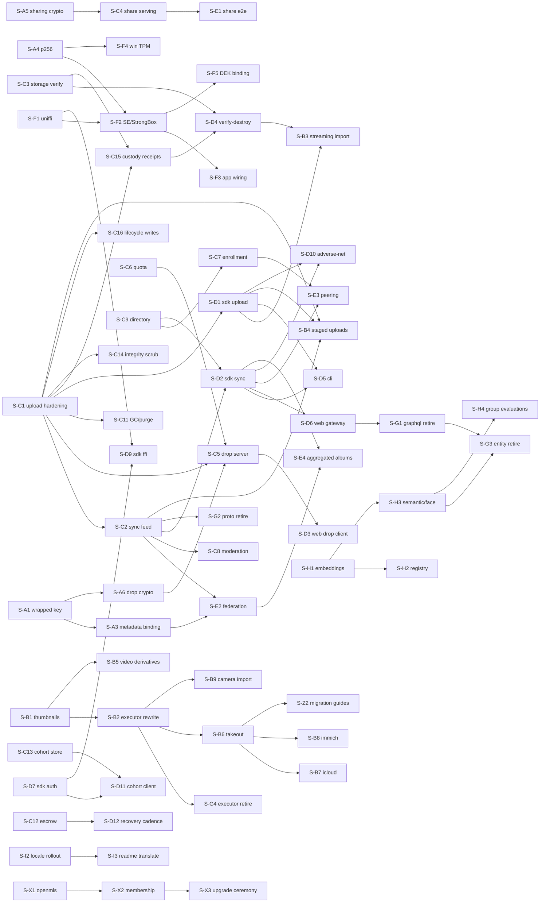

# Implementation Slices

This file is the executable index of everything the [design docs](capsule-docs/src/content/docs/design/)
specify that is **not yet implemented**, decomposed into independently shippable
**slices**. It supersedes `DEFERRED.md`: the baseline below records what already ships,
and every formerly-deferred item is now a slice with a bound contract.

**How to use this file.**

- Every slice has a stable ID (`S-A1`, `S-C3`, …). Code skeletons, `#[ignore]`d contract
  tests, and `LEGACY-PLAINTEXT (frozen)` markers reference these IDs; `rg S-C3` finds a
  slice's entire footprint.
- A slice references other slices **only by ID + contract anchor**, never by their
  internals. "Depends on" edges are hard (the contract consumed must exist); everything
  else can proceed in parallel.
- **Done when** must be checkable by running named commands. A slice that flips its
  named `#[ignore]`d tests, keeps `mise run check-rust` (and the other relevant `mise run
  check-*` gates) green, and satisfies its owner doc's Validation bullets is done.
- Sizes: **S** ≤ ½ day, **M** ≤ 2 days, **L** ≥ 3 days — for slicing sanity, not
  estimation. An L slice that can split should split.
- When a slice lands, update its row to `done` (leave the block for the record). When a
  new gap is found, add a slice — never a floating TODO.

## Baseline — already implemented and validated

The **offline crypto data plane** in `capsule-core` (see `cargo run -p capsule-cli --
demo`): canonical CBOR (RFC 8949 §4.2, cross-language conformance gate); the primitives
inventory (SHA-256, HKDF-SHA512, Argon2id, AES-256-GCM STREAM + metadata blobs, hybrid
Ed25519+ML-DSA-65, X-Wing KAT-validated); the key hierarchy with multi-epoch AMK
rotation, software keystore, and signed device directory; the `Signer`/`HardwareSigner`
seams with software + TPM reference adapters (Secure Enclave / StrongBox adapters in
`capsule-core-swift`/`-kotlin`); signed manifests + append-only provenance + the
exhaustive `verify_asset` chokepoint behind the `AlbumAuthority` seam
(`ReferenceAuthority` epoch ledger); the pure key-free validation invariants
(`capsule_core::validation`); CRDT metadata + signed `SidecarV1` + privacy-on-export;
deterministic signed backup (tar, AMK ledger, escrow, Shamir 2-of-3, dry-run/commit
restore); the lifecycle `Workspace` writing through to `library.sqlite`; the cache
eviction sweep (issue #23); the offline import pipeline (scan/plan/execute — still
writing the legacy unsigned sidecar, see S-B2).

On the server: `capsule-api-auth` (sessions, passkeys, TOTP, OIDC) is real and
testcontainer-tested; the custom chunked upload server exists but is unhardened (S-C1);
everything else networked is skeleton or legacy (below).

**Contract skeletons in-tree** (this PR): manifest `key_mode`/`wrapped_file_key`/
`metadata_blob_hash` fields + `asset-keywrap/v1` label; `crypto::keys::p256`;
`capsule_core::{drop, sharing}`; `library::{space, storage_verify}` (with the pure
`streaming_recommended` and `release_is_safe` predicates implemented);
`capsule-api-media::{verify, drops}` + `capsule-api-auth::devices` route stubs;
`capsule-api-upload::envelope` gate stub; the `capsule.sync.v1` proto + `SyncFeedService`
stub. The design-review pass added: the upload server's contract-complete session/
request types + append-only store + `error.upload.*` taxonomy (enforcement = S-C1);
sidecar `stack_membership: Lww<Option<…>>`, `cull`, and `hidden` (implemented +
tested); `capsule_core::cohort` and `capsule_core::backup::verify_recovery_secret`
(implemented + tested); `UploadPolicy`/`UploadTier`, `capsule-sdk::net`
(`ConnectionClass`/`RetryClass`), and `original_held` on the sync proto. Each names
its slice.

## Slice index

| ID    | Slice                                                | Lane            | Depends on       | Size | Status  |
| ----- | ---------------------------------------------------- | --------------- | ---------------- | ---- | ------- |
| S-A1  | Wrapped file-key mode (seal/unseal + verify)         | core-crypto     | —                | M    | done    |
| S-A2  | Re-key salt fold                                     | core-crypto     | —                | S    | done    |
| S-A3  | Metadata↔manifest binding (invariant 25, both sides) | core-crypto     | S-A1             | M    | done    |
| S-A4  | P-256 hybrid DSK variant                             | core-crypto     | —                | L    | done    |
| S-A5  | Share-link crypto (`capsule_core::sharing`)          | core-crypto     | —                | M    | done    |
| S-A6  | Drop crypto (`capsule_core::drop`, incl. WASM build) | core-crypto     | S-A1             | L    | done    |
| S-A7  | `gps.datum` sidecar field + BD-09 input fold         | core-crypto     | geocoordinates-rs (fold only) | S | done* |
| S-B1  | Thumbnail/LQIP generation                            | media/import    | —                | L    | done    |
| S-B2  | Signed-path import-executor rewrite                  | media/import    | S-B1             | L    | done    |
| S-B3  | Streaming import (probe, `total_size`, drive mode)   | media/import    | S-D1, S-D4       | L    | done    |
| S-B4  | Staged uploads (low-data tier ladder)                | media/import    | S-C1, S-C2, S-D1 | M    | done    |
| S-B5  | Video derivatives (first-frame still + H.264 preview) | media/import   | S-B1             | M    | done    |
| S-B6  | Google Takeout importer                              | media/import    | S-B2             | M    | done    |
| S-B7  | iCloud export importer                               | media/import    | S-B6             | M    | post-v1 |
| S-B8  | Immich importer                                      | media/import    | S-B6             | M    | post-v1 |
| S-B9  | Tethered camera import (PTP/IP)                      | media/import    | S-B2, ptpip-rs   | L    | post-v1 |
| S-C1  | Upload-server hardening (envelope gate + invariants) | server          | —                | L    | done    |
| S-C2  | Key-free sync feed                                   | server          | S-C1             | L    | done    |
| S-C3  | Storage-verification endpoint                        | server          | —                | M    | done    |
| S-C4  | Share-link serving endpoints                         | server          | S-A5             | M    | done    |
| S-C5  | Drop store, inbox, atomic adoption                   | server          | S-A6, S-C1, S-C6 | L    | done    |
| S-C6  | Quota service                                        | server          | —                | M    | done    |
| S-C7  | Device-enrollment endpoints (code + relay channel)   | server          | S-C9             | M    | done    |
| S-C8  | Moderation hooks                                     | server          | S-C2             | M    | done    |
| S-C9  | Device-directory publish/fetch                       | server          | —                | M    | done    |
| S-C10 | Key-free media serving conformance                   | server          | —                | M    | done    |
| S-C11 | Refcount GC + retention purge worker                 | server          | S-C1             | M    | done    |
| S-C12 | Backup escrow server surface                         | server          | —                | S    | done    |
| S-C13 | Session device-cohort storage + grouping             | server          | —                | S    | done    |
| S-C14 | Server integrity scrub (Postgres⇄blob-store)         | server          | S-C1             | M    | done    |
| S-C15 | Custody receipts + signed storage attestation        | server          | S-C1, S-C3       | M    | done    |
| S-C16 | Generic lifecycle-write endpoint (`/albums/{id}/ops`) | server         | S-C1             | M    | done    |
| S-D1  | SDK upload client (hand-written, stateful protocol)  | sdk/clients     | S-C1             | M    | done    |
| S-D2  | SDK sync/download client + connection-class budget   | sdk/clients     | S-C2, S-C9       | L    | done    |
| S-D3  | Web guest drop client (WASM)                         | sdk/clients     | S-A6, S-C5       | L    | ready   |
| S-D4  | Verify-before-destroy wiring                         | sdk/clients     | S-C3, S-C15      | M    | done    |
| S-D5  | CLI auth/sync/list                                   | sdk/clients     | S-D1, S-D2       | M    | done    |
| S-D6  | Web server gateway (key-free reads)                  | sdk/clients     | S-D2             | L    | done    |
| S-D7  | SDK auth/session foundation + auto token refresh     | sdk/clients     | —                | M    | done    |
| S-D8  | spargen REST client integration                      | sdk/clients     | in-house spargen | M    | done    |
| S-D9  | capsule-sdk uniffi FFI bindings                      | sdk/clients     | S-F1, S-D7       | M    | done*   |
| S-D10 | Adverse-network hardening                            | sdk/clients     | S-D1, S-D2       | M    | done    |
| S-D11 | Client cohort emission + devices grouping UI         | sdk/clients     | S-C13, S-D7      | M    | done*   |
| S-D12 | Recovery verification cadence + guided re-wrap       | sdk/clients     | S-C12            | M    | done    |
| S-D13 | Culling workflow client UX                           | sdk/clients     | —                | M    | done    |
| S-D14 | Local-gallery security gates                         | sdk/clients     | —                | S    | done    |
| S-D15 | Exact client build identification                    | sdk/clients     | —                | S    | done    |
| S-E1  | Share-link end-to-end serving                        | fed/sharing     | S-C4             | M    | done*   |
| S-E2  | Federation capabilities + pulls                      | fed/sharing     | S-C2, S-A3       | L    | done    |
| S-E3  | LAN peering                                          | fed/sharing     | S-D2, S-C7       | L    | done*   |
| S-E4  | Aggregated federated albums (album-group view)       | fed/sharing     | S-E2, S-D2       | L    | done    |
| S-F1  | uniffi consolidation (0.29 catalog vs 0.31 core)     | platform/FFI    | —                | M    | done    |
| S-F2  | Secure Enclave / StrongBox hybrid composition        | platform/FFI    | S-A4, S-F1       | L    | done*   |
| S-F3  | Xcode/Gradle binding wiring + on-device CI           | platform/FFI    | S-F2             | L    | ready   |
| S-F4  | Windows TPM (TBS) backend                            | platform/FFI    | S-A4             | M    | done*   |
| S-F5  | Hardware DEK binding                                 | platform/FFI    | S-F2             | M    | done*   |
| S-F6  | `log` → `tracing` migration (core + core-ffi)        | platform/FFI    | —                | S    | done    |
| S-F7  | core-swift XCTest → swift-testing migration          | platform/FFI    | —                | S    | done    |
| S-G1  | GraphQL retirement                                   | legacy-retire   | S-C2, S-D6       | M    | blocked |
| S-G2  | Legacy plaintext proto/service removal               | legacy-retire   | S-C2, S-D2       | S    | done    |
| S-G3  | Plaintext entity retirement (face/person/smart_tag)  | legacy-retire   | S-G1, S-H3       | M    | blocked |
| S-G4  | Legacy import-executor removal                       | legacy-retire   | S-B2             | S    | done    |
| S-H1  | Embeddings + sqlite-vec index                        | ML              | —                | L    | done    |
| S-H2  | Model registry + version regen                       | ML              | S-H1             | M    | done    |
| S-H3  | Semantic/face features                               | ML              | S-H1             | L    | done*   |
| S-H4  | Group-scoped evaluations (best shot/framing/exposure) | ML             | S-H3             | M    | post-v1 |
| S-I1  | Hardcoded-string migration to catalog keys           | i18n            | —                | M    | ready   |
| S-I2  | Official language-set rollout (12 locales + RTL)     | i18n            | —                | L    | done*   |
| S-I3  | `xtask translate-readme` + CI drift check            | i18n            | S-I2             | M    | done    |
| S-X1  | OpenMLS backend → `OpenMlsAuthority`                 | crypto/mls      | —                | L    | done    |
| S-X2  | MLS membership + Welcome/history delivery            | crypto/mls      | S-X1             | L    | done    |
| S-X3  | Album upgrade ceremony + MLS resilience              | crypto/mls      | S-X2             | L    | done    |
| S-Z1  | Library-settings document schema (design)            | design          | —                | S    | done    |
| S-Z2  | Provider migration user guides (docs site)           | design          | S-B6             | S    | done*   |

Lanes are independent by construction; within a lane, "Depends on" is the only ordering.
`blocked` = a dependency (or an upstream project) gates the start, not review priority.

## In-House and External Library Gates

Some slices depend on libraries that are ours but not yet stable, or on upstream
projects. A gated slice can start its non-gated parts; its "Done when" cannot fully
pass until the gate lifts.

| Library | Status | Gates |
| --- | --- | --- |
| `rawshift` (in-house RAW decode; git submodule, alpha, consumed by nothing yet) | stabilizing | Full RAW support in S-B1/S-B2. v1 ships the zune-jpeg format set; the `media::image::formats::raw` stub is the integration point. |
| `spargen` (in-house OpenAPI **3.1** client generator) | **released** (0.1.0 on crates.io) — gate lifted | S-D8 landed on it. One known 0.1.0 limitation: object-typed query parameters mis-lower (`.to_string()` on a non-`Display` struct), so the media asset-serve tree is excluded from the generated surface (it is the hand-written byte-transfer path anyway); re-include when spargen supports object query params. We never downgrade schemas to 3.0. |
| `geocoordinates-rs` (in-house WGS-84 ↔ GCJ-02/BD-09 conversions) | planned | The deterministic client-side coordinate conversion named in [Metadata — Geolocation](capsule-docs/src/content/docs/design/metadata.md); consumed by map display, S-H3 geo features, and S-A7's exact BD-09→GCJ-02 input fold. Until it lands, verbatim datum storage is unaffected (display conversion and the BD-09 fold are the gated pieces). |
| `ptpip-rs` (in-house PTP/IP camera protocol; repo not yet created) | planned | S-B9 (post-v1). Portable Rust PTP/IP (ISO 15740 over TCP/IP) with a vendor-extension seam (Sony first) — see [Import — Camera Import](capsule-docs/src/content/docs/design/import/camera-import.md). |
| `openmls` (RFC 9420 MLS; X-Wing suite `0x004D` via the libcrux provider) | available — no longer a gate | S-X1 adopts `MLS_256_XWING_CHACHA20POLY1305_SHA256_Ed25519` (`0x004D`), which OpenMLS ships today. Capsule is a closed deployment (all clients are Capsule's; federation is Capsule↔Capsule), so an IANA codepoint — a third-party-interop concern — is not required; a private/experimental codepoint is sufficient. X-Wing is off the WG standards track (the WG's `draft-ietf-mls-pq-ciphersuites` moved to direct ML-KEM hybrid; X-Wing-in-MLS is the non-adopted `draft-mahy-mls-xwing`), so if Capsule ever needs the ratified suite it migrates via the S-X3 upgrade ceremony + `crypto_suite_id`. Lane X (S-X1 → S-X2 → S-X3) is now ordinary sequenced work, not upstream-blocked. |

## Lane A — core crypto

### S-A1 — Wrapped file-key mode

- **Contract:** [Encryption — Asset Key Derivation](capsule-docs/src/content/docs/design/cryptography/encryption.md),
  [Provenance — Asset Manifest](capsule-docs/src/content/docs/design/cryptography/provenance.md).
- **Deliverable:** `asset-keywrap/v1` seal/unseal in `crypto::encryption` (wrap `K` under
  the AMK with a fresh `wrap_nonce` folded into the salt; unwrap to STREAM-decrypt), and
  `verify_asset` + `structural_ok` enforcing the presence rules (`wrapped_file_key`
  present iff `key_mode = wrapped`; `metadata_blob_hash` presence-by-action).
- **Seam today:** `KeyMode`/`WrappedFileKey` manifest fields and the
  `info::ASSET_KEYWRAP_V1` label are in-tree (wire-absent defaults, byte-identity
  regression-tested); behavior is deliberately unimplemented.
- **Done when:** the wrapped-mode positive/negative cases in the provenance doc's
  Validation section exist and pass (tampered `wrapped_file_key` → terminal-reject;
  member unwrap + decrypt round-trip); `mise run check-rust` green.
- **Tier:** Unit (exhaustive negative cases). **Blocks:** S-A3, S-A6.
- **Landed:** seal/unseal + the `wrapped_file_key` presence rule. The
  `metadata_blob_hash` presence-by-action rule rides S-A3 (its "field enforcement
  lands together" note): enforcement needs the `Workspace` to populate the field per
  the sealing order, which is S-A3's deliverable.

### S-A2 — Re-key salt fold

- **Contract:** [Encryption — Re-keying on Rewrite](capsule-docs/src/content/docs/design/cryptography/encryption.md).
- **Deliverable:** fold the fresh `nonce_prefix` into the file-key salt
  (`file_id || nonce_prefix`) and the metadata blob's fresh `nonce` into its key salt
  (`blob_id || nonce`), plus the writer's refuse-to-reuse-a-nonce defense in depth.
- **Seam today:** local to `crypto::encryption` key derivation; the design contract is
  written, the derivation still salts on the id alone.
- **Done when:** the rewrite re-roll unit tests in the encryption doc's Validation
  section pass (same `file_id` + epoch `replace` yields a different key AND nonce);
  existing round-trip vectors unchanged for first encryptions.
- **Tier:** Unit. **Blocks:** nothing (independent hardening).
- **Landed:** `derive_file_key(file_id, nonce_prefix)` / `derive_blob_key(blob_id,
  nonce)` fold per the doc's spec (KATs unchanged — none pinned a derived key
  against a bare id; the AEAD primitives are untouched); `CryptoError::NonceReuse`
  writer defense on both paths; every derive call site threaded (lifecycle,
  sharing scope material, drop adoption, backup restore). File-side re-roll is
  unit-exercised via `encrypt_asset_rekey` — no lifecycle `replace` re-encryption
  path exists yet to drive it end-to-end.

### S-A3 — Metadata↔manifest binding

- **Contract:** [Provenance](capsule-docs/src/content/docs/design/cryptography/provenance.md),
  [Metadata — Provenance Binding and Sealing Order](capsule-docs/src/content/docs/design/metadata.md),
  [Validation invariant 25](capsule-docs/src/content/docs/design/threat-model/validation.md).
- **Deliverable:** `Workspace` writes populate `metadata_blob_hash` per the sealing
  order; `verify_asset` runs the round-trip equivalence check (decrypted blob ==
  signed sidecar, blob hash == manifest field); the pure invariant-25 envelope check in
  `capsule_core::validation` for the server side.
- **Depends on:** S-A1 (field enforcement lands together). **Blocks:** S-E2.
- **Done when:** metadata round-trip equivalence tests (metadata + encryption docs)
  pass; a one-byte sidecar mutation quarantines.
- **Tier:** Unit.
- **Landed:** closes S-A1's presence-by-action deferral. The sidecar's
  `provenance_chain_hash` became `Option<Hash32>` (wire-absent exactly on create,
  referencing the **prior** head per the sealing order); `verify_metadata_binding`
  quarantines (distinct from terminal-reject); the server half is
  `validation::check_metadata_blob_envelope` (`error.upload.envelope_mismatch`
  mapping wired in `capsule-api-upload`).

### S-A4 — P-256 hybrid DSK variant

- **Contract:** [Keys — Device Keys](capsule-docs/src/content/docs/design/cryptography/keys.md);
  seam docs in `capsule-core/src/crypto/keys/p256.rs`.
- **Deliverable:** algorithm-tagged hybrid signature/verifying-key/directory-entry types
  over `ClassicalAlgorithm`, `P256HybridSigningKey: Signer` composing a hardware P-256
  half (DER ECDSA) with the software ML-DSA-65 half, and `verify_asset` dispatch on the
  directory entry's declared algorithm — the Ed25519 path byte-for-byte unchanged.
- **Seam today:** `crypto::keys::p256` skeleton + `#[ignore]`d contract test.
- **Done when:** `p256_hybrid_round_trip_and_directory_dispatch` un-ignored and green
  against a mock P-256 element; existing Ed25519 vectors untouched.
- **Tier:** Unit + Smoke (mock element). **Blocks:** S-F2, S-F4.
- **Landed:** algorithm tag carried by the tagged classical half and recovered
  from wire lengths (Ed25519 wire byte-identical — serde vectors untouched);
  DER ECDSA verbatim from the `HardwareSigner` seam, verified via
  `p256::ecdsa` (low/high-S both accepted per the doc); public-key ingestion
  normalizes compressed/uncompressed SEC1 + bare x‖y (TPM) to compressed;
  `verify_asset` dispatches on the directory entry's key with a cross-algorithm
  reject. `p256` reuses the version already in-tree via jsonwebtoken
  (default-features off — WASM build stays lean); no `DeviceEntry` schema change.

### S-A5 — Share-link crypto

- **Contract:** [Share Links](capsule-docs/src/content/docs/design/share-links.md);
  seam docs in `capsule-core/src/sharing/mod.rs`.
- **Deliverable:** `ShareLinkIssuer` implemented on `Workspace`: scope-key encapsulation
  around a fresh ≥128-bit link secret, optional Argon2id passphrase wrap (client-side
  unwrap), revocation records.
- **Done when:** the module's `#[ignore]`d tests flip (opaque-id entropy, client-side
  passphrase unwrap) plus the share-links doc's unit Validation bullets.
- **Tier:** Unit. **Blocks:** S-C4.
- **Landed:** issuer + encapsulation + client-side open + revocation records. The
  doc's two serve-path unit bullets (privacy-strip on serve, home-server-only) have
  no issuer surface and land with S-C4's six-bullet contract.

### S-A6 — Drop crypto

- **Contract:** [Web Upload](capsule-docs/src/content/docs/design/web-upload.md);
  seam docs in `capsule-core/src/drop/mod.rs`.
- **Deliverable:** `seal_drop` (fresh `K`, STREAM, KEM encapsulation to the Drop Key),
  `UploadLinkIssuer` + `DropAdopter` on `Workspace` (Drop Key mint + master-key/OGK
  escrow wrap; decapsulate → `asset-keywrap/v1` rewrap → signed `create` with
  `key_mode = wrapped`), and the WASM build of the sealing path for `capsule-web`.
- **Depends on:** S-A1. **Blocks:** S-C5, S-D3.
- **Done when:** the module's three `#[ignore]`d tests flip; the web-upload doc's unit
  Validation bullets pass; the sealing path compiles to `wasm32-unknown-unknown`.
- **Tier:** Unit (seal round-trip + adoption rewrap).
- **Landed:** all three tests flipped; WASM sealing surface builds via
  `cargo build -p capsule-core --target wasm32-unknown-unknown --no-default-features`
  (new default `native` feature gates SQLite/lifecycle; `ffi`/`media` imply it;
  `.cargo/config.toml` pins the wasm getrandom backend). Drop Key private half is
  escrowed under the account master key — the multi-device OGK re-wrap rides the
  escrow seam once MLS membership (Lane X) exists. Note for S-E1: `sharing` sits
  behind `native`; move it to the always-on set when the browser unwrap needs it.

### S-A7 — `gps.datum` sidecar field + BD-09 input fold

- **Contract:** [Metadata — Geolocation](capsule-docs/src/content/docs/design/metadata.md),
  [Metadata — Closed Enum Value Sets](capsule-docs/src/content/docs/design/metadata.md).
- **Deliverable:** the closed `GpsDatum` enum (`wgs84 | gcj02`) in
  `capsule-core::domain`; the optional `datum` key on the sidecar `gps` value
  (wire-absent = `wgs84`, byte-identity regression-tested against the existing
  known-answer vectors, plus a new populated-`datum` vector); the exact BD-09 → GCJ-02
  fold applied at the input edge (from `geocoordinates-rs` — the only gated piece;
  verbatim storage of either datum needs no conversion code). The lossy display
  conversions stay behind the `geocoordinates-rs` gate and are **not** this slice.
- **Done when:** the metadata doc's datum-verbatim-storage Validation bullet passes
  (GCJ-02 round-trips unconverted; BD-09 folds exactly; WGS-84 stays wire-absent and
  byte-identical); `mise run check-rust` green.
- **Tier:** Unit.
- **Landed (done\* — fold gated):** closed `GpsDatum` enum + wire-absent-default
  `datum` key (byte-identity KAT kept, populated vector added, signed round-trip);
  BD-09 is a distinct input-edge type (never a storable datum) and
  `fold_bd09_to_gcj02` REFUSES with `DatumFoldError::FoldGated` until
  `geocoordinates-rs` ships the exact closed-form fold — refusal, never an
  approximation, per the metadata doc. The seam's body swaps in the real fold with
  no signature change; flip `done*` → `done` when the gate lifts.

## Lane B — media / import

### S-B1 — Thumbnail/LQIP generation

- **Contract:** [Thumbnails](capsule-docs/src/content/docs/design/thumbnails.md).
- **Deliverable:** **still-image** thumbnail/preview generation over
  `capsule_core::media` (the folded former `capsule-media` crate, behind the
  non-default `media` feature; today it decodes JPEG only — format decoders grow as
  needed), chromahash LQIP + `dominant_color` into the sidecar `lqip` field,
  `DerivativeManifest`-signed outputs. Video tiers are split to S-B5 (distinct
  transcode toolchain).
- **Done when:** generation produces the committed still formats with signed
  derivative manifests; LQIP lands in the sidecar and renders as the fallback tier.
- **Tier:** Unit + Smoke. **Blocks:** S-B2, S-B5.
- **Landed:** core owns resize + the closed format enum + `DerivativeManifest`
  signing/chaining + LQIP (thumbhash bytes under `LQIP_FORMAT_V1`, versioned
  fallback tested); JXL/AVIF/WebP byte-encoding is the injected `StillEncoder`
  seam per the thumbnails doc's "per-platform encoder libraries in capsule-sdk"
  architecture — the SDK-side codec wiring rides S-B2's executor integration.
  No new dependencies.

### S-B2 — Signed-path import-executor rewrite

- **Contract:** [Import — Pipeline](capsule-docs/src/content/docs/design/import/pipeline.md) (status note).
- **Deliverable:** the legacy `import::executor` unified onto the signed
  `lifecycle::Workspace` path (signed `SidecarV1` + manifest + provenance + derivatives),
  retiring the unsigned `AssetSidecar` write path.
- **Depends on:** S-B1 (derivative generation is the missing input). **Blocks:** S-G4.
- **Done when:** an executor import produces `verify_asset`-accepting assets with
  derivatives; planner determinism suite unchanged.
- **Tier:** Unit (planner) + Smoke (executor).
- **Landed:** executor drives `Workspace::import_asset_with` (STREAM → signed
  sidecar → sealed blob → signed create → self-gate on `verify_asset` + binding);
  derivatives + LQIP behind `media` via S-B1's encoder seam; EXIF capture/GPS into
  the signed sidecar; move-mode releases the source only after the verified durable
  commit; planner suite untouched. The unsigned `AssetSidecar` write path is no
  longer reachable from the executor (deletion = S-G4). Known gap (pre-existing):
  album keys are session-scoped — durable key persistence is its own follow-up.

### S-B3 — Streaming import

- **Contract:** [Import — Pipeline: Import-Upload Streaming Mode](capsule-docs/src/content/docs/design/import/pipeline.md).
- **Deliverable:** `library::available_bytes()` (the probe skeleton in
  `library/space.rs`), planner `total_size` accounting (it emits counts only today),
  the `streaming_recommended` plan attachment at confirmation, the minimum-headroom
  hard error, and the executor's import→upload→verify→release window with
  halt-on-disconnect.
- **Depends on:** S-D1 (upload client), S-D4 (release gate). **Done when:** the
  pipeline doc's three streaming Validation bullets pass; `space.rs`'s `#[ignore]`d
  probe test flips.
- **Tier:** Unit (auto-detect) + Smoke (release gating, halt-on-disconnect).
- **Landed:** real `available_bytes` probe (rustix/windows-sys, native-gated);
  planner `total_size` with the recommendation attached at confirmation (planner
  determinism untouched); `execute_streaming` window over injected
  `AssetUploader`/`StorageVerifier` seams (core network-free; SDK/CLI supply real
  ones); halt-on-disconnect resumes via plan re-derivation without re-import.
  Landing also fixed an S-D4 latent bug this slice exposed: `release_owned_original`
  keyed representation rows by unhyphenated UUID while the lifecycle writer indexes
  hyphenated — the release lookup could never match (tests were self-consistently
  wrong); all sites now use the writer's form.

### S-B4 — Staged uploads (low-data tier ladder)

- **Contract:** [Download & Sync — Upload Tiering (Staged Uploads)](capsule-docs/src/content/docs/design/import/download-sync.md);
  seams: `UploadPolicy`/`UploadTier` in `capsule-core::import::upload`, `original_held`
  on the sync proto.
- **Deliverable:** the client-side staged scheduler — sessions open T0 (manifest +
  metadata w/ LQIP) → T1 (thumb + preview) → T2 (original) per asset, T2 gated on the
  large-reconciliation criteria; the `awaiting-original` derived state end-to-end
  (badge UX, `error.blob.pending_upload` handling, GC carve-out server-side); tier
  queue re-derived from server truth on resume. Zero server mode branches by
  construction — the policy is session ordering only.
- **Depends on:** S-C1 (visibility gate + `original_held` derivation), S-C2 (feed
  field), S-D1 (upload client). **Done when:** the download-sync doc's staged
  Validation bullets pass (ladder order, awaiting-original semantics, release gate,
  resume-from-server-truth, staged×streaming exclusion).
- **Tier:** Unit + Smoke.
- **Landed:** all five bullets tested; ONE canonical `UploadPolicy`/`UploadTier`
  in `capsule-core::import::upload` (orphan mod-declared; S-D2's `StagedTier`
  mirror deleted; dead `plan.rs`-style skeleton removed); scheduler in
  `capsule-sdk::staged` over a `TierSink` seam; exclusion enforced at confirmation
  AND by construction in the streaming window; zero server changes. Resume keys
  off feed blob hashes — `SessionSummary` carries no hash, so in-flight tiers
  resume implicitly through create-dedup/HEAD (documented).

### S-B5 — Video derivatives

- **Contract:** [Thumbnails — Video Previews](capsule-docs/src/content/docs/design/thumbnails.md)
  (formats fixed by the tier table).
- **Deliverable:** the video derivative path behind the `media` feature — first-frame
  JXL/AVIF still for the thumbnail tier, H.264 baseline preview transcode (original
  resolution capped to 1080p, CRF 23, 30 fps cap, AAC audio) for the preview tier —
  signed through the same `DerivativeManifest` path as S-B1's stills.
- **Depends on:** S-B1 (derivative plumbing + signing path).
- **Done when:** a fixture video yields both tiers with signed manifests; the
  closed-format rejection covers the video rows of the tier table.
- **Tier:** Unit + Smoke.
- **Landed:** `VideoTranscoder` seam mirroring S-B1's encoder architecture; the
  doc's parameters pinned as types (`H264PreviewParams::CONTRACT` — baseline,
  1080p cap, CRF 23, 30fps, AAC — always passed by core, never chosen by the
  transcoder); both tiers signed through the S-B1 manifest chain; closed video
  format set. Platform transcoders (ffmpeg/AVFoundation/MediaCodec) are the
  apps' halves, same as the still encoders.

### S-B6 — Google Takeout importer

- **Contract:** [Import — Third-Party Importers](capsule-docs/src/content/docs/design/import/pipeline.md).
- **Deliverable:** the Takeout source adapter in
  `capsule-core::import::importers::takeout` (and the adapter trait it defines,
  shared by S-B7/S-B8/S-B9): archive walk, JSON-sidecar pairing (taken-time, GPS,
  description, favorites, album JSONs), the EXIF-over-exporter precedence fold at
  extraction, and the known Takeout quirks (truncated filenames, `(1)` duplicates,
  edited/original pairs, split archives) as fixture-covered adapter concerns. The
  planner and executor are untouched.
- **Depends on:** S-B2 (imports must land on the signed path). **Blocks:** S-B7,
  S-B8, S-Z2.
- **Done when:** the pipeline doc's Takeout mapping-table Validation bullet passes;
  a fixture-archive import is deterministic across runs and skips completed work on
  re-run.
- **Tier:** Unit (mapping table, determinism) + Smoke (end-to-end archive import).
- **Landed:** `SourceAdapter` trait + `ExtractedImport → to_scan_result()` handoff
  (the seam S-B7/B8/B9 implement; planner/executor untouched); all four Takeout
  quirks fixture-covered; determinism + resume proven against the real planner.
  Adapter operates over extracted directory trees (no zip reader added). Follow-up:
  the extracted exporter metadata (`ExtractedMetadata`) folds at extraction but the
  signed sidecar-enrichment write is a documented seam — wiring it means touching
  the executor, deferred with S-B2's other known gaps.

### S-B7 — iCloud export importer (post-v1)

- **Contract:** [Import — Third-Party Importers](capsule-docs/src/content/docs/design/import/pipeline.md).
- **Deliverable:** the iCloud Photos export adapter (originals + CSV metadata) on the
  S-B6 adapter trait. **Depends on:** S-B6. **Status: post-v1** — indexed so the
  contract has an owner. **Tier:** Unit + Smoke.

### S-B8 — Immich importer (post-v1)

- **Contract:** [Import — Third-Party Importers](capsule-docs/src/content/docs/design/import/pipeline.md).
- **Deliverable:** the Immich adapter (export/API surface fixed when the slice
  starts) on the S-B6 adapter trait. **Depends on:** S-B6. **Status: post-v1**.
- **Tier:** Unit + Smoke.

### S-B9 — Tethered camera import (post-v1)

- **Contract:** [Import — Camera Import](capsule-docs/src/content/docs/design/import/camera-import.md).
- **Deliverable:** the PTP/IP source adapter in `capsule-core::import::camera` over
  the gated in-house `ptpip-rs` crate — deterministic handle enumeration,
  hash-on-receipt integrity, per-object resume, read-only camera storage, mDNS +
  manual discovery/pairing — feeding the unmodified pipeline; Sony extension quirks
  stay behind the crate.
- **Depends on:** S-B2 (signed path) + the `ptpip-rs` library gate.
- **Status: post-v1** — indexed so the adapter seam has an owner now.
- **Done when:** the camera-import doc's mock-responder unit suite passes; the bench
  smoke pulls a real card's worth from hardware. **Tier:** Unit + Smoke (bench
  hardware lane); rides E2E case 2 once live.

## Lane C — server (key-free surfaces)

### S-C1 — Upload-server hardening

- **Contract:** [Import — Upload Protocol](capsule-docs/src/content/docs/design/import/upload-protocol.md),
  [Validation invariants 1–15](capsule-docs/src/content/docs/design/threat-model/validation.md).
- **Deliverable:** the `EnvelopeGate` (skeleton in `capsule-api-upload/src/envelope.rs`)
  wired ahead of every write with `capsule_core::validation::protocol_gate` +
  `check_manifest_envelope` (already implemented and unit-tested in core) plus the
  top-level↔envelope consistency check (`error.upload.envelope_mismatch`); the
  idempotency machinery (tuple replay store returning byte-identical duplicate
  responses; create-dedup returning the active session / `409 duplicate_blob` per the
  doc's Idempotency and Resumption section, in one `SELECT…FOR UPDATE` transaction);
  the atomic status CAS on finalization + the finalization transaction ordering; the
  visibility gate on **manifest + metadata** finalization with `original_held`
  derivation (staged-uploads contract); the discard machinery (≥1 h progress floor,
  pressure eviction least-recently-progressed-first, startup scrub of orphan
  `incoming/*.bin` + length-diverged sessions); the uploader-scoped session index; and
  the `error.upload.*` code on every rejection (constants already generated).
- **Done when:** invariants 1–15 (as amended) each have a rejecting test against the
  real server (testcontainer Postgres + Valkey) asserting status **and** `error.*`
  code; every row of the upload doc's Strictness Table has a test; the
  session-lifecycle smoke passes; the discard-floor test passes (progress within 1 h
  is never evicted under injected pressure); crash injection between append and
  counter-increment, and between rename and commit, recovers per the atomicity
  invariants.
- **Tier:** Unit + Smoke + E2E case 2/11. **Blocks:** S-C2, S-C5, S-C11, S-D1, S-B4.
  (The custody-receipt insert that joins this finalization transaction is owned by
  S-C15 — no scope change here.)
- **Landed:** all deliverables; invariants 1–15 + Strictness Table each tested against
  testcontainer Postgres + Valkey. Schema-driven partials: invariant 7's device half
  uses the account-creation time as the `added_at` floor until S-C9's directory table
  lands; invariant 6's album protocol-pin sub-check is a no-op (no pin column yet) —
  album existence + write capability are enforced and re-validated at finalization.
  `original_held` ships as a pure derivation; the feed field carrying it is S-C2.
  Pressure eviction is operator/sweeper-invoked (no live cache-bytes counter yet).

### S-C2 — Key-free sync feed

- **Contract:** `capsule-api/sync/proto/capsule/sync/v1/sync.proto` (in-tree),
  [Download & Sync](capsule-docs/src/content/docs/design/import/download-sync.md),
  [API Surfaces](capsule-docs/src/content/docs/design/api-surfaces.md).
- **Deliverable:** `SyncFeedService` implemented — per-album `sync_seq` minted in the
  finalization transaction, the HMAC'd opaque cursor (invariant 22), entries carrying
  the manifest as opaque CBOR + metadata blob + blob refs + the `original_held`
  completeness fact (proto field in-tree; staged-uploads contract); gRPC metadata
  negotiation per the api-surfaces mapping; the salvo↔tonic bridge verified
  end-to-end.
- **Depends on:** S-C1. **Blocks:** S-C8, S-D2, S-E2, S-G1, S-G2.
- **Done when:** the download-sync doc's sync-feed Validation bullets (monotonicity,
  forward-version rejection, rewind rejection, cursor authenticity) pass server-side.
- **Tier:** Unit + Smoke + E2E case 3.
- **Landed:** `sync_seq` mint joins S-C1's finalization transaction (counter-row-lock
  linearised, gap-free per album); HMAC-SHA256 opaque cursor (MAC key HKDF-derived
  from the JWT key, `SYNC_CURSOR_MAC_KEY` override); manifest travels as the
  canonical-CBOR envelope projection (the server holds no full signed manifest);
  salvo↔tonic bridge fixed en route (`{**rest}` route syntax + trailer streaming).
  Known limitation: global `feed_seq` pagination is bigserial — a long-racing
  finalization could commit below a served cursor; per-album `sync_seq` (the
  anti-rewind layer) is unaffected. S-D2's client high-water marks are the
  client-side halves of forward-version/rewind rejection.

### S-C3 — Storage-verification endpoint

- **Contract:** [Storage Verification](capsule-docs/src/content/docs/design/import/storage-verification.md);
  stub `capsule-api-media/src/routes/verify.rs`.
- **Deliverable:** `POST /storage/verify` computing stored/indexed/retrievable from the
  blob store + Postgres, the `deep` re-hash (rate-limited, coalesced), and the
  GC-grace interaction that keeps a just-verified blob out of byte deletion.
- **Done when:** the storage-verification doc's six unsigned-verdict Validation
  bullets pass; the stub's `todo!()` is gone. (The signed `StorageAttestation`
  extension of this endpoint is owned by S-C15.) **Tier:** Unit + Smoke.
  **Blocks:** S-D4, S-C15.
- **Landed:** pure-read endpoint; blob addressing lifted into
  `service::blob_store` (shared with upload, no fork); `indexed` derives from the
  S-C2 sync feed; deep re-hash per-hash coalesced + per-user rate-limited (proven
  with injected hasher gate + mocked clock); GC-grace contract in `service::gc`
  (`GC_GRACE_WINDOW`, `earliest_byte_deletion`, `blob_gc` table — S-C11 owns the
  writes and MUST NOT byte-delete before the window elapses).

### S-C4 — Share-link serving

- **Contract:** [Share Links — Security Contract](capsule-docs/src/content/docs/design/share-links.md).
- **Deliverable:** `/s/{opaque-id}` metadata + blob + wrapped-secret endpoints on the
  existing stub route group: indistinguishable 404, per-IP/per-link rate limits,
  mandatory privacy strip, fail-closed revocation cache, home-server pointer for peers.
- **Depends on:** S-A5. **Blocks:** S-E1. **Done when:** the doc's six Validation
  bullets pass. **Tier:** Unit + Smoke.
- **Landed:** all six bullets tested, incl. byte-identical 404s across
  unknown/revoked/expired (status+headers+body asserted equal), fail-closed
  revocation cache (stale cache refuses, injected clock), mandatory privacy strip
  via `export_policy::strip_for_export` with no opt-out. Home-server pointer is
  `421 + {home_server}` (deliberately distinguishable non-content). Publish is a
  service-level mutation mirroring drops' provision step (HTTP publish surface
  deferred with drops'). Migration renumbered to `000009` at landing (escrow holds
  `000008`).

### S-C5 — Drop store, inbox, adoption

- **Contract:** [Web Upload](capsule-docs/src/content/docs/design/web-upload.md),
  [Validation invariants 26–32](capsule-docs/src/content/docs/design/threat-model/validation.md);
  stubs `capsule-api-media/src/routes/drops.rs`.
- **Deliverable:** drop sessions under link-capability auth (+ Argon2id passphrase
  verifier), chunks via the upload mechanics, the inbox rows, and the single-transaction
  inbox→album promotion on adoption (invariant 32).
- **Depends on:** S-A6, S-C1, S-C6 (drops charge the owner's quota at creation).
- **Done when:** invariants 26–32 each have a rejecting test; the adoption-atomicity
  crash-injection smoke passes. **Tier:** Unit + Smoke + E2E case 13. **Blocks:** S-D3.
- **Landed:** invariants 26–32 tested (status + code); adoption is one transaction
  (`service::drop::Mutation::adopt_in_txn`: inbox `FOR UPDATE` → quota handover →
  asset insert → `sync_seq` mint + feed entry → inbox delete; rollback smoke proves
  no half-state; re-adopt is `AlreadyPromoted`). Owner quota charged at drop
  creation via txn-scoped `quota::reserve`. Upload transport (`UploadSessionManager`
  + `StorageService`) re-exported, not forked. Notes: in-process rate limiter
  (shared-Valkey limiter is future hardening); drop endpoints use `#[handler]` so
  they're absent from the OpenAPI doc; drops migration renumbered to `000004` at
  landing (S-C3's `blob_gc` holds `000003`).

### S-C6 — Quota service

- **Contract:** [Quota](capsule-docs/src/content/docs/design/quota.md).
- **Deliverable:** `capsule-api-service::quota` per the doc's contract skeleton —
  accounting sums, the five states (incl. the Grace-expired lifecycle-write exemption),
  enforcement at session creation/cancellation/metadata-growth, `GET /quota`.
- **Done when:** the quota doc's seven Validation bullets pass. **Tier:** Unit + Smoke.
  **Blocks:** S-C5.
- **Landed:** all seven bullets tested. Accounting splits originals (assets index,
  first-uploader attribution; the pending row is the reservation) from aux/federated
  blobs (`quota_ledger`, refcounted) — the doc's "reads from the asset index" hint
  cannot hold the blob classes the index doesn't model. `check` runs inside S-C1's
  create transaction; metadata-growth enforcement is exercised at the service
  boundary until S-C16 lands its HTTP surface; `Suspended` enforcement rides S-C8.

### S-C7 — Device-enrollment endpoints

- **Contract:** [Device Enrollment](capsule-docs/src/content/docs/design/device-enrollment.md);
  stubs `capsule-api-auth/src/routes/devices.rs`.
- **Deliverable:** enrollment-code issue/redeem (single-use, 10-min, rate-limited,
  deleted on redemption/expiry), the relay channel, and the directory-update path for
  cross-device add.
- **Depends on:** S-C9. **Blocks:** S-E3 (peering assumes enrolled same-user devices).
- **Done when:** the enrollment doc's code-lifecycle Validation bullets (expiry,
  single-use, local-auth gate) pass. **Tier:** Unit + Smoke; E2E case 12 needs S-F2.
- **Landed:** issue/redeem (256-bit code + 10-digit text fallback, both single-use,
  deleted on redeem/expiry; issuance rate-limited); relay = per-channel directional
  mailboxes over Valkey, opaque payloads, possession-authorized (enrollee is
  unauthenticated); cross-device add republishes the signed directory through
  S-C9's monotonic publish (no fork). Local-auth gate enforced as the
  server-visible proxy: access-token freshness ≤ 2 min. Redemption brute-force
  folds into the indistinguishable `code_refused`.

### S-C8 — Moderation hooks

- **Contract:** [Moderation](capsule-docs/src/content/docs/design/moderation.md).
- **Deliverable:** federated-report intake (signed, rate-limited — invariant 24),
  suspension (`error.moderation.account_suspended` at session creation), takedown
  (`served = false`, 410 to peers, moderation provenance record), server blocklist.
- **Depends on:** S-C2 (report transport rides the peer surface). **Done when:** the
  moderation doc's six Validation bullets pass. **Tier:** Unit + Smoke.
- **Landed:** all six bullets tested. Suspension wires S-C6's flag into S-C1's
  create path (`403 error.moderation.account_suspended`); takedown flips
  `assets.served` + appends a `moderation_events` provenance row, 410 before any
  disk access, blob preserved; report intake = shape → blocklist → Ed25519 verify
  against registered `federation_peers` → per-peer budget → admin queue (peer
  identity gets re-grounded when S-E2's capabilities land); per-user block is the
  server-visible half (share-row revocation) — the MLS Remove/epoch-bump half is
  Lane-X-gated. Also fixed the legacy asset routes' dead `<id>` salvo syntax so
  the 410 gate is actually reachable.

### S-C9 — Device-directory publish/fetch

- **Contract:** [Keys — Device Directory](capsule-docs/src/content/docs/design/cryptography/keys.md),
  [Validation invariant 23](capsule-docs/src/content/docs/design/threat-model/validation.md).
- **Deliverable:** the server surface for publishing and fetching signed
  `DeviceDirectory` documents with the monotonic `directory_version` check — without it
  no sync consumer can verify manifests. (The directory type + signing is implemented
  in core.)
- **Done when:** invariant 23's rejecting test passes; a client can fetch and pin a
  directory end-to-end. **Tier:** Unit + Smoke. **Blocks:** S-C7, S-D2.
- **Landed:** publish/fetch of verbatim signed CBOR (server projects only
  `directory_version` for the guarded-upsert monotonicity check; fetch is
  byte-identical). S-C1's invariant-7 per-device floor stays on account-creation
  time: the upload contract carries no UUID device id (`created_by_device` is
  zeroed in the envelope battery), so joining directory entries needs a contract
  change — follow-up owned by whichever slice adds device identity to uploads.

### S-C10 — Key-free media serving conformance

- **Contract:** [Filesystem — Server](capsule-docs/src/content/docs/design/filesystem/server.md),
  [Encryption — ranged reads](capsule-docs/src/content/docs/design/cryptography/encryption.md),
  [Download & Sync](capsule-docs/src/content/docs/design/import/download-sync.md).
- **Deliverable:** `GET /blob/{hash}` serving opaque ciphertext by content address with
  HTTP `Range` at the **65,536-byte ciphertext stride**, replacing the plaintext-era
  assumptions in the legacy asset routes (marked `LEGACY-PLAINTEXT`), with access-token
  auth per route.
- **Done when:** ranged reads decrypt correctly at chunk boundaries (the encryption
  doc's ranged-read test against a real server); no plaintext-era route regressions.
- **Tier:** Unit + Smoke.
- **Landed:** `GET /blob/{hash}` over the shared blob store; stride cited from core
  (`CIPHERTEXT_CHUNK` = 65,536); mid-file chunk proven to decrypt in isolation
  against the real server. Status taxonomy: 404 unknown/malformed; 410 quarantined/
  mid-GC/dangling (decided before the stat so grace bytes never serve);
  awaiting-original = 409 + `error.blob.pending_upload` (per the api-surfaces
  stale-state convention, distinguishable from 410). Album-scoped authz is a
  carried-but-unconsumed seam (`BlobServeReference.album_id`) — feed-level authz
  is S-C2's. Legacy plaintext routes untouched (S-G1/G3 own retirement).

### S-C11 — Refcount GC + retention purge worker

- **Contract:** [Filesystem — Server: Deletion and GC](capsule-docs/src/content/docs/design/filesystem/server.md),
  [Organization — Retention Window](capsule-docs/src/content/docs/design/organization.md).
- **Deliverable:** the two-phase mark-and-sweep over refcounts (grace window honored),
  the keyless purge worker enforcing `retention_until` from the envelope, and the
  orphan sweep the finalization crash-safety depends on.
- **Depends on:** S-C1. **Done when:** the organization doc's retention smokes pass
  (early purge refused; post-window purge proceeds; hostile-purge defense).
- **Tier:** Unit + Smoke + E2E case 7 (with S-D2).
- **Landed:** two-phase mark-and-sweep honoring S-C3's grace contract (byte-delete
  only past `earliest_byte_deletion`, zero-reference re-confirmed under the row
  lock; reappearing references cancel marks; quarantine never swept; dangling refs
  quarantined); keyless retention purge from the signed envelope floor; `capsule-gc`
  operator binary (`--dry-run`, phase filters). Refcount SSoT = live `assets` rows
  + the S-C6 `quota_ledger` (the append-only feed would pin blobs forever). Note:
  blob store is flat `blobs/{hash}.bin` per the landed code, not the doc's nested
  fanout — doc or store should reconcile eventually.

### S-C12 — Backup escrow server surface

- **Contract:** [Backup — Master-Key Escrow](capsule-docs/src/content/docs/design/backup-recovery.md).
- **Deliverable:** store/fetch/**replace** of the wrapped master-key escrow blob
  (opaque to the server; the wrap format is implemented in core) — replace is
  single-active-escrow: the old blob is deleted in the same transaction, per the
  guided re-wrap contract in the backup doc — with the ≥128-bit recovery-secret rule
  surfaced client-side.
- **Done when:** escrow round-trips through the server and unwraps with the passphrase
  path already tested in core; after a replace, the prior blob is gone and unwraps
  nothing. **Tier:** Smoke + E2E case 6 (backup → restore on a fresh device: this
  slice's escrow fetch bootstraps the passphrase path over the implemented core
  restore). **Blocks:** S-D12.
- **Landed:** `PUT`/`GET /backup/escrow`, strictly owner-scoped (no target param);
  single-active-escrow via the primary-key upsert (replace overwrites in one
  statement — prior ciphertext unretrievable, proven by unwrap-fails test); blob
  fully opaque (4 KiB size sanity only; the ≥128-bit rule stays client-side).

### S-C13 — Session device-cohort storage + grouping

- **Contract:** [Authentication — Device Cohorts](capsule-docs/src/content/docs/design/authentication.md);
  pure hash in `capsule_core::cohort` (implemented + tested).
- **Deliverable:** accept the advisory `cohort_hash` in the session-creation body,
  store it on the session record + the durable `device_cohorts(user_id, cohort_hash,
  first_seen, last_seen)` map, and surface both through the session listing.
  Advisory-only invariant enforced structurally: no authorization path reads it.
- **Done when:** the authentication doc's cohort Validation bullets pass (advisory
  behavior under absent/garbage values; grouping; durable map outlives sessions).
- **Tier:** Unit + Smoke. **Blocks:** S-D11.
- **Landed:** advisory-only is structural — the value never enters `Claims` (the
  sole authz input), enforced by a serialization tripwire test; guarded-upsert
  durable map (`first_seen` pinned, `last_seen` bumped); `GET /devices` now returns
  `{devices, cohorts}`. Over-long values (>128) treated as absent; TOTP/passkey
  ceremonies pass no cohort yet (S-D11's client emission decides what rides them).

### S-C14 — Server integrity scrub

- **Contract:** [Maintenance — Server-Side Integrity Scrub](capsule-docs/src/content/docs/design/filesystem/maintenance.md).
- **Deliverable:** the operator-invoked, read-only scrub command in `capsule-api` —
  row→blob presence (with the `awaiting-original` carve-out), blob→row orphan
  detection, deep re-hash, envelope⇄index chain agreement, mirrored-fact agreement,
  debris/quarantine inventory — classified structured findings, per-class counts,
  non-zero exit on any finding, and **no mutation of any kind**.
- **Depends on:** S-C1 (the envelope persistence and finalization semantics it
  audits). **Done when:** the maintenance doc's seeded-corruption matrix passes
  against testcontainer Postgres + a real blob tree; clean-store idempotency holds.
- **Tier:** Unit + Smoke.
- **Landed:** `capsule-scrub` binary + `service::scrub`, SELECT-only with a
  byte-identity no-mutation proof (tree digest + row-set snapshots). Schema-honest
  mappings: the envelope⇄index chain check walks the `custody_receipts` hash chain
  (the one materialized envelope-derived chain); the mirrored fact is the declared
  size held in three copies; debris = flat `{upload_id}.bin` staging, quarantine =
  the `blob_gc` flag. Fields living only inside the opaque `manifest_cbor` have no
  second column to disagree with and are not separately checkable today.

### S-C16 — Generic lifecycle-write endpoint

- **Contract:** [Authorization — The Lifecycle Write Surface](capsule-docs/src/content/docs/design/authorization.md),
  [Validation invariants 16–18 + 25](capsule-docs/src/content/docs/design/threat-model/validation.md),
  [API Surfaces — transport row](capsule-docs/src/content/docs/design/api-surfaces.md).
- **Deliverable:** `POST /albums/{album_id}/ops` in `capsule-api-upload::ops` — the
  signed manifest bundle (opaque canonical-CBOR manifest + encrypted metadata blob
  when the action carries one) through S-C1's `EnvelopeGate` before any write;
  invariants 16 (closed action set), 17 (`prior_provenance_hash` chain match,
  `409` stale-revival), 18 (monotonic + MLS-attested `amk_version`), and 25
  (metadata-blob hash binding) each rejecting with its `error.*` code; content-hash
  replay idempotency returning the byte-identical prior response; provenance append +
  per-album `sync_seq` mint in one transaction (the sync feed's finalization rule).
- **Depends on:** S-C1 (envelope gate + finalization transaction shape).
- **Done when:** invariants 16/17/18 each have a rejecting test (status **and**
  `error.*` code) against testcontainer Postgres; the replay test returns
  byte-identical responses; a delete → restore round-trip smoke passes and appears on
  the sync feed in order.
- **Tier:** Unit + Smoke + E2E case 7 (with S-C11, S-D2).
- **Landed:** one-transaction op path (replay lookup → `FOR UPDATE` asset lock →
  envelope battery incl. invariant 25 → soft-delete/restore → quota metadata-growth
  → feed mint → replay row `ON CONFLICT DO NOTHING`); chain head + epoch derived
  from the S-C2 feed projection (no new head tables); invariant 18's MLS ceiling
  stays Lane-X-gated (monotonic backstop enforced). **Open follow-up:** S-C1 mints
  a nanoid `assets.id` unrelated to the signed `file_id`, so uploads aren't yet
  addressable by `/ops` until the ids are aligned — owned by whichever slice unifies
  asset identity (candidate: S-C10/S-G3 territory).

## Lane D — SDK / clients

`capsule-sdk` is the **sanctioned network path**: it owns the session/token store and
auto refresh (S-D7), the complete user-flow primitives (login → upload → status →
sync), and their FFI exposure to Swift/Kotlin/Linux (S-D9). Native apps consume the
SDK; they never hand-roll network flows.

### S-D1 — SDK upload client

- **Contract:** [Import — Upload Protocol](capsule-docs/src/content/docs/design/import/upload-protocol.md);
  the `todo!()` stubs in `capsule-sdk/src/upload.rs`.
- **Deliverable:** the hand-written chunked, resumable, adaptive upload client — the
  protocol is too stateful for codegen; the spargen-generated REST client (S-D8)
  covers the plain request/response surfaces instead. Implements create/PATCH/HEAD/
  DELETE/list with `application/octet-stream`, the **required** `X-Capsule-Checksum`
  (lowercase-hex SHA-256), `X-Capsule-Offset`, and the handshake headers; the
  adaptive algorithm per the doc (normative), clamped to the protocol bounds
  `[PROTOCOL_MIN_CHUNK, PROTOCOL_MAX_CHUNK]` with alignment guaranteed by
  construction; and the code-driven recovery matrix (`offset_mismatch` → HEAD
  re-align; `session_not_found` → re-create; `duplicate_blob` → merge; `426` →
  abort-with-upgrade; `checksum_mismatch` → re-send) — clients switch on `error.*`
  codes, never bare statuses.
- **Depends on:** S-C1. **Blocks:** S-B3, S-B4, S-D5. **Done when:** the upload doc's
  client-side Validation bullets pass against a real server; the recovery matrix has
  a mocked-HTTP test per code; E2E case 2 lives.
- **Tier:** Unit + Smoke + E2E case 9 (the cross-version protocol gate — this slice's
  `426` abort-with-upgrade path against the real handshake).
- **Landed:** full client + recovery matrix (mocked-HTTP test per code) + four
  real-server integration tests (`capsule-api/upload/src/tests/sdk_client.rs`,
  real router over TCP + testcontainers) covering round-trip, duplicate-blob merge,
  session resume, and the live 426 gate. Uploads compose with S-D7's `Session`
  (`UploadTransport::with_session`). Follow-up noted: `duplicate_blob`'s asset ref
  rides only the English detail message — a structured field is an S-C1 follow-up.

### S-D2 — SDK sync/download client

- **Contract:** [Download & Sync](capsule-docs/src/content/docs/design/import/download-sync.md).
- **Deliverable:** the gRPC sync consumer (cursor high-water marks, per-album
  `sync_seq` anti-rewind, forward-version rejection), tiered on-demand fetch with the
  degrade ladder (403-as-authorization-change), resumable ranged blob fetch, and the
  connection-class detection (taxonomy owned by
  [Networking](capsule-docs/src/content/docs/design/networking.md); `ConnectionClass`
  seam in `capsule-sdk::net`) that feeds the cache-eviction byte budget and the
  staged-upload tier gates.
- **Depends on:** S-C2, S-C9. **Blocks:** S-D5, S-D6, S-E3, S-G1, S-G2.
- **Done when:** the download-sync doc's client Validation bullets pass; E2E case 3
  lives. **Tier:** Unit + Smoke.
- **Landed:** validate-then-apply `SyncState` (no partial apply; per-album
  high-water anti-rewind proven against the real server via an authentic replayed
  cursor); tiered fetch + degrade ladder + ranged resume over a mocked `BlobSource`
  (`HttpBlobSource` is the production impl — live wiring rides S-C10's blob
  serving); `ConnectionClass` detection + tier/reconciliation gates + eviction
  byte budget in `capsule-sdk::net`. Client-only proto codegen from the S-C2
  `.proto`; real-server tests live in `capsule-api/sync` (dev-dep on the SDK).

### S-D3 — Web guest drop client

- **Contract:** [Web Upload](capsule-docs/src/content/docs/design/web-upload.md).
- **Deliverable:** the `capsule-web` guest flow at `/u/{opaque-id}#…`: WASM `seal_drop`,
  the drop upload, progress + failure UX; strictly contribute-only.
- **Depends on:** S-A6, S-C5. **Done when:** E2E case 13's browser half runs (seal →
  stage → adopt on a native client → verify on a second device). **Tier:** Smoke
  (browser/WASM).

### S-D4 — Verify-before-destroy wiring

- **Contract:** [Storage Verification — Verify Before Destroy](capsule-docs/src/content/docs/design/import/storage-verification.md);
  the implemented pure predicate `capsule_core::library::release_is_safe`.
- **Deliverable:** the SDK call to `POST /storage/verify` + the 60-second re-verify
  window, wired into the three destructive paths (device-owned-original release,
  Move-import source deletion, streaming release) via `release_is_safe`; plus the
  **receipt half of the gate** — fetch, verify (pinned attestation key, field match),
  and persist the `CustodyReceipt` (`{uuid}.receipts.cbor`, included in the backup
  artifact) for every finalized upload, with release refused when the receipt is
  missing or unverified.
- **Depends on:** S-C3; S-C15 (receipt endpoints + attestation key). **Blocks:** S-B3.
  **Done when:** `storage_verify.rs`'s `#[ignore]`d wiring test flips; the client.md
  verify-before-release smoke passes; the receipt-gated-release smoke
  (storage-verification doc) passes.
- **Tier:** Unit + Smoke.
- **Landed:** `ReleaseGate` fail-closed on all paths (verify unavailable / not
  durable / receipt missing → retain); owned-original + Move-source releases wired;
  streaming release left as the documented seam S-B3 consumes
  (`defer_source_release`). Receipts persist to `{uuid}.receipts.cbor` and ride the
  backup artifact (round-trip tested). Client `CustodyReceiptCore` is a
  byte-compatible mirror (canonical CBOR) guarded by a cross-crate test against the
  real server signer — no dep-direction inversion.

### S-D5 — CLI auth/sync/list

- **Contract:** [Clients](capsule-docs/src/content/docs/design/clients.md) (the CLI is a client).
- **Deliverable:** the `todo!()` CLI commands (`auth login/logout`, `sync`, `list`)
  over the SDK clients.
- **Depends on:** S-D1, S-D2, S-D7 (the token store — the CLI never hand-rolls auth).
  **Done when:** `capsule auth login && capsule sync && capsule list` round-trips
  against a dev server. **Tier:** Smoke + E2E case 1 (auth → sync → client-side
  library query — the CLI round-trip *is* the case).
- **Landed:** E2E case 1 lives (`cli_login_sync_list_round_trip`, real auth+sync
  over TCP + testcontainers, incl. persisted-cursor no-op second sync). All
  commands drive SDK primitives (zero CLI-side reqwest/tonic); session persists as
  `PersistedSession` JSON at `0600`; per-album high-water marks derive from
  `MAX(sync_seq)` and rehydrate via the new `SyncState::restore`. CLI became
  lib + bin so tests drive command fns. `--local/--remote/--force` flags accepted
  but render the same synced view for now (no separate local-query path yet).

### S-D6 — Web server gateway

- **Contract:** [API Surfaces](capsule-docs/src/content/docs/design/api-surfaces.md)
  (library queries are client-side); the `CapsuleGateway` seam in
  `capsule-web/src/data/gateway.ts` (`server-gateway.ts` currently throws).
- **Deliverable:** the web app's real read path — sync-fed local store queried
  client-side (the browser's analogue of `library.sqlite`), replacing the mock gateway;
  auth is already wired.
- **Depends on:** S-D2 (the feed contract). **Blocks:** S-G1 (query parity is the
  retirement precondition). **Done when:** the gateway methods run against a dev server
  with the mock gateway deleted. **Tier:** Smoke (`mise run check-web` + bun tests).
- **Landed:** the web read path is a **key-free projection** of `capsule.sync.v1`
  over **gRPC-web** — hand-rolled golden-tested Protobuf+gRPC-web codec
  (`sync/wire.ts`) into a client-side `SyncStore` (validate-then-apply, per-album
  `sync_seq` anti-rewind + forward-version rejection, persisted cursor+snapshot in
  one atomic unit); mock gateway deleted. Server side: the same `SyncService` gains
  `tonic_web::GrpcWebLayer` + a scoped CORS hoop (key-free; native gRPC untouched,
  26 sync tests green). Queries return **key-free shells**: ids, album membership +
  counts, awaiting-original, blob content-addresses, change recency are real;
  titles/cover art/capture dates/dimensions/LQIP/locations are absent (encrypted
  metadata; the wasm decode/verify boundary deferred in gateway.ts fills them
  later). For S-G1, "query parity" = the four gateway methods on this real path —
  not decrypted-content parity, which is structurally impossible until the wasm
  boundary lands. Owed: a live browser↔server gRPC-web smoke (CORS preflight is the
  unexercised piece); blob rendering rides the wasm boundary; 28 bun tests cover
  wire/store/gateway against a mocked transport.

### S-D7 — SDK auth/session foundation + auto token refresh

- **Contract:** [Authentication — Session and Access Tokens](capsule-docs/src/content/docs/design/authentication.md);
  the parked `AuthenticatedClient` shape in `capsule-sdk/src/lib.rs`.
- **Deliverable:** the SDK-owned session/token store and refresh engine — a quick
  asynchronous pre-flight check on token expiry before each request, single-flight
  refresh, 401-retry-once — hand-rolled `reqwest` against the real `capsule-api-auth`
  endpoints (no spargen dependency), exposing the login → authenticated-call → logout
  primitives. This is the "SDK owns the complete user flow" foundation: native apps
  never juggle raw tokens.
- **Done when:** login/refresh/expiry flows round-trip against a dev server; a mocked
  clock exercises pre-flight refresh + single-flight; `capsule-sdk` stays in every
  Rust gate. **Tier:** Unit + Smoke. **Blocks:** S-D9, S-D11; S-D5 consumes it.
- **Landed:** wire flows proven against a focused in-process mock HTTP server (real
  `reqwest` over TCP) — booting `capsule-api-auth` from the SDK crate would pull the
  server stack into SDK dev-deps, against the mocking rule. The live dev-server
  round-trip rides S-D5's E2E case 1, which consumes this store.

### S-D8 — spargen REST client integration

- **Contract:** [API Surfaces — Why Two Transports](capsule-docs/src/content/docs/design/api-surfaces.md);
  the parked wrapper in `capsule-sdk/src/lib.rs`.
- **Gated on (internal, imminent):** in-house `spargen` (OpenAPI 3.1 client generator)
  reaching usable stability **and** the server's OpenAPI schema stabilizing post-S-C1.
  Capsule-controlled — not an external gate; the wait is our own release, tracked against
  spargen's repo milestones (re-evaluate monthly).
- **Deliverable:** generate the typed REST client from the OpenAPI 3.1 schema (no 3.0
  downgrade, ever), revive `AuthenticatedClient` over it (composing S-D7's token
  store), and delete the parked comment blocks.
- **Landed:** `capsule_api::openapi_router()` dumps the salvo-oapi 3.1 schema
  state-free (no DB/Valkey/keys/disk) to committed `capsule-sdk/openapi.json`
  (29 paths); each server crate single-sources its route *shape* in a
  `route_tree()`/`schema_router()` helper the live router injects state onto, so the
  dump cannot drift from serving. `gen_openapi --check` is the `openapi-check` gate in
  `check-rust` (mirrors `i18n-check`). spargen generates `capsule_sdk::rest::Client`
  at **build time** (build-dependency only; the client is a pure function of the
  committed spec). `client::AuthenticatedClient` wraps it, `Deref`s to it, and
  composes S-D7's `Session` via spargen's async token-provider seam (pre-flight
  refresh + single-flight reused, not duplicated). Generated surface = plain
  request/response ops only — hand-written upload (S-D1)/sync (S-D2) untouched;
  media asset-serve excluded (byte transfer + the spargen 0.1.0 object-query-param
  gap in the gates table). Owed: reactive 401-retry-once on the typed path needs a
  reqwest-middleware layer (S-D10 territory; proactive refresh already covers the
  expiry case); bare-`#[handler]` routers (share `/s`, drops `/u`, `.well-known`,
  passkeys, gRPC) stay absent from the schema by construction.

### S-D9 — capsule-sdk uniffi FFI bindings

- **Contract:** [Clients](capsule-docs/src/content/docs/design/clients.md),
  [Module Map](capsule-docs/src/content/docs/design/module-map.md) (`capsule-sdk` row).
- **Deliverable:** the uniffi surface over `capsule-sdk`'s user-flow primitives
  (login, upload file, upload/sync status, sync) so iOS/macOS (Swift), Android
  (Kotlin), and Linux consumers call one SDK instead of reimplementing flows —
  async-capable bindings, sharing the single-uniffi-version strategy S-F1 lands;
  binding generation joins `gen-bindings`/`verify-examples`.
- **Depends on:** S-F1, S-D7. **Done when:** Swift + Kotlin harnesses drive a
  login→upload→status round-trip against a dev server through the bindings.
- **Tier:** Smoke per platform.
- **Landed (done\* — native harness runs owed):** `FfiCapsuleClient`/`FfiSession`
  async surface (tokio runtime; tokens never cross the FFI — opaque session
  handle); both binding sets generate non-empty (Kotlin suspend fns, Swift async
  throws verified in output); `gen-bindings`/`verify-examples`/`build-ffi`/
  `lint-check-ffi` extended to cover the SDK namespace; Rust-side flow smoke 4/4
  vs the mock server. Owed: the Swift/Kotlin harness round-trips on platform CI
  (Kotlin toolchain broken on this host); `sync_pull` behaviorally driven only by
  the native harness.

### S-D10 — Adverse-network hardening

- **Contract:** [Networking — Adverse-Network Posture](capsule-docs/src/content/docs/design/networking.md);
  `ConnectionClass`/`RetryClass` seams in `capsule-sdk::net`.
- **Deliverable:** behavioral `adverse` promotion/demotion (reset/stall counters over
  a sliding window), stall-detection cuts (no-bytes-for-T) with offset/Range resume,
  bounded transfer windows under `adverse`, chunk-size floor coupling, Happy Eyeballs
  at dial, and the three retry policy classes as a shared engine the sync/upload/fetch
  paths instantiate.
- **Depends on:** S-D1, S-D2. **Done when:** the networking doc's four Validation
  bullets pass (mocked-signal class matrix; promotion/demotion; stall-cut-resume with
  zero duplicate bytes; backoff discipline). **Tier:** Unit + Smoke.
- **Landed:** one `RetryEngine` instantiated by all three paths (fetch/upload =
  BulkTransfer, sync = Interactive); stall-cut + bounded windows via
  `RangedFetcher` (zero-duplicate-bytes proven by exact window tiling);
  adverse pins the upload chunk floor. Happy Eyeballs: address racing is
  stack-provided (hyper-util, verified in source); S-D10 adds the per-address
  dial timeout + the no-request-racing structural guarantee. Jitter is a
  dependency-free xorshift (no `rand` in the workspace).

### S-D11 — Client cohort emission + devices grouping UI

- **Contract:** [Authentication — Device Cohorts](capsule-docs/src/content/docs/design/authentication.md).
- **Deliverable:** per-platform primary-identifier readers (Keychain seed / SSAID /
  IOPlatformUUID / MachineGuid / hashed machine-id), `cohort_hash` emission at session
  creation, the grouped devices view with assert-don't-litigate copy, and the one-tap
  support bundle (`cohort_hash` + device-id/session map).
- **Depends on:** S-C13, S-D7. **Done when:** a reinstall groups with "previously
  used" in the devices view; the support bundle round-trips. **Tier:** Unit + Smoke.
- **Landed (done\* — native halves owed):** `PrimaryIdentifierReader` seam with
  Linux machine-id (hashed, never raw) + macOS IOPlatformUUID readers host-tested;
  emission rides login/register (absent = omitted, not null); devices grouping
  view model with reinstall→`PreviouslyUsed` proven; assert-don't-litigate copy as
  catalog keys; support bundle serde round-trips. Owed: iOS/Android/Windows reader
  adapters + the native devices screens; `device_id` in the bundle awaits the
  server listing surfacing it (S-C13 follow-up).

### S-D12 — Recovery verification cadence + guided re-wrap

- **Contract:** [Backup — Recovery Verification Cadence](capsule-docs/src/content/docs/design/backup-recovery.md);
  `capsule_core::backup::verify_recovery_secret` (implemented + tested).
- **Deliverable:** the escrow-blob cache + refresh, the cadence scheduler
  (7 d → 90 d → 180 d, re-arm triggers, snooze caps, never-blocking), the
  verification prompt UX, and the guided re-wrap flow (new secret, same master key,
  escrow replace via S-C12, Shamir re-issue, old-artifact guidance).
- **Depends on:** S-C12. **Done when:** the backup doc's cadence Validation bullets
  pass (mocked clock; stale-cache rule; re-wrap smoke with unchanged blob hashes).
- **Tier:** Unit + Smoke.
- **Landed:** `capsule-sdk::recovery` — pure serde-persistable `RecoveryCadence`
  (every method takes `now`; `blocks_critical_flow()` is `const false` — the
  never-blocking rule is compile-time); escrow cache with the
  refresh-once-on-mismatch stale rule; `guided_rewrap` proven to keep the exact
  master-key bytes + blob hashes while the old secret unwraps nothing; Shamir
  re-issue + old-artifact guidance as data. Prompt UX strings are the platform
  apps' to localize — the engine ships states, not strings.

### S-D13 — Culling workflow client UX

- **Contract:** [Organization — Culling](capsule-docs/src/content/docs/design/organization.md)
  (schema landed: sidecar `cull` LWW register).
- **Deliverable:** the keyboard/swipe-driven review mode writing `cull` flags,
  flag-filtered views, derived group cull state, and the reject-sweep (batch-move to
  trash — the only destructive step, soft per retention).
- **Done when:** the flag → filter → sweep loop round-trips on a fixture library;
  concurrent flags from two devices converge. **Tier:** Unit + Smoke.
- **Landed:** culling engine on `Workspace` (signed metadata-update writes, CRDT
  sync-apply path, cull-filtered views, derived-never-stored `GroupCullState`,
  retention-carrying `reject_sweep` + restore reversal); convergence proven both
  merge orders. CLI surface is the `capsule demo` culling segment — a standalone
  `capsule cull` awaits user-library open/passphrase plumbing (the durable-key
  follow-up S-B2 noted). Companion `set_stack_membership` write-through added.

### S-D14 — Local-gallery security gates

- **Contract:** [Local Gallery — Security Requirements](capsule-docs/src/content/docs/design/local-gallery.md).
- **Deliverable:** the fresh-local-auth gate (biometric → credential fallback, per-view
  5-minute grace) on the Recently Deleted and Hidden views, and the cache/temp
  placement audit asserting no plaintext lands outside the library root.
- **Done when:** the local-gallery doc's unit Validation bullets pass; the NFR1
  no-network-on-read-paths smoke runs with a socket-refusing harness.
- **Tier:** Unit + Smoke; the airplane-mode E2E case rides the Module Map surface.
- **Landed:** `LocalAuthGate` uniffi foreign trait + `GateKeeper` (per-view 5-min
  grace on a monotonic injectable clock; window from original mint); gated
  `query_recently_deleted` wired. NFR1 proven structurally: capsule-core's
  transitive closure contains no network crate (non-vacuous — the test asserts
  those crates DO exist elsewhere in the lock). SR3 placement audit: all writes
  under the library root; `tempfile` is dev-only. The Hidden view's DB projection
  doesn't exist yet — the gate governs it at policy level; the projection plugs
  into the same `GateKeeper` when the Organization work lands it.

### S-C15 — Custody receipts + signed storage attestation

- **Contract:** [Storage Verification — Custody Receipts / Signed Storage Attestation /
  Proof of Loss](capsule-docs/src/content/docs/design/import/storage-verification.md),
  [Validation invariants 33–34](capsule-docs/src/content/docs/design/threat-model/validation.md).
- **Deliverable:** the server **attestation keypair** (hybrid Ed25519+ML-DSA-65,
  distinct from the operational key) with well-known publication + append-only key
  history (federation doc); `CustodyReceipt` signing hooked into S-C1's finalization
  transaction (receipt + `uploaded` flip commit together) with the per-server
  `receipt_seq` chain; `GET /upload/{id}/receipt` + `GET /assets/{asset_id}/receipts`
  (`error.upload.receipt_not_available` before Completed — key already in `locales/`);
  `signed`/`nonce` on `POST /storage/verify` returning `StorageAttestation`,
  rate-limited like `deep`.
- **Depends on:** S-C1 (finalization transaction), S-C3 (verify endpoint).
- **Done when:** the storage-verification doc's receipt/attestation/proof-of-loss
  Validation bullets pass (issuance atomicity, log monotonicity, nonce echo,
  loss-proof composition, delete rebuttal, cross-server replay, rotation continuity).
- **Tier:** Unit + Smoke. **Blocks:** the receipt half of S-D4's release gate.
- **Landed:** all bullets tested. Receipt insert joins the finalization transaction
  (with `mark_uploaded` + the S-C2 feed mint — all three atomic, proven by rollback);
  per-server `receipt_seq` chained by prior-receipt hash, append-only enforced by a
  DB trigger; hybrid attestation keypair from `ATTESTATION_KEY_SEED` (HKDF-derived
  fallback, distinct label) published at `/.well-known/capsule/attestation-keys`
  with key history; `signed`/`nonce` on `/storage/verify` rate-limited like `deep`.
  `DeleteRebuttal` is a minimal binding — full chain verification rides S-D4.

### S-D15 — Exact client build identification

- **Contract:** [Provenance — Client Build Identification](capsule-docs/src/content/docs/design/cryptography/provenance.md).
- **Deliverable:** build-time git-commit embedding (`build.rs` `git rev-parse` + dirty
  detection — no vergen-class dependency needed) feeding the manifest producer in
  `capsule-core::lifecycle`, which today writes `capsule-core/{CARGO_PKG_VERSION}`;
  a `client_id` injection point through the SDK/FFI surface so each app reports
  itself (`capsule-ios`, `capsule-cli`, …) rather than `capsule-core`; the same value
  on `generated_by_client`.
- **Done when:** the provenance doc's client-build-identification Validation bullet
  passes; a locally built CLI writes `capsule-cli/{semver}+{commit}` (`.dirty` on a
  modified tree). Test fixtures may keep arbitrary strings — the grammar is producer
  discipline, not a verify gate.
- **Tier:** Unit.
- **Landed:** dependency-free `build.rs` git probe (12-hex commit + `.dirty`;
  all-zero sentinel fallback, never a build failure; `rerun-if` watches only
  HEAD/ref/index so incremental builds stay valid — purely unstaged edits won't
  re-probe, documented); `Workspace::with_client_id` injection reaches FFI via a
  `FfiClientBuild` record; all four manifest producers stamp their own build.

## Lane E — federation / sharing

### S-E1 — Share-link end-to-end serving

- **Contract:** [Share Links](capsule-docs/src/content/docs/design/share-links.md).
- **Deliverable:** the full share flow — issue on a native client (S-A5), serve (S-C4),
  open in a browser with client-side unwrap — plus scenario #33/#42 checks.
- **Depends on:** S-C4. **Done when:** a passphrase-protected album link opens
  read-only in a clean browser profile with the privacy strip verified. **Tier:** Smoke.
- **Landed (done\* — live-browser smoke owed):** the full flow — issuer crypto
  (S-A5) → serve (S-C4) → browser client-side open. `capsule_core::sharing` moved
  to the always-on set (per the S-A6 note); new `capsule-wasm` workspace member
  (wasm-bindgen, open-only surface: passphrase detection, `openShare`,
  `ShareScope.decryptBlob`) with stable machine error codes and one
  indistinguishable `wrong_secret` for the whole cannot-open family. Web route
  `/s/$opaqueId`: guest no-auth read-only viewer — fragment secret and passphrase
  never leave the browser, 421 home-server pointer resolution, one generic message
  for the indistinguishable 404; 19 new `share.*` catalog keys. Build: mise
  `build-wasm` (cargo + pinned `wasm-bindgen-cli` `=0.2.100`, bumped together;
  wasm-pack rejected — it fetches tools at runtime) + `share-kat` fixtures feed
  `test-web`/`build-web`; artifacts gitignored, deterministic. Scenario #33/#42
  client halves proven by the cross-language KAT (Rust seals real issuer
  encapsulation + real STREAM ciphertext; bun/wasm reopens byte-exactly;
  wrong-passphrase/tamper refused). Owed: the clean-browser-profile live smoke
  (like S-D6's); in-viewer thumbnail decrypt needs `ServeAsset`/
  `ShareMetadataResponse` to carry `nonce_prefix`+`amk_version` (S-C4 surface
  extension — follow-up); 12 non-English `share.*` entries are English
  placeholders pending translation seeds.

### S-E2 — Federation capabilities + pulls

- **Contract:** [Federation](capsule-docs/src/content/docs/design/federation.md),
  [Validation invariants 19–21](capsule-docs/src/content/docs/design/threat-model/validation.md).
- **Deliverable:** capability issuance/verification/refresh/revocation (`iat`, album
  `aud`, `revoked-jti` with pruning + 15-min fail-closed staleness), the pull path over
  the sync feed with invariants 1–18 + 25 re-applied, per-peer compartmentalization
  (budgets, circuit breaker, probation), soft-fail rejected-hash table, scope
  enforcement by blob role.
- **Depends on:** S-C2, S-A3. **Done when:** the federation doc's seven Validation
  bullets pass; E2E case 4 lives. **Tier:** Unit + Smoke + E2E case 4.
- **Landed:** all seven bullets + invariants 19–21 tested; EdDSA-JWT capabilities
  (RFC-3339 temporals via jiff, 24h exp clamp, UUIDv7 jti); `federation_peers`
  (S-C8's) stays the sole peer-identity store — only the durable revocation list
  is new state; E2E case 4 = two service instances over two Postgres containers,
  byte-identical cross-peer manifest + tamper→soft-fail proven. Note: the pull
  path ships as authority objects + pure gates exercised in-process on the feed
  query — the capability metadata riding the real gRPC method is thin follow-up
  wiring (S-E4/S-E3 consume these same gates).

### S-E3 — LAN peering

- **Contract:** [Peering](capsule-docs/src/content/docs/design/peering.md).
- **Deliverable:** `capsule-sdk::peering` — opaque rotating mDNS discovery, mutual-TLS
  with the classical half + application-layer hybrid chain check, delta-scoped backup
  artifact transfer over ranged GET, ingest through the restore path.
- **Depends on:** S-D2 (cursor model + transport plumbing), S-C7 (enrolled same-user
  devices). **Done when:** the peering doc's six Validation bullets pass; E2E case 5
  lives. **Tier:** Unit + Smoke per platform.
- **Landed (done\* — live mDNS responder owed):** all six bullets + the in-process
  E2E case 5; CA-less real mTLS (rustls, ring pinned, ephemeral rcgen leaf) with
  the hybrid check bound to the RFC 5705 session exporter (stronger than
  SPKI-equality — a re-terminating MITM can't forge the proof); opaque rotating
  advertisement is pure + unit-tested behind the `Discovery` seam; delta-scoped
  transfer structurally can't ship held assets; stale revival quarantines. Owed:
  the live `mdns-sd` responder (non-deterministic in CI — its dependencies-doc
  row is written).

### S-E4 — Aggregated federated albums (album-group view)

- **Contract:** [Federation — Federated Shared Albums](capsule-docs/src/content/docs/design/federation.md)
  (assertion schema), [Organization — views](capsule-docs/src/content/docs/design/organization.md).
- **Deliverable:** the `AlbumGroupAssertion` write/merge on the collaborative-metadata
  op path, group-aware invites (group_id + sibling hints riding the existing album
  invite), the aggregate view renderer (member-of ∧ asserts-group inclusion rule,
  capture-time ordering, per-origin partial-view indicator), leave = assertion
  removal (+ optional unshare), per-origin moderation drop. Zero new server surface —
  buildable against `ReferenceAuthority` fixtures while MLS membership (S-X2) is
  pending; user-facing multi-user invites ride S-X2 (same caveat as organization's
  invitation surface).
- **Depends on:** S-E2 (cross-server read path), S-D2 (feed consumer). **Done when:**
  the federation doc's aggregated-album Validation bullets pass (composition,
  injection-refusal, partial view, leave propagation, LWW rename convergence).
- **Tier:** Unit + Smoke.
- **Landed:** all five bullets tested; `AlbumGroupAssertion` (device-signed, LWW
  name, hint-union merge) rides the op path AMK-sealed (server-opaque, proven);
  inclusion = member-of ∧ asserts-group ∧ not-blocked; per-origin degraded/partial
  view; zero server surface confirmed. Cover override is a renderer parameter —
  reading it from the S-Z1 settings document rides that schema's implementation
  slice; multi-user invites still ride S-X2.

## Lane F — platform / FFI

### S-F1 — uniffi consolidation

- **Contract:** the two surfaces' crate docs (`capsule-core-ffi/src/lib.rs`,
  `capsule-core/src/ffi.rs`).
- **Deliverable:** one uniffi version and one bindings strategy for the `Catalog`
  surface (0.29) and the `FfiWorkspace`/`HardwareSigner` surface (0.31) — either merged
  or explicitly layered — keeping `mise run gen-bindings` + `verify-examples` green and
  the Swift app's `CatalogFFIBridge` compiling.
- **Done when:** a single uniffi version across the workspace; both binding sets
  regenerate non-empty. **Tier:** Smoke (binding generation + harness tests).
  **Blocks:** S-F2.
- **Landed:** layered strategy — two crates, one uniffi (0.31.1, `cargo tree -i`
  single node); catalog surface bumped 0.29→0.31 with a symbol-level Swift diff
  proving zero source-breaking changes for `CatalogFFIBridge` (additive
  `LocalizedError` only; internal pointer→handle plumbing invisible to consumers);
  both binding sets regenerate non-empty; `swiftc -parse` clean. Merging was
  rejected — it would collapse namespaces and force consumer edits.

### S-F2 — Secure Enclave / StrongBox composition

- **Contract:** [Keys — Device Keys](capsule-docs/src/content/docs/design/cryptography/keys.md);
  the harness adapters in `capsule-core-swift` / `capsule-core-kotlin`.
- **Deliverable:** the existing SE/StrongBox `HardwareSigner` adapters composed
  end-to-end through `P256HybridSigningKey` into workspace signing, with the
  per-platform smoke (sign/verify/non-exportability) running on real hardware where CI
  allows. **Depends on:** S-A4, S-F1. **Blocks:** S-F3, S-F5.
- **Done when:** `capsule-core-swift`'s `swift test` exercises the real Secure Enclave
  path with the P-256 composition; the Kotlin harness mirrors it. **Tier:** Smoke per
  platform; enables E2E case 12.
- **Landed (done\* — Kotlin run owed):** `createWithP256HardwareSigner` FFI
  constructor (Ed25519 path untouched); the real Secure Enclave RAN on this host —
  SE-held P-256 + ML-DSA halves signed a directory + manifest, verified through
  `verify_asset`, non-exportability asserted. Two adapter bugs fixed en route
  (Swift returned raw r‖s instead of DER; Kotlin returned SPKI instead of SEC1).
  The Kotlin mirror is written but unexecuted (local Gradle broken) — platform CI
  owes the run.

### S-F3 — App binding wiring + on-device CI

- **Contract:** [Clients](capsule-docs/src/content/docs/design/clients.md).
- **Deliverable:** the generated bindings + `cdylib`/`staticlib` wired into the real
  Xcode and Gradle apps, with on-device CI lanes. **Depends on:** S-F2.
- **Done when:** both apps build in CI consuming the produced bindings. **Tier:** Smoke.

### S-F4 — Windows TPM (TBS) backend

- **Contract:** [Keys — Device Keys](capsule-docs/src/content/docs/design/cryptography/keys.md).
- **Deliverable:** the TBS-path `HardwareSigner` (the tss-esapi reference covers
  Linux), P-256 composed. **Depends on:** S-A4. **Done when:** the Windows smoke
  mirrors the TPM reference adapter's. **Tier:** Smoke.
- **Landed (done\* — Windows CI run owed):** raw-TBS adapter hand-marshalling the
  reference lifecycle; pure wire codec host-tested (10 tests, incl. raw-r‖s→DER);
  bare x‖y publics + DER sigs plug into `P256HybridSigningKey` unchanged;
  `cargo check --target x86_64-pc-windows-msvc --no-default-features` green
  (`windows-sys` TBS feature, doc row added). Owed to Windows CI: full ffi build
  (MSVC C toolchain for bundled SQLite), windows-target clippy, real-TPM smoke.

### S-F5 — Hardware DEK binding

- **Contract:** [Keys — Device Keys](capsule-docs/src/content/docs/design/cryptography/keys.md).
- **Deliverable:** the device **encryption** key's classical half hardware-bound
  (P-256 ECDH), mirroring the DSK composition. **Depends on:** S-F2. **Tier:** Smoke.
- **Landed (done\* — keystore wiring + Kotlin owed):** `HardwareKeyAgreement` seam
  + `P256HybridDek` mirroring the X-Wing combiner with the classical half swapped
  (distinct domain label; lengths never alias X25519's, so tagging is structural;
  X-Wing KAT byte-identical); real SE ECDH ran on this host. Owed: wiring the
  hardware DEK into full workspace creation/keystore (this slice ships the
  composition + FFI smoke), and the Kotlin StrongBox ECDH adapter (local Gradle
  broken).

### S-F6 — `log` → `tracing` migration

- **Contract:** [Dependencies — Rust](capsule-docs/src/content/docs/design/dependencies.md)
  (logging row: `tracing` is the sole facade).
- **Deliverable:** every `log::` call site in `capsule-core` and `capsule-core-ffi`
  replaced with `tracing` (structured fields; `#[instrument]` spans on the hot paths
  the traceability rule names), the platform bridges (oslog) re-wired through a
  tracing subscriber, and the `log` workspace dependency dropped once nothing consumes
  it.
- **Done when:** `rg 'log::'` finds no non-frozen hits in the two crates; the existing
  unit suites pass unchanged; `mise run check-rust` green.
- **Tier:** Unit (existing suites).
- **Landed:** 21 call sites migrated to structured `tracing`; `#[instrument]` on
  executor execute, `import_asset_with`, backup export/import; oslog re-wired as an
  apple-target `tracing_subscriber::Layer` (level mapping preserved); workspace
  `log` dep removed (sdk's unused declaration too). `log` remains only as a
  build-time transitive of `prost-build→tzf-rs`.

### S-F7 — core-swift XCTest → swift-testing migration

- **Contract:** [Clients — Test and Performance Tooling](capsule-docs/src/content/docs/design/clients.md).
- **Deliverable:** `capsule-core-swift`'s XCTest smoke suite rewritten on
  swift-testing (`@Suite`/`@Test`), matching the framework the `capsule-swift`
  app already uses; after this, XCTest imports exist only inside XCUITest
  UI-automation bundles.
- **Done when:** `swift test` in `capsule-core-swift` runs green with no
  `import XCTest` outside UI-automation targets.
- **Tier:** Smoke per platform.
- **Landed:** 3 tests migrated 1:1 (`@Suite`/`@Test`, `.enabled(if:)` for the
  SE-on-device gate); zero `import XCTest` remains. Two migration findings:
  the suite needed S-D15's `FfiClientBuild` arg (it predated the API), and
  ML-DSA-65 keygen overflows swift-testing's small worker stacks — solved with a
  64 MiB-stack thread helper (`onLargeStack`), a pattern future FFI-driven
  swift-testing suites will need.

## Lane G — legacy retirement (frozen until preconditions)

Every `LEGACY-PLAINTEXT (frozen)` marker in the tree names its slice here. Frozen code
keeps compiling and takes no new surface.

### S-G1 — GraphQL retirement

- **Contract:** [API Surfaces — Legacy: GraphQL](capsule-docs/src/content/docs/design/api-surfaces.md).
- **Deliverable:** delete `capsule-api-library` (schema, disabled dataloaders, the
  `library` feature) once the client-side query path reaches parity.
- **Depends on:** S-C2, S-D6 (the parity precondition is explicit: the web app's reads
  run on the gateway, not GraphQL — today they run on the mock, so nothing user-facing
  breaks earlier, but retirement waits for the real path). **Blocks:** S-G3.

### S-G2 — Legacy plaintext proto/service removal

- **Deliverable:** delete `photolibrary.metadata.v1` (proto + `CapsuleMetadataService`)
  once `capsule.sync.v1` serves clients. **Depends on:** S-C2, S-D2.
- **Landed:** deleted the proto (337 lines), its `build.rs` compilation,
  `CapsuleMetadataService` (all-`unimplemented` stub), the `include_proto!`
  module, and the legacy catch-all router mount — only `capsule.sync.v1`'s
  `SyncService` is mounted now; `GrpcHandler` retained (the key-free feed rides
  it). Repo-wide sweep confirmed no consumers of the generated types outside the
  sync crate.

### S-G3 — Plaintext entity retirement

- **Contract:** [Filesystem — Server: PostgreSQL](capsule-docs/src/content/docs/design/filesystem/server.md)
  (the key-free row set).
- **Deliverable:** retire the server-side plaintext-era entities (`face`, `person`,
  `smart_tag`, `memory`, and the plaintext columns on `asset`) with forward-only
  migrations down to the key-free set; their features re-land client-side
  ([AI/ML](capsule-docs/src/content/docs/design/ai.md) + client-side views).
- **Depends on:** S-G1, S-H3 (feature parity client-side before the server rows go).

### S-G4 — Legacy import-executor removal

- **Deliverable:** delete the unsigned `AssetSidecar` write path once S-B2 lands.
  **Depends on:** S-B2.
- **Landed:** deleted `library::trash` (`soft_delete`/`purge_expired_trash` — dead
  since S-B2 moved imports to the signed lifecycle; superseded by
  `Workspace::soft_delete`/`restore`), the only production writer of an unsigned
  `AssetSidecar`; `sidecar::io::write_sidecar` demoted to `#[cfg(test)]` and
  dropped from re-exports. The **read/recovery path** (`read_sidecar`,
  `AssetSidecar`, `library::rebuild::rebuild_index`) is deliberately kept — it is
  live via `capsule library rebuild` (failure-modes recovery path 5) and still
  ingests unsigned `.cbor` sidecars from pre-signed-path libraries; it becomes
  deletable only if a future slice retires the plaintext filesystem library model
  (the CLI's `library init/info/rebuild` still ride it).

## Lane H — ML (client-side)

The `feat/ml` PR stack (#335–342) designed this lane in detail (registry, vector index,
AI tags, embedding provenance, orchestration, CLIP runner behind the default-off
`inference` feature); these slices supersede-or-land that work rather than duplicating
its design here.

### S-H1 — Embeddings + sqlite-vec index

- **Contract:** [AI/ML](capsule-docs/src/content/docs/design/ai.md) (embedding
  provenance; the vec0 inner-product query model).
- **Deliverable:** the local vector index in `capsule-core::db` with the
  `(model_id, model_version)` insert refusal (unknown models rejected; superseded
  admitted as stale) and per-asset regen. **Blocks:** S-H2, S-H3.
- **Landed:** mined from `feat/ml-vector-index` and re-landed additively on the
  current base (the branch's raw diff predates albums/cohort/drop/etc.); its
  refuse-stale semantics corrected to the finalized ai.md contract (known-but-old
  admitted as stale-flagged; staleness derived by partition). `ml::Registry` is
  the known-models seam S-H2 extends (`stale_embedding_assets()` is the regen
  work-list). `sqlite-vec` added under `native` + its dependencies-doc row (the
  feat/ml stack never landed one).

### S-H2 — Model registry + version regen

- **Deliverable:** the canonical inventory rows in code; version-bump stale-flagging +
  background per-asset regeneration; E2E case 10. **Depends on:** S-H1.
- **Landed:** inventory enriched with function/fallback per ai.md's committed
  slots; `bump_version` swap primitive; `regenerate_stale` orchestration —
  cursor-free, budget-chunked, resumable by re-deriving the work-list (proven);
  E2E case 10 deterministic via a seeded embedder double. Mined the
  feat/ml-orchestration loop shape; deliberately did NOT regress S-H1's
  admit-stale semantics the branch predated. Full `Workspace`/runner coupling is
  S-H3 territory.

### S-H3 — Semantic/face features

- **Deliverable:** the v1-committed slots (MobileCLIP-B, YOLOv10, SCRFD,
  InsightFace-AdaFace) on the deterministic execution path with the platform-partition
  fallback; `tags_ai` population. **Depends on:** S-H1. **Blocks:** S-G3.
- **Landed (done\* — real runner gated):** `ModelRunner` seam + deterministic
  execution (mined from feat/ml-orchestration); bit-exact known-answer partition
  resolution (fallback vectors never merge into the canonical partition, proven);
  `tags_ai` OR-set write-through as signed metadata updates mirroring `set_cull`
  (promote copies to `tags_user`, dismiss keeps AI entry). The real CLIP runner
  (feat/ml-clip-runner, default-off `inference` feature) stays follow-up — it
  downloads weights at runtime, which this landing environment forbids.
  Post-v1 `video`/`reid` deliberately excluded.

### S-H4 — Group-scoped evaluations (post-v1)

- **Contract:** [AI — Quality Assessment](capsule-docs/src/content/docs/design/ai.md)
  (sequencing contract fixed now; category deferred post-v1).
- **Deliverable:** best-shot/framing/exposure scoring over stacks, bursts, and
  similarity groups — strictly **after** grouping, keyed
  `(group_id, membership_hash, model_id, model_version)` so any regroup invalidates
  by key construction; deterministic recompute (ties broken by asset id); results as
  AI-namespaced derived state feeding the `role = primary` suggestion.
- **Depends on:** S-H3 (and the stacking surfaces). **Status: post-v1** — indexed now
  so the sequencing contract has an owner; not part of the v1 cut.

## Lane I — i18n

Catalog + client work over the [i18n contract](capsule-docs/src/content/docs/design/i18n.md);
no new server surface. The infrastructure (catalogs, codegen, `capsule-i18n`
runtime, error-code scheme) already ships — this lane is the content and rollout.

### S-I1 — Hardcoded-string migration

- **Contract:** [i18n — Canonical source](capsule-docs/src/content/docs/design/i18n.md);
  the no-hardcoded-strings rule in `AGENTS.md`.
- **Deliverable:** every user-facing literal in web JSX, SwiftUI `Text`, and
  Compose moved onto catalog keys (`locales/en.json` grows the keys;
  `mise run i18n` regenerates the per-platform files), plus a per-platform
  lint/grep gate that fails on new user-facing literals so the migration cannot
  regress.
- **Done when:** the gate runs clean on all three surfaces; `mise run i18n-check`
  green; the touched screens render from the catalogs.
- **Tier:** Unit/Smoke per platform.

### S-I2 — Official language-set rollout

- **Contract:** [i18n — Supported Languages](capsule-docs/src/content/docs/design/i18n.md).
- **Deliverable:** the twelve locales (`zh-Hans`, `zh-Hant`, `ja`, `ko`, `fr`,
  `de`, `es`, `pt-BR`, `it`, `ru`, `hi`, `ar`) added to `locales/config.json` +
  full catalogs (machine-seeded entries flagged for human review in the
  translator `context` field); fallbacks direct-to-`en` (explicitly **no**
  `zh-Hant → zh-Hans`); RTL support for `ar` (web `dir` attribute wiring, native
  layout mirroring).
- **Done when:** `mise run i18n-check` green with thirteen catalogs carrying the
  full key set; an RTL smoke renders the web app mirrored under `ar`.
- **Tier:** Unit + Smoke. **Blocks:** S-I3.
- **Landed (done\* — native RTL mirroring + human review owed):** thirteen full
  catalogs (all 1260 seeded entries flagged `Machine-translated seed pending human
  review`; placeholders verbatim-verified against `en` — the key set carries no
  ICU plurals yet); direct-to-`en` fallbacks (no `zh-Hant → zh-Hans`); web
  `dir`/`lang` wiring + RTL smoke. Generator fixed to emit fmt-clean output for
  any locale count. Owed: iOS/Android layout mirroring (the apps' half) and human
  translation review.

### S-I3 — README translation pipeline

- **Contract:** [i18n — README Translation](capsule-docs/src/content/docs/design/i18n.md).
- **Deliverable:** `xtask translate-readme` — block segmentation (code/links/badges
  pass through), glossary-pinned LLM translation, committed `README.<lang>.md`
  with the do-not-edit banner — plus the key-less structural `--check` drift gate
  in CI; languages mirror `locales/config.json`.
- **Depends on:** S-I2 (the locale list it mirrors).
- **Done when:** every non-source locale has a committed translation; mutating a
  source segment makes `--check` fail; segmentation has golden tests.
- **Tier:** Unit (segmentation goldens) + Smoke.
- **Landed:** lossless tiling segmentation (goldens incl. code/link/badge
  passthrough + protected inline spans); glossary-pinned; `TranslationBackend`
  seam (`FileBackend` serves committed per-locale data; `--api` is the hermetic
  future-LLM hook); twelve committed `README.<lang>.md` with fingerprint banners;
  `translate-readme-check` wired into `check-rust` after `i18n-check`;
  drift proven end-to-end (source mutation → exit 1).

## Lane X — MLS group layer

### S-X1 — OpenMLS backend → `OpenMlsAuthority`

- **Contract:** [Cryptography — MLS](capsule-docs/src/content/docs/design/cryptography/mls.md)
  (status note), [Keys — Write Authority Interface](capsule-docs/src/content/docs/design/cryptography/keys.md).
- **Approach (unblocked 2026-07):** adopt `MLS_256_XWING_CHACHA20POLY1305_SHA256_Ed25519`
  (`0x004D`), the X-Wing suite OpenMLS ships today via its libcrux provider — dropping the
  earlier SHA-512 re-pin (only the MLS-internal transcript hash changes; ChaCha20 + Ed25519
  are unchanged, so the ChaCha20 and Ed25519/ML-DSA-identity-layer rationale in
  [MLS](capsule-docs/src/content/docs/design/cryptography/mls.md) still holds). Capsule is a
  closed deployment, so the missing IANA codepoint is not a blocker; a future migration to a
  WG-standardized ML-KEM-hybrid suite rides S-X3 + `crypto_suite_id`. No longer gated on
  upstream — this is implementation effort now.
- **Deliverable:** `OpenMlsAuthority` behind `&dyn AlbumAuthority` — drops in without
  touching `verify_asset`; the `ReferenceAuthority` epoch ledger stays as the offline
  and test authority. One real coupling to unwind during implementation: `WorkspaceState`
  stores `authorities: HashMap<Uuid, ReferenceAuthority>` (`lifecycle.rs`) and `drop/mod.rs`
  names the concrete type — both move to `Box<dyn AlbumAuthority>` (or an enum/generic) so
  the live backend can be swapped in.
- **Landed:** `OpenMlsAuthority` over a live OpenMLS 0.8.1 group pinned to X-Wing
  `0x004D` via the libcrux provider (`openmls_libcrux_crypto` 0.3.1), behind the same
  `&dyn AlbumAuthority` seam — `verify_asset` untouched. Backend/authority layer only:
  self-group creation, epoch ceiling via self-update commit, per-epoch write-tier key,
  AMK export from the RFC 9420 exporter (album id = exporter context),
  pending-vs-terminal `has_amk`. `Workspace.authorities` + create/rotate now hold a
  boxed `Authority` enum (`Reference` | `OpenMls`); `drop/mod.rs`'s concrete naming
  turned out test-only (the sanctioned test authority) and stays. Gated behind the
  `mls` feature (implied by `native`, excluded from wasm — libcrux has no wasm32
  target). MLS group state is in-memory (`openmls_memory_storage`); durable group
  persistence rides S-X2 with the membership ceremonies / Welcome / history seams.

### S-X2 — MLS membership + Welcome/history delivery

- **Deliverable:** the four membership ceremonies, `AlbumKeyDistribution`, history
  policies. **Depends on:** S-X1 (sequenced internal work now — no longer upstream-blocked;
  the MLS backend is available once S-X1 lands `OpenMlsAuthority`). Enables organization's
  invitation surface, moderation's per-user block, enrollment's group joins (their docs
  link to the MLS note).
- **Landed:** the four ceremonies on `OpenMlsAuthority` over live OpenMLS 0.8.1
  commits/Welcome — add (user/device), remove+re-key, self-update rotation,
  join-via-Welcome — behind the same `&dyn AlbumAuthority` seam (`verify_asset`
  untouched). `AlbumKeyDistribution { amk_version, amk_bytes }` delivers AMK read
  keys over MLS application messages (steady-state broadcast + join-time history
  batch); per-album `HistoryPolicy` (`Full | Capped(n)`) fixed at creation.
  Write-tier keys are **minted by the committer and distributed**, never
  exporter-derived: public half attested in the commit's authenticated AAD, private
  half via `WriteTierDistribution` to the `writers()` seam (all members today —
  the filter narrows to per-writer delivery when a roles model lands), so signing
  capability is never derivable from group state. Hybrid MLS↔device-identity
  LeafNode binding (device DSK Ed25519+ML-DSA over the MLS leaf key, checked
  against the device directory). Durable group persistence via an owned
  serializable provider + `export_state`/`import_state` CBOR. Accepted deferrals:
  per-receiver re-verification of add-commit leaf bindings; `history_policy` as a
  join parameter (not yet a GroupContext extension); capped-out prior epochs read
  as `WrongEpoch` (a distinct placeholder outcome would touch `verify_asset`).
  Note: several OpenMLS 0.8 serialization surfaces are `test-utils`-gated —
  persistence works around them via public fields + ungated codecs (gates table).

### S-X3 — Album upgrade ceremony + MLS resilience

- **Contract:** [MLS Resilience](capsule-docs/src/content/docs/design/mls-resilience.md)
  (state divergence, lost commits, the re-keying ceremony, `ReconcileOutcome`),
  [Versioning](capsule-docs/src/content/docs/design/versioning.md) (upgrade ceremony).
- **Deliverable:** the tombstone-plus-fork ceremony, re-keying, reconciliation
  (`ReconcileOutcome`) — and, as the general suite-migration path, the vehicle for a future
  move off the `0x004D` X-Wing suite to a WG-standardized ML-KEM-hybrid suite should Capsule
  ever need it. **Depends on:** S-X2 (sequenced internal work — not upstream-blocked); E2E
  case 8.
- **Landed:** suite-parametric tombstone-plus-fork upgrade
  (`UpgradeIntent`/`AlbumTombstone`/`fork_upgrade`: DSK-hybrid-signed intent
  verified against the device directory, quiescence + pending-write queue,
  `frozen_state_hash` recompute-and-abort on the receive side, `upgraded_from`
  lineage, `intent_id`-keyed crash-resume through `export_state`); group re-keying
  (`rekey_group` + two-phase `begin`/`finish`/`resume` — fresh AMK + write-tier,
  assets not re-encrypted, prior AMKs retained for reads); reconciliation
  (`reconcile_with_server(ServerChainView) → ReconcileOutcome`, all four variants,
  + `LostCommitTracker` 30s/2m/10m retry); E2E case 8 in the in-process
  multi-participant shape (incl. mid-ceremony crash-resume). Tombstoned albums
  refuse every write ceremony; the tombstoned-member-cannot-write-into-fork
  negative rides the fork's fresh write-tier key (terminal-reject through the
  existing `verify_asset`, untouched). 14 new tests, one per Validation bullet
  across mls-resilience.md + versioning.md; no new dependencies. Owed
  (server-side halves, modeled outside per the no-server-changes guard): the
  server-clock deadline evaluation (`is_expired` ships as the pure predicate),
  `409` on stale upload sessions during quiescence, in-flight session drain, and
  the manifest-layer wiring of `upgraded_from` for joiners.

## Lane Z — design follow-ups (docs, not code)

### S-Z1 — Library-settings document schema

- **Contract:** [Metadata — How Operations Travel](capsule-docs/src/content/docs/design/metadata.md),
  [Organization — views](capsule-docs/src/content/docs/design/organization.md).
- **Deliverable:** the concrete schema for the per-owner E2E-encrypted library-settings
  document (smart-album definitions; per-viewer aggregated-album cover preferences) as
  a design-doc addition. The scope-override map's rows and grammar are now specified
  in [Organization — Scope Grammar](capsule-docs/src/content/docs/design/organization.md);
  what remains is the smart-album predicate schema and the document's envelope/versioning.
- **Landed:** `LibrarySettingsV1` envelope owned by Metadata (OGK-keyed, field-wise
  CRDT merge, refuse-forward-schema, preserve-forward-predicates); the closed
  versioned predicate grammar owned by Organization (bounded boolean tree over a
  6-class field set, deterministic sorted evaluation); Federation keeps cover
  semantics. 10 Validation bullets give the future implementation slice its
  acceptance contract.

### S-Z2 — Provider migration user guides

- **Contract:** [Import — Third-Party Importers](capsule-docs/src/content/docs/design/import/pipeline.md)
  (the guides describe shipped importer behavior only); issue #296's requirements.
- **Deliverable:** user-facing migration guides under
  `capsule-docs/src/content/docs/guides/` — **outside `design/`**, non-normative —
  one per provider as its importer lands (Google Photos first, with S-B6): export
  walkthrough, import steps, an end-to-end verification checklist (counts, spot
  hashes, metadata sampling), and the robustness disclaimer (transfer, verify
  everything end-to-end, run both systems in parallel for a period, follow
  deployment best practices).
- **Depends on:** S-B6 (guides ship only for stabilized importers).
- **Done when:** the Google Photos guide is published and its steps round-trip
  against a real Takeout archive; `mise run check-docs` green.
- **Tier:** docs build.
- **Landed (done\* — real-archive round-trip owed):** the guide is published,
  honest about today's surface (generic `capsule import`; originals + embedded
  EXIF + dedup ship; Google-specific enrichment deferred). The round-trip is
  fixture-proven (S-B6's 17 tests vs the real planner/executor). Gap surfaced:
  the S-B6 `TakeoutAdapter` is not wired to any CLI command (no `--provider`) —
  that wiring + a real-archive round-trip flips this to `done`.
