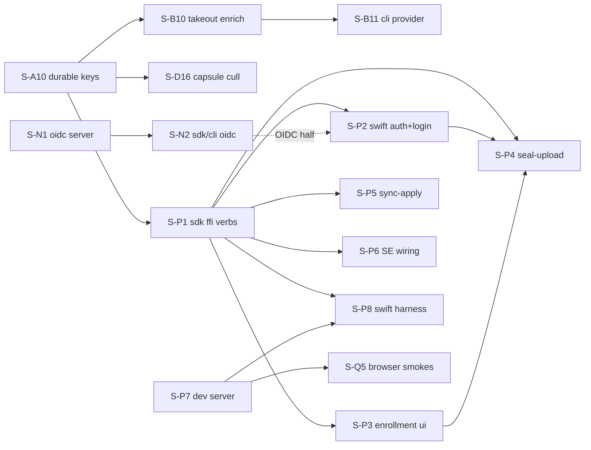

# Implementation Slices

This file is the executable index of everything the [design docs](capsule-docs/src/content/docs/design/)
specify that is **not yet implemented**, decomposed into independently shippable
**slices**. The v1 campaign (completed 2026-07-12) landed all 74 original slices; their
one-line record is the [Landed Register](#landed-register-v1-campaign) below, and this
index now carries **wave 2**: the full design-docs↔code gap census (2026-07-12 audit,
re-verified against the code 2026-08-21) plus everything needed to exercise the iOS app
against the server end to end. The 2026-08-21 pass confirmed every claimed gap is still
open, corrected three entries that were wrong as written (S-C20, S-Z4, and a dangling
`geocoordinates-rs` gates reference), and added five slices the original census missed —
most importantly **S-D18**, since the CLI has no upload path at all.

**How to use this file.**

- Every slice has a stable ID (`S-A8`, `S-P1`, …). Code skeletons, `#[ignore]`d contract
  tests, and markers reference these IDs; `rg S-P1` finds a slice's entire footprint.
  IDs are never reused: wave-2 IDs continue each lane's numbering past the landed set.
- A slice references other slices **only by ID + contract anchor**, never by their
  internals. "Depends on" edges are hard (the contract consumed must exist); everything
  else can proceed in parallel.
- **Done when** must be checkable by running named commands. A slice that flips its
  named tests, keeps `mise run check-rust` (and the other relevant `mise run check-*`
  gates) green, and satisfies its owner doc's Validation bullets is done.
- Sizes: **S** ≤ ½ day, **M** ≤ 2 days, **L** ≥ 3 days — for slicing sanity, not
  estimation. An L slice that can split should split.
- When a slice lands, update its row to `done` (add a **Landed:** note recording any
  deviation). When a new gap is found, add a slice — never a floating TODO.

## Baseline — already implemented and validated

Everything the v1 campaign shipped, now the floor wave 2 stands on:

- **Offline crypto data plane** (`capsule-core`): canonical CBOR (RFC 8949 §4.2,
  cross-language gate); the primitives inventory (SHA-256, HKDF-SHA512, Argon2id,
  AES-256-GCM STREAM + metadata blobs, hybrid Ed25519+ML-DSA-65, X-Wing KAT-validated);
  key hierarchy with multi-epoch AMK rotation, wrapped file-key mode, re-key salt
  folds, software keystore, signed device directory; `Signer`/`HardwareSigner` seams
  with software, TPM (tss-esapi), Windows TBS, and Secure Enclave/StrongBox adapters;
  P-256 hybrid DSK + hardware-bound P-256 ECDH DEK composition; signed manifests +
  append-only provenance + the exhaustive `verify_asset` chokepoint; metadata↔manifest
  binding (invariant 25 both sides); pure key-free validation invariants; CRDT
  metadata + signed `SidecarV1` (incl. `stack_membership`, `cull`, `hidden`,
  `gps.datum`) + privacy-strip table; deterministic signed backup (tar, AMK ledger,
  escrow, Shamir 2-of-3, restore, recovery cadence); lifecycle `Workspace` over
  `library.sqlite`; cache-eviction sweep; share-link + drop crypto (WASM sealing
  builds); culling engine; local-auth gate (NFR1 proven structurally).
- **MLS lane** (`OpenMlsAuthority`, OpenMLS 0.8.1, X-Wing `0x004D` via libcrux): the
  four membership ceremonies, minted-and-distributed write-tier keys, Welcome/history
  delivery, durable group persistence, tombstone-plus-fork upgrade ceremony, re-keying,
  `ReconcileOutcome` reconciliation.
- **Import/media**: thumbnail/LQIP + video-derivative generation over injected
  per-platform encoder seams, signed `DerivativeManifest` chains; signed-path import
  executor; streaming import; staged uploads (tier ladder); Takeout source adapter
  (`SourceAdapter` trait); planner determinism suite. Derivative byte-encoding is a
  per-platform SDK seam — CLI-path derivative generation is inert without an injected
  encoder (by design, thumbnails.md).
- **Key-free server** (`capsule-api`): hardened chunked upload (invariants 1–15 +
  strictness table, testcontainer-proven), `capsule.sync.v1` gRPC feed (+ gRPC-web),
  `/albums/{id}/ops` lifecycle writes, content-addressed blob serving at the 65,536-B
  stride, storage verification + custody receipts + signed attestation
  (`attestation-keys` well-known), quota, drops + atomic adoption, share serving,
  device directory + enrollment (code + relay), escrow store/replace, cohort storage,
  moderation hooks, refcount GC + retention purge + integrity scrub (operator
  binaries), federation capabilities/budgets/revocation state. Auth: sessions,
  password+TOTP, passkeys — real and testcontainer-tested (OIDC is wave 2, `S-N1`).
- **SDK/clients**: session store + auto refresh, hand-written upload/sync clients,
  spargen-generated typed REST client from committed `openapi.json`, verify-before-
  destroy + receipt gate, adverse-network engine, LAN peering (in-process), recovery
  cadence, CLI auth/sync/list/demo (E2E case 1), web guest-drop + share-viewer
  (wasm), aggregated federated albums, uniffi FFI for catalog + SDK user flows.
- **Legacy retired**: GraphQL, plaintext proto/entities/import-executor gone.
- **i18n**: catalog infra + 13 locales + error-code contract + three-surface guard +
  README translation pipeline.

## Landed Register (v1 campaign)

One line per landed slice so every code marker still resolves. `done*` rows name where
their owed remainder now lives.

| ID | Slice | Status | Owed → now |
| --- | --- | --- | --- |
| S-A1 | Wrapped file-key mode | done | |
| S-A2 | Re-key salt fold | done | |
| S-A3 | Metadata↔manifest binding | done | |
| S-A4 | P-256 hybrid DSK variant | done | |
| S-A5 | Share-link crypto | done | |
| S-A6 | Drop crypto | done | multi-device OGK re-wrap → post-v1 (OGK cluster) |
| S-A7 | `gps.datum` + BD-09 fold | done* | fold flip → `S-A8` |
| S-B1 | Thumbnail/LQIP generation | done | |
| S-B2 | Signed-path import executor | done | durable album keys → `S-A10` |
| S-B3 | Streaming import | done | |
| S-B4 | Staged uploads | done | |
| S-B5 | Video derivatives | done | |
| S-B6 | Google Takeout importer | done | sidecar-enrichment write → `S-B10` |
| S-B7 | iCloud importer | post-v1 | |
| S-B8 | Immich importer | post-v1 | |
| S-B9 | Tethered camera import | post-v1 | `ptpip-rs` gate |
| S-C1 | Upload-server hardening | done | duplicate-blob field → `S-C22`; device floor → `S-C20` |
| S-C2 | Key-free sync feed | done | feed_seq race → `S-C21` |
| S-C3 | Storage-verification endpoint | done | |
| S-C4 | Share-link serving | done | |
| S-C5 | Drop store/inbox/adoption | done | OpenAPI row → `S-C22`; shared limiter → post-v1 |
| S-C6 | Quota service | done | |
| S-C7 | Device-enrollment endpoints | done | |
| S-C8 | Moderation hooks | done | blob-path 410 → `S-C17`; MLS block half → `S-X4` |
| S-C9 | Device-directory publish/fetch | done | upload device identity → `S-C20` |
| S-C10 | Key-free media serving | done | takedown-gate fold → `S-C17` |
| S-C11 | Refcount GC + purge worker | done | layout doc reconciled (filesystem/server.md, 2026-07-12) |
| S-C12 | Backup escrow surface | done | |
| S-C13 | Cohort storage + grouping | done | wire device_id + ceremony cohort → `S-N3` |
| S-C14 | Server integrity scrub | done | |
| S-C15 | Custody receipts + attestation | done | |
| S-C16 | Lifecycle-write endpoint | done | pin column → `S-C19` |
| S-D1 | SDK upload client | done | |
| S-D2 | SDK sync/download client | done | |
| S-D3 | Web guest drop client | done* | live-browser smoke → `S-Q5`; seeds → gates |
| S-D4 | Verify-before-destroy | done | |
| S-D5 | CLI auth/sync/list | done | |
| S-D6 | Web server gateway | done* | live gRPC-web smoke → `S-Q5`; decode boundary → post-v1 |
| S-D7 | SDK auth/session foundation | done | |
| S-D8 | spargen REST client | done | 401-retry-once → `S-D17` |
| S-D9 | capsule-sdk uniffi FFI | done* | Swift harness → `S-P8`; Kotlin harness → owed-CI |
| S-D10 | Adverse-network hardening | done | |
| S-D11 | Cohort emission + devices UI | done* | iOS reader → `S-P6`; devices screen → post-v1; device_id → `S-N3` |
| S-D12 | Recovery cadence + re-wrap | done | |
| S-D13 | Culling workflow UX | done | `capsule cull` → `S-D16` |
| S-D14 | Local-gallery security gates | done | Hidden projection → `S-D19` |
| S-D15 | Exact client build identification | done | |
| S-E1 | Share-link end-to-end | done* | live-browser smoke → `S-Q5`; seeds → gates |
| S-E2 | Federation capabilities + pulls | done | gRPC capability gate → `S-E5` |
| S-E3 | LAN peering | done* | live mDNS → post-v1 (peering.md note) |
| S-E4 | Aggregated federated albums | done | cover override rides post-v1 settings doc |
| S-F1 | uniffi consolidation | done | |
| S-F2 | SE/StrongBox composition | done* | Kotlin run → owed-CI |
| S-F3 | App binding wiring + CI | done* | first CI runs + device lanes → owed-CI |
| S-F4 | Windows TPM (TBS) backend | done* | Windows CI + real-TPM smoke → owed-CI |
| S-F5 | Hardware DEK binding | done* | keystore wiring → `S-F8`; Kotlin ECDH → owed-CI |
| S-F6 | `log` → `tracing` migration | done | |
| S-F7 | XCTest → swift-testing | done | |
| S-G1 | GraphQL retirement | done | README residual → `S-Z4` |
| S-G2 | Legacy proto removal | done | |
| S-G3 | Plaintext entity retirement | done | legacy route deletion → `S-C17` |
| S-G4 | Legacy import-executor removal | done | |
| S-H1 | Embeddings + sqlite-vec | done | |
| S-H2 | Model registry + regen | done | |
| S-H3 | Semantic/face features | done* | real runner → post-v1 (ai.md note) |
| S-H4 | Group-scoped evaluations | post-v1 | |
| S-I1 | Hardcoded-string migration | done* | Swift plural/InfoPlist gaps → `S-I4`; review → gates |
| S-I2 | Language-set rollout | done* | native RTL → post-v1; review → gates |
| S-I3 | README translation pipeline | done | |
| S-X1 | OpenMLS backend | done | |
| S-X2 | MLS membership + Welcome | done | |
| S-X3 | Upgrade ceremony + resilience | done | server halves → `S-C24` |
| S-Z1 | Library-settings schema (design) | done | implementation → post-v1 (OGK cluster) |
| S-Z2 | Provider migration guides | done* | real-archive round trip → `S-B11` |

## In-House and External Library Gates

| Library / environment | Status | Gates |
| --- | --- | --- |
| `spargen` 0.1.0 | adopted; progenitor migration **complete**; one known gap | The progenitor→spargen migration is done — progenitor is gone from `Cargo.lock` and every manifest, and the OpenAPI 3.0 down-convert script (`capsule-sdk/generate_openapi.sh`) was deleted in `2996a13`; the server emits 3.1 directly via `gen_openapi`. Remaining gap: object-typed query params mis-lower, so the media asset-serve tree stays out of the generated client (hand-written byte path anyway); re-include when fixed. W003 multi-error-body ops type as `serde_json::Value` (cosmetic). |
| `openmls` 0.8.x | adopted (X-Wing `0x004D`) | Key serialization surfaces are `test-utils`-gated — persistence rides public fields + ungated codecs; fragile if upstream privatizes (upstream ask filed against openmls). Version pairing is load-bearing (0.8.x ↔ traits/storage 0.5.x ↔ libcrux-crypto 0.3.x). |
| `libcrux` provider | no wasm32 target | `mls` feature is host-only; a browser MLS surface would need another provider. |
| BD-09 datum fold (`geocoordinates-rs`) | **not adopted** | The wave-2 rewrite dropped this row while `capsule-core/src/domain/gps_datum.rs` and `metadata.md` still pointed at it. Decision 2026-08-21: S-A8 implements the error-bounded refined BD-09→GCJ-02 inverse **in-house** (~40 LOC, deterministic, unit-testable) rather than taking a dependency for one function. No crate to adopt. |
| `rawshift` (in-house RAW decode) | stabilizing, unconsumed | Full RAW support in thumbnails/import; `media::image::formats::raw` is the integration stub. |
| `ptpip-rs` (in-house PTP/IP) | repo not created | S-B9 (post-v1). |
| Self-hosted device runners | unprovisioned | The `strongbox-device`/`secure-enclave` CI lanes exist, manual-trigger, inert. Owed-CI items park here: S-F2 Kotlin run, S-F3 first Android/iOS CI runs + device lanes, S-F4 Windows ffi build + clippy + real-TPM smoke, S-F5 Kotlin ECDH adapter, S-D9 Kotlin harness. |
| swiftformat 0.55 (mise) | broken on dev host | Binary SIGKILLed (invalid signature); `format-swift` can't run locally. |
| Translation seeds | pending human review | ~350 machine-seeded entries across 12 locales (S-I1/S-I2/S-E1/S-D3) flagged in the `context` field; human review is the gate, not agent work. |

## Wave-2 Slice Index

| ID    | Slice                                                  | Lane        | Depends on   | Size | Status  |
| ----- | ------------------------------------------------------ | ----------- | ------------ | ---- | ------- |
| S-A8  | BD-09 bounded input fold (flip `FoldGated`)            | core-crypto | —            | S    | ready   |
| S-A9  | Add-id counter reseed at `Workspace` open              | core-crypto | —            | S    | ready   |
| S-A10 | Durable album-key persistence + library open plumbing  | core-crypto | —            | L    | ready   |
| S-B10 | Takeout metadata → signed sidecar enrichment           | import      | S-A10        | M    | blocked |
| S-B11 | CLI `import --provider takeout` + real-archive run     | import      | S-B10        | S    | blocked |
| S-B12 | Base default-album resolution (`resolve_default_album`)| import      | —            | M    | ready   |
| S-B13 | Codec stubs → typed `UnsupportedFormat` (no panics)     | import      | —            | M    | ready   |
| S-D16 | Standalone `capsule cull` command                      | sdk/clients | S-A10        | S    | blocked |
| S-D17 | Typed REST client reactive 401-retry-once              | sdk/clients | —            | S    | ready   |
| S-D18 | `capsule push` — drive `capsule_sdk::upload` from CLI   | sdk/clients | S-A10        | M    | blocked |
| S-D19 | Hidden-view DB projection + gate wiring                | sdk/clients | —            | S    | ready   |
| S-D20 | CLI truthfulness pass (status/register/endpoints/flags)| sdk/clients | —            | M    | ready   |
| S-N1  | OIDC relying party (server)                            | auth        | —            | L    | ready   |
| S-N2  | SDK/CLI OIDC login flows                               | auth        | S-N1         | M    | blocked |
| S-N3  | `device_id` on session listing + ceremony cohorts      | auth        | —            | S    | ready   |
| S-C17 | Takedown 410 gate on `/blob/{hash}` + legacy route del | server      | —            | M    | ready   |
| S-C18 | `.well-known/capsule` registry completion              | server      | —            | M    | ready   |
| S-C19 | Authoritative album `protocol_version` pin             | server      | —            | M    | ready   |
| S-C20 | Invariant-7 floor grounded in the device directory     | server      | —            | M    | ready   |
| S-C21 | `feed_seq` visibility-order race fix                   | server      | —            | M    | ready   |
| S-C22 | Structured `duplicate_blob` ref + adopt in OpenAPI     | server      | —            | S    | ready   |
| S-C23 | `revoke_all_sessions` with master-key proof            | server      | —            | M    | ready   |
| S-C24 | Album-upgrade server halves (quiescence/drain/lineage) | server      | —            | M-L  | ready   |
| S-E5  | Federation capability gate on the live gRPC method     | federation  | —            | M-L  | ready   |
| S-X4  | Per-user block MLS Remove + epoch bump                 | crypto/mls  | —            | M    | ready   |
| S-F8  | Hardware DEK → workspace keystore wiring               | platform    | —            | M    | ready   |
| S-I4  | Swift interpolated/plural strings + InfoPlist/LAContext| i18n        | —            | M    | ready   |
| S-P1  | `capsule_sdk` FFI workspace verbs                      | iOS path    | S-A10        | L    | blocked |
| S-P2  | Swift auth service + Keychain + login screen           | iOS path    | S-P1         | L    | blocked |
| S-P3  | First-device enrollment UI                             | iOS path    | S-P1         | L    | blocked |
| S-P4  | Import→seal→upload bridge + status UI                  | iOS path    | S-P1–P3      | L    | blocked |
| S-P5  | Sync-apply into local catalog + render                 | iOS path    | S-P1         | L    | blocked |
| S-P6  | SE signer wiring into the app + iOS cohort reader      | iOS path    | S-P1         | M    | blocked |
| S-P7  | Dev-server bring-up (task, keys, blob backend, ATS)    | iOS path    | —            | M    | done    |
| S-P8  | Swift behavioral FFI harness (flips S-D9)              | iOS path    | S-P1, S-P7   | M    | blocked |
| S-Q1  | Mark/complete E2E cases 2, 3, 11                       | e2e         | —            | S    | ready   |
| S-Q2  | E2E case 6: backup → fresh-device restore              | e2e         | —            | M    | ready   |
| S-Q3  | E2E case 7: full lifecycle chain                       | e2e         | —            | M    | ready   |
| S-Q4  | E2E case 12: cross-device enrollment                   | e2e         | —            | M    | ready   |
| S-Q5  | Live-browser smokes (gRPC-web, share, drop)            | e2e         | S-P7         | M    | blocked |
| S-Z3  | Design-doc scope-out + amendment notes                 | docs        | —            | M    | done    |
| S-Z4  | README GraphQL scrub (13 READMEs + web) + regen        | docs        | —            | S    | ready   |
| S-Z5  | Dead-code removal (exports stub, CLI import planner)    | docs        | —            | S    | done    |
| S-Z6  | Developer-docs parity pass                             | docs        | —            | M    | ready   |

Lanes are independent by construction; within a lane, "Depends on" is the only
ordering. `blocked` = a dependency gates the start, not review priority.

## Lane A — core crypto

### S-A8 — BD-09 bounded input fold

- **Contract:** [Metadata — Geolocation](capsule-docs/src/content/docs/design/metadata.md)
  (amended 2026-07-12: the fold is the error-bounded refined inverse, not "exact").
- **Deliverable:** `fold_bd09_to_gcj02` in `capsule-core::domain::gps_datum` swaps the
  `FoldGated` refusal for an **in-house** error-bounded refined BD-09→GCJ-02 inverse
  (deterministic, sub-meter bound), no signature change; drop `DatumFoldError::FoldGated`
  if nothing else needs it. Flips S-A7 done*→done (update the register row).
  Decision 2026-08-21: implemented in-crate rather than via a `geocoordinates` dependency —
  it is one ~40-LOC iterative refinement, and the dangling gates-table reference the file
  comments pointed at is replaced by the "BD-09 datum fold" row above.
- **Done when:** the metadata doc's amended datum-verbatim-storage bullet passes (BD-09
  folds within bound, deterministically; GCJ-02 verbatim; WGS-84 wire-absent
  byte-identical); `mise run check-rust` green. **Tier:** Unit.

### S-A9 — Add-id counter reseed at open

- **Contract:** [Metadata — Add-id Binding + Validation](capsule-docs/src/content/docs/design/metadata.md)
  ("reseed from the device's existing sidecars").
- **Gap:** `Counter::new(device_id)` on both `Workspace` create and open
  (`lifecycle.rs`), so a reopened library can reissue `add_id` counters — OR-set
  aliasing after restart. `reseed_from_max` exists but has no production caller.
- **Deliverable:** on open, derive this device's max issued counter from the indexed
  sidecars (or a persisted high-water mark) and `reseed_from_max` before the first
  issue.
- **Done when:** the doc's add-id-counter-durability bullet runs against a real
  reopen (import → close → reopen → add → assert strictly-greater counters).
- **Tier:** Unit. **Note:** correctness fix — schedule early.

### S-A10 — Durable album-key persistence + library open plumbing

- **Contract:** [Keys — Album Master Keys](capsule-docs/src/content/docs/design/cryptography/keys.md),
  [Backup](capsule-docs/src/content/docs/design/backup-recovery.md) (the keystore that
  already persists device keys and the AMK ledger in backup artifacts).
- **Gap:** AMKs are session-scoped — every CLI run mints a fresh "Imports" album
  (`capsule-cli/src/lib.rs:184`); a reopened library cannot decrypt or write prior
  assets. This is the single biggest blocker for every persistent-library flow
  (importers, `capsule cull`, the iOS app).
- **Deliverable:** persist album authorities/AMK ledgers through the keystore
  (encrypted at rest under the master key; MLS group state via the existing
  `export_state`/`import_state` CBOR), plus `Workspace::open` plumbing (passphrase /
  platform-keystore unlock) that restores albums, authorities, and the S-A9 counter.
  The CLI stops minting a fresh default album per run.
- **Done when:** import → close → reopen → decrypt + write to the same album round-trips
  in a new process; `capsule demo` unaffected; backup restore still round-trips.
- **Tier:** Unit + Smoke. **Blocks:** S-B10, S-D16, S-P1.

## Lane B — import

### S-B10 — Takeout metadata → signed sidecar enrichment

- **Contract:** [Import — Third-Party Importers](capsule-docs/src/content/docs/design/import/pipeline.md)
  (EXIF-over-exporter precedence fold).
- **Gap:** `TakeoutAdapter` extracts `ExtractedMetadata` (taken-time, GPS, description,
  favorites, albums) but the executor never writes it through — only bytes + embedded
  EXIF land.
- **Deliverable:** the executor consumes the adapter's folded metadata into the signed
  sidecar at import (precedence rule of the pipeline doc), album-membership mapping
  included. **Depends on:** S-A10 (albums must persist to be mappable).
- **Done when:** the pipeline doc's Takeout mapping-table bullet passes including the
  enrichment fields; fixture-archive determinism/resume unchanged. **Tier:** Unit + Smoke.

### S-B11 — CLI provider wiring + real-archive round trip

- **Contract:** [Import — Third-Party Importers](capsule-docs/src/content/docs/design/import/pipeline.md);
  the [Google Photos guide](capsule-docs/src/content/docs/guides/) (S-Z2).
- **Deliverable:** `capsule import --provider takeout <dir>` driving the S-B6 adapter
  through the standard plan/confirm/execute flow; run the guide's steps against a real
  Takeout archive. Flips S-Z2 done*→done. **Depends on:** S-B10.
- **Done when:** the guide's verification checklist passes on a real archive; re-run
  skips completed work. **Tier:** Smoke.

### S-B12 — Base default-album resolution

- **Contract:** [Organization — The Default Album + Scope Grammar](capsule-docs/src/content/docs/design/organization.md)
  (status note 2026-07-12: settings-document rows deferred; base order ships).
- **Deliverable:** `Scope`/`scope_id`/`SourceKind` types (closed enums per the doc) and
  `resolve_default_album(context)` implementing explicit-pick → owner
  `default_album_id` pointer → derived de facto album, recording which rule fired in
  the plan; the planner consumes it instead of a raw `target_album_id`. The
  `scope_overrides`/`source_kind_defaults` rows plug in post-v1 with the settings doc.
- **Done when:** the organization doc's resolution-order bullets (minus override rows)
  pass; planner determinism suite unchanged. **Tier:** Unit.

### S-B13 — Codec stubs → typed `UnsupportedFormat`

- **Contract:** [Thumbnails and Previews](capsule-docs/src/content/docs/design/thumbnails.md);
  [Module Map](capsule-docs/src/content/docs/design/module-map.md) (`capsule-core::media` row,
  "only JPEG decode is implemented today").
- **Gap:** `capsule-core/src/media/image/formats/` ships eight pure-stub modules
  (`avif`, `bmp`, `dng`, `gif`, `heif`, `jxl`, `tiff`, `webp`) at 22 `unimplemented!()`
  each, plus `raw.rs` at 21 and `media/fs/mod.rs` at 1 — **197 of the repo's 199 panicking
  stubs**. `media/fs/mod.rs` dispatches to them by `ImageFormat`, so any non-JPEG/PNG image
  aborts the process rather than failing.
- **Deliverable:** make the stub types **uninhabited** (`pub enum AvifImage {}`), so every
  `&self` body is `match *self {}` — total, non-panicking, and unreachable by construction.
  The only two ways to obtain one (`ImageDecode::decode_from_bytes`, `Image::from_raw_parts`)
  already return `Result`, so they return a new
  `ImageError::UnsupportedFormat { format, op }`. `media/fs` dispatch is unchanged — the `?`
  now propagates instead of aborting. Add `ImageFormat::is_decodable()` +
  `SUPPORTED_IMAGE_FORMATS` and wire them into the import planner's `unsupported` bucket so
  such files are **planned as skipped, never attempted**.
- **Scope-out:** real JXL/AVIF/WebP encode and RAW decode stay deferred (see the gates
  table). This slice makes the gap honest, not smaller.
- **Done when:** `rg 'unimplemented!\(|todo!\(' capsule-core/src/media` is empty; a
  table-driven test asserts every unsupported format returns `UnsupportedFormat` and that
  `is_decodable` agrees with the dispatch table; `mise run check-rust` green. **Tier:** Unit.

## Lane D — SDK / clients

### S-D16 — Standalone `capsule cull`

- **Contract:** [Organization — Culling](capsule-docs/src/content/docs/design/organization.md).
- **Deliverable:** `capsule cull` over the landed culling engine (S-D13), using
  S-A10's open plumbing: flag → filtered view → reject-sweep loop on a user library.
  **Depends on:** S-A10.
- **Done when:** the flag→filter→sweep loop round-trips on a reopened fixture library.
- **Tier:** Smoke.

### S-D17 — Reactive 401-retry-once

- **Contract:** [Authentication — Session and Access Tokens](capsule-docs/src/content/docs/design/authentication.md);
  S-D8's owed note.
- **Deliverable:** a retry layer on the typed REST path: on 401, single-flight refresh
  then retry exactly once (mirroring the hand-written clients); closes the
  refresh/expiry race the proactive check leaves open.
- **Done when:** a mocked-clock race test passes (expired-at-server, valid-at-client →
  one refresh, one retry, no loop). **Tier:** Unit.

### S-D19 — Hidden-view projection

- **Contract:** [Organization — Hidden Assets](capsule-docs/src/content/docs/design/organization.md),
  [Local Gallery — SR1](capsule-docs/src/content/docs/design/local-gallery.md).
- **Gap:** the `hidden` LWW field ships but no query projects it: no `query_hidden`,
  and default views don't filter hidden assets.
- **Deliverable:** `query_hidden` in `capsule-core::db`, hidden-exclusion in the
  default projections (timeline/album), and the view behind the existing `GateKeeper`
  (same 5-minute-grace contract as Recently Deleted).
- **Done when:** hidden assets vanish from default views, appear only in the gated
  Hidden view; gate test mirrors `query_recently_deleted`'s. **Tier:** Unit.

### S-D18 — `capsule push`

- **Contract:** [Import — Upload Protocol](capsule-docs/src/content/docs/design/import/upload-protocol.md),
  [Clients](capsule-docs/src/content/docs/design/clients.md).
- **Gap** (found 2026-08-21; the wave-2 census never named it): **the CLI has no upload
  path at all.** `capsule-sdk/src/upload.rs` is a complete resumable upload client with
  `create_session`/`upload`/`upload_resuming`/`head`/`list_sessions`, and
  `capsule-cli/src/remote.rs` imports only `capsule_sdk::{auth, sync}`. `capsule import` is
  local-only; `capsule sync` is pull-only (`SyncConsumer::pull_into`). Nothing in the CLI
  moves a byte to the server, which makes the primary user flow — offload my photos —
  impossible. This is the single biggest gap in the product today.
- **Deliverable:** a **separate `capsule push`** command (with `capsule import --push` as
  sugar — import must stay offline because its determinism suite depends on it, and push
  must be re-runnable against an unchanged library). Add a `Workspace::upload_bundle(asset_id)`
  accessor, extracted from the per-asset re-encrypt loop `export_backup` already runs, so no
  crypto is duplicated. Note `AssetUploader` (`import/streaming.rs`) is unusable here: it has
  zero implementations and `stream_candidate` holds `&mut Workspace` across the call, so push
  is a **post-import pass**, not a streaming-path impl. Drive the staged tier ladder through
  the landed `staged::StagedScheduler`. Resume derives from **server truth** (feed pull →
  `staged::held_from_feed`), so there is no new client state file.
- **Depends on:** S-A10 (a session-scoped album cannot be pushed and re-pushed).
- **Done when:** a testcontainer round trip — register → import → push → `/storage/verify`
  reports durable → sync → `capsule list` shows the asset — passes; re-running `push` is a
  no-op. **Tier:** Unit + E2E (case 2's CLI shape).

### S-D20 — CLI truthfulness pass

- **Contract:** [Clients](capsule-docs/src/content/docs/design/clients.md) (the CLI is a
  first-class client), [Authentication](capsule-docs/src/content/docs/design/authentication.md).
- **Gap** (found 2026-08-21): several CLI surfaces report fiction.
  `capsule auth status` and `capsule status` read `CAPSULE_AUTH_TOKEN` from the environment
  and never `session.json`, fabricate a 30-day expiry, and hardcode `Disconnected` /
  "Backend not implemented" — so after a **successful** `capsule auth login` the CLI still
  says "Not logged in". `config.rs` never parses `config.toml` and fabricates
  `user_id = "user@example.com"`. `--force` (sync), `--local`/`--remote` (list) are parsed
  and silently discarded. Endpoint defaults point at ports 8080/8081 while the server serves
  one port (3000) under `/v1/auth` and `/v1/sync`. There is no `capsule auth register`, so
  account creation requires a hand-written `curl`.
- **Deliverable:** single `CAPSULE_ENDPOINT` base (default `http://127.0.0.1:3000`) deriving
  the auth/upload/sync paths, per-endpoint overrides retained; `capsule auth register` over
  the existing `AuthClient::register`; real `AuthStatus` off `session.json`, real
  `ServerStatus` off `GET /v1/version`, real `SyncStatus` off the sync store; delete
  `config.rs`; honor the three discarded flags. Every new string is a catalog key.
- **Done when:** `rg "not implemented|user@example" capsule-cli/src` is empty;
  `cargo nextest run -p capsule-cli` green including a test that `auth status` reflects a
  persisted session. **Tier:** Unit.

## Lane N — auth (OIDC first-class alongside local auth)

Decision 2026-07-12: local auth (password + TOTP, passkeys) and OIDC are **both
first-class**; [Authentication — Choosing an Auth Path](capsule-docs/src/content/docs/design/authentication.md)
carries the audience split. Today OIDC is a config struct with zero routes
(`capsule-api/auth/src/oidc.rs`).

### S-N1 — OIDC relying party (server)

- **Contract:** [Authentication — Design Principles + Choosing an Auth Path](capsule-docs/src/content/docs/design/authentication.md).
- **Deliverable:** the RP flow in `capsule-api-auth`: IdP discovery (issuer metadata),
  authorization-code + PKCE, token exchange, id-token validation (sig, `aud`, `nonce`,
  expiry), account linking by stable `sub` claim, and Capsule session mint identical
  to the password path's (same `Claims`, same cohort handling); a dev IdP in
  `compose.yaml` for local runs; testcontainer-IdP integration tests. Local auth
  untouched.
- **Done when:** the full handshake round-trips against a testcontainer IdP (happy
  path + tampered id-token + `nonce` replay rejections, each with its `error.*` code);
  `capsule-sdk/openapi.json` regenerated with the new routes; `mise run check-rust`
  green. **Tier:** Unit + Smoke. **Blocks:** S-N2.

### S-N2 — SDK/CLI OIDC login flows

- **Contract:** [Authentication — Choosing an Auth Path](capsule-docs/src/content/docs/design/authentication.md);
  [Clients](capsule-docs/src/content/docs/design/clients.md).
- **Deliverable:** SDK support for the browser-redirect flow (loopback listener for
  CLI/desktop; a seam the iOS `ASWebAuthenticationSession` half consumes in S-P2) and
  the device-code flow for headless CLI; sessions land in the same S-D7 store;
  `cohort_hash` rides the ceremony. **Depends on:** S-N1.
- **Done when:** `capsule auth login --oidc` round-trips against the dev IdP;
  mocked-HTTP tests per flow. **Tier:** Unit + Smoke.

### S-N3 — `device_id` on session listing + ceremony cohorts

- **Contract:** [Authentication — Device Cohorts](capsule-docs/src/content/docs/design/authentication.md)
  (support bundle needs `(device_id, session_id)` pairs).
- **Deliverable:** `device_id` on the `GET /devices` wire (S-C13's follow-up), the
  TOTP and passkey ceremonies accepting `cohort_hash` like password login does, and
  the SDK support bundle assembling the full doc-specified shape.
- **Done when:** the authentication doc's support-bundle bullet passes end-to-end;
  TOTP/passkey logins group in the devices view. **Tier:** Unit + Smoke.

## Lane C — server correctness

### S-C17 — Takedown gate on the content-addressed path

- **Contract:** [Moderation — Takedown](capsule-docs/src/content/docs/design/moderation.md)
  (peers receive 410), [Validation](capsule-docs/src/content/docs/design/threat-model/validation.md).
- **Gap:** `BlobServeService::resolve` never reads `served` — a taken-down asset still
  serves on `GET /blob/{hash}` (the real client/federation path); the 410 gate lives
  only on the legacy per-id routes retained for it (S-G3's note).
- **Deliverable:** the `served = false` → 410 check on blob resolution (decided before
  disk access, like the GC checks), then delete the legacy per-id asset routes.
- **Done when:** takedown → `/blob/{hash}` 410 test passes (federation-fetch shape
  included); legacy routes gone; no OpenAPI drift. **Tier:** Unit + Smoke.
  **Note:** moderation-correctness fix — schedule early.

### S-C18 — `.well-known/capsule` registry completion

- **Contract:** [Authentication — The `.well-known/capsule/*` Registry](capsule-docs/src/content/docs/design/authentication.md)
  (status note 2026-07-12), [Federation — Token Lifecycle](capsule-docs/src/content/docs/design/federation.md).
- **Deliverable:** `server-info` (API base URL, auth + federation endpoints, server
  signing key, `protocol_version` range, deprecation cutoffs — never a user list),
  `revoked-jti` (≤ 24 h window, the existing table published; peers' 15-min fail-closed
  staleness rule becomes enforceable), and `deprecation`. `moved/{user}` stays post-v1.
- **Done when:** each record round-trips against its doc's shape; a second server's
  revocation check consumes the published list in the federation test rig.
- **Tier:** Unit + Smoke.

### S-C19 — Authoritative album protocol pin

- **Contract:** [Validation invariant 6](capsule-docs/src/content/docs/design/threat-model/validation.md),
  [Authorization](capsule-docs/src/content/docs/design/authorization.md).
- **Gap:** `ops.rs` derives the pin from the head feed entry, falling back to the
  request's own value on an empty album — the first write is self-checked.
- **Deliverable:** an `albums.protocol_version` pin column set at album creation,
  checked by envelope + ops paths; migration backfills from feed heads.
- **Done when:** invariant 6's rejecting test covers the first-write case (fresh album,
  mismatched request → reject). **Tier:** Unit.

### S-C20 — Ground invariant-7's floor in the device directory

- **Contract:** [Validation invariant 7](capsule-docs/src/content/docs/design/threat-model/validation.md),
  [Keys — Device Directory](capsule-docs/src/content/docs/design/cryptography/keys.md).
- **Gap** (corrected 2026-08-21 — the original census claim that "the upload contract
  carries no device id" was wrong): `created_by_device` is already carried on the wire
  (`capsule-api/upload/src/models/requests.rs`, `capsule-sdk/src/upload.rs`) and persisted
  into receipts (`capsule-api/upload/src/service/upload.rs`). What is missing is narrower:
  the invariant-7 `added_at` floor is still account-creation time. `uploader_added_at`
  (`capsule-api/upload/src/service/upload.rs`, `service/ops.rs`) returns `user.created_at`,
  and its comment "until the directory table lands" is itself stale — S-C9 landed that
  table. `EnvelopeContext.device_added_at` is fed the account floor, and the invariant-7
  test asserts against that floor rather than a directory row.
- **Deliverable:** resolve `added_at` from the published device directory for the
  `created_by_device` already on the request — membership check plus per-device
  `added_at` ≺ request timestamp — keeping the account-creation floor as the documented
  fallback for directory-less accounts. The wire and envelope battery need no change.
- **Done when:** invariant 7's test uses a real directory entry's `added_at` (pre-dating
  entry accepted; post-dating rejected; unknown device rejected). **Tier:** Unit + Smoke.

### S-C21 — `feed_seq` visibility-order fix

- **Contract:** [Download & Sync](capsule-docs/src/content/docs/design/import/download-sync.md),
  [Validation invariant 22](capsule-docs/src/content/docs/design/threat-model/validation.md).
- **Gap:** the global cursor pages over bigserial `feed_seq`; a long-racing
  finalization can commit a lower seq after a higher one was served — that entry is
  permanently skipped (S-C2's known limitation).
- **Deliverable:** eliminate the skip window — candidates: page below
  `pg_snapshot_xmin`-safe horizons, or a committed-visibility watermark the cursor
  respects; per-album `sync_seq` semantics unchanged.
- **Done when:** a concurrency test with an artificially stalled finalization proves
  no entry is skipped across cursor pages. **Tier:** Unit + Smoke.

### S-C22 — Structured duplicate ref + adopt in OpenAPI

- **Contract:** [Validation — Idempotency table](capsule-docs/src/content/docs/design/threat-model/validation.md)
  (the duplicate response carries "the existing asset reference");
  [Web Upload](capsule-docs/src/content/docs/design/web-upload.md).
- **Deliverable:** a machine-readable `existing_asset` field on
  `409 error.upload.duplicate_blob` (English detail unchanged); `/drops/{id}/adopt`
  (session-auth JSON) added to the OpenAPI schema so the typed client can drive it;
  `openapi.json` regenerated.
- **Done when:** the SDK merge path switches on the structured field; schema gate
  green. **Tier:** Unit.

### S-C23 — Revoke-all with master-key proof

- **Contract:** [Authentication — Explicit Revocation item 3 + Validation](capsule-docs/src/content/docs/design/authentication.md);
  the client-side half in [Threat Model — Client Invariants](capsule-docs/src/content/docs/design/threat-model/validation.md).
- **Deliverable:** the global `revoke_all_sessions` ceremony: server challenge, IK
  signature over it, verification against the published directory's IK, then
  `invalidate_for_user`; SDK/CLI surface with the forbidden-behaviors rule (no
  confirmation without proof).
- **Done when:** the doc's revoke-all bullets pass (valid proof revokes everything
  including the caller; missing/invalid proof refused with its `error.*` code).
- **Tier:** Unit + Smoke.

### S-C24 — Album-upgrade server halves

- **Contract:** [Versioning — Album Upgrade Ceremony](capsule-docs/src/content/docs/design/versioning.md),
  [MLS Resilience](capsule-docs/src/content/docs/design/mls-resilience.md); S-X3's owed list.
- **Deliverable:** server-clock deadline evaluation (consuming core's `is_expired`),
  `409` on upload sessions whose `intent_id` mismatches during quiescence, in-flight
  session drain at ceremony start, and `upgraded_from` carried at the manifest layer
  so joiners see lineage (core field + envelope projection).
- **Done when:** the versioning doc's server-side ceremony bullets pass against
  testcontainer Postgres (stale-session 409, drain, joiner lineage visible on the
  feed). **Tier:** Unit + Smoke; completes E2E case 8's server shape.

## Lane E — federation

### S-E5 — Capability gate on the live gRPC method

- **Contract:** [Federation — Federation Capabilities](capsule-docs/src/content/docs/design/federation.md),
  [Validation invariants 19–21](capsule-docs/src/content/docs/design/threat-model/validation.md),
  [API Surfaces](capsule-docs/src/content/docs/design/api-surfaces.md) (transport row).
- **Gap:** `federation::pull::authorize` (the landed invariant-19/21 verifier) has no
  production caller — `SyncFeedService::sync` authenticates bearer access tokens only,
  so a peer's capability JWT is never gated on the real method.
- **Deliverable:** capability-token detection + verification on the gRPC
  `authorization` metadata (same-format carriage per api-surfaces), routing peers
  through the landed budget/circuit-breaker/scope gates; peer identity re-grounded
  from `federation_peers` (closing S-C8's note); local-user path unchanged.
- **Done when:** E2E case 4 runs over the live gRPC method (not in-process gates):
  valid capability pulls; revoked/expired/wrong-`aud` each reject with its code;
  bearer-token users unaffected. **Tier:** Unit + Smoke + E2E case 4 (upgraded).

## Lane X — MLS

### S-X4 — Per-user block MLS half

- **Contract:** [Moderation — Blocklists](capsule-docs/src/content/docs/design/moderation.md).
- **Deliverable:** the per-user block's MLS `Remove` + AMK epoch bump on
  `OpenMlsAuthority` (S-X2's remove ceremony), composed with the landed share-row
  revocation half in `blocklist.rs`.
- **Done when:** the moderation doc's per-user-block bullet passes end-to-end: blocked
  user loses future-epoch decryption; write-tier key rotates. **Tier:** Unit + Smoke.

## Lane F — platform

### S-F8 — Hardware DEK keystore wiring

- **Contract:** [Keys — Device Keys](capsule-docs/src/content/docs/design/cryptography/keys.md);
  S-F5's owed note.
- **Deliverable:** workspace creation/keystore consuming `P256HybridDek` (the landed
  composition) so the device encryption key's classical half is hardware-bound in real
  workspaces, not only the FFI smoke; software fallback stays for hosts without an
  element. (Kotlin StrongBox ECDH adapter remains owed-CI.)
- **Done when:** a workspace created with a (mock or SE) `HardwareKeyAgreement`
  round-trips lock/unlock; existing software-DEK workspaces unaffected. **Tier:**
  Unit + Smoke.

## Lane I — i18n

### S-I4 — Swift string-mechanism completion

- **Contract:** [i18n](capsule-docs/src/content/docs/design/i18n.md); S-I1's owed list.
- **Deliverable:** migrate Swift interpolated/plural strings to
  `String(localized:)`/ICU arguments (closing the documented `i18n-guard` blind spot),
  plus `InfoPlist` and `LAContext` reason strings onto their platform mechanisms;
  extend the guard where it can now see.
- **Done when:** `xtask i18n-guard` covers the formerly-blind constructs with zero
  false positives; injected literals caught; `mise run check-rust` green.
- **Tier:** Unit.

## Lane P — iOS app path

The minimal loop: login → first-device enrollment → PhotoKit import → seal → upload →
sync-apply → gallery, against a locally-run server. Second-device verification uses the
CLI. Architecture decision 2026-07-12: the app-reachable crypto surface is exposed via
the **`capsule_sdk` uniffi namespace** (the SDK owns user flows; S-F1's
never-same-binary invariant for the `capsule_core` namespace stays intact). Today the
app is a local-only plaintext gallery: the SDK FFI glue is compiled but uncalled, and
no sealing surface is linkable.

### S-P1 — `capsule_sdk` FFI workspace verbs

- **Contract:** [Clients](capsule-docs/src/content/docs/design/clients.md),
  [Module Map](capsule-docs/src/content/docs/design/module-map.md) (`capsule-sdk` row);
  decision above.
- **Deliverable:** the SDK-side workspace surface over `capsule-core` (SDK already
  depends on core): enroll/create + open workspace (S-A10 plumbing, hardware-signer
  constructor parity with `create_with_p256_hardware_signer`), create album, seal +
  import an asset (bytes → STREAM → signed sidecar/manifest ready for
  `FfiSession.upload`), `verify_asset` + sync-apply (feed entry → decrypt metadata →
  verified upsert facts), escrow put/get, and device-directory publish — exposed
  through the existing `FfiCapsuleClient`/`FfiSession` uniffi surface;
  `gen-bindings`/`verify-examples` extended. **Depends on:** S-A10.
- **Done when:** a Rust-side flow test drives enroll → album → seal+import → upload →
  sync-apply against the mock server through the FFI types; both binding sets
  regenerate non-empty. **Tier:** Unit + Smoke. **Blocks:** S-P2–P6, S-P8.

### S-P2 — Swift auth service + Keychain + login screen

- **Contract:** [Authentication](capsule-docs/src/content/docs/design/authentication.md)
  (session store; Keychain cohort seed), [Clients](capsule-docs/src/content/docs/design/clients.md).
- **Deliverable:** a Swift service layer over the SDK FFI (first real caller): login/
  logout/refresh with the session persisted in Keychain (`ThisDeviceOnly`,
  non-synchronized), the login screen (local auth first; OIDC via
  `ASWebAuthenticationSession` when S-N2's seam lands), and a server-URL entry in
  Settings. **Depends on:** S-P1.
- **Done when:** simulator login against the S-P7 dev server survives app relaunch
  (Keychain restore); logout clears it. **Tier:** Smoke (simulator).

### S-P3 — First-device enrollment UI

- **Contract:** [Device Enrollment — First-Device](capsule-docs/src/content/docs/design/device-enrollment.md),
  [Backup — Master-Key Escrow](capsule-docs/src/content/docs/design/backup-recovery.md).
- **Deliverable:** the post-login first-run ceremony: master-key + device-key
  generation (SE-backed via S-P6 when available), recovery-passphrase capture
  (≥128-bit rule), escrow upload, directory publish, default-album creation — all
  through S-P1 verbs; catalog keys for every string. Cross-device add UI is post-v1
  (device-enrollment.md note). **Depends on:** S-P1.
- **Done when:** a fresh simulator install reaches an enrolled, upload-ready state;
  the escrow round-trips (CLI can restore from it — E2E case 6's shape).
- **Tier:** Smoke (simulator).

### S-P4 — Import→seal→upload bridge + status UI

- **Contract:** [Local Gallery — FR4](capsule-docs/src/content/docs/design/local-gallery.md),
  [Import — Upload Protocol](capsule-docs/src/content/docs/design/import/upload-protocol.md).
- **Deliverable:** the bridge from the existing PhotoKit import to S-P1's seal+import
  and `FfiSession.upload` (staged-tier ordering per the landed policy), with the
  backing-up / awaiting-original status surface in the gallery (badges + a sync
  status sheet; degrade-ladder unavailability states). Foreground-initiated only
  (clients.md note). **Depends on:** S-P1–P3.
- **Done when:** an imported photo reaches `durable` on the dev server and the UI
  reflects each state transition; kill-and-relaunch resumes from server truth.
- **Tier:** Smoke (simulator); E2E case 2's app shape.

### S-P5 — Sync-apply + render

- **Contract:** [Download & Sync](capsule-docs/src/content/docs/design/import/download-sync.md),
  [Clients — Validation Duties](capsule-docs/src/content/docs/design/clients.md).
- **Deliverable:** `sync_pull` consumption: S-P1's verified sync-apply into the local
  catalog (quarantine on `verify_asset` failure, never silent), thumbnail-tier fetch +
  decrypt + render for synced assets (in-process decode is the documented sandbox
  deviation for v1). **Depends on:** S-P1.
- **Done when:** an asset uploaded from the CLI appears rendered in the app's gallery
  after sync; a tampered feed entry quarantines with a visible state.
- **Tier:** Smoke (simulator); E2E case 3's app shape.

### S-P6 — SE signer wiring + cohort reader

- **Contract:** [Keys — Device Keys](capsule-docs/src/content/docs/design/cryptography/keys.md),
  [Authentication — Device Cohorts](capsule-docs/src/content/docs/design/authentication.md).
- **Deliverable:** the `CapsuleHardware` SE adapters (today test-harness-only) added to
  the app target and passed into S-P1's hardware-signer constructor; the iOS
  primary-identifier reader (Keychain-persisted seed) feeding `cohort_hash` emission
  at login. **Depends on:** S-P1.
- **Done when:** enrollment on a real device signs with the SE (simulator falls back
  to software, documented); login carries a stable cohort across reinstall.
- **Tier:** Smoke; device half rides the `secure-enclave` CI lane when provisioned.

### S-P7 — Dev-server bring-up

- **Contract:** [Module Map — E2E surface](capsule-docs/src/content/docs/design/module-map.md);
  operational, no design change.
- **Deliverable:** `mise run serve-api` (compose deps up + migrations + server run),
  a keygen bootstrap for `JWT_ED25519_DER` (+ documented `ATTESTATION_KEY_SEED`
  handling), reconcile the blob backend (filesystem `UPLOAD_DIR` is what the code
  uses — drop the unused MinIO service from `compose.yaml` or wire it explicitly),
  and the ATS `NSAllowsLocalNetworking` exception in the app's Info.plist for
  simulator ↔ localhost.
- **Done when:** `mise run serve-api` from a clean checkout yields a server the CLI
  round-trips against; the simulator reaches it. **Tier:** Smoke. **Blocks:** S-P8, S-Q5.

### S-P8 — Swift behavioral FFI harness

- **Contract:** S-D9's owed note; [Clients — Test Tooling](capsule-docs/src/content/docs/design/clients.md).
- **Deliverable:** the swift-testing harness driving login → upload → status →
  `sync_pull` (and the S-P1 verbs) through the generated bindings against the dev
  server — flips S-D9 done*→done for the Swift half (Kotlin stays owed-CI).
  **Depends on:** S-P1, S-P7.
- **Done when:** `swift test` in the harness passes locally against `serve-api`; wired
  into the iOS CI lane. **Tier:** Smoke.

## Lane Q — E2E case completion

The Module Map's 13 bounded cases: live = 1, 4 (upgraded by S-E5), 9, 10; in-process
shape = 5, 8 (server half = S-C24), 13; this lane closes the rest.

### S-Q1 — Mark/complete E2E cases 2, 3, 11

- **Deliverable:** name the existing coverage (upload lifecycle smokes ≈ case 2, CLI
  round trip ≈ case 3, S-C1 crash-injection ≈ case 11) with explicit `E2E case N`
  markers, fill whatever the audit finds missing to each case's Module-Map wording.
- **Done when:** `rg "E2E case (2|3|11)"` hits a passing named test each. **Tier:** Smoke.

### S-Q2 — E2E case 6: backup → fresh-device restore

- **Deliverable:** the full chain: backup artifact + server escrow fetch → restore on
  a fresh workspace (new process, no prior state) → assets decrypt + verify.
- **Done when:** the named test passes against testcontainers. **Tier:** Smoke.

### S-Q3 — E2E case 7: full lifecycle chain

- **Deliverable:** create → sync → soft-delete → retention window → hard purge across
  client + server (composing S-C16's op path with S-C11's GC), asserting feed order
  and byte deletion honoring grace.
- **Done when:** the named test passes. **Tier:** Smoke.

### S-Q4 — E2E case 12: cross-device enrollment

- **Deliverable:** the server + CLI halves of the cross-device add (code issue/redeem,
  relay channel, directory update, second device syncs) — the iOS UI half is post-v1.
- **Done when:** the named two-client test passes against testcontainers. **Tier:** Smoke.

### S-Q5 — Live-browser smokes

- **Deliverable:** the owed live halves of S-D6 (gRPC-web CORS preflight through the
  salvo bridge), S-E1 (clean-profile share open), and S-D3 (clean-profile drop flow),
  against the S-P7 dev server — a minimal browser-automation lane. Flips those three
  register rows' owed notes. **Depends on:** S-P7.
- **Done when:** the three flows pass in a clean browser profile in CI or a
  documented local lane. **Tier:** Smoke (browser).

## Lane Z — docs

### S-Z3 — Design-doc scope-out + amendment notes — **done**

- **Landed (2026-07-12, this change):** status notes in keys.md (OGK cluster
  post-v1), metadata.md (settings document post-v1; BD-09 bounded-inverse amendment;
  privacy-on-export v1 surface), organization.md (smart albums post-v1; scope-override
  rows post-v1 with base resolution shipping; stack auto-detection breadth),
  authentication.md (dual-path auth + Choosing an Auth Path; registry status +
  `attestation-keys` row; account portability post-v1), api-surfaces.md (web decode
  boundary post-v1; table annotations refreshed), clients.md (sandboxed decoder
  post-v1 with documented-deviation rule; background upload/push post-v1), ai.md
  (real runner post-v1), peering.md (live mDNS post-v1), share-links.md (per-process
  limiters), filesystem/server.md + storage-verification.md (flat blob layout
  amendment), device-enrollment.md (cross-device add UI post-v1).

### S-Z4 — README residual scrub

- **Contract:** [API Surfaces — Legacy: GraphQL](capsule-docs/src/content/docs/design/api-surfaces.md);
  S-G1's residual note.
- **Deliverable** (corrected 2026-08-21 — the census claimed a botched scrub artifact
  "HTTP, gRPC, ln, WebSockets" in the English README; **no such string exists**, and the
  English README is not already clean): remove the GraphQL mentions from **all 13**
  READMEs — `README.md` included, at the "HTTP, gRPC, GraphQL, WebSockets" and "multiple
  APIs (GraphQL, REST, gRPC)" lines — plus the historical mention in
  `capsule-web/src/data/server/server-gateway.ts`, then re-run `xtask translate-readme`
  so fingerprints agree.
- **Done when:** `rg -i graphql README* capsule-web/src` is empty; `translate-readme-check`
  green.
- **Tier:** docs build.

### S-Z5 — Dead-code removal

- **Gap:** `capsule-api/media/src/routes/exports.rs` is a five-line comment block listing
  four unimplemented `/v1/exports` endpoints and is mounted nowhere.
  `capsule-cli/src/import/plan.rs` is an `#[allow(dead_code)]` stub whose
  `create_import_plan` returns `Err("not yet implemented — use Phase 9 CLI commands")`, and
  `capsule-cli/src/import/mod.rs` is `mod plan;` plus `// TODO: Use this ^^`. Phase 9
  shipped; both are residue that reads as planned work.
- **Deliverable:** delete both, plus their `mod`/route registrations. If a data-export
  surface is still wanted, it belongs in the Post-v1 Register as a named item, not as an
  unmounted file.
- **Done when:** both files are gone, `mise run check-rust` green. **Tier:** build.

### S-Z6 — Developer-docs parity pass

- **Gap:** the non-design docs describe a system that does not exist.
  `development/architecture.md` links a `capsule-desktop` package that was never created,
  points at the wrong GitHub org, and describes Envoy/Istio sidecars.
  `development/local-development.md` is entirely K3d + Skaffold + cargo-watch and has no
  relationship to the real `mise` task graph. `guides/self-hosting.md` has bare
  `<!-- TODO -->` sections and lists MinIO as a live dependency (the code uses a filesystem
  `UPLOAD_DIR`; S-P7 removes the compose service). `design/module-map.md` carries 60
  "planned" markers for modules that landed in the v1 campaign, and a status paragraph
  claiming "none of the 13 E2E cases is runnable today" when seven now carry markers.
- **Deliverable:** bring all four into line with what is actually built and actually run.
  The module-map status paragraph and "planned" annotations are the load-bearing half —
  they are what a reader uses to decide whether a module exists.
- **Done when:** `rg -n 'capsule-desktop|Skaffold|K3d' capsule-docs` is empty; no
  `<!-- TODO -->` remains in `guides/`; the module-map's E2E status paragraph names the live
  cases; `mise run check-docs` and `check-md` green. **Tier:** docs build.

## Deferred Migrations Register

Framework migrations we have decided **not** to start, with the cost that decision is
buying. These are neither slices (no deliverable) nor post-v1 features (no user-visible
capability) — they get their own section because burying a migration this size in the gates
table hides what it would cost.

| Migration | Status | Measured cost today | Unblocks when |
| --- | --- | --- | --- |
| `salvo` → [`kynos`](https://github.com/getkono/kynos) | **deferred, no target date** | ~648 `salvo` occurrences across 84 files: 63 `#[handler]`/`#[endpoint]` route fns, 51 `impl Writer`, 41 `EndpointOutRegister`, 67 `ToSchema`, 109 `Depot` references. Critically this is **not a transport swap** — the wire-contract types are themselves salvo-typed (`capsule-api/auth/src/models/responses.rs` alone is 1440 LOC / 113 occurrences), and the gRPC-web bridge is a hand-written salvo `Handler` over a `tower::Service`. | `kynos` stabilizes (it is WIP, and has zero references in this repo today). **Precondition, and the only tractable first step: a separate `feat(api): decouple wire-contract types from salvo` slice** moving `models/{requests,responses}` onto plain serde behind a thin per-framework adapter. Attempting the migration before that lands would stall every other lane. |
| `progenitor` → [`spargen`](https://github.com/getkono/spargen) | **done** | — | Complete. See the `spargen` gates row above; the only open item is spargen's object-typed-query-param lowering. `capsule-sdk/README.md` still claims `AuthenticatedClient` is "parked (commented out)" — stale prose, fixed by S-Z6. |
| Real image codecs (JXL/AVIF/WebP encode, RAW decode) | **deferred** | Nine format modules are decode/encode stubs; only JPEG and PNG are real. | `rawshift` stabilizes for RAW; the JXL/AVIF/WebP encode half is picked up separately against the thumbnails.md format table. S-B13 makes the gap a typed `UnsupportedFormat` error and has the import planner skip such inputs, so the deferral cannot cause incorrect behaviour — only visibly absent behaviour. |

## Post-v1 Register

Deliberately out of wave 2; each carries a scope-out note in its owner doc
(decision 2026-07-12) so the design stays honest:

| Item | Owner doc note | Unblocks when |
| --- | --- | --- |
| OGK cluster: `OwnerGroupKey`, `LibrarySettingsV1`, smart-album grammar/evaluator, scope-override + source-kind-default rows, aggregated-album cover override, Drop-Key OGK re-wrap, OGK recovery path | keys.md, metadata.md, organization.md | prioritized post-v1 |
| Web authenticated decode/verify boundary (wasm) + decrypted web reads | api-surfaces.md | post-v1 |
| Account portability (moved cert + migration flow) | authentication.md | post-v1 |
| Real ML inference runner (weights download, `inference` feature) | ai.md | post-v1 |
| Live mDNS responder for peering | peering.md | post-v1 |
| Shared-Valkey (multi-replica) rate limiters | share-links.md | multi-replica deployments |
| Sandboxed decoder platform implementations | clients.md | post-v1 (deviation documented) |
| Background upload / push-driven auto-sync | clients.md | post-v1 |
| iOS cross-device-add UI + devices/cohorts screen | device-enrollment.md, authentication.md | post-v1 |
| XCUITest UI-automation bundle | clients.md (tooling) | post-v1 |
| Client plaintext file-export command (privacy-strip client half) | metadata.md | post-v1 |
| Stack auto-detection beyond RAW+JPEG(+XMP) | organization.md | post-v1 |
| Native RTL layout mirroring (iOS/Android) | i18n.md | post-v1 |
| S-B7 iCloud, S-B8 Immich, S-B9 camera import, S-H4 group evaluations | (already indexed) | post-v1 |
| Owed-CI runs: Kotlin harness/StrongBox/ECDH, Windows ffi+clippy+TPM smoke, first Android/iOS CI runs, device lanes | gates table | runners/environments |
