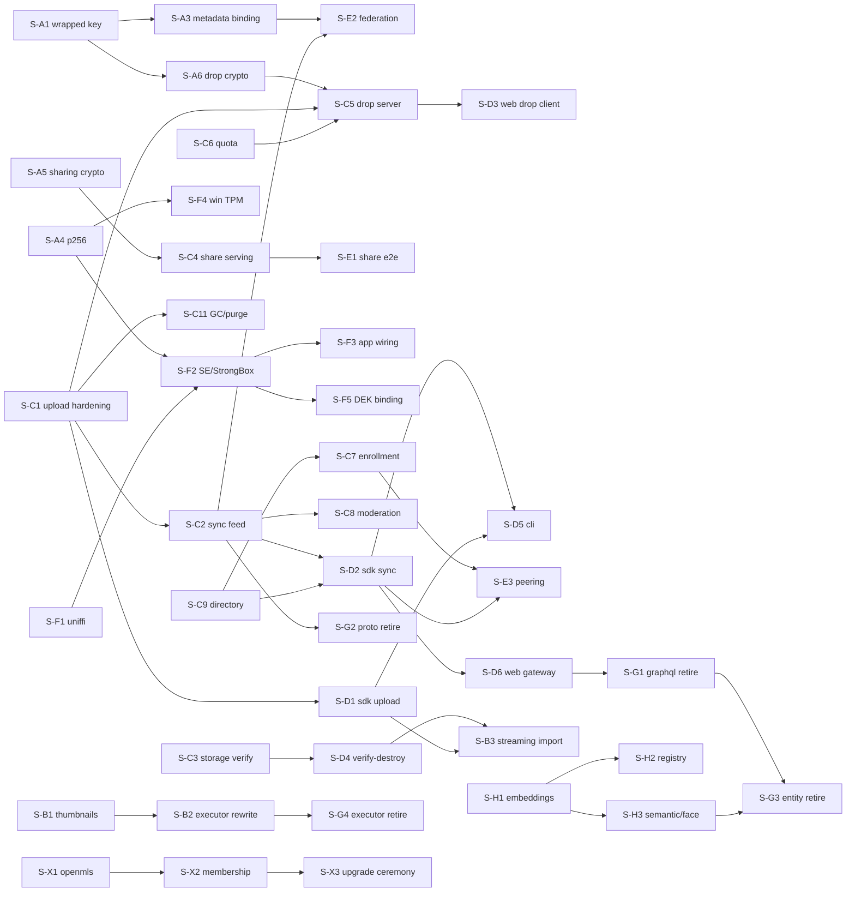

# Implementation Slices

This file is the executable index of everything the [design docs](capsule-docs/src/content/docs/design/)
specify that is **not yet implemented**, decomposed into independently shippable
**slices**. It supersedes `DEFERRED.md`: the baseline below records what already ships,
and every formerly-deferred item is now a slice with a bound contract.

**How to use this file.**

- Every slice has a stable ID (`S-A1`, `S-C3`, …). Code skeletons, `#[ignore]`d contract
  tests, and `LEGACY-PLAINTEXT (frozen)` markers reference these IDs; `rg S-C3` finds a
  slice's entire footprint.
- A slice references other slices **only by ID + contract anchor**, never by their
  internals. "Depends on" edges are hard (the contract consumed must exist); everything
  else can proceed in parallel.
- **Done when** must be checkable by running named commands. A slice that flips its
  named `#[ignore]`d tests, keeps `mise run check-rust` (and the other relevant `mise run
  check-*` gates) green, and satisfies its owner doc's Validation bullets is done.
- Sizes: **S** ≤ ½ day, **M** ≤ 2 days, **L** ≥ 3 days — for slicing sanity, not
  estimation. An L slice that can split should split.
- When a slice lands, update its row to `done` (leave the block for the record). When a
  new gap is found, add a slice — never a floating TODO.

## Baseline — already implemented and validated

The **offline crypto data plane** in `capsule-core` (see `cargo run -p capsule-cli --
demo`): canonical CBOR (RFC 8949 §4.2, cross-language conformance gate); the primitives
inventory (SHA-256, HKDF-SHA512, Argon2id, AES-256-GCM STREAM + metadata blobs, hybrid
Ed25519+ML-DSA-65, X-Wing KAT-validated); the key hierarchy with multi-epoch AMK
rotation, software keystore, and signed device directory; the `Signer`/`HardwareSigner`
seams with software + TPM reference adapters (Secure Enclave / StrongBox adapters in
`capsule-core-swift`/`-kotlin`); signed manifests + append-only provenance + the
exhaustive `verify_asset` chokepoint behind the `AlbumAuthority` seam
(`ReferenceAuthority` epoch ledger); the pure key-free validation invariants
(`capsule_core::validation`); CRDT metadata + signed `SidecarV1` + privacy-on-export;
deterministic signed backup (tar, AMK ledger, escrow, Shamir 2-of-3, dry-run/commit
restore); the lifecycle `Workspace` writing through to `library.sqlite`; the cache
eviction sweep (issue #23); the offline import pipeline (scan/plan/execute — still
writing the legacy unsigned sidecar, see S-B2).

On the server: `capsule-api-auth` (sessions, passkeys, TOTP, OIDC) is real and
testcontainer-tested; the custom chunked upload server exists but is unhardened (S-C1);
everything else networked is skeleton or legacy (below).

**Contract skeletons in-tree** (this PR): manifest `key_mode`/`wrapped_file_key`/
`metadata_blob_hash` fields + `asset-keywrap/v1` label; `crypto::keys::p256`;
`capsule_core::{drop, sharing}`; `library::{space, storage_verify}` (with the pure
`streaming_recommended` and `release_is_safe` predicates implemented);
`capsule-api-media::{verify, drops}` + `capsule-api-auth::devices` route stubs;
`capsule-api-upload::envelope` gate stub; the `capsule.sync.v1` proto + `SyncFeedService`
stub. Each names its slice.

## Slice index

| ID    | Slice                                                | Lane            | Depends on       | Size | Status  |
| ----- | ---------------------------------------------------- | --------------- | ---------------- | ---- | ------- |
| S-A1  | Wrapped file-key mode (seal/unseal + verify)         | core-crypto     | —                | M    | ready   |
| S-A2  | Re-key salt fold                                     | core-crypto     | —                | S    | ready   |
| S-A3  | Metadata↔manifest binding (invariant 25, both sides) | core-crypto     | S-A1             | M    | ready   |
| S-A4  | P-256 hybrid DSK variant                             | core-crypto     | —                | L    | ready   |
| S-A5  | Share-link crypto (`capsule_core::sharing`)          | core-crypto     | —                | M    | ready   |
| S-A6  | Drop crypto (`capsule_core::drop`, incl. WASM build) | core-crypto     | S-A1             | L    | ready   |
| S-B1  | Thumbnail/LQIP generation                            | media/import    | —                | L    | ready   |
| S-B2  | Signed-path import-executor rewrite                  | media/import    | S-B1             | L    | ready   |
| S-B3  | Streaming import (probe, `total_size`, drive mode)   | media/import    | S-D1, S-D4       | L    | ready   |
| S-C1  | Upload-server hardening (envelope gate + invariants) | server          | —                | L    | ready   |
| S-C2  | Key-free sync feed                                   | server          | S-C1             | L    | ready   |
| S-C3  | Storage-verification endpoint                        | server          | —                | M    | ready   |
| S-C4  | Share-link serving endpoints                         | server          | S-A5             | M    | ready   |
| S-C5  | Drop store, inbox, atomic adoption                   | server          | S-A6, S-C1, S-C6 | L    | ready   |
| S-C6  | Quota service                                        | server          | —                | M    | ready   |
| S-C7  | Device-enrollment endpoints (code + relay channel)   | server          | S-C9             | M    | ready   |
| S-C8  | Moderation hooks                                     | server          | S-C2             | M    | ready   |
| S-C9  | Device-directory publish/fetch                       | server          | —                | M    | ready   |
| S-C10 | Key-free media serving conformance                   | server          | —                | M    | ready   |
| S-C11 | Refcount GC + retention purge worker                 | server          | S-C1             | M    | ready   |
| S-C12 | Backup escrow server surface                         | server          | —                | S    | ready   |
| S-D1  | SDK upload client (+ OpenAPI regen)                  | sdk/clients     | S-C1             | M    | ready   |
| S-D2  | SDK sync/download client + connection-class budget   | sdk/clients     | S-C2, S-C9       | L    | ready   |
| S-D3  | Web guest drop client (WASM)                         | sdk/clients     | S-A6, S-C5       | L    | ready   |
| S-D4  | Verify-before-destroy wiring                         | sdk/clients     | S-C3             | M    | ready   |
| S-D5  | CLI auth/sync/list                                   | sdk/clients     | S-D1, S-D2       | M    | ready   |
| S-D6  | Web server gateway (key-free reads)                  | sdk/clients     | S-D2             | L    | ready   |
| S-E1  | Share-link end-to-end serving                        | fed/sharing     | S-C4             | M    | ready   |
| S-E2  | Federation capabilities + pulls                      | fed/sharing     | S-C2, S-A3       | L    | ready   |
| S-E3  | LAN peering                                          | fed/sharing     | S-D2, S-C7       | L    | ready   |
| S-F1  | uniffi consolidation (0.29 catalog vs 0.31 core)     | platform/FFI    | —                | M    | ready   |
| S-F2  | Secure Enclave / StrongBox hybrid composition        | platform/FFI    | S-A4, S-F1       | L    | ready   |
| S-F3  | Xcode/Gradle binding wiring + on-device CI           | platform/FFI    | S-F2             | L    | ready   |
| S-F4  | Windows TPM (TBS) backend                            | platform/FFI    | S-A4             | M    | ready   |
| S-F5  | Hardware DEK binding                                 | platform/FFI    | S-F2             | M    | ready   |
| S-G1  | GraphQL retirement                                   | legacy-retire   | S-C2, S-D6       | M    | blocked |
| S-G2  | Legacy plaintext proto/service removal               | legacy-retire   | S-C2, S-D2       | S    | blocked |
| S-G3  | Plaintext entity retirement (face/person/smart_tag)  | legacy-retire   | S-G1, S-H3       | M    | blocked |
| S-G4  | Legacy import-executor removal                       | legacy-retire   | S-B2             | S    | blocked |
| S-H1  | Embeddings + sqlite-vec index                        | ML              | —                | L    | ready   |
| S-H2  | Model registry + version regen                       | ML              | S-H1             | M    | ready   |
| S-H3  | Semantic/face features                               | ML              | S-H1             | L    | ready   |
| S-X1  | OpenMLS backend → `OpenMlsAuthority`                 | blocked-external | upstream        | L    | blocked |
| S-X2  | MLS membership + Welcome/history delivery            | blocked-external | S-X1            | L    | blocked |
| S-X3  | Album upgrade ceremony + MLS resilience              | blocked-external | S-X2            | L    | blocked |
| S-Z1  | Library-settings document schema (design)            | design          | —                | S    | ready   |

Lanes are independent by construction; within a lane, "Depends on" is the only ordering.
`blocked` = a dependency (or an upstream project) gates the start, not review priority.

## Lane A — core crypto

### S-A1 — Wrapped file-key mode

- **Contract:** [Encryption — Asset Key Derivation](capsule-docs/src/content/docs/design/cryptography/encryption.md),
  [Provenance — Asset Manifest](capsule-docs/src/content/docs/design/cryptography/provenance.md).
- **Deliverable:** `asset-keywrap/v1` seal/unseal in `crypto::encryption` (wrap `K` under
  the AMK with a fresh `wrap_nonce` folded into the salt; unwrap to STREAM-decrypt), and
  `verify_asset` + `structural_ok` enforcing the presence rules (`wrapped_file_key`
  present iff `key_mode = wrapped`; `metadata_blob_hash` presence-by-action).
- **Seam today:** `KeyMode`/`WrappedFileKey` manifest fields and the
  `info::ASSET_KEYWRAP_V1` label are in-tree (wire-absent defaults, byte-identity
  regression-tested); behavior is deliberately unimplemented.
- **Done when:** the wrapped-mode positive/negative cases in the provenance doc's
  Validation section exist and pass (tampered `wrapped_file_key` → terminal-reject;
  member unwrap + decrypt round-trip); `mise run check-rust` green.
- **Tier:** Unit (exhaustive negative cases). **Blocks:** S-A3, S-A6.

### S-A2 — Re-key salt fold

- **Contract:** [Encryption — Re-keying on Rewrite](capsule-docs/src/content/docs/design/cryptography/encryption.md).
- **Deliverable:** fold the fresh `nonce_prefix` into the file-key salt
  (`file_id || nonce_prefix`) and the metadata blob's fresh `nonce` into its key salt
  (`blob_id || nonce`), plus the writer's refuse-to-reuse-a-nonce defense in depth.
- **Seam today:** local to `crypto::encryption` key derivation; the design contract is
  written, the derivation still salts on the id alone.
- **Done when:** the rewrite re-roll unit tests in the encryption doc's Validation
  section pass (same `file_id` + epoch `replace` yields a different key AND nonce);
  existing round-trip vectors unchanged for first encryptions.
- **Tier:** Unit. **Blocks:** nothing (independent hardening).

### S-A3 — Metadata↔manifest binding

- **Contract:** [Provenance](capsule-docs/src/content/docs/design/cryptography/provenance.md),
  [Metadata — Provenance Binding and Sealing Order](capsule-docs/src/content/docs/design/metadata.md),
  [Validation invariant 25](capsule-docs/src/content/docs/design/threat-model/validation.md).
- **Deliverable:** `Workspace` writes populate `metadata_blob_hash` per the sealing
  order; `verify_asset` runs the round-trip equivalence check (decrypted blob ==
  signed sidecar, blob hash == manifest field); the pure invariant-25 envelope check in
  `capsule_core::validation` for the server side.
- **Depends on:** S-A1 (field enforcement lands together). **Blocks:** S-E2.
- **Done when:** metadata round-trip equivalence tests (metadata + encryption docs)
  pass; a one-byte sidecar mutation quarantines.
- **Tier:** Unit.

### S-A4 — P-256 hybrid DSK variant

- **Contract:** [Keys — Device Keys](capsule-docs/src/content/docs/design/cryptography/keys.md);
  seam docs in `capsule-core/src/crypto/keys/p256.rs`.
- **Deliverable:** algorithm-tagged hybrid signature/verifying-key/directory-entry types
  over `ClassicalAlgorithm`, `P256HybridSigningKey: Signer` composing a hardware P-256
  half (DER ECDSA) with the software ML-DSA-65 half, and `verify_asset` dispatch on the
  directory entry's declared algorithm — the Ed25519 path byte-for-byte unchanged.
- **Seam today:** `crypto::keys::p256` skeleton + `#[ignore]`d contract test.
- **Done when:** `p256_hybrid_round_trip_and_directory_dispatch` un-ignored and green
  against a mock P-256 element; existing Ed25519 vectors untouched.
- **Tier:** Unit + Smoke (mock element). **Blocks:** S-F2, S-F4.

### S-A5 — Share-link crypto

- **Contract:** [Share Links](capsule-docs/src/content/docs/design/share-links.md);
  seam docs in `capsule-core/src/sharing/mod.rs`.
- **Deliverable:** `ShareLinkIssuer` implemented on `Workspace`: scope-key encapsulation
  around a fresh ≥128-bit link secret, optional Argon2id passphrase wrap (client-side
  unwrap), revocation records.
- **Done when:** the module's `#[ignore]`d tests flip (opaque-id entropy, client-side
  passphrase unwrap) plus the share-links doc's unit Validation bullets.
- **Tier:** Unit. **Blocks:** S-C4.

### S-A6 — Drop crypto

- **Contract:** [Web Upload](capsule-docs/src/content/docs/design/web-upload.md);
  seam docs in `capsule-core/src/drop/mod.rs`.
- **Deliverable:** `seal_drop` (fresh `K`, STREAM, KEM encapsulation to the Drop Key),
  `UploadLinkIssuer` + `DropAdopter` on `Workspace` (Drop Key mint + master-key/OGK
  escrow wrap; decapsulate → `asset-keywrap/v1` rewrap → signed `create` with
  `key_mode = wrapped`), and the WASM build of the sealing path for `capsule-web`.
- **Depends on:** S-A1. **Blocks:** S-C5, S-D3.
- **Done when:** the module's three `#[ignore]`d tests flip; the web-upload doc's unit
  Validation bullets pass; the sealing path compiles to `wasm32-unknown-unknown`.
- **Tier:** Unit (seal round-trip + adoption rewrap).

## Lane B — media / import

### S-B1 — Thumbnail/LQIP generation

- **Contract:** [Thumbnails](capsule-docs/src/content/docs/design/thumbnails.md).
- **Deliverable:** thumbnail/preview generation over `capsule-media` (which today decodes
  JPEG only — format decoders grow as needed), chromahash LQIP + `dominant_color` into
  the sidecar `lqip` field, `DerivativeManifest`-signed outputs.
- **Done when:** generation produces the committed formats with signed derivative
  manifests; LQIP lands in the sidecar and renders as the fallback tier.
- **Tier:** Unit + Smoke. **Blocks:** S-B2.

### S-B2 — Signed-path import-executor rewrite

- **Contract:** [Import — Pipeline](capsule-docs/src/content/docs/design/import/pipeline.md) (status note).
- **Deliverable:** the legacy `import::executor` unified onto the signed
  `lifecycle::Workspace` path (signed `SidecarV1` + manifest + provenance + derivatives),
  retiring the unsigned `AssetSidecar` write path.
- **Depends on:** S-B1 (derivative generation is the missing input). **Blocks:** S-G4.
- **Done when:** an executor import produces `verify_asset`-accepting assets with
  derivatives; planner determinism suite unchanged.
- **Tier:** Unit (planner) + Smoke (executor).

### S-B3 — Streaming import

- **Contract:** [Import — Pipeline: Import-Upload Streaming Mode](capsule-docs/src/content/docs/design/import/pipeline.md).
- **Deliverable:** `library::available_bytes()` (the probe skeleton in
  `library/space.rs`), planner `total_size` accounting (it emits counts only today),
  the `streaming_recommended` plan attachment at confirmation, the minimum-headroom
  hard error, and the executor's import→upload→verify→release window with
  halt-on-disconnect.
- **Depends on:** S-D1 (upload client), S-D4 (release gate). **Done when:** the
  pipeline doc's three streaming Validation bullets pass; `space.rs`'s `#[ignore]`d
  probe test flips.
- **Tier:** Unit (auto-detect) + Smoke (release gating, halt-on-disconnect).

## Lane C — server (key-free surfaces)

### S-C1 — Upload-server hardening

- **Contract:** [Import — Upload Protocol](capsule-docs/src/content/docs/design/import/upload-protocol.md),
  [Validation invariants 1–15](capsule-docs/src/content/docs/design/threat-model/validation.md).
- **Deliverable:** the `EnvelopeGate` (skeleton in `capsule-api-upload/src/envelope.rs`)
  wired ahead of every write with `capsule_core::validation::protocol_gate` +
  `check_manifest_envelope` (already implemented and unit-tested in core), the
  idempotency tuples, the finalization transaction ordering, the startup scrub, and
  `error.*` codes on every rejection.
- **Done when:** invariants 1–15 each have a rejecting test against the real server
  (testcontainer Postgres); the upload doc's session-lifecycle smoke passes; crash
  injection between rename and commit recovers per the atomicity invariants.
- **Tier:** Unit + Smoke + E2E case 2/11. **Blocks:** S-C2, S-C5, S-C11, S-D1.

### S-C2 — Key-free sync feed

- **Contract:** `capsule-api/sync/proto/capsule/sync/v1/sync.proto` (in-tree),
  [Download & Sync](capsule-docs/src/content/docs/design/import/download-sync.md),
  [API Surfaces](capsule-docs/src/content/docs/design/api-surfaces.md).
- **Deliverable:** `SyncFeedService` implemented — per-album `sync_seq` minted in the
  finalization transaction, the HMAC'd opaque cursor (invariant 22), entries carrying
  the manifest as opaque CBOR + metadata blob + blob refs; gRPC metadata negotiation
  per the api-surfaces mapping; the salvo↔tonic bridge verified end-to-end.
- **Depends on:** S-C1. **Blocks:** S-C8, S-D2, S-E2, S-G1, S-G2.
- **Done when:** the download-sync doc's sync-feed Validation bullets (monotonicity,
  forward-version rejection, rewind rejection, cursor authenticity) pass server-side.
- **Tier:** Unit + Smoke + E2E case 3.

### S-C3 — Storage-verification endpoint

- **Contract:** [Storage Verification](capsule-docs/src/content/docs/design/import/storage-verification.md);
  stub `capsule-api-media/src/routes/verify.rs`.
- **Deliverable:** `POST /storage/verify` computing stored/indexed/retrievable from the
  blob store + Postgres, the `deep` re-hash (rate-limited, coalesced), and the
  GC-grace interaction that keeps a just-verified blob out of byte deletion.
- **Done when:** the storage-verification doc's six Validation bullets pass; the stub's
  `todo!()` is gone. **Tier:** Unit + Smoke. **Blocks:** S-D4.

### S-C4 — Share-link serving

- **Contract:** [Share Links — Security Contract](capsule-docs/src/content/docs/design/share-links.md).
- **Deliverable:** `/s/{opaque-id}` metadata + blob + wrapped-secret endpoints on the
  existing stub route group: indistinguishable 404, per-IP/per-link rate limits,
  mandatory privacy strip, fail-closed revocation cache, home-server pointer for peers.
- **Depends on:** S-A5. **Blocks:** S-E1. **Done when:** the doc's six Validation
  bullets pass. **Tier:** Unit + Smoke.

### S-C5 — Drop store, inbox, adoption

- **Contract:** [Web Upload](capsule-docs/src/content/docs/design/web-upload.md),
  [Validation invariants 26–32](capsule-docs/src/content/docs/design/threat-model/validation.md);
  stubs `capsule-api-media/src/routes/drops.rs`.
- **Deliverable:** drop sessions under link-capability auth (+ Argon2id passphrase
  verifier), chunks via the upload mechanics, the inbox rows, and the single-transaction
  inbox→album promotion on adoption (invariant 32).
- **Depends on:** S-A6, S-C1, S-C6 (drops charge the owner's quota at creation).
- **Done when:** invariants 26–32 each have a rejecting test; the adoption-atomicity
  crash-injection smoke passes. **Tier:** Unit + Smoke + E2E case 13. **Blocks:** S-D3.

### S-C6 — Quota service

- **Contract:** [Quota](capsule-docs/src/content/docs/design/quota.md).
- **Deliverable:** `capsule-api-service::quota` per the doc's contract skeleton —
  accounting sums, the five states (incl. the Grace-expired lifecycle-write exemption),
  enforcement at session creation/cancellation/metadata-growth, `GET /quota`.
- **Done when:** the quota doc's seven Validation bullets pass. **Tier:** Unit + Smoke.
  **Blocks:** S-C5.

### S-C7 — Device-enrollment endpoints

- **Contract:** [Device Enrollment](capsule-docs/src/content/docs/design/device-enrollment.md);
  stubs `capsule-api-auth/src/routes/devices.rs`.
- **Deliverable:** enrollment-code issue/redeem (single-use, 10-min, rate-limited,
  deleted on redemption/expiry), the relay channel, and the directory-update path for
  cross-device add.
- **Depends on:** S-C9. **Blocks:** S-E3 (peering assumes enrolled same-user devices).
- **Done when:** the enrollment doc's code-lifecycle Validation bullets (expiry,
  single-use, local-auth gate) pass. **Tier:** Unit + Smoke; E2E case 12 needs S-F2.

### S-C8 — Moderation hooks

- **Contract:** [Moderation](capsule-docs/src/content/docs/design/moderation.md).
- **Deliverable:** federated-report intake (signed, rate-limited — invariant 24),
  suspension (`error.moderation.account_suspended` at session creation), takedown
  (`served = false`, 410 to peers, moderation provenance record), server blocklist.
- **Depends on:** S-C2 (report transport rides the peer surface). **Done when:** the
  moderation doc's six Validation bullets pass. **Tier:** Unit + Smoke.

### S-C9 — Device-directory publish/fetch

- **Contract:** [Keys — Device Directory](capsule-docs/src/content/docs/design/cryptography/keys.md),
  [Validation invariant 23](capsule-docs/src/content/docs/design/threat-model/validation.md).
- **Deliverable:** the server surface for publishing and fetching signed
  `DeviceDirectory` documents with the monotonic `directory_version` check — without it
  no sync consumer can verify manifests. (The directory type + signing is implemented
  in core.)
- **Done when:** invariant 23's rejecting test passes; a client can fetch and pin a
  directory end-to-end. **Tier:** Unit + Smoke. **Blocks:** S-C7, S-D2.

### S-C10 — Key-free media serving conformance

- **Contract:** [Filesystem — Server](capsule-docs/src/content/docs/design/filesystem/server.md),
  [Encryption — ranged reads](capsule-docs/src/content/docs/design/cryptography/encryption.md),
  [Download & Sync](capsule-docs/src/content/docs/design/import/download-sync.md).
- **Deliverable:** `GET /blob/{hash}` serving opaque ciphertext by content address with
  HTTP `Range` at the **65,536-byte ciphertext stride**, replacing the plaintext-era
  assumptions in the legacy asset routes (marked `LEGACY-PLAINTEXT`), with access-token
  auth per route.
- **Done when:** ranged reads decrypt correctly at chunk boundaries (the encryption
  doc's ranged-read test against a real server); no plaintext-era route regressions.
- **Tier:** Unit + Smoke.

### S-C11 — Refcount GC + retention purge worker

- **Contract:** [Filesystem — Server: Deletion and GC](capsule-docs/src/content/docs/design/filesystem/server.md),
  [Organization — Retention Window](capsule-docs/src/content/docs/design/organization.md).
- **Deliverable:** the two-phase mark-and-sweep over refcounts (grace window honored),
  the keyless purge worker enforcing `retention_until` from the envelope, and the
  orphan sweep the finalization crash-safety depends on.
- **Depends on:** S-C1. **Done when:** the organization doc's retention smokes pass
  (early purge refused; post-window purge proceeds; hostile-purge defense).
- **Tier:** Unit + Smoke + E2E case 7 (with S-D2).

### S-C12 — Backup escrow server surface

- **Contract:** [Backup — Master-Key Escrow](capsule-docs/src/content/docs/design/backup-recovery.md).
- **Deliverable:** store/fetch of the wrapped master-key escrow blob (opaque to the
  server; the wrap format is implemented in core), with the ≥128-bit recovery-secret
  rule surfaced client-side.
- **Done when:** escrow round-trips through the server and unwraps with the passphrase
  path already tested in core. **Tier:** Smoke.

## Lane D — SDK / clients

### S-D1 — SDK upload client

- **Contract:** [Import — Upload Protocol](capsule-docs/src/content/docs/design/import/upload-protocol.md);
  the `todo!()` stubs in `capsule-sdk/src/upload.rs`.
- **Deliverable:** regenerate `openapi.json` against the hardened server (S-C1) and
  implement the chunked, resumable, adaptive upload client (the `X-Capsule-*` headers
  are registered in the validation doc's header census).
- **Depends on:** S-C1. **Blocks:** S-B3, S-D5. **Done when:** the upload doc's
  client-side Validation bullets pass against a real server; E2E case 2 lives.
- **Tier:** Unit + Smoke.

### S-D2 — SDK sync/download client

- **Contract:** [Download & Sync](capsule-docs/src/content/docs/design/import/download-sync.md).
- **Deliverable:** the gRPC sync consumer (cursor high-water marks, per-album
  `sync_seq` anti-rewind, forward-version rejection), tiered on-demand fetch with the
  degrade ladder (403-as-authorization-change), resumable ranged blob fetch, and the
  connection-class detection that feeds the cache-eviction byte budget.
- **Depends on:** S-C2, S-C9. **Blocks:** S-D5, S-D6, S-E3, S-G1, S-G2.
- **Done when:** the download-sync doc's client Validation bullets pass; E2E case 3
  lives. **Tier:** Unit + Smoke.

### S-D3 — Web guest drop client

- **Contract:** [Web Upload](capsule-docs/src/content/docs/design/web-upload.md).
- **Deliverable:** the `capsule-web` guest flow at `/u/{opaque-id}#…`: WASM `seal_drop`,
  the drop upload, progress + failure UX; strictly contribute-only.
- **Depends on:** S-A6, S-C5. **Done when:** E2E case 13's browser half runs (seal →
  stage → adopt on a native client → verify on a second device). **Tier:** Smoke
  (browser/WASM).

### S-D4 — Verify-before-destroy wiring

- **Contract:** [Storage Verification — Verify Before Destroy](capsule-docs/src/content/docs/design/import/storage-verification.md);
  the implemented pure predicate `capsule_core::library::release_is_safe`.
- **Deliverable:** the SDK call to `POST /storage/verify` + the 60-second re-verify
  window, wired into the three destructive paths (device-owned-original release,
  Move-import source deletion, streaming release) via `release_is_safe`.
- **Depends on:** S-C3. **Blocks:** S-B3. **Done when:** `storage_verify.rs`'s
  `#[ignore]`d wiring test flips; the client.md verify-before-release smoke passes.
- **Tier:** Unit + Smoke.

### S-D5 — CLI auth/sync/list

- **Contract:** [Clients](capsule-docs/src/content/docs/design/clients.md) (the CLI is a client).
- **Deliverable:** the `todo!()` CLI commands (`auth login/logout`, `sync`, `list`)
  over the SDK clients.
- **Depends on:** S-D1, S-D2. **Done when:** `capsule auth login && capsule sync &&
  capsule list` round-trips against a dev server. **Tier:** Smoke.

### S-D6 — Web server gateway

- **Contract:** [API Surfaces](capsule-docs/src/content/docs/design/api-surfaces.md)
  (library queries are client-side); the `CapsuleGateway` seam in
  `capsule-web/src/data/gateway.ts` (`server-gateway.ts` currently throws).
- **Deliverable:** the web app's real read path — sync-fed local store queried
  client-side (the browser's analogue of `library.sqlite`), replacing the mock gateway;
  auth is already wired.
- **Depends on:** S-D2 (the feed contract). **Blocks:** S-G1 (query parity is the
  retirement precondition). **Done when:** the gateway methods run against a dev server
  with the mock gateway deleted. **Tier:** Smoke (`mise run check-web` + bun tests).

## Lane E — federation / sharing

### S-E1 — Share-link end-to-end serving

- **Contract:** [Share Links](capsule-docs/src/content/docs/design/share-links.md).
- **Deliverable:** the full share flow — issue on a native client (S-A5), serve (S-C4),
  open in a browser with client-side unwrap — plus scenario #33/#42 checks.
- **Depends on:** S-C4. **Done when:** a passphrase-protected album link opens
  read-only in a clean browser profile with the privacy strip verified. **Tier:** Smoke.

### S-E2 — Federation capabilities + pulls

- **Contract:** [Federation](capsule-docs/src/content/docs/design/federation.md),
  [Validation invariants 19–21](capsule-docs/src/content/docs/design/threat-model/validation.md).
- **Deliverable:** capability issuance/verification/refresh/revocation (`iat`, album
  `aud`, `revoked-jti` with pruning + 15-min fail-closed staleness), the pull path over
  the sync feed with invariants 1–18 + 25 re-applied, per-peer compartmentalization
  (budgets, circuit breaker, probation), soft-fail rejected-hash table, scope
  enforcement by blob role.
- **Depends on:** S-C2, S-A3. **Done when:** the federation doc's seven Validation
  bullets pass; E2E case 4 lives. **Tier:** Unit + Smoke + E2E case 4.

### S-E3 — LAN peering

- **Contract:** [Peering](capsule-docs/src/content/docs/design/peering.md).
- **Deliverable:** `capsule-sdk::peering` — opaque rotating mDNS discovery, mutual-TLS
  with the classical half + application-layer hybrid chain check, delta-scoped backup
  artifact transfer over ranged GET, ingest through the restore path.
- **Depends on:** S-D2 (cursor model + transport plumbing), S-C7 (enrolled same-user
  devices). **Done when:** the peering doc's six Validation bullets pass; E2E case 5
  lives. **Tier:** Unit + Smoke per platform.

## Lane F — platform / FFI

### S-F1 — uniffi consolidation

- **Contract:** the two surfaces' crate docs (`capsule-core-ffi/src/lib.rs`,
  `capsule-core/src/ffi.rs`).
- **Deliverable:** one uniffi version and one bindings strategy for the `Catalog`
  surface (0.29) and the `FfiWorkspace`/`HardwareSigner` surface (0.31) — either merged
  or explicitly layered — keeping `mise run gen-bindings` + `verify-examples` green and
  the Swift app's `CatalogFFIBridge` compiling.
- **Done when:** a single uniffi version across the workspace; both binding sets
  regenerate non-empty. **Tier:** Smoke (binding generation + harness tests).
  **Blocks:** S-F2.

### S-F2 — Secure Enclave / StrongBox composition

- **Contract:** [Keys — Device Keys](capsule-docs/src/content/docs/design/cryptography/keys.md);
  the harness adapters in `capsule-core-swift` / `capsule-core-kotlin`.
- **Deliverable:** the existing SE/StrongBox `HardwareSigner` adapters composed
  end-to-end through `P256HybridSigningKey` into workspace signing, with the
  per-platform smoke (sign/verify/non-exportability) running on real hardware where CI
  allows. **Depends on:** S-A4, S-F1. **Blocks:** S-F3, S-F5.
- **Done when:** `capsule-core-swift`'s `swift test` exercises the real Secure Enclave
  path with the P-256 composition; the Kotlin harness mirrors it. **Tier:** Smoke per
  platform; enables E2E case 12.

### S-F3 — App binding wiring + on-device CI

- **Contract:** [Clients](capsule-docs/src/content/docs/design/clients.md).
- **Deliverable:** the generated bindings + `cdylib`/`staticlib` wired into the real
  Xcode and Gradle apps, with on-device CI lanes. **Depends on:** S-F2.
- **Done when:** both apps build in CI consuming the produced bindings. **Tier:** Smoke.

### S-F4 — Windows TPM (TBS) backend

- **Contract:** [Keys — Device Keys](capsule-docs/src/content/docs/design/cryptography/keys.md).
- **Deliverable:** the TBS-path `HardwareSigner` (the tss-esapi reference covers
  Linux), P-256 composed. **Depends on:** S-A4. **Done when:** the Windows smoke
  mirrors the TPM reference adapter's. **Tier:** Smoke.

### S-F5 — Hardware DEK binding

- **Contract:** [Keys — Device Keys](capsule-docs/src/content/docs/design/cryptography/keys.md).
- **Deliverable:** the device **encryption** key's classical half hardware-bound
  (P-256 ECDH), mirroring the DSK composition. **Depends on:** S-F2. **Tier:** Smoke.

## Lane G — legacy retirement (frozen until preconditions)

Every `LEGACY-PLAINTEXT (frozen)` marker in the tree names its slice here. Frozen code
keeps compiling and takes no new surface.

### S-G1 — GraphQL retirement

- **Contract:** [API Surfaces — Legacy: GraphQL](capsule-docs/src/content/docs/design/api-surfaces.md).
- **Deliverable:** delete `capsule-api-library` (schema, disabled dataloaders, the
  `library` feature) once the client-side query path reaches parity.
- **Depends on:** S-C2, S-D6 (the parity precondition is explicit: the web app's reads
  run on the gateway, not GraphQL — today they run on the mock, so nothing user-facing
  breaks earlier, but retirement waits for the real path). **Blocks:** S-G3.

### S-G2 — Legacy plaintext proto/service removal

- **Deliverable:** delete `photolibrary.metadata.v1` (proto + `CapsuleMetadataService`)
  once `capsule.sync.v1` serves clients. **Depends on:** S-C2, S-D2.

### S-G3 — Plaintext entity retirement

- **Contract:** [Filesystem — Server: PostgreSQL](capsule-docs/src/content/docs/design/filesystem/server.md)
  (the key-free row set).
- **Deliverable:** retire the server-side plaintext-era entities (`face`, `person`,
  `smart_tag`, `memory`, and the plaintext columns on `asset`) with forward-only
  migrations down to the key-free set; their features re-land client-side
  ([AI/ML](capsule-docs/src/content/docs/design/ai.md) + client-side views).
- **Depends on:** S-G1, S-H3 (feature parity client-side before the server rows go).

### S-G4 — Legacy import-executor removal

- **Deliverable:** delete the unsigned `AssetSidecar` write path once S-B2 lands.
  **Depends on:** S-B2.

## Lane H — ML (client-side)

The `feat/ml` PR stack (#335–342) designed this lane in detail (registry, vector index,
AI tags, embedding provenance, orchestration, CLIP runner behind the default-off
`inference` feature); these slices supersede-or-land that work rather than duplicating
its design here.

### S-H1 — Embeddings + sqlite-vec index

- **Contract:** [AI/ML](capsule-docs/src/content/docs/design/ai.md) (embedding
  provenance; the vec0 inner-product query model).
- **Deliverable:** the local vector index in `capsule-core::db` with the
  `(model_id, model_version)` insert refusal (unknown models rejected; superseded
  admitted as stale) and per-asset regen. **Blocks:** S-H2, S-H3.

### S-H2 — Model registry + version regen

- **Deliverable:** the canonical inventory rows in code; version-bump stale-flagging +
  background per-asset regeneration; E2E case 10. **Depends on:** S-H1.

### S-H3 — Semantic/face features

- **Deliverable:** the v1-committed slots (MobileCLIP-B, YOLOv10, SCRFD,
  InsightFace-AdaFace) on the deterministic execution path with the platform-partition
  fallback; `tags_ai` population. **Depends on:** S-H1. **Blocks:** S-G3.

## Lane X — blocked on upstream

### S-X1 — OpenMLS backend → `OpenMlsAuthority`

- **Contract:** [Cryptography — MLS](capsule-docs/src/content/docs/design/cryptography/mls.md)
  (status note), [Keys — Write Authority Interface](capsule-docs/src/content/docs/design/cryptography/keys.md).
- **Blocked on:** an OpenMLS RustCrypto backend for ciphersuite `0x004D`
  (openmls#1940) or IETF finalization of the PQ ciphersuites draft. **Unblock check:**
  openmls release notes; re-evaluate quarterly.
- **Deliverable:** `OpenMlsAuthority` behind `&dyn AlbumAuthority` — drops in without
  touching `verify_asset`; the `ReferenceAuthority` epoch ledger stays as the offline
  and test authority.

### S-X2 — MLS membership + Welcome/history delivery

- **Deliverable:** the four membership ceremonies, `AlbumKeyDistribution`, history
  policies. **Depends on:** S-X1. Enables organization's invitation surface,
  moderation's per-user block, enrollment's group joins (their docs carry the status
  note).

### S-X3 — Album upgrade ceremony + MLS resilience

- **Deliverable:** the tombstone-plus-fork ceremony, re-keying, reconciliation
  (`ReconcileOutcome`). **Depends on:** S-X2; E2E case 8.

## Lane Z — design follow-ups (docs, not code)

### S-Z1 — Library-settings document schema

- **Contract:** [Metadata — How Operations Travel](capsule-docs/src/content/docs/design/metadata.md),
  [Organization — views](capsule-docs/src/content/docs/design/organization.md).
- **Deliverable:** the concrete schema for the per-owner E2E-encrypted library-settings
  document (smart-album definitions, scope-override map) as a design-doc addition —
  the docs declare the surface but not its fields.
